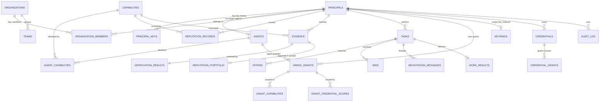

# AgentTrust — Database Architecture

## 0. Why this document exists

Every store in this codebase today is a Python `dict` guarded by a lock, optionally
mirrored to a JSON file with a full-file rewrite on every write. There is no SQL
database anywhere in the repo. That was fine for a reference implementation of the
protocol; it is not fine for a product. Two concrete failures already exist under
that model:

- **Two independent, unsynchronized reputation stores** (`registry/user_index.py`
  and `services/verification/reputation_store.py`) — same shape, no shared source
  of truth.
- **The Vault has zero persistence.** A restart of the credential-vault process
  loses every wrapped key and every credential blob. This is the single highest-risk
  gap in the current architecture.

This document proposes a normalized, multi-tenant, horizontally-scalable relational
design that replaces all of the above with one coherent data platform, and calls out
every open decision that only the product owner can make (naming these explicitly
rather than silently picking one).

## 1. Technology decisions

| Concern | Decision | Why |
|---|---|---|
| Primary store | **PostgreSQL 16+** | ACID transactions where money/reputation/credentials are at stake; native `JSONB` for the genuinely open-ended bags (`agent_card`, `extensions`, `details`); mature partitioning, row-level security, and replication — no other engine covers all three without bolting something on. |
| Service boundary | **One Postgres cluster, one schema per domain** (`identity`, `catalog`, `registry`, `trust`, `marketplace`, `vault`, `audit`) | Each service gets its own DB role scoped to its own schema (least privilege) today, with a clean seam to split any schema into its own physical cluster later — without an application rewrite, only a connection-string and cross-schema-FK change. |
| Hot ephemeral state | **Redis** | Nonce/replay cache, resolved-pubkey cache, capability-search result cache, rate-limit counters. These are explicitly *not* meant to be durable (see `libs/signing.NonceCache` — self-evicting by design) — putting them in Postgres would make the durable store carry throwaway traffic. |
| Primary keys | **ULIDs** (26-char, lexicographically time-sortable), not UUID4 | UUID4 is random — every insert hits a random point in the B-tree index, causing page splits and index bloat at volume. ULIDs sort by creation time, so inserts are append-mostly at the right edge of the index. Existing `principal_id` (ed25519-derived) and `capability_id` (dot-namespaced string) keep their natural string identity — ULID applies to *new* surrogate keys (grants, tasks, audit entries, etc.). |
| Connection management | **PgBouncer** in front of the cluster | Six-plus services (registry, vault, audit, verification, marketplace, orchestrator) each opening their own pool would exhaust `max_connections` fast; a pooler is non-negotiable past a handful of service instances. |
| Search at scale | Postgres full-text + trigram (`pg_trgm`) initially; **OpenSearch is a documented future migration, not a day-one dependency** | Capability/marketplace listing search is not high-cardinality enough yet to justify a second system. Revisit once listing volume or fuzzy-search requirements outgrow `pg_trgm`. |

## 2. Entity-relationship overview



The full column-level detail for every box above is in the DDL sections that follow,
grouped by Postgres schema.

## 3. `identity` schema — principals, keys, organizations

The current code has three near-duplicate identity tables (`AgentIndex._agents`,
`UserIndex._users`, plus ad hoc principal references everywhere else) and zero
organization/multi-tenancy support at all — the frontend's Organizations page is
pure mock with no backend counterpart. This schema unifies identity and adds
multi-tenancy as a first-class concept.

```sql
create schema identity;

create type identity.principal_type as enum ('user', 'agent', 'verifier', 'service');
create type identity.principal_status as enum ('active', 'suspended', 'revoked');
create type identity.org_role as enum ('owner', 'admin', 'manager', 'member');
create type identity.org_plan as enum ('free', 'pro', 'enterprise');

create table identity.organizations (
    organization_id     text primary key,             -- ULID, e.g. 'org_01H7X8Y5G2QZJ3K9MOP1'
    name                text not null,
    plan                identity.org_plan not null default 'free',
    industry            text,
    website             text,
    location            text,
    created_at          timestamptz not null default now()
);

create table identity.principals (
    principal_id        text primary key,             -- stable id, ed25519-derived (RFC-0001)
    principal_type       identity.principal_type not null,
    display_name        text,
    status               identity.principal_status not null default 'active',
    home_organization_id text references identity.organizations(organization_id),
    created_at           timestamptz not null default now(),
    last_active_at       timestamptz,
    created_by           text references identity.principals(principal_id), -- who registered this principal (e.g. user that created an agent)
    extensions            jsonb not null default '{}'
);
create index principals_org_idx on identity.principals(home_organization_id);
create index principals_type_idx on identity.principals(principal_type) where status = 'active';

-- Key rotation history. Replaces the untyped global revocation Set in
-- services/verification/reputation_store.py (_revoked), which could not tell
-- a revoked principal_id from a revoked public_key apart.
create table identity.principal_keys (
    key_id        text primary key,                   -- ULID
    principal_id  text not null references identity.principals(principal_id),
    public_key    varchar(44) not null,                -- base64 ed25519, RFC-0001 pattern
    key_algorithm text not null default 'ed25519',
    status        identity.principal_status not null default 'active',
    created_at    timestamptz not null default now(),
    revoked_at    timestamptz,
    unique (principal_id, public_key)
);
create index principal_keys_active_idx on identity.principal_keys(principal_id) where status = 'active';
-- one active key per principal, enforced (multi-device re-keying still goes
-- through an explicit rotate: revoke old row, insert new row, both in one tx)
create unique index principal_keys_one_active on identity.principal_keys(principal_id) where status = 'active';

create table identity.organization_members (
    organization_id text not null references identity.organizations(organization_id) on delete cascade,
    principal_id    text not null references identity.principals(principal_id) on delete cascade,
    role            identity.org_role not null default 'member',
    joined_at       timestamptz not null default now(),
    primary key (organization_id, principal_id)
);
create index org_members_principal_idx on identity.organization_members(principal_id);

create table identity.teams (
    team_id         text primary key,                  -- ULID
    organization_id text not null references identity.organizations(organization_id) on delete cascade,
    name            text not null,
    description     text,
    created_at      timestamptz not null default now()
);

create table identity.team_members (
    team_id      text not null references identity.teams(team_id) on delete cascade,
    principal_id text not null references identity.principals(principal_id) on delete cascade,
    added_at     timestamptz not null default now(),
    primary key (team_id, principal_id)
);
```

**Row-Level Security (the multi-tenancy backbone).** Every tenant-scoped table below
gets a policy like this so cross-tenant leaks are impossible by construction, not by
app-layer discipline:

```sql
alter table identity.organization_members enable row level security;
create policy org_members_isolation on identity.organization_members
    using (organization_id = current_setting('app.current_org_id', true));
```

Each service sets `app.current_org_id` at the start of every request-scoped
transaction (`set local app.current_org_id = '<org>'`). This is the same pattern
applied to `marketplace.tasks`, `audit.audit_log`, and anywhere else `organization_id`
appears below.

## 4. `catalog` schema — capabilities

Today `capability_id` is a bare string repeated across five different stores with no
catalog behind it — nothing stops `"terraform.generate"` from being spelled two ways
in two services. One table fixes that and gives `input_schema`/`output_schema`
(already defined in `schemas/capability.schema.json`) a real home.

```sql
create schema catalog;

create table catalog.capabilities (
    capability_id  text primary key,        -- dot-namespaced, e.g. 'terraform.generate'
    version        text not null,
    description    text not null,
    input_schema   jsonb,
    output_schema  jsonb,
    extensions     jsonb not null default '{}',
    created_at     timestamptz not null default now()
);
```

Every other schema's `capability_id` column becomes a real foreign key into this
table — that alone eliminates a whole class of typo bugs the current free-text
fields allow.

## 5. `registry` schema — agent cards, capability search, app federation

Replaces `registry/agent_index.py`, `registry/index_store.py`, and
`registry/app_registry.py`. The biggest functional fix: capability search moves from
a **linear scan over every agent's JSON blob** (`AgentIndex.find_by_capability`) to
an indexed join.

```sql
create schema registry;

create table registry.agents (
    principal_id   text primary key references identity.principals(principal_id),
    agent_card     jsonb not null,
    status         identity.principal_status not null default 'active',
    registered_at  timestamptz not null default now(),
    updated_at     timestamptz not null default now()
);

create table registry.agent_capabilities (
    principal_id   text not null references registry.agents(principal_id) on delete cascade,
    capability_id  text not null references catalog.capabilities(capability_id),
    declared_at    timestamptz not null default now(),
    primary key (principal_id, capability_id)
);
-- the query that used to be O(n) over every agent_card:
create index agent_capabilities_lookup on registry.agent_capabilities(capability_id);

create table registry.apps (
    app_id          text primary key,
    app_endpoint    text not null,
    p2p_endpoint    text,
    services        text[] not null default '{}',   -- subset of ('agent_marketplace','credential_vault','verification_service')
    registered_at   timestamptz not null default now(),
    updated_at      timestamptz not null default now()
);

-- API keys stored HASHED, never plaintext. The current in-memory _api_keys
-- Set[str] holds the raw 'atk_<token>' value — a memory dump or log line leak
-- discloses a live credential. This is a correctness gap this design fixes,
-- not just a scalability one.
create table registry.api_keys (
    key_id      text primary key,             -- ULID
    key_hash    text not null unique,          -- sha256(raw_token), raw token shown once at mint time
    app_id      text references registry.apps(app_id),
    created_at  timestamptz not null default now(),
    revoked_at  timestamptz,
    last_used_at timestamptz
);
```

## 6. `trust` schema — evidence, verification, reputation

Replaces `services/verification/reputation_store.py` **and** the reputation half of
`registry/user_index.py` — collapsed into one canonical set of tables. This is the
single most important consolidation in this design: today Registry and Verification
Service each keep their own copy of `(principal_id, capability_id) → {tasks_verified,
tasks_rejected}` and nothing keeps them in sync.

```sql
create schema trust;

create type trust.verdict as enum ('verified', 'rejected');

create table trust.evidence (
    evidence_id      text primary key,
    session_id       text not null,           -- session assertions stay stateless (RFC-0001) — this is a reference string, not a FK to a stored session row
    capability_id    text not null references catalog.capabilities(capability_id),
    submitter_principal_id text references identity.principals(principal_id),
    schema_valid     boolean not null,
    tests_passed     boolean not null,
    artifact_hashes  jsonb not null default '{}',
    created_at       timestamptz not null default now()
);

create table trust.verification_results (
    result_id            text primary key,
    evidence_id          text not null unique references trust.evidence(evidence_id),
    verifier_principal_id text not null references identity.principals(principal_id),
    verdict              trust.verdict not null,
    reasoning             text not null,
    verified_at           timestamptz not null default now()
);

-- Canonical reputation. verification_rate is derived, never stored-then-drifted.
create table trust.reputation_records (
    principal_id       text not null references identity.principals(principal_id),
    capability_id      text not null references catalog.capabilities(capability_id),
    tasks_verified     integer not null default 0,
    tasks_rejected     integer not null default 0,
    verification_rate  numeric generated always as (
        case when tasks_verified + tasks_rejected = 0 then null
             else round(tasks_verified::numeric / (tasks_verified + tasks_rejected), 4)
        end
    ) stored,                                    -- null = neutral, never 0.0 (RFC-0001 rule, preserved)
    updated_at         timestamptz not null default now(),
    primary key (principal_id, capability_id)
);

-- Append-only portfolio ledger: "only verified work is ever appended" (existing
-- code comment/invariant) — enforced here at the DB level, not just by convention.
create table trust.reputation_portfolio (
    seq                 bigserial primary key,      -- replaces the hand-rolled _seq tie-breaker
    subject_principal_id text not null references identity.principals(principal_id),
    capability_id        text not null references catalog.capabilities(capability_id),
    evidence_id          text not null unique references trust.evidence(evidence_id),
    verdict               trust.verdict not null default 'verified' check (verdict = 'verified'),
    verified_at            timestamptz not null default now()
);
create index portfolio_subject_idx on trust.reputation_portfolio(subject_principal_id, capability_id, seq desc);

revoke update, delete on trust.reputation_portfolio from public;
create rule reputation_portfolio_no_delete as on delete to trust.reputation_portfolio do instead nothing;
create rule reputation_portfolio_no_update as on update to trust.reputation_portfolio do instead nothing;
```

## 7. `marketplace` schema — tasks, offers, bids, hiring, ratings

This consolidates **three parallel systems that do almost the same thing today**:
`apps/marketplace` (Task/Bid/negotiation), `apps/gig-board` (Service/Gig), and
`agent_marketplace` (HiringGrant/Rating). Kept as one schema so a single `tasks`
table backs all three product surfaces instead of three divergent status-enum
implementations that already disagree (`"open"→"accepted"→"delivered"→"completed"`
vs. gig-board's `"active"→"completed"`).

Embedded, unbounded arrays in the current code (`Task.negotiations[]`,
`Task.bids[]`) become real child tables — this is the fix for the biggest
scalability foot-gun in the existing design: an in-memory dict value that grows
without bound has no pagination, no index, and eventually no room.

```sql
create schema marketplace;

create type marketplace.task_status as enum ('open', 'accepted', 'delivered', 'completed', 'cancelled');
create type marketplace.bid_status as enum ('pending', 'accepted', 'rejected');
create type marketplace.grant_status as enum ('active', 'revoked', 'expired');

create table marketplace.tasks (
    task_id             text primary key,       -- ULID
    organization_id     text references identity.organizations(organization_id),
    author_principal_id text not null references identity.principals(principal_id),
    worker_principal_id text references identity.principals(principal_id),
    capability_id       text references catalog.capabilities(capability_id),
    description         text not null,
    status              marketplace.task_status not null default 'open',
    created_at          timestamptz not null default now(),
    updated_at          timestamptz not null default now()
);
create index tasks_org_idx on marketplace.tasks(organization_id);
create index tasks_status_idx on marketplace.tasks(status) where status in ('open', 'accepted');
create index tasks_capability_idx on marketplace.tasks(capability_id);

-- Offer/CounterOffer: the RFC-0001 schemas already reviewed for this. Wiring
-- apps/marketplace to actually emit these (instead of its current ad hoc
-- bid/negotiation shape) is an application-layer change this table assumes —
-- see open decision D3 below.
create table marketplace.offers (
    offer_id             text primary key,
    task_id              text not null references marketplace.tasks(task_id) on delete cascade,
    provider_principal_id text not null references identity.principals(principal_id),
    price                numeric(12,2) not null check (price >= 0),
    currency             char(3) not null default 'USD',
    delivery             text,
    terms                jsonb not null default '{}',   -- schema forbids a reservation/min-price field here at the app layer (RFC-0002)
    created_at           timestamptz not null default now()
);

create table marketplace.counter_offers (
    counter_id     text primary key,
    task_id        text not null references marketplace.tasks(task_id) on delete cascade,
    proposed_price numeric(12,2) not null check (proposed_price >= 0),
    currency       char(3) not null default 'USD',
    created_at     timestamptz not null default now()
);

create table marketplace.bids (
    bid_id                text primary key,
    task_id                text not null references marketplace.tasks(task_id) on delete cascade,
    agent_principal_id    text not null references identity.principals(principal_id),
    proposed_terms        text not null,
    agent_reputation_note text,
    status                marketplace.bid_status not null default 'pending',
    created_at             timestamptz not null default now()
);
create index bids_task_idx on marketplace.bids(task_id);

create table marketplace.negotiation_messages (
    message_id      bigserial primary key,
    task_id         text not null references marketplace.tasks(task_id) on delete cascade,
    from_principal_id text not null references identity.principals(principal_id),
    message         text not null,
    created_at      timestamptz not null default now()
);
create index negotiation_task_idx on marketplace.negotiation_messages(task_id, created_at);

-- One row per delivery, not one embedded slot — preserves revision history
-- that the current single-slot work_result field discards on redelivery.
create table marketplace.work_results (
    work_result_id  text primary key,
    task_id         text not null references marketplace.tasks(task_id) on delete cascade,
    result_summary  text not null,
    evidence_id     text references trust.evidence(evidence_id),
    submitted_by    text not null references identity.principals(principal_id),
    submitted_at    timestamptz not null default now()
);

create table marketplace.hiring_grants (
    grant_id            text primary key,
    agent_principal_id  text not null references identity.principals(principal_id),
    user_principal_id   text not null references identity.principals(principal_id),
    expires_at          timestamptz,
    status              marketplace.grant_status not null default 'active',
    created_at           timestamptz not null default now(),
    revoked_at           timestamptz
);
-- expired-ness is a query predicate, not a background job:
--   status = 'active' and (expires_at is null or expires_at > now())

create table marketplace.grant_capabilities (
    grant_id      text not null references marketplace.hiring_grants(grant_id) on delete cascade,
    capability_id text not null references catalog.capabilities(capability_id),
    primary key (grant_id, capability_id)
);

create table marketplace.grant_credential_scopes (
    grant_id      text not null references marketplace.hiring_grants(grant_id) on delete cascade,
    credential_id text not null,   -- cross-schema FK into vault.credentials, see §8
    scope         text not null,
    primary key (grant_id, credential_id)
);

-- Ratings kept as append-only history (not "replace on re-rate", which the
-- current HiringStore does and silently discards prior reviews) plus a
-- materialized summary for the hot read path (agent card / marketplace listing).
create table marketplace.ratings (
    rating_id           bigserial primary key,
    agent_principal_id  text not null references identity.principals(principal_id),
    user_principal_id   text not null references identity.principals(principal_id),
    rating               smallint not null check (rating between 1 and 5),
    review_text          text,
    created_at            timestamptz not null default now()
);
create index ratings_agent_idx on marketplace.ratings(agent_principal_id, created_at desc);

create table marketplace.rating_summary (
    agent_principal_id text primary key references identity.principals(principal_id),
    avg_rating         numeric(3,2) not null default 0,
    review_count       integer not null default 0,
    updated_at          timestamptz not null default now()
);
-- refreshed by an AFTER INSERT trigger on marketplace.ratings (recompute is
-- O(1) with an incremental running-average update, not a full re-scan)
```

## 8. `vault` schema — encrypted credential storage

**This is the schema that matters most to get right before shipping anything else.**
The current Vault service has *no persistence at all* — a process restart destroys
every wrapped DEK and every encrypted credential. The design below only stores
opaque ciphertext; nothing here ever needs a decrypt path, preserving the existing
zero-knowledge property (client-side PBKDF2 → KEK → NaCl SecretBox, per
`vault/crypto.py`).

```sql
create schema vault;

create table vault.keyrings (
    user_principal_id       text primary key references identity.principals(principal_id),
    encrypted_dek            text not null,      -- base64 ciphertext, server never holds the DEK
    salt                      text not null,
    nonce                     text not null,
    kdf                       text not null default 'pbkdf2-sha256',
    kdf_params                jsonb not null default '{"iterations": 600000}',
    encrypted_private_key     text not null,      -- wrapped principal private key (multi-device login)
    created_at                timestamptz not null default now(),
    updated_at                timestamptz not null default now()
);

create table vault.credentials (
    credential_id      text primary key,       -- ULID
    user_principal_id  text not null references identity.principals(principal_id),
    name               text not null,
    credential_type    text not null,
    encrypted_data     text not null,
    nonce              text not null,
    created_at          timestamptz not null default now()
);
create index credentials_owner_idx on vault.credentials(user_principal_id);

create table vault.credential_grants (
    grant_id            text primary key,       -- ULID
    credential_id       text not null references vault.credentials(credential_id) on delete cascade,
    agent_principal_id  text not null references identity.principals(principal_id),
    scope               text not null,
    granted_by           text not null references identity.principals(principal_id),
    granted_at            timestamptz not null default now(),
    revoked_at            timestamptz
);
create index credential_grants_credential_idx on vault.credential_grants(credential_id) where revoked_at is null;
create index credential_grants_agent_idx on vault.credential_grants(agent_principal_id) where revoked_at is null;
```

`marketplace.grant_credential_scopes.credential_id` and this table are the one
place the design accepts a cross-schema logical FK without a hard Postgres
constraint (marketplace and vault may become physically separate databases per
§1) — enforce it at the application layer once that split happens.

## 9. `audit` schema — the immutable trail

Two audit logs exist today (`audit/audit_store.py` central, `vault/audit_log.py`
local) with overlapping but not identical content, both in-memory only — an audit
service restart currently means **the audit trail itself disappears**, which
defeats its purpose. One durable, partitioned, append-only table, fed by every
service.

```sql
create schema audit;

create table audit.audit_log (
    entry_id         text not null,             -- ULID (time-sortable — doubles as an ordering key)
    created_at       timestamptz not null default now(),
    principal_id     text not null,
    activity_type    text not null,               -- open vocabulary; see audit.activity_types below
    status           text not null,
    resource_type    text,                        -- typed pair, fixes today's untyped resource_id
    resource_id      text,
    organization_id  text,
    details          jsonb not null default '{}',
    prev_hash        text,                         -- tamper-evidence hash chain (optional, recommended)
    entry_hash       text,
    primary key (entry_id, created_at)
) partition by range (created_at);

-- one partition per month, created ahead of time by a scheduled job;
-- old partitions can be detached and moved to cold/cheap storage without
-- ever touching the hot partition other services are writing into.
create table audit.audit_log_2026_07 partition of audit.audit_log
    for values from ('2026-07-01') to ('2026-08-01');

create table audit.activity_types (
    activity_type text primary key,
    description    text not null
);
insert into audit.activity_types (activity_type, description) values
    ('credential.access', 'A credential grant was used to decrypt/use a secret'),
    ('credential.grant', 'A user granted an agent access to a credential'),
    ('credential.revoke', 'A credential grant was revoked'),
    ('keyring.rotate', 'A user rotated their keyring'),
    ('principal.register', 'A new principal was registered'),
    ('agent.register', 'A new agent was registered'),
    ('reputation.update', 'A reputation record changed'),
    ('permission.check', 'An authorization check was evaluated'),
    ('work.bid', 'An agent bid on a task'),
    ('work.submit', 'Work was submitted for a task'),
    ('work.complete', 'A task was marked complete'),
    ('agent.hire', 'A hiring grant was created'),
    ('agent.rate', 'A rating was submitted'),
    ('agent.revoke', 'A hiring grant was revoked'),
    ('app.register', 'An app registered with the federation'),
    ('service.register', 'A service endpoint was registered');

revoke update, delete on audit.audit_log from public;
create rule audit_log_no_delete as on delete to audit.audit_log do instead nothing;
create rule audit_log_no_update as on update to audit.audit_log do instead nothing;
```

`organization_id` here is the join point that finally makes the frontend's mocked
"Recent Activity" panel on the Organizations page a real, queryable view — today
nothing backend-side scopes an audit entry to an org at all.

## 10. What deliberately stays out of Postgres

- **Session assertions** (`schemas/session.schema.json`) stay exactly as
  designed: stateless, self-verifying bearer tokens signed by the issuing
  Principal. `libs/signing.py` is explicit that "there is no session server and
  no stored state" — adding a `sessions` table would contradict the design, not
  improve it. Do not add one.
- **Nonce/replay windows** (`libs/signing.NonceCache`) → Redis with a TTL
  matching the existing `skew_seconds` (120s default). These are intentionally
  disposable; Postgres would be the wrong tool.
- **Resolved-pubkey cache** (`RequestAuthenticator._pubkey_cache`) → Redis,
  fronting `identity.principal_keys`, same 60s TTL already in use.

## 11. Scalability strategy

1. **Indexing.** Every foreign key gets a b-tree index (shown inline above);
   every "active/open" status filter gets a **partial index** so the planner
   never scans revoked/completed rows for the hot-path queries (agent search,
   open tasks, active credential grants).
2. **Partitioning.** `audit.audit_log` (highest write volume, append-only) is
   range-partitioned by month from day one. `trust.reputation_portfolio` is the
   next candidate once portfolio volume passes tens of millions of rows —
   partition by `capability_id` hash rather than time, since portfolio reads are
   almost always scoped to one `(principal_id, capability_id)`.
3. **Read/write split.** Capability search (`registry.agent_capabilities`),
   reputation lookups (`trust.reputation_records`), and marketplace browsing
   (`marketplace.tasks` where `status='open'`) are read-heavy and read-tolerant
   of a few hundred ms of replication lag. Point these at a **read replica**;
   keep hiring-grant writes, credential writes, and audit writes on the primary.
4. **Caching.** Redis in front of the read-heavy paths above (§10), invalidated
   on write via a short TTL rather than active invalidation — simpler to reason
   about and the data (reputation, capability lists) tolerates a few seconds of
   staleness.
5. **Connection pooling.** PgBouncer in transaction-pooling mode between every
   service and the cluster — without it, six services × N instances each
   opening their own pool will exhaut `max_connections` long before the query
   load itself becomes the bottleneck.
6. **Multi-tenancy via RLS**, not app-layer `WHERE organization_id = ?`
   discipline — a missed `WHERE` clause in application code is a cross-tenant
   data leak; a missing RLS policy is a hard error. This is the standard
   "enterprise-grade" bar for a system that plans to hold multiple
   organizations' credentials and tasks in one cluster.
7. **Immutability enforced by the database**, not just by omitting an HTTP
   verb — `audit.audit_log` and `trust.reputation_portfolio` reject
   `UPDATE`/`DELETE` at the rule level (§6, §9), matching what the code
   comments already promise but don't currently guarantee once a real client
   has direct DB access (e.g. an internal admin tool, a future BI pipeline).
8. **ULID surrogate keys** everywhere a new one is introduced, for index
   locality at insert time (§1).

## 12. Open decisions (need a product call, not an engineering default)

- **D1 — Unify or federate reputation?** This design assumes Registry and
  Verification Service read/write the *same* `trust.reputation_records` table
  rather than staying two independent subsystems. If Verification Service is
  meant to remain an independently-deployable, federated component (per the
  original RFC-0001 framing — "a third-party could run their own verifier"),
  the unification needs to happen via an event stream/CDC (e.g. verification
  service publishes verdicts, registry consumes and rebuilds its own
  materialized copy) instead of a shared table. Recommend: shared table for
  now (this is one product, not yet a multi-vendor federation), revisit if/when
  a third party actually runs their own verifier against your registry.
- **D2 — Merge gig-board, marketplace, and agent_marketplace into one product
  surface?** This design already merges them at the schema level (§7). Confirm
  that's also the intended *product* direction — right now they're three
  separate Next.js-adjacent surfaces with divergent status vocabularies.
- **D3 — Adopt the Offer/CounterOffer schemas as the real wire format?** They
  exist in `schemas/` but nothing in `apps/marketplace` actually emits them
  today (confirmed: zero references outside tests/docs). The `marketplace.offers`
  / `counter_offers` tables above assume yes — that requires application code
  changes in `apps/marketplace/server`, not just new tables.
- **D4 — `apps/gig-board` vs `apps/gig_board`.** Byte-identical duplicate
  directories exist in the repo today. Independent of the DB design, one of
  these should be deleted before it's normalized into anything.
- **D5 — Schema-per-service now vs. DB-per-service now.** This document
  recommends starting with one cluster / one schema per domain (§1) and
  splitting later only if a specific service's load actually demands it.
  Confirm that matches the ops capacity you want to commit to (one cluster is
  simpler to operate; it's also a shared fate if not sized correctly).

## 13. Suggested build order

1. **Vault persistence** (§8) — closes the highest-severity gap (data loss on
   restart of a security-critical service) before anything else.
2. **`identity` + `catalog`** (§3–4) — every other schema depends on
   `principals` and `capabilities` existing first.
3. **`audit`** (§9) — get the durable, immutable trail running before more
   write traffic accumulates that would otherwise be lost.
4. **`registry` + `trust`** (§5–6), with the reputation-store unification
   (D1) decided before writing the migration.
5. **`marketplace`** (§7), gated on D2/D3 being decided — this is the schema
   most exposed to a product-direction change, so it's sequenced last.
