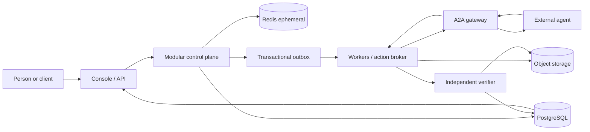
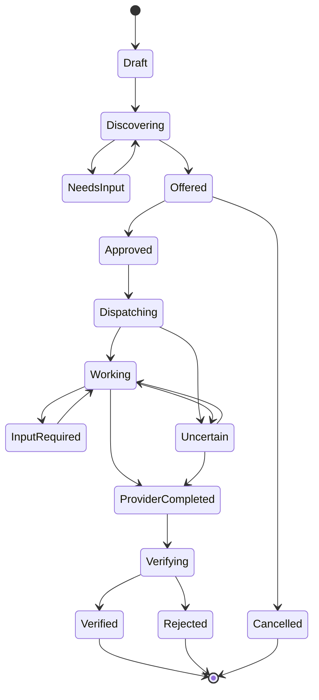

# Tessera Target Architecture

**Status:** authoritative target for the consolidation program

Date: 2026-08-26

## Architectural objective

Tessera must let any independently built agent join an open network while giving humans and orchestrators a safe, durable way to delegate work. Internal implementation choices must not leak into the public agent contract.

## Boundary model

### 1. Protocol

Owns transport-neutral trust vocabulary, schema identifiers, cryptographic bindings, and the A2A extension. It has no dependency on Tessera's Console, database models, provider connectors, or agent framework.

### 2. Network

Owns Agent Card registration, ownership proof, capability indexing, health/freshness, eligibility, endpoint grounding, discovery, and public reputation views. Discoverable does not automatically mean trusted or transactable.

### 3. Orchestrator

Owns the canonical request lifecycle: interpretation, discovery, offer comparison, exact approval, durable dispatch, progress, reconciliation, verification coordination, and result presentation. It addresses providers only through registry-grounded endpoint data.

### 4. Console/control plane

Owns browser/API authentication, tenant-bound administrative state, human approvals, integrations, task views, and operational controls. Administrative modules may deploy together, but retain explicit module ports and repository contracts.

### 5. Vertical applications

Contacts, campaigns, voice, Slack, Google, Twilio, and future products consume the same task/action contracts. They cannot create alternate approval, tenant, or completion semantics.

## Deployment shape

The consolidation target begins with four independently scalable trust boundaries:

1. **Control plane** — Console BFF, sessions, OAuth coordination, registry administration, and orchestration APIs as explicit modules.
2. **A2A gateway** — public Agent Card/task compatibility, version negotiation, authentication projection, endpoint validation, and legacy translation.
3. **Workers and action broker** — crash-recoverable task execution and external effects, isolated from public web processes.
4. **Independent verifier** — evidence resolution and reputation projection, isolated from the provider and requester.

Vault remains a dedicated security boundary. Provider webhooks may remain isolated ingress adapters where public callback scaling or secrets justify it.

## Canonical trusted lifecycle

`ProviderCompleted` is provisional. Only `Verified` is a trusted success.

Every external effect requires an immutable preview/offer hash, actor and tenant binding, expiration, one-use approval, and idempotency key. A timeout after dispatch becomes `Uncertain` and must reconcile before retry.

## State ownership

- PostgreSQL is the only production source of truth for durable control-plane and execution state.
- Redis stores only reconstructible cache, presence, rate-limit, replay, and short-lock state.
- Large immutable evidence bytes use content-addressed object storage; PostgreSQL stores their authoritative digest, tenant, retention, and verification metadata.
- Transactional outbox/inbox records asynchronous handoffs before any separate event platform is justified.
- Previously applied migrations are immutable; corrections are forward migrations.

## Security and tenancy

- One request binding, `app.current_org_id`, governs tenant-owned PostgreSQL rows.
- Tenant access must fail closed when that binding is absent, empty, malformed, or names another organization. Enforcement uses `ENABLE` and `FORCE ROW LEVEL SECURITY`, command-specific `USING` and `WITH CHECK`, and non-owner runtime roles.
- Public Agent Cards and capability discovery remain globally readable without tenant context. Agent ownership, credentials, contacts, tasks, approvals, evidence, and administrative metadata remain tenant-bound.
- Agent ownership is explicit private control-plane data; it is not inferred from the public card or exposed by discovery responses.
- Legacy rows without a defensible owner remain preserved in administrative quarantine and invisible to tenant roles until an audited administrative assignment.
- Previously applied migrations are append-only. Tenant-policy corrections are new forward migrations, never edits to migration history.
- Secrets never appear in Agent Cards, model context, logs, traces, or error payloads.
- Telemetry uses allowlisted low-cardinality attributes and correlation identifiers, not raw prompts, contact destinations, message bodies, or evidence bytes.

## Public compatibility

- A2A and the Agent Card are the public communication/discovery surface.
- Tessera trust semantics remain an opt-in extension with graceful degradation.
- Current custom task envelopes receive a versioned compatibility adapter; internal task state is wire-version independent.
- Eve, n8n, Python, Vercel AI SDK, and other frameworks need only implement the published card, security declaration, task operations, and selected extension behavior.
- External agents never import Tessera application modules to pass conformance.

## Scaling rules

- Scale gateway, workers/action execution, verification, and control-plane instances independently from measured saturation.
- Keep capability search in PostgreSQL until representative query plans and latency fail the accepted SLO.
- Evaluate Temporal behind the execution interface using the same recovery scenarios; do not adopt it by assumption.
- Introduce Kafka/NATS only when transactional outbox throughput, fan-out, or retention requirements prove insufficient.
- Partition audit, task-event, and outbox tables only after representative volume and query plans identify a threshold.

## Dependency direction

- Protocol schemas/RFCs depend on no application code.
- Gateway depends on protocol contracts and adapter ports, not control-plane repositories.
- Orchestrator depends on registry, approval, execution, and verification interfaces, not provider-specific implementations.
- Vertical modules depend on canonical orchestration/action contracts.
- Repositories implement domain ports; domain logic does not import web frameworks or concrete database pools.

## Release gates

Consolidation is complete only when:

- generic and provider-specific paths project one lifecycle;
- production durable state has no SQLite dependency;
- cross-tenant tests pass under non-owner roles;
- every effect is approval/idempotency bound;
- every trusted success has independent evidence verification;
- Eve, Python, and n8n examples pass black-box conformance;
- restart/retry tests produce zero duplicate external effects;
- operators can trace the complete lifecycle without direct database inspection.
