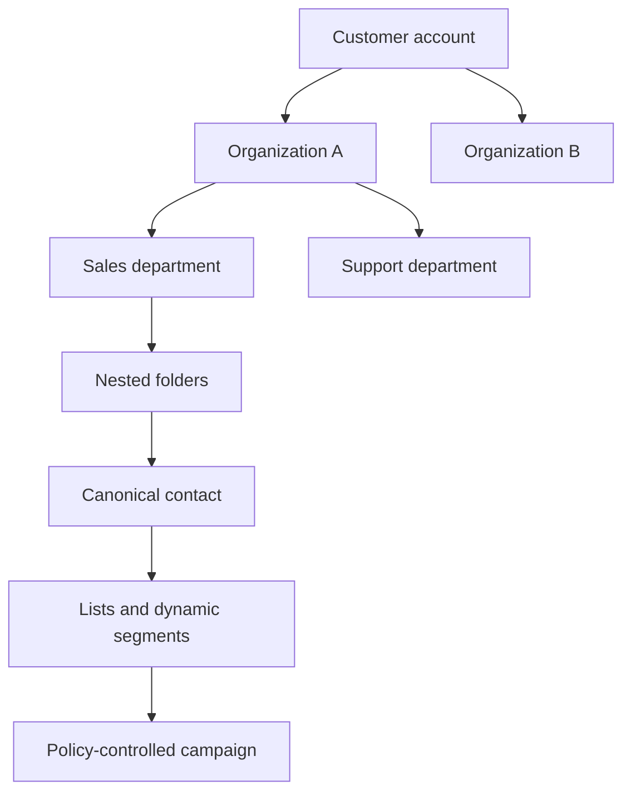

# General Twilio Orchestration and Account Contact Directory

## Summary

ACP-TASK will add general Twilio orchestration for SMS, WhatsApp, inbound and outbound voice, conversational voice handling, human transfer, and policy-controlled campaigns. A tenant-isolated Contacts product will organize authorized recipients in an S3-like hierarchy with HubSpot-like records, activity, permissions, lists, and segments.

---

## Problem Frame

Customers currently coordinate communications through a mixture of personal telephone numbers and Twilio numbers. Contacts, consent, ownership, conversation history, and responsibility for follow-up can become dispersed, while natural-language requests such as “send Juana a WhatsApp” or “call Juan” still require a person to locate the correct number and operate Twilio manually.

The existing integrations screen already presents Twilio as available, and ACP-TASK has established patterns for catalog-driven orchestration, exact approvals, durable workflows, provider execution, and audit in the general Slack orchestration work. Twilio introduces additional product risks: paid effects, high-volume campaigns, real-time voice interactions, unwanted contact, ambiguous delivery outcomes, and strict isolation between customer accounts.

The diagram is conceptual: the contact has one primary place in the tree and may participate in many lists or segments without being duplicated.

---

## Actors

- A1. Account administrator: configures Twilio, the contact hierarchy, permissions, consent policy, campaign limits, and emergency controls for one ACP-TASK account.
- A2. Contact manager: creates, imports, organizes, corrects, and validates contacts within authorized branches.
- A3. Campaign operator: prepares audiences and campaigns within branches for which they have campaign authority.
- A4. Ordinary user: asks the Concierge to communicate with a named contact and reviews exact effects when approval is required.
- A5. ACP-TASK agent: interprets requests, proposes contacts and effects, and operates only through trusted capabilities and current policy.
- A6. External contact: receives or initiates SMS, WhatsApp, or voice communication and can opt out where applicable.
- A7. Human responder: receives transferred calls according to department, language, schedule, and fallback rules.

---

## Key Flows

- F1. Connect and prepare Twilio
  - **Trigger:** An account administrator enables Twilio for an ACP-TASK account.
  - **Actors:** A1, A2
  - **Steps:** The administrator connects the correct Twilio authority, selects owned communication identities, configures limits, creates or imports the contact hierarchy, records authorization evidence, and verifies readiness before enabling effects.
  - **Outcome:** Only the current account can discover and use its Twilio connection, senders, contacts, and policies.
  - **Covered by:** R1, R2, R3, R8, R13, R16

- F2. Send an individual message or place a call
  - **Trigger:** A user asks in natural language to contact a named person.
  - **Actors:** A4, A5, A6
  - **Steps:** The system identifies an allowed capability, resolves the canonical contact, selects a currently authorized channel, materializes the exact destination and content or call purpose, obtains the required approval, executes once, and reports the verified or uncertain outcome.
  - **Outcome:** The intended contact receives one authorized communication, or the user receives an actionable reason it could not be sent.
  - **Covered by:** R4, R8, R9, R10, R14, R15

- F3. Run an autonomous campaign
  - **Trigger:** An authorized operator activates a campaign definition.
  - **Actors:** A1, A3, A5, A6
  - **Steps:** The operator chooses a permitted tree branch, list, or segment; fixes the campaign content, channels, schedule, limits, and budget; reviews the eligible audience and exclusions; authorizes the campaign; and the system executes individual effects under that unchanged authorization while enforcing live policy and opt-outs.
  - **Outcome:** Eligible contacts are processed within the authorized envelope, with per-contact outcomes, aggregate progress, spend visibility, pause, and emergency stop.
  - **Covered by:** R7, R10, R11, R12, R13, R14, R15

- F4. Handle an inbound call
  - **Trigger:** A contact calls an ACP-TASK-managed Twilio number.
  - **Actors:** A5, A6, A7
  - **Steps:** The voice agent discloses its automated nature, identifies the applicable account and routing context, answers only approved public information, and transfers by department, language, schedule, and fallback rule when requested or required.
  - **Outcome:** The caller receives an allowed answer or reaches the best configured human destination without the agent exposing private information or performing sensitive actions.
  - **Covered by:** R5, R6, R8, R14, R17

---

## Requirements

**Trusted Twilio orchestration**

- R1. Twilio must be a first-class, account-scoped integration with observable connection status, reconnect and disconnect controls, enabled capability families, owned sender identities, and a fail-closed unavailable state.
- R2. “Any supported Twilio task” must mean an operation present in a versioned trusted catalog and permitted by the live connection, account policy, actor authority, rollout state, destination consent, and provider state; a model must never invent arbitrary Twilio API operations or parameters.
- R3. SMS, WhatsApp, and voice must be independently enableable, observable, rate- and spend-limited, auditable, and disableable without breaking the other families.
- R4. The Concierge must interpret ordinary Spanish, English, typo-tolerant, and mixed-language requests for individual messages and calls, multi-step requests, and campaign preparation without requiring command syntax.
- R5. The product must receive and associate inbound SMS, WhatsApp messages, delivery events, calls, and call outcomes with the correct account, Twilio identity, contact when known, and conversation or campaign context.
- R6. The inbound voice agent may disclose approved public information and transfer calls, but it must not access private contact data for the caller, modify records, or perform sensitive business actions on the caller’s instructions.

**Account-isolated Contacts**

- R7. Each ACP-TASK account must have a completely isolated Contacts directory; no user, agent, search, campaign, import, export, or provider callback may reveal or use another account’s contact data.
- R8. Contacts must support an account-owned hierarchy of organizations, departments, and freely nested subfolders, with navigation by path, safe branch moves, global search within authorized branches, and no cyclic ancestry.
- R9. Each person must have one canonical contact record and one primary tree location, while lists, tags, and dynamic segments may reference that record across campaign and operational groupings without creating copies.
- R10. A contact must carry the communication information needed to make safe decisions, including names, channel addresses, locale and timezone where known, authorized channels, consent evidence and status, exclusions, activity history, and current suppression state.
- R11. Branch permissions must be independently grantable for viewing, editing, administering, and using contacts in campaigns; permissions inherit to descendants unless an authorized administrator applies an explicit restriction.
- R12. Contacts may be added manually, imported during or after Twilio setup, or proposed conversationally by an agent. Agent proposals and changes to identity, destination, consent, or permissions require an authorized human decision before becoming usable.
- R13. When a name resolves to multiple records, the system may prefer the most recently human-confirmed match only when it remains policy-compatible; tied, conflicting, stale, or insufficient matches require disambiguation before any effect is materialized.

**Effects, approval, and campaigns**

- R14. Every individual outbound communication outside an active campaign authorization must present the exact canonical contact, masked destination, channel, sender identity, content or call purpose, and estimated material consequence before human approval; changing any of these invalidates approval.
- R15. A campaign may execute individual messages or calls without per-effect human approval only after an authorized operator fixes and authorizes its audience rule, content or voice behavior, channels, senders, schedule, frequency, budget, concurrency, duration, and stop conditions. Expansion or material change invalidates that authorization.
- R16. Campaign eligibility must be evaluated again before each effect. Missing or expired consent, opt-out, suppression, permission loss, budget exhaustion, quiet hours, frequency limits, or emergency stop must prevent dispatch even if the contact was eligible when the campaign began.
- R17. Voice campaigns and inbound voice handling must support configurable human transfer by department, language, operating hours, primary destinations, fallback destinations, and a truthful no-responder outcome.

**Reliability, safety, and accountability**

- R18. Replayed requests, concurrent workers, retries, provider timeouts, restarts, duplicate callbacks, and repeated approvals must not produce duplicate messages or calls. Ambiguous provider outcomes must be reconciled before another potentially duplicative dispatch.
- R19. Every connection, contact change, consent decision, resolution, campaign authorization, policy decision, dispatch, delivery event, call transfer, suppression, reconciliation, and emergency action must produce a tenant-scoped audit trail without exposing secret credentials or unnecessary contact content.
- R20. Account administrators must be able to pause a campaign, disable one capability family, disable a sender, enforce hard spend and volume ceilings, and invoke an account-wide Twilio emergency stop with a clear view of effects already dispatched versus prevented.

---

## Acceptance Examples

- AE1. **Covers R7, R8, R11.** Given two ACP-TASK accounts connected to Twilio, when a user searches, browses, imports, or targets a campaign, only contacts and branches authorized inside that user’s current account are available.
- AE2. **Covers R9, R13, R14.** Given “Juana” has one canonical record in `Acme/Ventas` and belongs to both `VIP` and `Renovaciones`, when a user asks to send her a WhatsApp message, the preview references that one record and does not create or choose a duplicate.
- AE3. **Covers R12.** Given the Concierge is told a new phone number for Juan, when the agent proposes adding it, the number remains unavailable for communication until an authorized contact manager approves the proposal and its consent state.
- AE4. **Covers R14.** Given an approved SMS draft, when the user changes its text, recipient, destination number, sender, or channel, the previous approval becomes invalid and dispatch remains blocked until the revised effect is approved.
- AE5. **Covers R15, R16.** Given an authorized campaign aimed at a branch and its descendants, when a contact opts out after campaign activation but before their turn, that contact is suppressed without requiring the campaign to be recreated.
- AE6. **Covers R15, R20.** Given an autonomous call campaign reaches its spend ceiling or an administrator activates emergency stop, when more contacts remain queued, no new calls begin and the product distinguishes completed, in-progress, prevented, and uncertain outcomes.
- AE7. **Covers R6, R17.** Given an inbound caller asks for private account information, when the voice agent cannot answer under its public-information policy, it refuses to disclose the data and offers transfer using the configured department, language, schedule, and fallback rules.
- AE8. **Covers R18.** Given Twilio times out after accepting a message or call request, when the worker resumes, ACP-TASK reconciles the original effect instead of blindly dispatching a duplicate.
- AE9. **Covers R2, R3.** Given the model proposes a Twilio operation that is absent from the trusted catalog or disabled for the account, when the plan is validated, the operation is rejected with a named limitation and no provider call occurs.

---

## Success Criteria

- Users can ask ACP-TASK to contact a named authorized person without manually locating a number or operating the Twilio console.
- Account administrators can organize large directories through a familiar hierarchy while using lists and segments without duplicating people.
- Campaign operators can run bounded autonomous messaging and calling campaigns and understand eligible, excluded, completed, failed, and uncertain outcomes.
- External contacts’ current consent, opt-outs, quiet hours, and suppression state reliably override campaign intent.
- Inbound callers receive an approved public answer or a predictable human-transfer path without exposure of private data.
- Cross-account contact access and cross-account Twilio execution are denied in positive, negative, concurrent, callback, and recovery scenarios.
- Planning can trace every proposed work unit and test scenario to stable requirements without inventing product behavior or approval semantics.

---

## Scope Boundaries

### Deferred for later

- Rich sales-pipeline functionality such as deals, forecasting, marketing attribution, and full CRM replacement beyond the contact, activity, segmentation, and communication needs defined here.
- Additional communication providers behind the same product surface; the requirements preserve a catalog-driven shape but this scope delivers Twilio.
- Automated private-data lookup or transactional business actions during inbound voice conversations; these require a separate identity-verification and delegated-authority product decision.

### Outside this product's identity

- A raw Twilio API console where a model chooses unreviewed methods or arbitrary parameters.
- Cross-account directories, discoverability, campaign audiences, credential reuse, or communication execution.
- Purchased, scraped, or otherwise unverified contact lists treated as authorized recipients.
- Unlimited autonomous outreach without consent, suppression, budget, frequency, schedule, permission, audit, and emergency controls.
- Treating a folder path, display name, model confidence, inbound message, or caller statement as authorization.

---

## Key Decisions

- One product, not a separate Twilio application: extend ACP-TASK’s existing integration, orchestration, approval, and audit experience.
- Trusted capability breadth over arbitrary API access: broad usefulness comes from reviewed catalog operations and bounded composition.
- S3-like hierarchy plus HubSpot-like contact behavior: the tree provides ownership and navigation; canonical records, properties, activity, lists, and segments prevent duplication and support campaigns.
- Account isolation is the primary boundary: organizations and departments organize contacts inside one account and never connect directories across customer accounts.
- One primary location per contact: cross-cutting membership uses lists, tags, and segments rather than multiple copies or ambiguous tree ownership.
- Branch-level permission dimensions: viewing, editing, administration, and campaign use are separate authorities and inherit downward with explicit restrictions.
- Exact approval for individual effects, bounded authorization for campaigns: autonomy is allowed only inside an unchanged, human-authorized campaign envelope with live per-effect policy checks.
- Voice agent as public-information front line: sensitive actions and private-data access remain unavailable; transfer to humans is the safe escalation path.

---

## Dependencies / Assumptions

- Existing personal and Twilio contacts are described as authorized to receive calls; imported records must still carry durable evidence, scope, status, and any applicable expiration rather than relying on an undocumented assertion.
- Customers have or will provision Twilio identities capable of the enabled SMS, WhatsApp, and voice families in their operating regions.
- The applicable communication, privacy, recording, consent, and automated-outreach rules vary by destination and use case; planning must define how policy configuration and evidence satisfy the markets selected for launch.
- Personal numbers can participate only through a supported migration, forwarding, verification, or linking arrangement; ACP-TASK cannot directly control an unrelated personal carrier line.
- Campaign autonomy assumes an authorized operator can be held accountable for the fixed campaign definition even though individual effects do not receive separate approval.

---

## Outstanding Questions

### Deferred to Planning

- [Affects R1, R3][Needs research] Which Twilio account, subaccount, sender, WhatsApp sender, and number-ownership models map safely to one ACP-TASK account and to independently disableable capability families?
- [Affects R5, R18][Technical] What provider-event and reconciliation mechanisms give each SMS, WhatsApp, and voice operation truthful delivery and ambiguous-outcome semantics?
- [Affects R6, R17][Needs research] Which voice runtime, supported languages, disclosure behavior, latency target, and transfer mechanisms satisfy the first launch markets?
- [Affects R10, R15, R16][Needs research] Which consent evidence, retention, quiet-hour, recording, opt-out, and campaign restrictions apply to the chosen launch countries and communication categories?
- [Affects R8-R13][Technical] What hierarchy, search, import, segment, permission-inheritance, and branch-move design preserves canonical contacts and account isolation at the expected directory scale?
