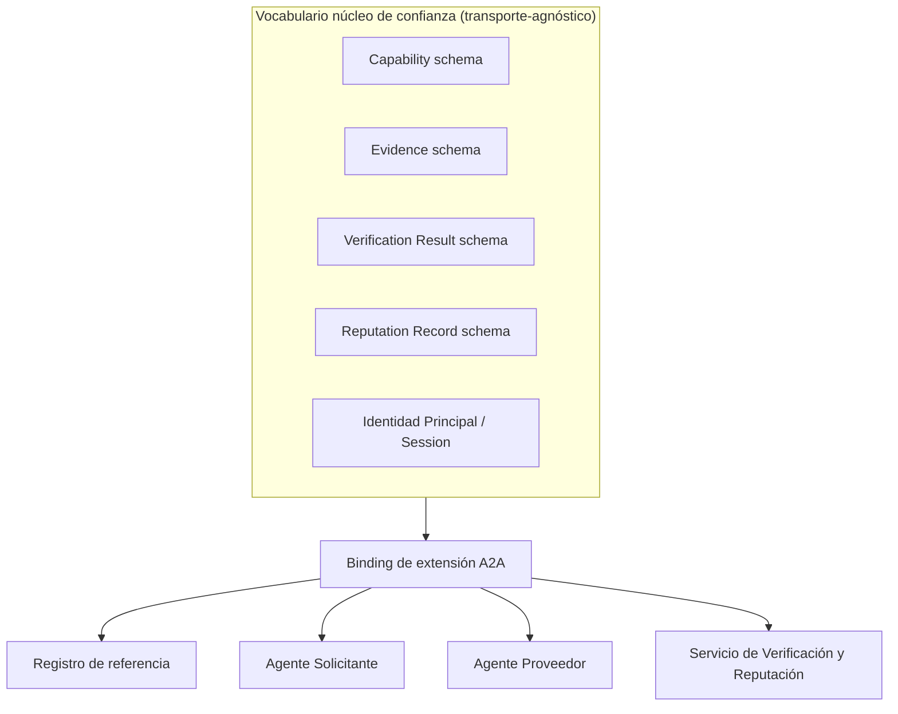
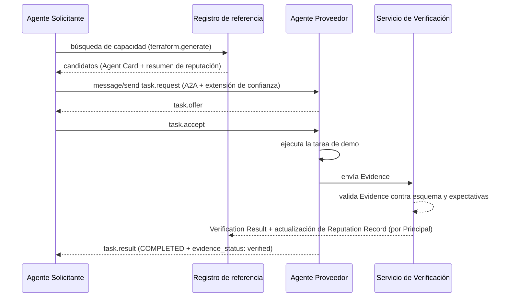

# Capa de Confianza para Agentes de IA sobre A2A - Plan

---

## Goal Capsule

- **Objetivo:** entregar una implementación de referencia mínima pero funcional de una capa de confianza/verificación/reputación para agentes de IA, construida como una extensión oficial del protocolo A2A de Google — demostrada por dos agentes construidos de forma independiente (un solicitante y un proveedor) que se descubren por capacidad, negocian una tarea, la ejecutan, y completan verificación independiente, sin integración manual entre sus bases de código.
- **Autoridad del producto:** este plan (Product Contract abajo), originado en diálogo directo con el usuario — no existe un documento previo de `ce-brainstorm` persistido en disco.
- **Condiciones de parada:** detener y preguntar si un requisito entra en conflicto con otro, si el mecanismo de extensión de A2A resulta insuficiente para cargar las formas de datos requeridas (Evidence/Verification Result/Reputation Record), o si el alcance amenaza con expandirse hacia escrow/pagos o delegación multi-salto (ambos explícitamente diferidos).
- **Perfil de ejecución:** código — implementación de referencia en Python.
- **Responsable del cierre:** el implementador verifica la demo de dos agentes de extremo a extremo contra el Verification Contract antes de declarar terminado; cualquier código de intentos abandonados debe eliminarse antes del cierre.

---

## Product Contract

### Summary

Construir la capa de confianza/verificación/reputación para agentes de IA como una extensión oficial de A2A (el protocolo agente-a-agente de Google, bajo Linux Foundation) — no un protocolo de mensajería rival. La implementación de referencia son dos agentes de demo construidos por separado (solicitante/proveedor de una tarea de generación de Terraform) que ejercitan el ciclo completo: descubrimiento por capacidad vía un registro de referencia, negociación de la tarea sobre A2A, ejecución, verificación respaldada por evidencia, y actualización de reputación portable anclada a una identidad "Principal" duradera (no a la sesión efímera desechable).

### Problem Frame

Los agentes de IA creados por distintas personas, modelos y plataformas hoy no pueden descubrirse, confiar entre sí, ni verificar el trabajo del otro a través de fronteras organizacionales. A2A y MCP ya resolvieron descubrimiento y llamada a herramientas — pero ninguno define durabilidad de identidad, verificación de resultados respaldada por evidencia, ni reputación portable entre plataformas. Construir un protocolo rival desde cero competiría en un terreno ya consolidado (A2A donado a Linux Foundation con 150+ organizaciones; MCP con ~97M de descargas de SDK al mes) y arriesga repetir el destino de especificaciones rivales anteriores como FIPA ACL (1997), que "nunca sobrevivió el contacto con el internet abierto".

### Requirements

**Posicionamiento del protocolo**
- R1. El sistema se monta sobre el protocolo A2A de Google como una Extensión oficial (vía el mecanismo `capabilities.extensions[]` / `AgentExtension` de A2A), no como un protocolo de transporte nuevo.
- R2. Se define un vocabulario de confianza transporte-agnóstico (semántica de Capability, Evidence, Verification Result, Reputation Record) independiente de cualquier protocolo portador específico, de modo que un binding futuro sobre MCP o uno independiente pueda reutilizar los mismos objetos sin rediseñarlos.

**Identidad y confianza**
- R3. La identidad de un agente separa un Principal duradero (la entidad que acumula reputación entre tareas) de una Sesión efímera y desechable (la instancia de ejecución de una sola tarea) — cada Sesión queda enlazada criptográficamente a su Principal emisor.
- R4. Una tarea no se marca completa para efectos de reputación hasta que un paso de Verificación independiente valida la Evidencia presentada — el cumplimiento autoreportado nunca actualiza la reputación por sí solo.

**Implementación de referencia y demo**
- R5. Un registro de referencia indexa Principals, sus Agent Cards de A2A, y resúmenes de reputación, exponiendo búsqueda por capacidad — pero ningún agente puede depender rígidamente de que este registro específico sea el único válido (el diseño debe ser federable).
- R6. Dos agentes de demo construidos de forma independiente (un solicitante y un proveedor) demuestran el ciclo completo de extremo a extremo: descubrimiento por capacidad, negociación de la tarea (una oferta única → aceptar, sin ronda de contraoferta), ejecución, envío de evidencia, verificación, y actualización de reputación — sin integración manual entre sus bases de código.
- R7. La tarea de demo es de generación de Terraform (continuidad con el documento de concepto original): generar una plantilla Terraform que despliegue dos contenedores detrás de un Application Load Balancer de AWS.

**No-objetivos explícitos de este plan**
- R8. El escrow o la retención de pago quedan fuera de alcance; la verificación en este plan es solo por evidencia, sin que se mueva dinero. El modelo de negocio (comisión sobre tareas verificadas vs. abrir el código y monetizar después) es una pregunta abierta explícita, no un bloqueante de construcción.
- R9. La delegación/subcontratación multi-salto entre agentes (una credencial de "poderes plenos" y cadena de custodia entre sub-agentes) queda fuera de alcance; el flujo de referencia cubre exactamente un solicitante y un proveedor.
- R10. El nombre público final del proyecto está sin definir (los nombres originales "AgentNet"/"ANP" colisionan con proyectos ya publicados); este plan usa el nombre provisional **AgentTrust** en todo el documento y trata el naming como una decisión separada, no bloqueante.

### Scope Boundaries

En alcance: R1-R7, R10 (posicionamiento del protocolo + modelo de identidad + registro de referencia + demo de dos agentes + uso del nombre placeholder; la decisión final de naming permanece diferida).

#### Deferred to Follow-Up Work
- Escrow / retención de pago y el modelo de negocio basado en comisión (R8).
- Credenciales de delegación / subcontratación multi-salto (R9).
- Binding sobre MCP y cualquier binding independiente (no-A2A) del vocabulario núcleo.
- Federación más amplia: múltiples registros independientes, reconciliación de reputación entre registros.
- La nube de mercado de agentes profesionales y la app móvil de consumo — la visión de producto de largo plazo que este protocolo debe eventualmente soportar, explícitamente fuera de este plan.
- Decisión final de naming y marca (R10).
- Negociación con ronda de contraoferta/RFQ, más allá de la oferta única del MVP (KTD6).

### Open Questions

- Modelo de negocio: comisión sobre tareas verificadas vs. abrir el código primero y monetizar después. No bloqueante — no afecta el alcance de construcción de este plan.
- Nombre final del proyecto. No bloqueante — "AgentTrust" es un placeholder usado en código, esquemas y URIs a lo largo de este plan.
- Cuándo agregar un binding sobre MCP junto al binding sobre A2A — alcance futuro, no requerido para el criterio de éxito de este plan.

### Sources & Research

- Especificación de A2A: `github.com/a2aproject/A2A`, `a2a-protocol.org/latest/specification/` — forma del Agent Card (`name`, `url`, `protocolVersion`, `capabilities.extensions[]`, `skills[]`, `securitySchemes`), estados de tarea (`SUBMITTED`, `WORKING`, `INPUT_REQUIRED`, `AUTH_REQUIRED`, `COMPLETED`, `FAILED`, `CANCELED`, `REJECTED`), y el mecanismo oficial de extensión (`AgentExtension { uri, description, required, params }`, encabezado `A2A-Extensions`).
- Extensiones existentes sobre A2A como precedente directo: `a2a-x402` (`github.com/google-agentic-commerce/a2a-x402`, extensión de pagos) y una extensión OID4VP de autenticación con credenciales verificables — prueban que una extensión de confianza/verificación es una categoría de extensión ya aceptada, no un fork.
- Investigación de panorama (de la ideación previa): MCP (~97M descargas de SDK al mes), ACP de IBM fusionado dentro de A2A bajo Linux Foundation (agosto 2025), ERC-8004 (reputación on-chain, ratificado ~enero 2026), x402 (iniciación de pago, sin escrow-con-verificación), FIPA ACL (1997, spec-primero, "nunca sobrevivió el contacto con el internet abierto").

---

## Planning Contract

### Key Technical Decisions

- **KTD1 — Extensión de A2A, no protocolo nuevo.** Se registra una URI de extensión estable (placeholder: `https://treessera.com/extensions/trust/v1`), declarada en `AgentCard.capabilities.extensions[]`; los clientes se suscriben vía el encabezado `A2A-Extensions` según el mecanismo documentado de A2A. Razón: A2A ya tiene gobernanza de Linux Foundation y 150+ organizaciones respaldándolo; `a2a-x402` demuestra que extensiones de confianza/pago de terceros son un patrón normal y aceptado, no un fork.
- **KTD2 — Núcleo transporte-agnóstico.** Los objetos centrales (Capability, Evidence, Verification Result, Reputation Record, identidad Principal/Session) se especifican como JSON Schemas independientes, separados de la forma de mensaje de A2A. El binding de A2A mapea estos objetos sobre `Message.extensions[]` / `metadata` / campos de artefacto de A2A. Razón: preserva la opción de agregar un binding sobre MCP o independiente más adelante sin rediseñar el vocabulario.
- **KTD3 — Verificación como metadato de extensión, no como estado del núcleo.** El enum `TaskState` de A2A no tiene un paso de verificación incorporado, así que el estado de verificación viaja como metadato a nivel de extensión (`evidence_status: pending | verified | rejected`) junto al artefacto de la tarea, sin modificar la máquina de estados propia de A2A. Razón: el enum central de A2A no es nuestro para cambiar; el metadato de extensión es el punto de extensibilidad documentado.
- **KTD4 — Reputación anclada al Principal, nunca a la Sesión.** Cada credencial de Sesión queda firmada por su Principal al emitirse, de modo que un Verification Result pueda rastrearse hasta el Principal correcto para actualizar su reputación. Razón: resuelve la contradicción "agentes efímeros + reputación" identificada durante la ideación previa.
- **KTD5 — Registro configurable, no singleton fijo.** El cliente de registro del agente solicitante recibe una URL de registro configurable, no un valor fijo en código. Razón: evita recrear el modo de falla de "cuello de botella central único"; mantiene el diseño federable (R5).
- **KTD6 — Negociación de una sola oferta en v1.** La negociación en este plan es un intercambio único `task.offer` → aceptar/rechazar (vía `message/send` de A2A), sin ronda de contraoferta. Razón: coincide con el alcance confirmado del MVP; la contraoferta/RFQ queda diferida.
- **KTD7 — Stack de implementación: Python.** La implementación de referencia usa Python con un cliente/servidor compatible con los bindings de transporte de A2A (JSON-RPC 2.0 sobre HTTP, con SSE para streaming). Razón: coincide con la preferencia de stack del documento de concepto original, y las implementaciones/SDKs de ejemplo publicados de A2A son mayormente Python-first, lo que minimiza fricción de traducción para los agentes solicitante y proveedor.
- **KTD8 — Postura de resistencia Sybil y manejo de claves a escala de referencia (no producción).** La resistencia Sybil completa (staking, agregación de attestations) queda explícitamente diferida — ni siquiera el propio ERC-8004 la resuelve del todo ("preventing Sybil attacks in permissionless systems... remains an open problem"). Para v1 se agrega solo una fricción barata: el registro de nuevos Principals requiere una invitación/API-key emitida por el Registro (U4), no una fricción criptoeconómica. Para claves: cada Principal genera su par ed25519 localmente en su propio proceso (nunca emitido ni transmitido de forma centralizada); la clave privada nunca vive en un archivo compartido/versionado; el Servicio de Verificación (U3) mantiene una lista de revocación de claves de Principal que puede poblarse manualmente — sin rotación automática en v1, ya que un control de revocación manual importa más a escala de demo que la rotación automatizada. Razón: A2A mismo delega la resistencia Sybil a "un registro curado" en vez de resolverla a nivel de protocolo, y `did:key` (el análogo más cercano a un Principal de clave ed25519 desnuda) tampoco soporta rotación — separar identificador de clave vigente (como hacen KERI/did:web) es trabajo de producción, no de v1.

### High-Level Technical Design

Topología de componentes:

Flujo de la demo de extremo a extremo:

### Assumptions

- El modelo de negocio (comisión vs. open-source-primero) no está decidido; no afecta el alcance de construcción de este plan.
- El nombre final del proyecto no está decidido; se usa **AgentTrust** como identificador placeholder en código, esquemas y URIs.
- La tarea de demo se mantiene como generación de Terraform (continuidad con el documento original) en vez de una tarea que refleje la visión de mercado de largo plazo (edición de video, etc.); el implementador puede sustituir una tarea igualmente simple y sin dependencias de nube en vivo si generar/validar Terraform resulta incómodo de verificar sin credenciales reales de AWS.

### Risks & Dependencies

- La especificación de A2A aún está evolucionando — algunas áreas (formalización de credenciales dentro del Agent Card, consulta dinámica de skills) están marcadas como "planeadas" por A2A, no finalizadas. Mitigación: KTD1/KTD2 mantienen el vocabulario propio desacoplado del núcleo de A2A, así que cambios futuros en A2A afectan principalmente al binding (U2), no a los esquemas centrales (U1).
- Dependencia de que el mecanismo de extensión de A2A efectivamente pueda cargar las formas de datos requeridas (Evidence, Verification Result) sin fricción — validado por investigación (`a2a-x402` y la extensión OID4VP son precedentes reales de extensiones con payloads no triviales), pero no verificado aún contra una implementación de A2A corriendo.
- Madurez de los SDKs/herramientas de A2A en Python — al ser un ecosistema relativamente joven (protocolo donado a Linux Foundation en 2025), las bibliotecas cliente/servidor pueden tener huecos o cambios de breaking entre versiones menores.
- **Resistencia Sybil no resuelta a nivel de protocolo (riesgo de seguridad/reputación).** Nada impide hoy que un Principal con mala reputación genere una identidad nueva y arranque con una reputación limpia — este es un problema abierto incluso en ERC-8004, el estándar de reputación on-chain más maduro del espacio. Mitigación para v1 (KTD8): fricción de registro vía invitación/API-key emitida por el Registro, documentando explícitamente que staking o agregación de attestations queda para una fase de producción posterior.
- **Manejo de claves del Principal (riesgo de seguridad).** Sin un control mínimo, una clave privada de Principal filtrada o mal almacenada permite suplantar esa identidad y falsificar su reputación. Mitigación para v1 (KTD8): generación local de claves, nunca en archivos compartidos/versionados, más una lista de revocación manual en el Servicio de Verificación — sin rotación automática, que queda diferida a producción.

---

## Implementation Units

### Fase A — Definición del protocolo núcleo

### U1. Vocabulario núcleo de confianza — esquemas transporte-agnósticos

- **Goal:** definir Capability, Evidence, Verification Result, Reputation Record, y la identidad Principal/Session como JSON Schemas independientes de A2A.
- **Requirements:** R2, R3, R4
- **Dependencies:** ninguna
- **Files:** `schemas/capability.schema.json`, `schemas/evidence.schema.json`, `schemas/verification-result.schema.json`, `schemas/reputation-record.schema.json`, `schemas/principal.schema.json`, `schemas/session.schema.json`, `spec/RFC-0001-core-vocabulary.md`, `tests/schemas/test_core_schemas.py`
- **Approach:** Evidence lleva `schema_valid`, `tests_passed`, y hashes de artefacto (precedente del documento de concepto original) más una referencia a la Session que la produjo. Verification Result referencia una instancia de Evidence y un Principal, con un veredicto (`verified`/`rejected`) y su razonamiento. Reputation Record se indexa por Principal + Capability, rastreando conteos y tasa de verificación en el tiempo. Principal lleva una clave pública (ed25519) y un identificador estable; Session referencia a su Principal emisor mediante un enlace firmado (KTD4).
- **Execution note:** test-first — escribir las pruebas de validación de esquema antes de finalizar cada esquema, ya que son el contrato del que dependen todas las demás unidades.
- **Test scenarios:**
  - Camino feliz: instancias válidas de Evidence, Verification Result y Reputation Record validan contra sus esquemas.
  - Casos límite: una Evidence sin el campo de hash requerido es rechazada; un Reputation Record de un Principal sin tareas completadas parte de un estado neutral, no de "fallo por defecto".
  - Camino de error: un objeto Session sin enlace firmado a un Principal falla la validación de esquema.
- **Verification:** los seis esquemas validan sus fixtures de ejemplo; fixtures inválidos son rechazados con un error de esquema claro.

### U2. Binding de extensión A2A — cómo el vocabulario núcleo viaja sobre A2A

- **Goal:** definir con precisión cómo los objetos del núcleo viajan sobre el Agent Card, los mensajes y los artefactos de A2A, vía su mecanismo oficial de extensión.
- **Requirements:** R1, R2
- **Dependencies:** U1
- **Files:** `spec/RFC-0002-a2a-extension-binding.md`, `schemas/a2a-extension-descriptor.schema.json`, `tests/spec/test_a2a_extension_binding.py`
- **Approach:** declara una entrada `AgentExtension` (`uri`, `description`, `required`, `params`) para `AgentCard.capabilities.extensions[]`; mapea Evidence/Verification Result sobre `Message.metadata` o un tipo de artefacto dedicado adjunto a `task.result`; lleva `evidence_status` como metadato a nivel de extensión junto al `TaskState` nativo de A2A (KTD3); usa el encabezado `A2A-Extensions` como el mecanismo de suscripción del cliente.
- **Test scenarios:**
  - Camino feliz: un Agent Card con la extensión declarada valida contra el esquema propio de Agent Card de A2A más el esquema del descriptor de extensión.
  - Caso límite: un cliente que no envía el encabezado `A2A-Extensions` sigue recibiendo una respuesta A2A válida y funcional, sin datos de extensión (degradación elegante).
  - Integración: una tarea con `evidence_status: verified` en metadato de extensión es distinguible de una sin datos de extensión.
- **Verification:** un Agent Card de ejemplo y un mensaje de tarea de ejemplo pasan validación contra el esquema público de A2A (donde sea obtenible) y contra el esquema del descriptor de extensión de este proyecto.

---

### Fase B — Implementación de referencia

### U3. Servicio de Verificación y Reputación

- **Goal:** implementar el servicio que valida la Evidencia enviada contra expectativas y emite Verification Results, actualizando el Reputation Record del Principal correspondiente.
- **Requirements:** R4, R3
- **Dependencies:** U1
- **Files:** `services/verification/app.py`, `services/verification/reputation_store.py`, `tests/services/test_verification_service.py`
- **Approach:** expone un endpoint que recibe una Evidence más el enlace firmado de la Session a su Principal; valida la Evidence contra el esquema (U1) y contra expectativas específicas de la tarea de demo (ej. que el Terraform generado sea sintácticamente válido); en caso de éxito escribe un Verification Result y actualiza el Reputation Record indexado por Principal + Capability; en caso de fallo, registra un Verification Result rechazado sin actualizar la reputación al alza. Antes de aceptar cualquier Evidence, consulta una lista de revocación de claves de Principal (KTD8, poblada manualmente en v1) y rechaza de inmediato cualquier envío firmado por una clave revocada.
- **Execution note:** test-first para la lógica de aceptar/rechazar — es la garantía de "verificación obligatoria" (R4) y la superficie de corrección de mayor valor de todo el sistema.
- **Test scenarios:**
  - Camino feliz: una Evidence válida para la capacidad de demo produce un Verification Result `verified` e incrementa el Reputation Record del Principal.
  - Casos límite: una Evidence con esquema válido pero que falla una verificación específica de la tarea (ej. Terraform sintácticamente inválido) produce `rejected`, no `verified`.
  - Caminos de error: una Evidence que referencia una Session sin enlace firmado válido a un Principal se rechaza de inmediato, sin escritura en el Reputation Record; una Evidence firmada por una clave de Principal presente en la lista de revocación se rechaza igual, sin importar que el resto de la validación pase.
  - Integración: dos tareas verificadas consecutivas del mismo Principal se acumulan en el Reputation Record en vez de sobrescribirse.
- **Verification:** una secuencia guionizada de un envío de Evidence válido y uno inválido produce el Verification Result y el estado del Reputation Record esperados en ambos casos.

### U4. Registro de referencia (federable)

- **Goal:** un directorio de búsqueda por capacidad que indexa Principals, sus Agent Cards de A2A, y resúmenes de reputación.
- **Requirements:** R5
- **Dependencies:** U1, U3
- **Files:** `registry/app.py`, `registry/index_store.py`, `tests/registry/test_capability_search.py`
- **Approach:** los agentes se registran publicando su Agent Card (con el descriptor de extensión) más su Principal ID; el registro requiere una invitación/API-key emitida por el propio Registro para aceptar el registro de un Principal nuevo (KTD8 — fricción mínima anti-Sybil para v1, no staking ni attestations); indexa por `skills[]`/id de capacidad declarado y expone un endpoint de búsqueda que filtra por capacidad más un umbral mínimo de reputación leído del Reputation Record. Ningún agente puede fijar en código la URL de este registro como la única válida — el contrato de API del registro es lo que otros registros necesitarían replicar, no una relación especial con este código (R5).
- **Test scenarios:**
  - Camino feliz: registrar dos agentes con capacidades distintas y buscar una capacidad devuelve solo el agente que corresponde.
  - Caso límite: una búsqueda con filtro de reputación mínima excluye a un agente que coincide en capacidad pero aún no tiene historial de reputación; un intento de registro sin invitación/API-key válida se rechaza.
  - Integración: las actualizaciones de reputación del Servicio de Verificación (U3) se reflejan en búsquedas posteriores del registro sin un paso manual de sincronización.
- **Verification:** registrar ambos agentes de demo y correr una búsqueda de capacidad para la tarea de demo devuelve al agente proveedor con un resumen de reputación correcto.

### U5. Agente Solicitante

- **Goal:** un agente cliente de A2A construido de forma independiente que busca en el registro, negocia, y valida el resultado recibido.
- **Requirements:** R6, R1
- **Dependencies:** U1, U2, U4, U6
- **Files:** `agents/requester/agent.py`, `agents/requester/config.py`, `tests/agents/test_requester_flow.py`
- **Approach:** lee una URL de registro configurable (KTD5); realiza la búsqueda de capacidad; envía una solicitud de tarea A2A `message/send` declarando la extensión de confianza vía `A2A-Extensions`; al recibir `task.offer`, acepta (una sola ronda, sin contraoferta según KTD6); sondea o escucha en streaming el `task.result`; lee `evidence_status` antes de tratar la tarea como genuinamente completa.
- **Test scenarios:**
  - Camino feliz: con un proveedor y un registro corriendo, el solicitante completa el flujo búsqueda→solicitud→aceptar→resultado y reporta un resultado verificado.
  - Caso límite: el solicitante trata un `task.result` con `evidence_status: rejected` como no-completo, distinto de un estado `FAILED` a nivel de A2A.
  - Camino de error: si no hay candidatos que coincidan en el registro, se devuelve un resultado claro de "sin candidatos" en vez de una excepción sin manejar.
- **Verification:** correr el solicitante contra el registro de referencia y el agente proveedor (U4, U6) de extremo a extremo completa la tarea de demo y expone el resultado de verificación al invocador.

### U6. Agente Proveedor

- **Goal:** un agente servidor de A2A construido de forma independiente que publica su Agent Card, ejecuta la tarea de demo, y envía Evidence.
- **Requirements:** R6, R7, R1
- **Dependencies:** U1, U2
- **Files:** `agents/provider/agent.py`, `agents/provider/skills/terraform_generate.py`, `tests/agents/test_provider_flow.py`
- **Approach:** publica un Agent Card de A2A en `/.well-known/agent-card.json` declarando la skill `terraform.generate` y la extensión de confianza; ante un `task.request`, responde con `task.offer`; ante `task.accept`, genera una plantilla Terraform que despliega dos contenedores detrás de un Application Load Balancer de AWS (R7) como artefacto; calcula la Evidence (validez de esquema, chequeo de validez sintáctica, hash del artefacto) y la envía al Servicio de Verificación (U3) antes de devolver `task.result`.
- **Test scenarios:**
  - Camino feliz: una solicitud de tarea válida produce un artefacto Terraform sintácticamente válido y un envío de Evidence verificado.
  - Caso límite: una solicitud de tarea malformada (input requerido faltante) se rechaza con el equivalente de `INVALID_INPUT` de A2A en vez de producir silenciosamente un artefacto roto.
  - Integración: el hash de artefacto registrado en la Evidence coincide con el artefacto real devuelto en `task.result`.
- **Verification:** correr el proveedor solo contra una solicitud de cliente A2A guionizada produce un artefacto Terraform verificable y un envío de Evidence aceptado por el Servicio de Verificación.

---

### Fase C — Demostración y documentación

### U7. Demo de dos agentes de extremo a extremo

- **Goal:** probar R6 como un escenario ejecutable — el criterio de éxito real de este plan.
- **Requirements:** R6
- **Dependencies:** U3, U4, U5, U6
- **Files:** `tests/e2e/test_two_agent_demo.py`, `docs/demo-runbook.md`
- **Approach:** levanta el registro, el servicio de verificación, y ambos agentes como procesos separados (sin código compartido más allá del spec/esquemas publicados); corre el solicitante contra el proveedor en vivo; verifica que el ciclo completo termine con un resultado verificado y un Reputation Record actualizado — con cero integración a nivel de código entre las implementaciones del solicitante y el proveedor más allá del spec compartido.
- **Test scenarios:**
  - Camino feliz: el ciclo completo termina y la reputación se actualiza como se espera.
  - Humo de camino de fallo: matar al proveedor a mitad de tarea expone un timeout/error claro al solicitante en vez de quedarse colgado indefinidamente (recoge el hueco de liveness del estado RUNNING señalado durante la ideación previa — vale un timeout mínimo aquí aunque el diseño completo de liveness/heartbeat queda diferido).
- **Verification:** `test_two_agent_demo.py` pasa en ejecución local/CI, demostrando el criterio de éxito del MVP de extremo a extremo.

### U8. Documentación de la especificación y artefactos de ejemplo

- **Goal:** publicar los documentos de spec estilo RFC y los artefactos de ejemplo para que el diseño sea legible independientemente del código de referencia.
- **Requirements:** R1, R2, R10
- **Dependencies:** U1, U2
- **Files:** `spec/RFC-0001-core-vocabulary.md`, `spec/RFC-0002-a2a-extension-binding.md`, `examples/agent-card-with-extension.json`, `examples/evidence.json`, `examples/verification-result.json`, `examples/reputation-record.json`, `README.md`
- **Approach:** el README declara el nombre placeholder (AgentTrust) y su estatus provisional (R10); los artefactos de ejemplo se derivan de los esquemas reales de U1/U2, no de aproximaciones escritas a mano.
- **Test scenarios:** Test expectation: none — unidad de documentación sin comportamiento propio más allá de la validez de esquema ya cubierta en U1/U2.
- **Verification:** los artefactos de ejemplo validan contra sus esquemas respectivos de U1/U2.

---

## Verification Contract

| Comando | Aplica a | Qué garantiza |
|---|---|---|
| `pytest tests/schemas/` | U1 | Todos los esquemas núcleo validan fixtures de ejemplo; fixtures inválidos se rechazan |
| `pytest tests/spec/` | U2 | El Agent Card y el mensaje de tarea de ejemplo validan contra el esquema del descriptor de extensión y contra el esquema público de A2A (donde sea obtenible) |
| `pytest tests/services/` | U3 | Lógica de aceptar/rechazar y acumulación de reputación |
| `pytest tests/registry/` | U4 | Búsqueda de capacidad y filtrado por reputación |
| `pytest tests/agents/` | U5, U6 | Flujos a nivel de unidad de solicitante/proveedor |
| `pytest tests/e2e/` | U7 | Demo completa de dos agentes de extremo a extremo |

---

## Definition of Done

- **Global:** todos los comandos del Verification Contract pasan; la demo de dos agentes (U7) corre de extremo a extremo sin código compartido manual entre solicitante y proveedor más allá del spec/esquemas publicados; no queda código de intentos abandonados de enfoques que no funcionaron.
- **Por unidad:** cada unidad cumple sus test scenarios tal como están especificados arriba.
