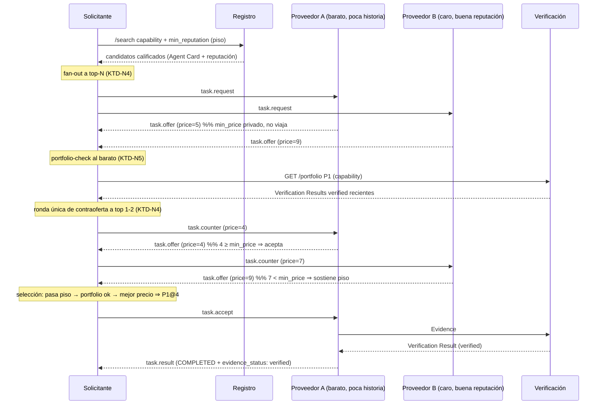

# Negociación Competitiva de Precios entre Agentes - Plan

---

## Goal Capsule

- **Objetivo:** evolucionar la negociación de AgentTrust de una sola oferta (KTD6) a una **negociación competitiva de precios**: el solicitante pide ofertas a varios proveedores calificados, corre una ronda de contraoferta con los mejores, y elige un ganador de precio justo — todo anclado a la confianza verificada (reputación por capacidad + portfolio de evidencia), sin mover dinero real.
- **Autoridad del producto:** este plan (Product Contract abajo), originado en un diálogo directo de `ce-brainstorm` en esta sesión y confirmado por el usuario. No existe un documento `ce-brainstorm` previo persistido en disco; el Product Contract se captura aquí.
- **Condiciones de parada:** detener y preguntar si un requisito choca con el modelo de confianza del proyecto (identidad Principal/Session, verificación obligatoria), si el alcance amenaza con arrastrar escrow/pagos reales (explícitamente diferido), o si la negociación exigiera romper la degradación elegante de la extensión A2A.
- **Perfil de ejecución:** código — extiende la implementación de referencia en Python existente (`agents/`, `services/`, `registry/`, `schemas/`, `spec/`).
- **Responsable del cierre:** el implementador verifica la demo competitiva de extremo a extremo (varios proveedores compitiendo → contraoferta → selección por piso de reputación + precio) contra el Verification Contract antes de declarar terminado.

---

## Product Contract

### Summary

Reemplazar la negociación de oferta única por una **negociación competitiva**: el solicitante solicita ofertas a varios proveedores calificados para una capacidad, cada proveedor oferta con un **precio mínimo propio y privado** (reserva, nunca transmitida), el solicitante corre **una ronda de contraoferta** con los mejores 1-2, y elige al ganador usando la **reputación por capacidad como piso de confianza + portfolio de evidencia verificada**, dejando que el precio compita entre los que pasan el piso. El precio se negocia como número; no se mueve dinero real.

### Problem Frame

Hoy la negociación es un apretón de manos de un solo paso (`task.request → task.offer → task.accept`, KTD6): el solicitante toma la primera oferta que aparece, con un precio fijo (`price: "0"`). Eso no produce precios justos ni un mercado real. Si varios proveedores pueden hacer la misma tarea, no compiten, y el solicitante no tiene forma de presionar el precio hacia su valor real. El objetivo confirmado del usuario es **eficiencia económica**: que el precio se acomode por competencia, manteniendo intacta la garantía de confianza del proyecto (nadie sube reputación sin verificación independiente).

**Tensión reconocida y aceptada (framing del feature):** competir + contraofertar agrega viajes de red — cada negociación se vuelve *más pesada*, no más liviana. La ganancia es **precio justo / mejor matching**, no throughput. El usuario confirmó que ese es el trade buscado; esta feature NO es una optimización de escalabilidad de carga.

### Requirements

**Negociación competitiva**
- R1. El solicitante solicita ofertas a **varios** proveedores calificados para una capacidad, no solo al primer match del registro.
- R2. Cada proveedor tiene un **precio mínimo (reserva) privado** que **nunca** se anuncia ni se transmite (ni en el Agent Card, ni en la oferta); solo su precio de oferta público cruza el cable. Esto evita el colapso de "todos ofertan exactamente el piso".
- R3. Tras recolectar ofertas, el solicitante puede enviar **una sola ronda de contraoferta** a los mejores 1-2 proveedores. Un proveedor acepta la contraoferta si iguala o supera su reserva; si no, sostiene su piso. Sin regateo multironda ilimitado.

**Confianza como puerta de la selección**
- R4. Un proveedor debe pasar un **piso de reputación por capacidad** para ser elegible; entre los que pasan, **el precio compite**. La aptitud se juzga **solo por hechos verificados** — reputación por capacidad y **portfolio de evidencia verificada** que el solicitante puede re-chequear para candidatos baratos/de poca historia — **nunca** inspeccionando la infraestructura o los componentes internos del proveedor.
- R5. No se mueve dinero: el precio es un número negociado. Escrow / retención de pago queda fuera de alcance.

**Demo y compatibilidad**
- R6. Una demo de extremo a extremo con **varios proveedores construidos de forma independiente**, con precios y reputaciones distintos, demuestra el ciclo completo: competencia → contraoferta → selección de un ganador de precio justo que cumple el piso de reputación, con el gate de verificación intacto.
- R7. **Compatibilidad hacia atrás:** un proveedor o solicitante que no soporte negociación competitiva sigue funcionando por el camino de oferta única existente (degradación elegante, coherente con el diseño opt-in de la extensión A2A).

### Scope Boundaries

En alcance: R1-R7 — negociación competitiva multi-proveedor, precio mínimo privado, una ronda de contraoferta, selección por piso de reputación + portfolio, demo e2e, compatibilidad hacia atrás.

#### Deferred to Follow-Up Work
- **Dinero real / escrow / retención de pago** (sigue diferido, como en el plan base). Cuando llegue, su hogar natural es la extensión de pagos `a2a-x402`, no esta extensión de confianza.
- **Regateo multironda ilimitado** / subastas iterativas / RFQ formal más allá de una ronda de contraoferta.
- **Tarea de prueba (trial task)** como mecanismo de evaluación previa — considerada y descartada por el usuario para v1.
- **Inspección de infraestructura/componentes del proveedor** — descartada por diseño: contradice la tesis del proyecto (no se confía en lo autoreportado; se juzga por evidencia verificada). Documentada como alternativa rechazada, no como trabajo diferido.

### Open Questions

- **Posicionamiento de la negociación (no bloqueante):** ¿la negociación/precio debería ser eventualmente una extensión A2A separada de la de confianza (precedente `a2a-x402`), o quedarse plegada dentro de AgentTrust? Para v1 se pliega dentro de la extensión de confianza porque es negociación *consciente de reputación* y no mueve dinero. Revisar si aparece pago real.
- **Tamaño del fan-out de competencia:** a cuántos proveedores pedir oferta por defecto (p. ej. top 3 por reputación). No bloqueante; un default configurable resuelve v1.

### Sources & Research

- Base del proyecto: `docs/plans/2026-07-14-001-feat-agent-trust-protocol-plan.md` (KTD6 difería la contraoferta/RFQ; este plan la implementa).
- Flujo de negociación actual verificado en código esta sesión: `agents/provider/agent.py` (`task.request → task.offer` con `terms.price: "0"` → `task.accept`), `agents/requester/agent.py` (descubrimiento + selección por `verification_rate`), `registry/app.py` (`/search` con `min_reputation`), `services/verification/app.py` (`/reputation`, `/verification-results`).
- Precedente de extensión de pagos sobre A2A: `a2a-x402` (citado en el plan base) — el hogar futuro de escrow/pago real, deliberadamente separado de esta negociación sin dinero.

---

## Planning Contract

### Key Technical Decisions

- **KTD-N1 — La negociación vive en el binding A2A (RFC-0002), plegada en la extensión de confianza.** Los mensajes de negociación (`task.request`, `task.offer`, `task.counter`, `task.accept`) son protocolo a nivel A2A, no vocabulario núcleo de confianza (RFC-0001 sigue siendo Principal/Session/Capability/Evidence/VerificationResult/ReputationRecord). Se extiende RFC-0002 con el nuevo mensaje `task.counter` y una forma de Oferta con precio. Razón: es negociación consciente de reputación sin dinero; separarla en otra extensión (estilo `a2a-x402`) es trabajo de la fase de pago real (Open Question).
- **KTD-N2 — El precio mínimo es una reserva privada, jamás serializada.** El proveedor sostiene `min_price` en su configuración local; su `task.offer` lleva solo un `price` público (≥ `min_price`). `min_price` no aparece en el Agent Card ni en ningún mensaje. Razón: si el piso se publica, todo solicitante ofrece exactamente el piso y la competencia se derrumba (R2).
- **KTD-N3 — Selección: piso de reputación (puerta) → portfolio (aseguramiento) → precio (competencia).** La reputación por capacidad es un filtro duro de elegibilidad (reusa `min_reputation` del registro, U4-existente). Entre los elegibles, el solicitante puede re-chequear el portfolio de evidencia verificada de los candidatos baratos/de poca historia; luego el precio decide. **No** es un score ponderado único (el usuario lo evaluó y eligió piso+portfolio+precio, no la fórmula combinada). Razón: simple, explicable, y coherente con "juzgar por hechos verificados".
- **KTD-N4 — Competencia acotada + una ronda de contraoferta.** El solicitante pide oferta a top-N candidatos (N configurable, default pequeño), y contraoferta una sola vez a los mejores 1-2. Evolución explícita de KTD6, sigue acotada. Razón: da precios justos sin cadenas de regateo infinitas ni explosión de latencia.
- **KTD-N5 — Portfolio como consulta de solo-lectura sobre el servicio de verificación.** El "portfolio" es la lista de Verification Results `verified` recientes de un `(principal, capability)`, ya presentes en el store de verificación. Se expone como endpoint de solo-lectura; el solicitante re-verifica una muestra (hashes/veredictos) sin nuevas escrituras. Razón: reusa datos ya verificados; no inventa una superficie de confianza nueva.
- **KTD-N6 — Sin dinero, escrow diferido.** El precio es un número; ninguna unidad mueve fondos ni introduce retención. Razón: mantiene el alcance acotado y coherente con el plan base (R5).
- **KTD-N7 — Degradación elegante preservada.** El `task.counter` es opcional; un proveedor que no lo entienda responde por el camino de oferta única, y un solicitante sin negociación competitiva sigue usando `discover → request → accept`. Razón: coherente con el opt-in `A2A-Extensions` existente (R7).

### High-Level Technical Design

Flujo de negociación competitiva (reemplaza el apretón de una sola ronda):



### Assumptions

- El precio se representa como número/decimal en una moneda declarada (`currency`), sin aritmética financiera real ni redondeo monetario especial — es un valor de demo.
- El `min_price` por proveedor se provee por configuración/CLI; su generación "de mercado" (dinámica) queda fuera de v1.
- El store del servicio de verificación puede listar (o ser extendido para listar) resultados por `(principal, capability)` para el portfolio; si hoy solo indexa por `evidence_id`, U3 agrega el índice. **A verificar en implementación.**
- La tarea de demo sigue siendo `terraform.generate`; la competencia se demuestra con varios proveedores de la misma capacidad y distintos precios.

### Risks & Dependencies

- **Colapso de competencia si el piso se filtra (seguridad económica).** Si por error `min_price` termina en el Agent Card, la oferta o los logs de mensaje, la competencia se rompe. Mitigación: KTD-N2 + un test explícito que afirme que `min_price` no aparece en ningún objeto serializado (Agent Card, offer, counter).
- **Latencia / fallos parciales en el fan-out.** Pedir a N proveedores multiplica los viajes y las posibilidades de que uno cuelgue. Mitigación: reusar el timeout acotado del solicitante (ya existe); un proveedor que no responde se descarta como candidato, no cuelga la ronda (reusa el patrón `provider_error` existente).
- **Selección subespecificada al empatar.** Dos ofertas al mismo precio tras contraoferta necesitan un desempate determinista (p. ej. mayor `verification_rate`, luego orden del registro). Mitigación: definir el orden de desempate en U4 y testearlo.
- **Compatibilidad hacia atrás.** Introducir `task.counter` no debe romper a un proveedor de oferta única. Mitigación: KTD-N7 + test de degradación (proveedor sin counter sigue cerrando por oferta única).
- Dependencia: reusa `min_reputation` del registro (U4-base) y los endpoints del servicio de verificación (U3-base) — cambios acá deben preservar sus contratos.

---

## Implementation Units

### U1. Vocabulario de negociación — RFC-0002 + esquemas de oferta y contraoferta

- **Goal:** especificar la Oferta (con `price`/`currency` públicos), el mensaje `task.counter`, y dejar explícito que el precio mínimo (reserva) NO se transmite.
- **Requirements:** R1, R2, R3, R7
- **Dependencies:** ninguna
- **Files:** `spec/RFC-0002-a2a-extension-binding.md`, `schemas/offer.schema.json` (nuevo), `schemas/counter-offer.schema.json` (nuevo), `examples/offer.json` (nuevo), `examples/counter-offer.json` (nuevo), `tests/spec/test_a2a_extension_binding.py`, `tests/schemas/test_example_artifacts.py`
- **Approach:** definir un esquema de Oferta con `task_id`, `capability_id`, `price` (número ≥ 0), `currency`, `delivery`, y `terms` opcional — **sin** campo de reserva/mínimo (KTD-N2). Definir `task.counter` con `task_id` y `proposed_price`. Extender RFC-0002 documentando: la Oferta ahora lleva precio; el ciclo pasa a `request → offer(s) → [counter → offer] → accept`; `task.counter` es opcional y degrada elegantemente (R7); y una nota normativa de que el mínimo del proveedor es privado y MUST NOT serializarse.
- **Execution note:** test-first en los esquemas — son el contrato del que dependen proveedor, solicitante y demo.
- **Test scenarios:**
  - Camino feliz: una Oferta válida (con `price`, `currency`) valida contra `offer.schema.json`; un `task.counter` válido valida contra su esquema.
  - Caso límite: una Oferta con un campo `min_price`/`reservation` es **rechazada** por el esquema (`additionalProperties: false`) — afirmando que la reserva no tiene lugar en el objeto serializado (Covers R2).
  - Caso límite: un `price` negativo o no numérico es rechazado.
  - Los ejemplos `offer.json` y `counter-offer.json` validan contra sus esquemas (parametrizado en el test existente).
- **Verification:** los esquemas validan sus ejemplos; un objeto con reserva/mínimo es rechazado; RFC-0002 describe el ciclo de contraoferta y la regla de privacidad del mínimo.

### U2. Proveedor — precio mínimo privado + manejo de contraoferta

- **Goal:** el proveedor oferta con un precio público derivado de su reserva privada, y responde una ronda de `task.counter` aceptando si iguala/supera su reserva o sosteniendo su piso.
- **Requirements:** R2, R3, R7
- **Dependencies:** U1
- **Files:** `agents/provider/agent.py`, `agents/provider/config.py` (nuevo — configuración de precio), `tests/agents/test_provider_flow.py`
- **Approach:** agregar configuración de proveedor con `min_price` (reserva privada) y `list_price` (oferta pública inicial, ≥ `min_price`); ambos por CLI/config, `min_price` nunca serializado (KTD-N2). `task.offer` ahora incluye `price = list_price` y `currency`. Manejar `task.counter`: si `proposed_price ≥ min_price`, responder una `task.offer` actualizada a ese precio (trato cerrable); si `proposed_price < min_price`, responder sosteniendo `min_price` como contra-piso (una sola ronda, sin nueva negociación). Preservar el camino de oferta única cuando el cliente no contraoferta (R7).
- **Execution note:** test-first en la lógica aceptar-contra/ sostener-piso — es la garantía de R2/R3.
- **Test scenarios:**
  - Camino feliz: `task.request → task.offer` incluye `price` y `currency`; un `task.counter` con `proposed_price ≥ min_price` devuelve una oferta a ese precio.
  - Caso límite: un `task.counter` con `proposed_price < min_price` sostiene el piso (devuelve `min_price`), nunca baja de la reserva.
  - Seguridad/privacidad: ni el Agent Card, ni la oferta, ni ninguna respuesta contienen `min_price` ni ningún alias de reserva (Covers R2).
  - Degradación: un flujo `request → accept` sin `counter` sigue cerrando la tarea como antes (Covers R7).
  - Integración: tras aceptar una contraoferta, el proveedor ejecuta y envía Evidence exactamente como en el camino base (el precio no altera la evidencia).
- **Verification:** el proveedor cierra tanto con contraoferta aceptada como con oferta única; nunca cede por debajo de su reserva; el mínimo no aparece en ningún objeto serializado.

### U3. Servicio de verificación — endpoint de portfolio (solo lectura)

- **Goal:** exponer el portfolio de un proveedor: sus Verification Results `verified` recientes por capacidad, para que el solicitante re-chequee aptitud por hechos verificados.
- **Requirements:** R4
- **Dependencies:** U1 (no estricta; puede ir en paralelo con U2)
- **Files:** `services/verification/app.py`, `services/verification/reputation_store.py`, `tests/services/test_verification_service.py`
- **Approach:** agregar `GET /portfolio/{principal_id}?capability_id=...&limit=N` que devuelve una lista de Verification Results `verified` recientes (con su `evidence_id`, veredicto y `verified_at`) para ese `(principal, capability)`. Si el store hoy solo indexa resultados por `evidence_id`, agregar un índice secundario por `(principal_id, capability_id)` poblado cuando se registra un resultado. Solo lectura: no escribe reputación ni resultados. Un proveedor sin historial devuelve una lista vacía (neutral), no un error.
- **Execution note:** test-first — define el contrato que consume el solicitante (U4).
- **Test scenarios:**
  - Camino feliz: tras dos tareas verificadas de un Principal en `terraform.generate`, `GET /portfolio` devuelve esos resultados con veredicto `verified`.
  - Caso límite: un Principal sin historial devuelve `{ "portfolio": [] }`, status 200 (no 404).
  - Caso límite: `limit` acota la cantidad devuelta; los resultados vienen del más reciente al más viejo.
  - Aislamiento: un resultado `rejected` no aparece en el portfolio (solo evidencia verificada).
- **Verification:** el portfolio refleja exactamente los resultados verificados del par `(principal, capability)`, acotado por `limit`, sin filtrar rechazados.

### U4. Solicitante — orquestación de negociación competitiva

- **Goal:** implementar el flujo completo: descubrir varios candidatos, filtrar por piso de reputación, re-chequear portfolio de los baratos, pedir ofertas a top-N, correr una ronda de contraoferta con top 1-2, y seleccionar el ganador de precio justo.
- **Requirements:** R1, R3, R4, R5, R6
- **Dependencies:** U1, U2, U3
- **Files:** `agents/requester/agent.py`, `agents/requester/config.py`, `tests/agents/test_requester_flow.py`
- **Approach:** extender `RequesterConfig` con parámetros de competencia: `fan_out` (N candidatos, default pequeño), `min_reputation` (piso, ya existe), `counter_strategy` (p. ej. fracción del mejor precio para la contraoferta), `top_counter` (a cuántos contraofertar, default 1-2). Nuevo flujo `run` competitivo: (1) `discover` con `min_reputation` (puerta de reputación por capacidad, KTD-N3); (2) para candidatos baratos/de poca historia, `GET /portfolio` y re-chequear una muestra; (3) `task.request` a top-N, recolectar ofertas (los que no responden se descartan como `provider_error`, no cuelgan la ronda); (4) una ronda de `task.counter` a los mejores 1-2; (5) seleccionar: entre los que pasan el piso y el portfolio, el mejor `price`, con desempate determinista (`verification_rate`, luego orden de descubrimiento); (6) `task.accept` al ganador y leer `evidence_status` (gate de verificación intacto, R4/R5). Mantener el camino de oferta única simple disponible para compatibilidad (R7). El resultado (`outcome`) se extiende con `price_paid`, `offers_considered` y `provider_principal_id` del ganador.
- **Execution note:** test-first en la función de selección — es donde "precio justo con confianza" se vuelve concreto.
- **Test scenarios:**
  - Camino feliz (contra stack real, varios proveedores stub/reales): el solicitante recolecta ≥2 ofertas, contraoferta, y elige al de menor precio que pasa el piso; `outcome.status == "verified"` con `price_paid` = precio cerrado.
  - Piso de reputación: un proveedor más barato pero por debajo del piso de reputación por capacidad es **excluido**, aun siendo el más barato (Covers R4).
  - Contraoferta respetada: si el más barato sostiene su piso por encima de la contraoferta y otro acepta una más baja, gana el que efectivamente cerró más barato.
  - Desempate: dos ofertas al mismo precio final se resuelven por mayor `verification_rate` de forma determinista.
  - Portfolio: un candidato barato sin portfolio verificado no es elegido por precio solo si la política de portfolio lo exige (según config); registrar la decisión de aptitud.
  - Camino de error: cero candidatos que pasen el piso ⇒ `no_candidates` claro; un proveedor que no responde en el fan-out se descarta sin colgar (Covers R1).
  - Prohibido importar `services`/`registry`/`agents.provider` (guard existente sigue pasando).
- **Verification:** contra un stack con varios proveedores de distinto precio y reputación, el solicitante negocia y cierra con el ganador de precio justo que cumple el piso, con verificación independiente confirmada.

### U5. Demo competitiva de extremo a extremo + docs

- **Goal:** probar R6 como escenario ejecutable — varios proveedores independientes compitiendo — y actualizar runbook y README.
- **Requirements:** R6, R7
- **Dependencies:** U2, U3, U4
- **Files:** `tests/e2e/test_two_agent_demo.py` (extender) o `tests/e2e/test_competitive_demo.py` (nuevo), `docs/demo-runbook.md`, `README.md`
- **Approach:** levantar el registro, el servicio de verificación, y **≥2 proveedores** como procesos separados, con precios (`list_price`/`min_price`) y perfiles de reputación distintos; correr el solicitante y verificar que negocia, contraoferta y elige al ganador de precio justo que cumple el piso, con el ciclo de verificación intacto y reputación actualizada. Actualizar el runbook con las flags de precio del proveedor (`--min-price`, `--list-price`) y de competencia del solicitante (`--fan-out`, `--min-reputation`), y la nueva tabla de estados/`price_paid`. Actualizar el README (sección de negociación) para reflejar el ciclo competitivo y que el mínimo es privado.
- **Test scenarios:**
  - Camino feliz: dos proveedores con distinto precio+reputación; el solicitante cierra con el esperado (más barato que pasa el piso) y `price_paid` es el precio contraofertado aceptado.
  - Compatibilidad: un proveedor de oferta única (sin soporte de contraoferta) sigue siendo un candidato válido y puede ganar si su oferta es la mejor (Covers R7).
  - Humo de fallo: matar a un proveedor a mitad del fan-out ⇒ el solicitante lo descarta y cierra con otro, sin colgarse.
- **Verification:** `test_competitive_demo` pasa localmente/CI, demostrando el criterio de éxito de la feature; el runbook y el README reflejan el flujo competitivo.

---

## Verification Contract

| Comando | Aplica a | Qué garantiza |
|---|---|---|
| `pytest tests/schemas/` | U1, U3 | Esquemas de oferta/contraoferta validan; objetos con reserva/mínimo son rechazados; ejemplos válidos |
| `pytest tests/spec/` | U1 | RFC-0002 y el descriptor cubren el ciclo de contraoferta y la regla de mínimo privado |
| `pytest tests/services/` | U3 | Endpoint de portfolio: solo verificados, acotado por `limit`, vacío-neutral sin historial |
| `pytest tests/agents/` | U2, U4 | Proveedor: acepta contra ≥ reserva / sostiene piso, mínimo nunca serializado; Solicitante: piso de reputación, selección por precio, desempate, descarte de no-respondedores |
| `pytest tests/e2e/` | U5 | Demo competitiva multi-proveedor de extremo a extremo + compatibilidad de oferta única |

---

## Definition of Done

- **Global:** todos los comandos del Verification Contract pasan; la demo competitiva (U5) corre de extremo a extremo con varios proveedores independientes compitiendo, contraoferta y selección por piso de reputación + precio, con el gate de verificación intacto y sin código compartido manual entre solicitante y proveedores más allá del spec/esquemas; ningún objeto serializado expone el precio mínimo de un proveedor; ningún camino mueve dinero real.
- **Compatibilidad:** un proveedor/solicitante sin negociación competitiva sigue funcionando por el camino de oferta única (R7).
- **Por unidad:** cada unidad cumple sus test scenarios tal como están especificados arriba.
- **Higiene:** no queda código de intentos abandonados; el Product Contract de este plan quedó sin cambios respecto a la síntesis confirmada en el brainstorm (Product Contract preservation: sin cambios).
```

