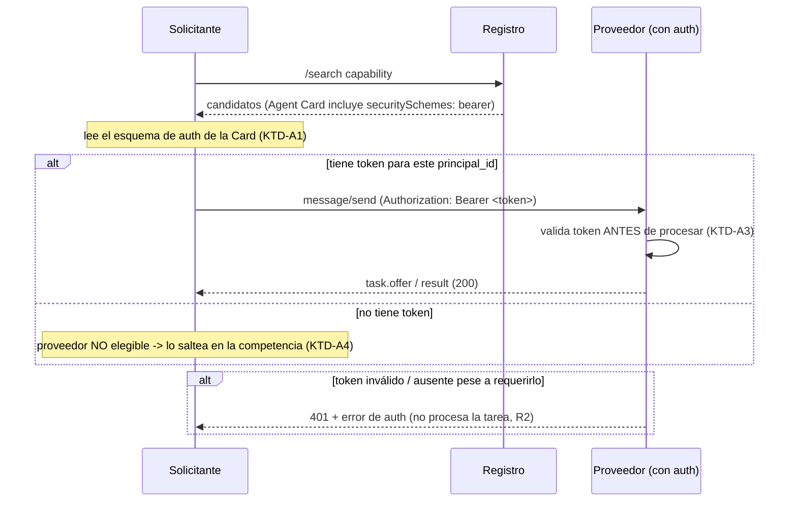
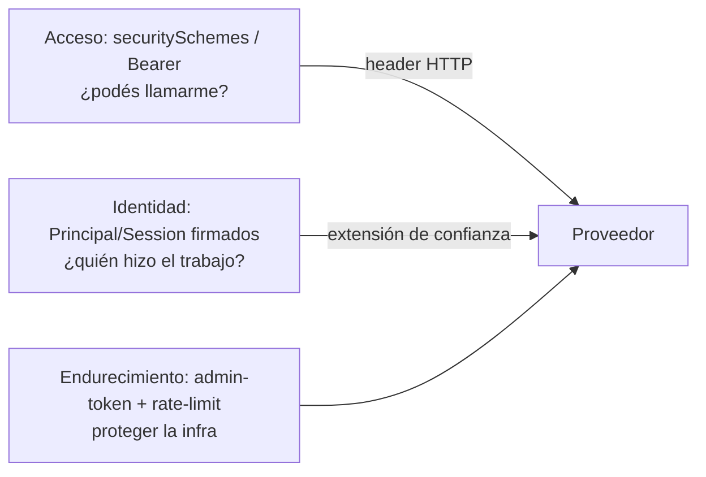

# Autenticación de Proveedores y Endurecimiento de Seguridad - Plan

---

## Goal Capsule

- **Objetivo:** llevar el MVP a algo usable de verdad con proveedores externos: (1) **autenticación de proveedores** end-to-end — un proveedor puede exigir un token bearer, declarado en su Agent Card (estándar A2A), y el solicitante lo respeta al contratarlo; (2) un **set acotado de endurecimiento** que acompaña a la auth (autenticar el endpoint admin del registro + rate-limiting básico); y (3) **conectar la consola web a un stack externo** para que proveedores reales se sumen.
- **Autoridad del producto:** este plan (Product Contract abajo), originado en diálogo directo con el usuario y confirmado — alcance de seguridad acotado a auth + admin-auth + rate-limit; auth v1 con **bearer estático out-of-band**.
- **Condiciones de parada:** detener y preguntar si un requisito exige mover el alcance hacia lo explícitamente diferido (TLS/HTTPS, rotación de claves, Sybil con staking, OAuth2/OIDC, servicio emisor de tokens), o si la auth de tareas rompiera la degradación elegante de la extensión de confianza.
- **Perfil de ejecución:** código — extiende la implementación de referencia en Python (`agents/`, `services/`, `registry/`, `web/`, `spec/`).
- **Responsable del cierre:** el implementador verifica la demo e2e de un proveedor con auth compitiendo a través de la consola, contra el Verification Contract, antes de declarar terminado.

---

## Product Contract

### Summary

Agregar autenticación opcional de proveedores usando el mecanismo estándar de A2A (`securitySchemes`/`security` en el Agent Card, esquema **bearer**): el proveedor declara que exige un token, lo valida en cada tarea, y el solicitante lee ese esquema, presenta el token configurado fuera de banda en `Authorization: Bearer`, y saltea a un proveedor que exige auth si no tiene token. Acompañar con endurecimiento acotado (token de admin en el registro + rate-limiting básico) y **conectar la consola web a un stack externo** para que proveedores reales participen. Todo opt-in y compatible hacia atrás.

### Problem Frame

Hoy cualquiera puede llamar a un proveedor y mandarle tareas — no hay control de acceso. Un proveedor real necesita poder decir *"para contratarme, autenticate"*. A2A ya define cómo declarar eso (`securitySchemes` en el Agent Card), pero la implementación de referencia no lo declara ni lo valida. Además, el endpoint admin del registro (`/admin/api-keys`) está abierto y no hay ningún límite de tasa. Y la consola web arranca su propio stack embebido en puertos internos, así que un proveedor externo no puede sumarse. Este plan cierra esas tres cosas, con auth como pieza central.

### Requirements

**Autenticación de proveedor (pieza central)**
- R1. Un proveedor puede exigir autenticación declarándola en su Agent Card vía `securitySchemes` + `security` (estándar A2A), con esquema **bearer** (HTTP `Authorization: Bearer <token>`).
- R2. El proveedor valida el token en cada `message/send` (task.request/counter/accept) y rechaza con un error de auth (HTTP 401 + error JSON-RPC) si el token falta o es inválido, **antes** de procesar la tarea. Un proveedor que no declara `securitySchemes` sigue abierto (compatibilidad hacia atrás).
- R3. El solicitante lee el esquema de auth del Agent Card del candidato; si exige bearer, presenta el token configurado en `Authorization: Bearer` en cada llamada. Si no tiene token para un proveedor que lo exige, lo **saltea** en la competencia (lo trata como no elegible), sin crashear.
- R4. Los tokens son **estáticos y configurados fuera de banda**: el proveedor recibe su(s) token(s) aceptado(s) por config/CLI; el solicitante recibe un mapa `proveedor → token` por config. No hay servicio emisor de tokens ni flujo OAuth/OIDC (diferido).

**Endurecimiento acotado**
- R5. El endpoint `/admin/api-keys` del registro puede requerir un **token de admin** configurado (header `Authorization: Bearer`); si no se configura ninguno, queda abierto (default demo, compatible).
- R6. **Rate-limiting básico** por IP (ventana fija en memoria, configurable) en los endpoints públicos de registro, verificación y proveedor; devuelve 429 al exceder. Desactivable.

**Producto y demo**
- R7. La consola web puede **conectarse a un stack externo** (`--registry-url` + `--verification-url`) además del modo embebido (default), y llevar un mapa de tokens para presentar a proveedores con auth.
- R8. Demo e2e: un proveedor con auth compite y **gana** a través de la consola con el token correcto; el mismo flujo **sin** token trata al proveedor como no elegible.

### Scope Boundaries

En alcance: R1-R8 — auth bearer de proveedor (declarar/validar/presentar), token de admin en el registro, rate-limiting básico, consola en modo conectado con tokens, y la demo e2e.

#### Deferred to Follow-Up Work
- **TLS / HTTPS** real en todos los servicios (concern de despliegue).
- **Rotación automática de claves** y de tokens (v1 usa estáticos + revocación manual existente).
- **Resistencia Sybil completa** (staking, agregación de attestations).
- **OAuth2 / OpenID Connect** y cualquier esquema de auth más allá de bearer estático.
- **Servicio emisor / broker de credenciales** (que emita y rote tokens por proveedor).
- **Runtime de proveedor hosteado** ("traé tu función, nosotros lo corremos").
- Rate-limiting distribuido / persistente (v1 es en memoria, por proceso).

### Open Questions

- Cómo se distribuyen los tokens en producción (emisor central vs. acuerdo bilateral) — no bloqueante; v1 usa estáticos out-of-band.
- Si el rate-limiting debería venir activado por defecto en la consola o quedar opt-in — se decide en implementación; default propuesto: generoso y activable.

### Sources & Research

- Estándar A2A de auth en el Agent Card: campos `securitySchemes` / `security`. Ya presente como ejemplo en `examples/agent-card-with-extension.json` (esquema `bearer`), pero no declarado ni validado por los agentes demo.
- Base del proyecto (verificado en código esta sesión): proveedor `agents/provider/agent.py` (`agent_card()`, `_dispatch`/`do_POST`, `handle_payload`), solicitante `agents/requester/agent.py` (`_send`, `run_competitive`, `_candidate_meta`), registro `registry/app.py` (`/admin/api-keys` abierto), verificación `services/verification/app.py`, consola `web/app.py` (`DemoStack`, `register_external`).

---

## Planning Contract

### Key Technical Decisions

- **KTD-A1 — Auth vía `securitySchemes` de A2A, no un mecanismo nuevo.** El proveedor declara su requerimiento de auth en el campo estándar `securitySchemes` (`{"bearer": {"type":"http","scheme":"bearer"}}`) + `security` del Agent Card. Razón: A2A ya define cómo un agente anuncia su auth; reutilizarlo mantiene la interoperabilidad y no inventa protocolo.
- **KTD-A2 — Token bearer estático, out-of-band.** El proveedor se configura con el/los token(s) que acepta; el solicitante con un mapa `principal_id → token`. Ninguna parte emite ni rota tokens en v1. Razón: alcance confirmado; un emisor/OAuth es mucho más grande y queda diferido.
- **KTD-A3 — El token viaja en el header HTTP `Authorization: Bearer`, no en el cuerpo del mensaje A2A.** Vive en la capa de transporte/acceso, ortogonal a la extensión de confianza (que sigue siendo sobre identidad/evidencia). Razón: separa "¿podés llamarme?" (acceso) de "¿quién hizo el trabajo?" (identidad/reputación), que son cosas distintas.
- **KTD-A4 — Auth opt-in y con degradación elegante.** Un proveedor sin `securitySchemes` sigue abierto. Un solicitante sin token para un proveedor que exige auth lo saltea (no elegible), no crashea ni lo marca `provider_error` global. Razón: compatibilidad con todo lo ya construido (R7 de negociación) y con proveedores abiertos.
- **KTD-A5 — Admin token opt-in en el registro.** `/admin/api-keys` requiere `Authorization: Bearer <admin-token>` **si** se configuró un admin token (`--admin-token`); si no, queda abierto. Razón: cierra el agujero sin romper el default demo; se activa en modo seguro.
- **KTD-A6 — Rate-limiting como helper compartido en memoria.** Un pequeño limitador de ventana fija por IP, invocado por los handlers stdlib (registro/verificación/proveedor), devuelve 429 al exceder; configurable y desactivable. Razón: mitigación básica de abuso sin dependencias ni infra; distribuido/persistente queda diferido.
- **KTD-A7 — Consola en modo conectado además de embebido.** `web/app.py` acepta `--registry-url` + `--verification-url`: si están, se conecta a ese stack externo (donde viven proveedores reales); si no, arranca el embebido (default de hoy). Además lleva un mapa de tokens para el solicitante. Razón: es el eslabón que permite que un proveedor externo real (con o sin auth) compita en la consola.

### High-Level Technical Design

Handshake de contratación con un proveedor que exige auth:



Ubicación de las tres "capas" que no hay que confundir:



### Assumptions

- Los tokens estáticos se representan como strings opacos; la comparación es de igualdad simple (sin hashing/rotación) para v1.
- El rate-limiting por IP alcanza para demo; detrás de un proxy real haría falta leer `X-Forwarded-For`, que queda como nota de implementación.
- La consola en modo conectado asume que el stack externo ya corre y es alcanzable; si no, degrada con un error claro al iniciar.

### Risks & Dependencies

- **Fuga/robo de token estático (seguridad).** Un token filtrado da acceso a llamar al proveedor hasta que se rote manualmente. Mitigación v1: tokens fuera de banda + posibilidad de que el proveedor tenga varios y descarte uno; rotación automática diferida y documentada.
- **Romper el flujo abierto existente.** La auth debe ser opt-in; un proveedor sin `securitySchemes` y toda la negociación competitiva ya construida deben seguir andando. Mitigación: KTD-A4 + tests de compatibilidad (proveedor abierto sigue compitiendo).
- **Rate-limiting con falsos positivos.** Un límite muy agresivo rompe la demo (varias llamadas por tarea). Mitigación: default generoso, configurable, desactivable, y tests que verifican que un flujo normal no se topa con 429.
- **Confusión acceso vs. identidad.** El token de acceso NO reemplaza la firma Principal/Session; son capas distintas (HTD). Mitigación: documentarlo en RFC-0002 y en los nombres de config.
- Dependencia: reutiliza el binding A2A (RFC-0002) y no debe alterar el gate de verificación (R4 de negociación) ni la regla de mínimo privado (R2 de negociación).

---

## Implementation Units

### Fase A — Auth de proveedor (núcleo)

### U1. Vocabulario de auth — RFC-0002 + esquema del Agent Card

- **Goal:** especificar cómo un proveedor declara auth (`securitySchemes`/`security`, bearer) y cómo el solicitante la presenta, sin inventar mecanismo.
- **Requirements:** R1, R4
- **Dependencies:** ninguna
- **Files:** `spec/RFC-0002-a2a-extension-binding.md`, `schemas/a2a-extension-descriptor.schema.json` (si hace falta reflejar el shape de auth), `examples/agent-card-with-extension.json` (ya declara bearer — usar de referencia), `tests/spec/test_a2a_extension_binding.py`
- **Approach:** agregar una sección a RFC-0002 (§Auth) que documente: (a) el proveedor declara `securitySchemes: { bearer: {type:http, scheme:bearer} }` + `security: [{bearer: []}]` en su Agent Card; (b) el cliente que quiere contratarlo incluye `Authorization: Bearer <token>` en `message/send`; (c) la auth es ortogonal a la extensión de confianza (acceso vs. identidad); (d) opt-in y degradación elegante. No cambia la máquina de estados ni la extensión de confianza.
- **Execution note:** test-first en las aserciones de spec/esquema — es el contrato del que dependen proveedor y solicitante.
- **Test scenarios:**
  - Camino feliz: el Agent Card de ejemplo con `securitySchemes: bearer` + `security` valida su forma esperada y es distinguible de una Card sin auth.
  - Caso límite: una Card sin `securitySchemes` es "abierta" (sin requerimiento de auth) — el binding lo trata como no-auth.
  - Doc: RFC-0002 describe el header `Authorization: Bearer` y la ortogonalidad acceso/identidad.
- **Verification:** el ejemplo con auth valida; RFC-0002 cubre el binding de auth y la degradación elegante.

### U2. Proveedor — declara y valida bearer

- **Goal:** el proveedor puede exigir un token: lo declara en su Agent Card y lo valida en cada tarea, rechazando 401 si falta o es inválido; sin auth configurada sigue abierto.
- **Requirements:** R1, R2, R4
- **Dependencies:** U1
- **Files:** `agents/provider/agent.py`, `agents/provider/config.py`, `tests/agents/test_provider_flow.py`
- **Approach:** extender la config del proveedor con `auth_tokens` (lista/set de tokens aceptados; vacío = abierto). Cuando hay tokens, `agent_card()` agrega `securitySchemes`/`security` (bearer). En el handler HTTP (`do_POST`/`_dispatch`), **antes** de `handle_payload`, si el proveedor exige auth: leer el header `Authorization`, extraer el bearer, y si falta o no está en `auth_tokens` responder **401 + error JSON-RPC de auth** sin procesar. Si no exige auth, no cambia nada. El `/.well-known/agent-card.json` sigue **público** (sin auth) para permitir descubrimiento.
- **Execution note:** test-first para aceptar/rechazar — es la superficie de control de acceso.
- **Test scenarios:**
  - Camino feliz: proveedor con `auth_tokens=["s3cr3t"]` acepta `message/send` con `Authorization: Bearer s3cr3t` y responde normal.
  - Caminos de error: sin header → 401; token equivocado → 401; ninguno procesa la tarea (no se genera artefacto ni se envía evidencia).
  - Descubrimiento: la Agent Card (`/.well-known/...`) se sirve **sin** auth aunque el proveedor exija token para tareas; y declara `securitySchemes: bearer`.
  - Compatibilidad: proveedor con `auth_tokens` vacío acepta tareas sin ningún header (abierto, como hoy).
- **Verification:** el proveedor con auth rechaza tareas sin token válido y las acepta con él; el descubrimiento no requiere auth; el proveedor abierto no cambia de comportamiento.

### U3. Solicitante — presenta bearer y saltea si no lo tiene

- **Goal:** el solicitante lee el esquema de auth del candidato, presenta el token configurado, y trata como no elegible a un proveedor que exige auth para el que no tiene token.
- **Requirements:** R3, R4
- **Dependencies:** U1, U2
- **Files:** `agents/requester/agent.py`, `agents/requester/config.py`, `tests/agents/test_requester_flow.py`
- **Approach:** extender `RequesterConfig` con `provider_tokens` (mapa `principal_id → token`). En `run_competitive`, al armar los candidatos: detectar si la Agent Card declara `security`/`securitySchemes` (requiere auth); si requiere y no hay token para ese `principal_id`, **excluir** al candidato antes de pedirle oferta (registrar el motivo). En `_send`, si hay token para el proveedor destino, incluir `Authorization: Bearer <token>`. Un 401 desde un proveedor (pese a tener token) se trata como el proveedor caído (se descarta del fan-out, igual que un `provider_error`), no como excepción.
- **Execution note:** test-first en la lógica de elegibilidad por auth.
- **Test scenarios:**
  - Camino feliz: con `provider_tokens={principal: "s3cr3t"}`, el solicitante contrata al proveedor con auth y cierra verificado; el header viaja (el proveedor lo recibe).
  - Caso límite: proveedor que exige auth pero sin token en config → excluido de la competencia; si es el único, `no_candidates` claro.
  - Camino de error: token inválido → el proveedor responde 401 → el solicitante lo descarta del fan-out y cierra con otro (o `no_candidates`), sin crashear.
  - Compatibilidad: proveedores abiertos (sin auth) siguen compitiendo sin token, como hoy.
  - Prohibido importar `services`/`registry`/`agents.provider` (guard existente sigue pasando).
- **Verification:** el solicitante contrata proveedores con auth cuando tiene token, los saltea cuando no, y nunca propaga una excepción por un 401.

### Fase B — Endurecimiento acotado

### U4. Registro — token de admin opt-in en `/admin/api-keys`

- **Goal:** proteger la emisión de API-keys detrás de un token de admin configurable, sin romper el default demo.
- **Requirements:** R5
- **Dependencies:** ninguna
- **Files:** `registry/app.py`, `tests/registry/test_capability_search.py`
- **Approach:** el registro acepta un `admin_token` (por `--admin-token` / config). Si está seteado, `POST /admin/api-keys` requiere `Authorization: Bearer <admin-token>` y responde 401 sin él; si no está seteado, queda abierto (comportamiento de hoy). No afecta `/register` ni `/search`.
- **Execution note:** test-first en aceptar/rechazar del admin.
- **Test scenarios:**
  - Con `admin_token` seteado: `POST /admin/api-keys` sin header → 401; con el header correcto → 200 y devuelve la key.
  - Sin `admin_token`: `POST /admin/api-keys` responde 200 como hoy (compatibilidad).
  - Aislamiento: `/search` y `/register` no se ven afectados por el admin token.
- **Verification:** la emisión de keys queda protegida cuando se configura el admin token, y abierta cuando no.

### U5. Rate-limiting básico por IP (helper compartido)

- **Goal:** un limitador de tasa simple, reutilizable por los servidores stdlib, que devuelve 429 al exceder; configurable y desactivable.
- **Requirements:** R6
- **Dependencies:** ninguna
- **Files:** `common/ratelimit.py` (nuevo módulo compartido), `registry/app.py`, `services/verification/app.py`, `agents/provider/agent.py`, `tests/common/test_ratelimit.py`
- **Approach:** un `RateLimiter` de ventana fija en memoria (por IP, N solicitudes por ventana de T segundos), thread-safe. Los handlers HTTP lo consultan al inicio de `do_POST`/`do_GET` (según config); al exceder, responden 429 sin procesar. Configurable por servicio (límite, ventana, on/off); off o generoso por default para no romper la demo. Nota de implementación: leer IP del socket; detrás de proxy usar `X-Forwarded-For` (diferido si no aplica).
- **Execution note:** test-first el limitador puro (sin HTTP) — determinístico.
- **Test scenarios:**
  - Unit: N solicitudes dentro de la ventana pasan; la N+1 se rechaza; tras la ventana se resetea.
  - Unit: dos IPs distintas tienen cupos independientes.
  - Integración: con un límite bajo, exceder en un endpoint devuelve 429; un flujo normal de una tarea (varias llamadas) NO se topa con 429 bajo el default.
  - Config: desactivado → nunca limita.
- **Verification:** el limitador corta al exceder por IP y no molesta a un flujo normal bajo el default.

### Fase C — Producto y demo

### U6. Consola web — modo conectado + tokens de proveedor

- **Goal:** la consola puede conectarse a un stack externo (además del embebido) y presentar tokens a proveedores con auth.
- **Requirements:** R7
- **Dependencies:** U2, U3
- **Files:** `web/app.py`, `tests/web/test_web_app.py`
- **Approach:** `make_server`/`main` aceptan `--registry-url` + `--verification-url`: si ambos están, la consola **no** arranca `DemoStack` sino que usa esas URLs (modo conectado); si no, arranca el embebido (default). El `RequesterConfig` que arma por tarea recibe `provider_tokens` (config de la consola). El auto-registro por URL (`register_external`) sigue funcionando; un proveedor con auth se registra igual (su Card pública se lee sin token). Degradar con error claro si el modo conectado no alcanza el stack.
- **Execution note:** smoke/integración — es sobre todo cableado + modo.
- **Test scenarios:**
  - Camino feliz (embebido): sin flags, la consola arranca el stack embebido y corre tareas como hoy.
  - Camino feliz (conectado): con `--registry-url`/`--verification-url` apuntando a un stack de test, la consola no levanta embebido y corre una tarea contra el externo.
  - Auth end-to-end: con un proveedor con auth registrado y su token en la config de la consola, una tarea lo contrata y cierra verificado.
  - Error: modo conectado con un registro inalcanzable → error claro al iniciar, no un crash silencioso.
- **Verification:** la consola funciona en ambos modos y presenta tokens correctamente a proveedores con auth.

### U7. Demo e2e con auth + documentación

- **Goal:** probar R8 como escenario ejecutable — un proveedor con auth compite y gana por la consola; sin token, no es elegible — y documentar el binding de auth y el endurecimiento.
- **Requirements:** R8, R1, R5, R6
- **Dependencies:** U2, U3, U4, U5, U6
- **Files:** `tests/e2e/test_auth_demo.py` (nuevo), `docs/demo-runbook.md`, `README.md`, `spec/RFC-0002-a2a-extension-binding.md`
- **Approach:** levantar (procesos separados o in-process, según el patrón e2e existente) un registro (con admin token), verificación, y un proveedor **con auth**; ejercitar: (a) solicitante con el token → gana verificado; (b) solicitante sin el token → el proveedor con auth no es elegible. Actualizar el runbook con las flags nuevas (`--auth-token` del proveedor, `--admin-token` del registro, tokens/`--registry-url` de la consola) y el README con una sección de auth y seguridad.
- **Test scenarios:**
  - Camino feliz: proveedor con auth + token correcto → tarea verificada de extremo a extremo.
  - Caso límite: mismo proveedor, solicitante sin token → no elegible (`no_candidates` si es el único).
  - Endurecimiento: `/admin/api-keys` sin admin token → 401; con él → 200.
  - Humo de rate-limit: exceder un endpoint devuelve 429 (con un límite de test bajo).
- **Verification:** `test_auth_demo` pasa; el runbook y el README reflejan auth + endurecimiento.

---

## Verification Contract

| Comando | Aplica a | Qué garantiza |
|---|---|---|
| `pytest tests/spec/` | U1 | RFC-0002 y el ejemplo cubren el binding de auth (bearer) y la degradación elegante |
| `pytest tests/agents/` | U2, U3 | Proveedor declara/valida bearer (401 sin token, abierto sin auth); solicitante presenta token, saltea sin él, no propaga 401 |
| `pytest tests/registry/` | U4 | `/admin/api-keys` protegido con admin token cuando se configura, abierto si no |
| `pytest tests/common/` | U5 | Limitador de tasa: corta al exceder por IP, resetea por ventana, IPs independientes, desactivable |
| `pytest tests/services/` | U5 | El rate-limiting cableado en verificación no rompe el flujo normal |
| `pytest tests/web/` | U6 | Consola en modo embebido y conectado; presenta tokens a proveedores con auth |
| `pytest tests/e2e/` | U7 | Demo de auth de extremo a extremo (con token gana; sin token, no elegible) |

---

## Definition of Done

- **Global:** todos los comandos del Verification Contract pasan; la demo de auth (U7) corre de extremo a extremo — un proveedor con auth gana con el token correcto y no es elegible sin él; ningún token estático aparece serializado en un Agent Card ni en un mensaje (solo en el header HTTP); la negociación competitiva y el gate de verificación ya existentes siguen funcionando sin cambios de comportamiento para proveedores abiertos.
- **Compatibilidad:** un proveedor sin `securitySchemes` sigue abierto y compite; un solicitante sin tokens sigue funcionando contra proveedores abiertos; `/admin/api-keys` sin admin token configurado sigue abierto.
- **Por unidad:** cada unidad cumple sus test scenarios tal como están especificados arriba.
- **Higiene:** no queda código de intentos abandonados.
```

