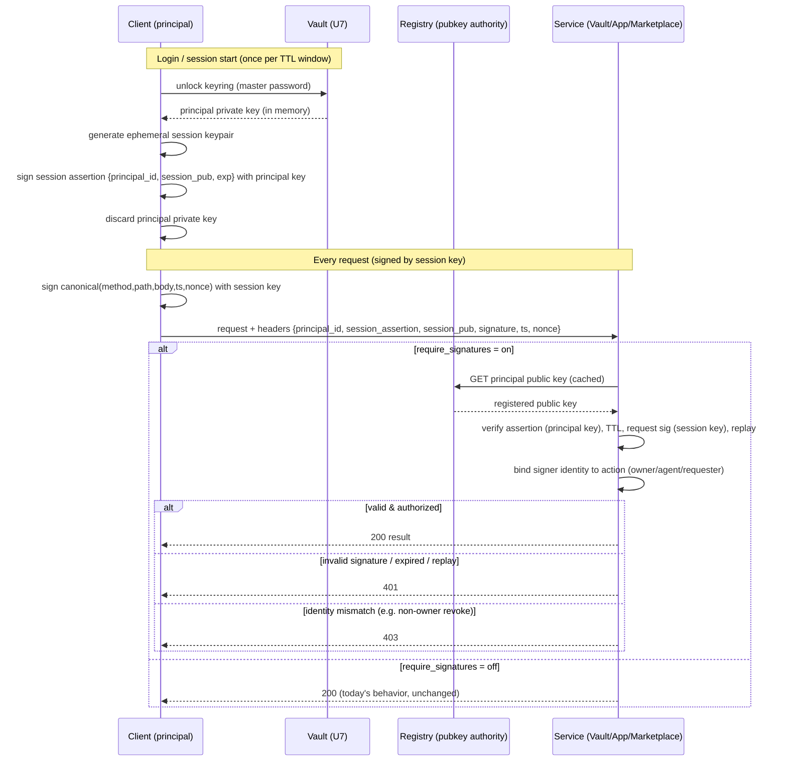

# Phase B.5: Session-Signature Authentication Across the Ecosystem

## Goal Capsule

Close the largest deferred security gap from Phase B: **no service authenticates its callers.** The Registry, Vault, apps, and agent-marketplace currently trust any caller that reaches them — the P2P permission check verifies a principal *exists*, not that the caller *is* that principal.

Phase B.5 makes every principal (user or agent) **prove its identity cryptographically** by signing requests with a short-lived session key, chained to its registered ed25519 public key. Enforcement is **opt-in per service** (`require_signatures` flag, default off) so the 533 existing tests and the web console keep working during migration, and can be flipped on for secure mode.

**Outcome:** an ecosystem where "this request is from principal X" is a verified cryptographic fact, not an unauthenticated header — without a token, a blockchain, or a stateful session store.

---

## Problem Frame

### What Phase B left open

Phase B (U5–U12) built the full agent/P2P/vault/federation/audit stack, but every service authorizes on **asserted** identity:

- **P2P permission check** (`registry/app.py` `check_p2p_permission`) verifies the requester principal *exists* and the app declares the capability — but anyone can send `requester_principal_id: "agent_x"` and be treated as agent_x.
- **Vault** (`vault/app.py`) trusts `agent_principal_id` / `granted_by` from the request body. Any caller can request another agent's credential access, or (worse) revoke a grant — `revoke_access` has no owner check at all, while `grant_access` requires `granted_by == owner`.
- **Agent-marketplace** (`agent_marketplace/app.py`) trusts `user_principal_id` on hire/rate/revoke.
- **Registry** agent/user/app registration and reputation writes trust the body.

The cryptographic primitives to fix this **already exist in the repo**: `agents/provider/agent.py` uses `nacl.signing.SigningKey` to sign A2A messages, and the Registry already stores an optional `public_key` per agent (U5). Phase B.5 generalizes that pattern into a shared library and wires verification into every service.

### Why now

This is the gating item before any production use and before Phase C. The plan's own Decision 8 (envelope encryption) designed **ephemeral session keys** for exactly this purpose; Phase B.5 implements them. It also connects the multi-device vault flow (U7) to authentication: unlock keyring → recover principal private key → issue a session → sign requests → discard the private key.

### Gap examples

- **Today:** `POST /credentials/{id}/access {agent_principal_id: "agent_x"}` — any caller impersonates agent_x and receives its granted credential ciphertext.
- **Phase B.5 (secure mode):** the same request must carry a session signature; the Vault verifies the session chains to agent_x's registered public key and that the request signer *is* agent_x. An impersonator has no valid signature → 401.

- **Today:** `DELETE /credentials/{id}/grants/{agent}` — any caller revokes anyone's grant (no owner check).
- **Phase B.5:** the revoker must sign as the credential owner; a non-owner signature → 403. Closes the grant/revoke asymmetry.

---

## Product Contract

### Summary

Add opt-in cryptographic request authentication across all AgentTrust services. Each principal holds a long-term ed25519 keypair (public key registered in the Registry, private key stored wrapped in the Vault per U7). To act, a principal issues a **stateless session assertion** — a fresh ephemeral session public key bound to its principal_id with an expiry, signed by the principal's private key. Each request is then signed by the ephemeral session key. Services verify the two-link chain (principal key → session key → request) statelessly, using the Registry as the public-key authority, plus replay protection (timestamp + nonce). Enforcement is gated per service by a `require_signatures` flag (default off for backward compatibility). The Vault additionally binds the signer's identity to the credential owner/agent, closing the revoke asymmetry.

### Requirements

- **R1** — A shared library produces and verifies ed25519 keypairs, stateless session assertions, and per-request signatures with a canonical request encoding.
- **R2** — Every principal (user and agent) can register a public key; the Registry serves it as the authority for verification.
- **R3** — A principal can issue a short-lived session assertion (ephemeral key bound to principal_id + expiry, signed by the principal key) without any server round-trip or stored session state.
- **R4** — A shared verification path proves, for any signed request: the session assertion chains to the principal's registered public key, the session is unexpired, the request is signed by the session key, and the request is not a replay (fresh timestamp + unused nonce).
- **R5** — Signature enforcement is opt-in per service via a `require_signatures` flag, default off; with the flag off, every current behavior and test is unchanged.
- **R6** — With the flag on, the Registry, Vault, apps (P2P), and agent-marketplace reject unsigned or invalidly-signed mutating requests with 401, and identity-mismatched requests with 403.
- **R7** — The Vault binds the request signer to the acting identity: credential access requires the signer to be the granted agent; grant/**revoke**/keyring operations require the signer to be the credential/keyring owner. This closes the revoke owner-check gap.
- **R8** — P2P requests prove the `requester_principal_id` cryptographically (identity is verified, not asserted), on top of the existing Registry permission check.
- **R9** — Client libraries sign requests automatically when given a session; an end-to-end integration test proves the full stack works in `require_signatures=True` mode and rejects impersonation, tampering, replay, expiry, and non-owner revoke.

### Scope Boundaries

**In scope:** shared signing/verification library, public-key registration for users, stateless session assertions, per-request signatures with replay protection, opt-in enforcement across Registry/Vault/apps/marketplace, closing the vault revoke asymmetry, client-library signing, secure-mode integration test.

#### Deferred to Follow-Up Work
- **Server-side session revocation / session registry** — sessions are stateless self-issued assertions with short TTL; a revocation list (for compromised-key kill-switch before TTL expiry) is deferred. Short TTL is the interim mitigation.
- **Key rotation for principal long-term keys** — re-registering a public key and re-issuing is possible, but a formal rotation ceremony is deferred.
- **TLS/HTTPS transport** — signatures authenticate the caller and prevent tampering/replay, but do not encrypt transport. TLS is a deployment concern, deferred.
- **Web console (`web/app.py`) migration to signed requests** — the console flow uses bare principal_ids today; it keeps working with the flag off. Migrating the console UI to sign is a separate frontend effort.
- **Argon2id KDF upgrade** — already deferred in Phase B; unrelated to signatures.

#### Outside this product's identity
- OAuth2/OIDC, JWT, or any token-server model — the system is signature-native, not token-native.
- Multi-signature / threshold signing.

---

## Key Technical Decisions

### Decision 1: Stateless self-issued session assertions (no session store)
**Choice:** A session is a signed assertion, not a server-side record. The principal signs `{principal_id, session_public_key, issued_at, expires_at}` with its long-term private key; services verify this assertion statelessly against the principal's registered public key.

**Rationale:**
- No stateful session store to build, replicate, or keep consistent across services — critical for the federated, multi-service topology.
- Matches Decision 8's "ephemeral session key (TTL 15 min)" design directly.
- The Registry stays the single authority for one thing only: principal → public key.
- The private key is used once per session (to sign the assertion), then discarded — exactly the small-exposure-window property Decision 8 wanted.

**Alternative rejected:** stateful sessions issued by a `POST /sessions` endpoint → requires a session store in (or queried from) every service, reintroduces the Registry-as-bottleneck problem P2P was built to avoid.

**Trade-off accepted:** a leaked session key is valid until its TTL expires (no instant revocation). Mitigated by short TTL; server-side revocation deferred (see Scope Boundaries).

### Decision 2: Two-link signature chain
**Choice:** `principal long-term key --signs--> session assertion --whose key signs--> each request`. Verification walks both links.

**Rationale:** decouples the rarely-used, high-value principal key from the frequently-used session key. The principal key touches only session issuance; request signing uses the disposable session key.

### Decision 3: Canonical request encoding + replay protection
**Choice:** Sign over a canonical string `method \n path \n sha256(body) \n timestamp \n nonce`. Requests carry `timestamp` and `nonce`; verifiers reject stale timestamps (outside a skew window, e.g. ±120s) and reused nonces (bounded in-memory nonce cache, TTL = skew window).

**Rationale:** without binding method+path+body, a signature could be lifted onto a different request; without timestamp+nonce, a captured signed request could be replayed. The nonce cache is bounded and self-expiring (no unbounded growth).

**Alternative rejected:** signing only the body → allows endpoint/verb swapping with a captured signature.

### Decision 4: Opt-in enforcement via `require_signatures` flag (default off)
**Choice:** Each service (`make_server(...)`) gains `require_signatures=False`. Off = today's behavior exactly (verification helper is a no-op pass). On = unsigned/invalid → 401, identity mismatch → 403.

**Rationale:** the 533 existing tests and the web console use unsigned principals; a mandatory flip breaks all of them at once. Opt-in mirrors the provider-auth precedent (`docs/plans/2026-07-16-001-feat-provider-auth-security-plan.md`) and enables gradual migration. New auth tests run with the flag on.

**Alternative rejected:** mandatory enforcement → breaks 533 tests and the console in one commit; no gradual path.

### Decision 5: Identity binding at the authorization layer
**Choice:** Verifying the signature proves *who* the caller is; each service then checks that identity against the action. Vault: signer == granted agent (access) or signer == owner (grant/revoke/keyring). Marketplace: signer == hiring user (hire/revoke/rate). P2P: signer == `requester_principal_id`.

**Rationale:** authentication (who) and authorization (may they) are separate; Phase B already has the authorization checks — B.5 makes them trustworthy by proving the identity they key on. This is also where the revoke asymmetry closes: revoke gains the owner check that grant already has, now enforceable because the caller is authenticated.

### Decision 6: Reuse PyNaCl and the existing provider signing pattern
**Choice:** Build `libs/signing.py` by generalizing `agents/provider/agent.py` (`nacl.signing.SigningKey` / `VerifyKey`). No new dependency (PyNaCl already used by the vault and provider).

---

## High-Level Technical Design

### Session issuance and request verification (stateless chain)



### Verification steps (the shared helper, R4)

1. Parse auth headers; if absent and `require_signatures` off → pass through (no-op). If absent and on → 401.
2. Fetch the claimed principal's registered public key from the Registry (cached with short TTL).
3. Verify the session assertion signature against the principal public key; reject if the assertion's `principal_id` ≠ claimed principal → 401.
4. Reject if `expires_at` is past → 401.
5. Recompute `canonical(method, path, sha256(body), timestamp, nonce)`; verify the request signature against the session public key → else 401.
6. Reject stale `timestamp` (outside skew) or reused `nonce` → 401.
7. Return the verified `principal_id` to the handler for the identity-binding authorization check (Decision 5).

---

## Implementation Units

> U-IDs continue the AgentTrust program sequence (Phase A ~U1–U4, Phase B U5–U12); Phase B.5 is **U13–U20**.

### U13. Shared signing & session library

**Goal:** One library that generates keypairs, issues/verifies stateless session assertions, and produces/verifies canonical per-request signatures with replay protection. (R1, R3)

**Dependencies:** none (foundation).

**Files:**
- Create: `libs/signing.py` — keypair gen, `build_session_assertion`, `verify_session_assertion`, `sign_request`, `verify_request_signature`, `canonical_request`, nonce/timestamp helpers, a bounded `NonceCache`.
- Create: `tests/lib/__init__.py`, `tests/lib/test_signing.py`
- Pattern to follow: `agents/provider/agent.py` (lines ~69–86, 213) — `nacl.signing.SigningKey` load/generate/sign.

**Approach:**
- ed25519 via `nacl.signing`. Keys serialized base64 (match `web/app.py`'s principal_id format expectation).
- Session assertion = JSON `{principal_id, session_public_key, issued_at, expires_at}` + detached base64 signature by the principal key.
- Canonical request string per Decision 3; `sign_request(session_signing_key, method, path, body_bytes, timestamp, nonce)`.
- `NonceCache`: thread-safe, entries expire at skew-window TTL, bounded.

**Execution note:** Implement test-first — the crypto contract (roundtrips, tamper/expiry/replay rejection) is the whole value; observe red before implementing.

**Test scenarios:**
1. Keypair generate → sign → verify roundtrip succeeds.
2. `verify_request_signature` fails when body/method/path/timestamp/nonce is altered (tamper detection), one case each.
3. Session assertion signed by principal key verifies against the principal public key; a different key → fails.
4. Expired assertion (`expires_at` in past) → `verify_session_assertion` rejects.
5. `NonceCache`: first use accepted, immediate reuse rejected; entry past TTL is evicted and the nonce is accepted again.
6. Stale timestamp (outside skew window) → rejected; fresh → accepted.
7. Canonical encoding is stable for the same inputs and differs when any field differs.

**Verification:** `python3 -B -m pytest tests/lib/test_signing.py -q` green; no repo regressions.

---

### U14. Public-key registration & authority endpoint in Registry

**Goal:** Users can register a public key (agents already can, U5); the Registry serves any principal's public key as the verification authority. (R2)

**Dependencies:** U13.

**Files:**
- Modify: `registry/app.py` — extend `POST /auth/register` to accept optional `public_key`; add `GET /principals/{principal_id}/public_key` returning `{principal_id, public_key}` (or 404). Keep all existing routes working.
- Modify: `registry/user_index.py` — store `public_key` per user.
- Modify: `tests/registry/` — new `tests/registry/test_public_key_authority.py`.

**Approach:** mirror the agent `public_key` handling already in `registry/agent_index.py`. The authority endpoint resolves a principal in either the user index or the agent index and returns its stored public key.

**Test scenarios:**
1. Register user with `public_key` → stored; `GET /principals/{id}/public_key` returns it.
2. Register user without `public_key` (today's shape) → still 200, no key (backward compatible).
3. Agent public key (registered via U5) is retrievable through the same authority endpoint.
4. Unknown principal → 404.
5. Non-string `public_key` → 422.

**Verification:** new tests green; existing `tests/registry` suite unchanged (78 passing).

---

### U15. Shared verification middleware (opt-in, default no-op)

**Goal:** One helper every service calls to authenticate a request, returning the verified principal_id or an error status; a no-op pass when `require_signatures` is off. (R4, R5)

**Dependencies:** U13, U14.

**Files:**
- Create: `libs/request_auth.py` — `RequestAuthenticator(registry_url, require_signatures=False)` with `authenticate(method, path, body_bytes, headers) -> (principal_id | None, error | None)`; fetches + caches principal public keys from the Registry (short TTL); runs the 7-step verification (HTD); off → returns `(None, None)` pass-through.
- Create: `tests/lib/test_request_auth.py`
- Define the auth header names once here (e.g. `X-AT-Principal`, `X-AT-Session`, `X-AT-Session-Pub`, `X-AT-Signature`, `X-AT-Timestamp`, `X-AT-Nonce`) and document them in `spec/RFC-0005-request-authentication.md` (create).

**Approach:** stateless per HTD steps. Public-key cache keyed by principal_id with short TTL; Registry unreachable while verifying → fail **closed** (401) when the flag is on (mirrors the P2P fail-closed precedent).

**Execution note:** Start from a failing test that asserts a valid signed request authenticates and an unsigned one is rejected only when the flag is on.

**Test scenarios:**
1. Flag off + no auth headers → `(None, None)` pass-through (proves backward compatibility is centralized here).
2. Flag on + valid signed request → returns the correct principal_id.
3. Flag on + missing headers → 401.
4. Flag on + assertion signed by the wrong key → 401.
5. Flag on + request body tampered after signing → 401.
6. Flag on + expired session → 401.
7. Flag on + replayed nonce → 401.
8. Flag on + Registry unreachable for pubkey lookup → 401 (fail closed).
9. Public-key cache: second request for the same principal does not re-hit the Registry within TTL.

**Verification:** new tests green.

---

### U16. Enforce in Registry (agent/user/admin mutations)

**Goal:** With the flag on, Registry mutating endpoints require a valid signature; identity-bound writes require the signer to match. (R6)

**Dependencies:** U15.

**Files:**
- Modify: `registry/app.py` — `make_server(..., require_signatures=False)`; run the authenticator on mutating routes (agent/app registration, reputation writes, admin). Reputation write for a principal requires signer == the recording authority (keep current behavior when flag off).
- Modify: `tests/registry/test_signature_enforcement.py` (new).

**Approach:** thread the authenticator through `RegistryService`/handler like `audit_client` was threaded in U12. Read-only routes (`GET`) stay open.

**Test scenarios:**
1. Flag off → all Phase B registry tests behave identically (regression guard).
2. Flag on + unsigned agent registration → 401.
3. Flag on + valid signed registration → 200.
4. Flag on + reputation write with a valid signature → 200; unsigned → 401.

**Verification:** new tests green; `tests/registry` (flag-off) unchanged.

---

### U17. Enforce in Vault + close the revoke asymmetry

**Goal:** All Vault endpoints authenticate when the flag is on; the signer's identity is bound to the credential owner/agent; **revoke gains the owner check grant already has.** (R6, R7)

**Dependencies:** U15.

**Files:**
- Modify: `vault/app.py` — `make_server(..., require_signatures=False)`; authenticate every mutating route; bind: keyring ops → signer == `user_principal_id`; credential store/grant → signer == owner; credential access → signer == `agent_principal_id`; **revoke → signer == credential owner** (new check, closes the asymmetry — a non-owner revoke is 403 even with a valid signature).
- Modify/add: `tests/vault/test_signature_enforcement.py` (new).

**Approach:** the authorization checks already exist for grant; add the symmetric owner check to `revoke_access`, now enforceable because the caller is authenticated. Off → today's behavior (including the current permissive revoke) unchanged, so existing vault tests stay green.

**Execution note:** Characterize the current (flag-off) revoke behavior with a test first, then add the flag-on owner check, so the backward-compatible path is provably preserved.

**Test scenarios:**
1. Flag off → all 32 Phase B vault tests behave identically.
2. Flag on + agent requests its own granted credential with a valid signature → 200 ciphertext.
3. Flag on + caller impersonates another agent (no valid signature for it) → 401.
4. Flag on + owner revokes a grant (valid signature) → 200.
5. Flag on + **non-owner** attempts revoke with a valid signature → 403 (asymmetry closed).
6. Flag on + keyring rotate signed by non-owner → 403.
7. Flag on + unsigned credential access → 401.

**Verification:** new tests green; `tests/vault` (flag-off) unchanged (32 passing).

---

### U18. Enforce in apps (P2P identity proof)

**Goal:** P2P requests prove `requester_principal_id` cryptographically, on top of the existing Registry permission check. (R6, R8)

**Dependencies:** U15.

**Files:**
- Modify: `apps/marketplace/server/app.py` and `apps/gig-board/server/app.py` — `make_server(..., require_signatures=False)`; in `handle_p2p_request`, authenticate first and require signer == `requester_principal_id` (401/403) before the existing permission check; then the bid/deliver/complete identity checks become trustworthy.
- Mirror copy: after editing `apps/gig-board/server/app.py`, `cp` to `apps/gig_board/server/app.py` (dash = source, underscore = importable test mirror) and verify identical.
- Modify: `tests/integration/test_p2p_signature_enforcement.py` (new).

**Approach:** the permission check (U6) already answers "may this principal use this capability"; U18 adds "is the caller actually this principal". Order: authenticate → identity-bind → permission check → dispatch.

**Test scenarios:**
1. Flag off → all P2P/coordination tests behave identically (regression guard).
2. Flag on + agent submits a bid with a valid signature matching `requester_principal_id` → 200.
3. Flag on + `requester_principal_id` claims another agent but signs with its own key → 403 (identity mismatch).
4. Flag on + unsigned P2P request → 401.
5. Flag on + valid signature but permission denied by Registry → 403 (permission layer still applies).

**Verification:** new tests green; flag-off P2P/coordination suites unchanged.

---

### U19. Enforce in agent-marketplace (hire/revoke/rate)

**Goal:** Hiring, revocation, and rating are signed by the acting user; revoke/rate identity is bound to the hiring user. (R6)

**Dependencies:** U15.

**Files:**
- Modify: `agent_marketplace/app.py` — `make_server(..., require_signatures=False)`; authenticate mutating routes; bind signer == `user_principal_id` for hire/rate and == hiring user for revoke.
- Modify: `tests/marketplace/test_signature_enforcement.py` (new).

**Test scenarios:**
1. Flag off → all Phase B marketplace tests behave identically.
2. Flag on + user hires with a valid signature → 200; unsigned → 401.
3. Flag on + a different user attempts to revoke someone else's hiring (valid signature) → 403.
4. Flag on + rating signed by a user without a hiring relationship → 403 (existing rule, now authenticated).

**Verification:** new tests green; flag-off marketplace suite unchanged (41 passing).

---

### U20. Client-side signing + secure-mode end-to-end integration

**Goal:** Client libraries sign automatically when given a session; a full-stack test proves secure mode end to end and rejects impersonation, tampering, replay, expiry, and non-owner revoke. (R9)

**Dependencies:** U13–U19.

**Files:**
- Modify: `libs/vault_client.py`, `libs/p2p_client.py`, `libs/agent_marketplace_client.py`, `libs/federation_client.py`, `libs/agent_coordination.py` — accept an optional session (session signing key + assertion); when present, attach auth headers via `libs/signing.py`. When absent, behave exactly as today.
- Add a small `SessionContext` helper (in `libs/signing.py` or `libs/request_auth.py`) that ties the U7 unlock flow to session issuance: unlock keyring → principal private key → `build_session_assertion` → discard private key → hold the session key + assertion.
- Create: `tests/integration/test_secure_mode_end_to_end.py`
- Update: `spec/RFC-0005-request-authentication.md` with the client flow.

**Approach:** spin the full stack (Registry + Vault + marketplace + both apps) with `require_signatures=True`, all clients given sessions, on ephemeral ports. Reuse the U11 full-stack fixture shape.

**Test scenarios:**
1. Full secure-mode happy path: register principals with public keys, unlock keyring → session, autonomous bid → accept → deliver → complete, reputation updates — all signed, all pass.
2. Multi-device: unlock keyring from a second "device", issue a fresh session, sign a request → accepted (ties U7 multi-device to auth).
3. Impersonation: a client signing with the wrong key for a claimed principal → 401/403 at the target service.
4. Tampering: a man-in-the-middle body change after signing → 401.
5. Replay: re-sending a captured signed request → 401 (nonce reuse).
6. Expiry: a request with an expired session → 401.
7. Non-owner revoke through the marketplace/vault path → 403 (asymmetry closed end to end).
8. Mixed mode: a service with the flag off still accepts an unsigned client (proves gradual migration).

**Verification:** `python3 -B -m pytest tests/integration/test_secure_mode_end_to_end.py -q` green; full repo suite green with all flags off (no regression to the 533 existing tests).

---

## Verification Contract

- Full existing suite (533 tests) stays green with `require_signatures=False` everywhere — **the backward-compatibility guarantee**.
- Each enforcement unit ships a flag-off regression guard plus flag-on positive/negative tests.
- The U20 secure-mode integration test exercises the whole stack with signatures mandatory and proves rejection of impersonation, tampering, replay, expiry, and non-owner revoke.
- A live smoke (optional, mirroring the Phase B smoke script) booting all services with `--require-signatures` and a signing client confirms the end-to-end secure path outside pytest.

---

## Risks & Mitigations

### Risk 1: Flipping the flag breaks the web console
The console (`web/app.py`) sends bare principal_ids. **Mitigation:** flag defaults off; the console keeps working until its own signed-request migration (deferred). Secure mode is opt-in per service, so the console's Registry can stay permissive while the Vault enforces.

### Risk 2: Leaked session key valid until TTL
Stateless sessions can't be revoked before expiry. **Mitigation:** short TTL (e.g. 15 min per Decision 8); server-side revocation list deferred with this risk explicitly recorded.

### Risk 3: Clock skew causes false rejections
Timestamp freshness depends on roughly-synced clocks. **Mitigation:** a skew window (±120s) absorbs normal drift; the window is a single constant in `libs/signing.py`.

### Risk 4: Nonce cache growth / cross-process replay
The nonce cache is per-process and in-memory, so a replay against a *different* process instance isn't caught. **Mitigation:** acceptable for the single-instance MVP topology; bounded self-expiring cache prevents growth; note the multi-instance limitation for Phase C (shared nonce store).

### Risk 5: Registry public-key lookup becomes a hot path
Every verification may hit the Registry. **Mitigation:** short-TTL public-key cache in the authenticator (public keys rarely change); Registry-unreachable fails closed.

### Risk 6: Private key exposure during session issuance
The principal private key is briefly in memory to sign the assertion. **Mitigation:** the U7 unlock flow already scopes this to milliseconds; `SessionContext` discards the private key immediately after signing the assertion.

---

## Dependencies & Sequencing

```
U13 (signing lib) ──▶ U14 (pubkey authority) ──▶ U15 (verification middleware)
                                                     │
                        ┌────────────┬───────────────┼───────────────┐
                        ▼            ▼               ▼               ▼
                     U16 Registry  U17 Vault      U18 Apps/P2P   U19 Marketplace
                        └────────────┴───────────────┴───────────────┘
                                                     │
                                                     ▼
                                          U20 (client signing + E2E)
```

- **U13 → U14 → U15** are the serial foundation.
- **U16–U19** are independent once U15 lands (different files, no shared mutable state) — parallelizable, subject to the gig-board mirror copy in U18.
- **U20** integrates everything and must run last.

---

## Definition of Done

- [ ] `libs/signing.py` + `libs/request_auth.py` implement the two-link chain with replay protection (U13, U15).
- [ ] Users and agents can register public keys; the Registry serves them (U14).
- [ ] `require_signatures` flag exists on Registry, Vault, both apps, and agent-marketplace, default off (U16–U19).
- [ ] Flag off → all 533 existing tests unchanged (backward-compatibility guarantee).
- [ ] Flag on → unsigned/invalid → 401, identity mismatch → 403, across all four services.
- [ ] The Vault revoke asymmetry is closed: non-owner revoke → 403 (U17).
- [ ] P2P requests prove `requester_principal_id` cryptographically (U18).
- [ ] Client libraries sign automatically when given a session; multi-device session issuance works (U20).
- [ ] Secure-mode end-to-end test rejects impersonation, tampering, replay, expiry, and non-owner revoke (U20).
- [ ] `spec/RFC-0005-request-authentication.md` documents the scheme.

---

## Sources & Research

- **Origin:** `docs/plans/2026-07-19-001-feat-phase-b-agents-p2p-federation-plan.md` — Decision 8 (ephemeral session keys), the deferred "no endpoint authentication" gap, and the vault revoke asymmetry noted in the Phase B review.
- **Existing signing pattern:** `agents/provider/agent.py` (`nacl.signing.SigningKey`, sign/verify) — the primitive to generalize.
- **Public-key storage precedent:** `registry/agent_index.py`, `registry/app.py` (`public_key` optional on agents, U5).
- **Opt-in enforcement precedent:** `docs/plans/2026-07-16-001-feat-provider-auth-security-plan.md` (bearer auth as an opt-in, backward-compatible flag).
- **Fail-closed precedent:** `apps/marketplace/server/app.py` `_check_p2p_permission` (502 on Registry-unreachable).
- **Vocabulary:** `spec/RFC-0001-core-vocabulary.md` (Principal, Session).
