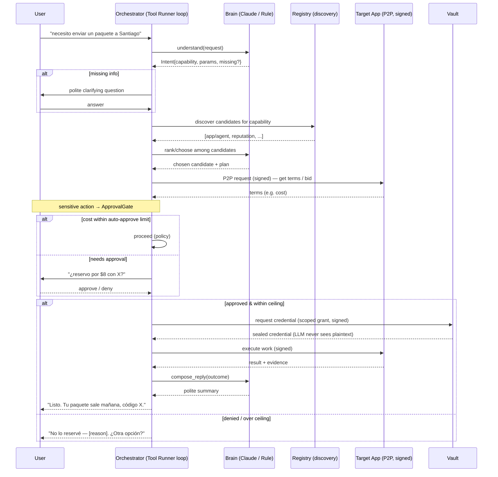

# Orchestrator Agent: the natural-language concierge brain

## Goal Capsule

Build the **orchestrator agent** — the "brain that represents you." A user says *"necesito enviar un paquete a Santiago"* in plain language, and the orchestrator: understands the intent, discovers which app/agent in the ecosystem can do it, compares candidates by reputation, communicates over P2P, and — crucially — **asks permission before spending money or using a credential**, then reports back politely.

It is the piece that turns "a network of apps and agents that can communicate" into "an assistant that gets things done for you." The rails (discovery, P2P, reputation, vault, signatures) already exist from Phases A/B/B.5; this plan builds the LLM-driven brain that drives them.

**Outcome:** a runnable, professional, safe autonomous concierge that takes a natural-language request and orchestrates it end to end against the existing ecosystem, with a human-in-the-loop gate on every sensitive action.

**Decisions locked in with the user:**
1. **Brain:** a real LLM (Claude API, `claude-opus-4-8`) understands language, decides, compares, and writes replies.
2. **Autonomy:** discovers/compares/prepares autonomously, but **stops and asks before spending or using a credential** (human-in-the-loop on sensitive actions).
3. **Scope:** the orchestrator only — tested against the existing Marketplace and Gig Board apps. No new demo "shipping" app.

---

## Problem Frame

### What exists vs what's missing

Phases A/B/B.5 laid every rail the concierge scenario needs:
- **Discovery** (U9, `libs/federation_client.py`) — "which apps/agents offer capability X?"
- **P2P work coordination** (U6/U10, `libs/agent_coordination.py`, `libs/p2p_client.py`) — discover work, bid, deliver.
- **Reputation** (U5) — rank candidates by verified history.
- **Credential Vault** (U7, `libs/vault_client.py`) — scoped, revocable secret access.
- **Signatures** (U13–U20, `libs/session.py`, `libs/signing.py`) — the orchestrator can prove its identity.
- **Example agents** (`agents/marketplace_coordinator/agent.py`) — the class/`single_cycle` pattern to mirror.

**What's missing is the brain.** Today's agents run a *canned* state machine: they bid on "the first matching open task" and return a hardcoded result. Nothing turns *"envía un paquete a Santiago"* into a structured capability query, chooses among options, or asks the user before acting. That intelligence layer — an LLM plus an orchestration loop plus a safety gate — is this plan.

### Why an LLM brain (not a rule parser)

The user asked for something that "translates what I ask." A keyword parser only handles phrasings we anticipate; an LLM handles arbitrary natural language, weighs trade-offs, asks clarifying questions, and writes courteous replies. Per the Claude API guidance, this is a **custom-tool agent**: the LLM decides *what* to do, our tools (the rails) *execute* it, and the SDK Tool Runner drives the loop.

### The security spine (explicit user requirement)

"Educado y seguridad." The orchestrator handles a user's money and credentials, so safety is a first-class design constraint, not an afterthought:
- **Human-in-the-loop** on every spend or credential use.
- **Defense in depth:** the LLM's tool calls are *proposals*; the tools independently enforce authorization (approval gate + the Vault's own scoped grants + B.5 signatures). A prompt-injected or hallucinated tool call still cannot spend or unlock a credential without a real user approval and a valid grant.
- **No secrets in the prompt:** the LLM never sees credential plaintext — the orchestrator uses credentials via the Vault; the model only ever sees a reference and a yes/no outcome.

---

## Product Contract

### Summary

An autonomous orchestrator agent that accepts a natural-language request, uses Claude to parse it into a structured intent, discovers and ranks ecosystem candidates for the needed capability, communicates with them over the signed P2P layer, pauses for explicit user approval before any spend or credential use (within user-set limits), executes the work, and reports the outcome in plain, polite language — all as a first-class signed Principal in the ecosystem that accrues its own reputation.

### Requirements

- **R1** — An LLM brain turns arbitrary natural-language requests into a structured intent (capability, parameters, missing-info questions) and produces courteous user-facing replies. Model `claude-opus-4-8`, adaptive thinking.
- **R2** — The orchestrator's abilities are exposed to the LLM as a bounded tool set (discover, rank, request work, request credential, ask the user, report) built on the existing `libs/` rails.
- **R3** — Discovery + ranking: given a capability, the orchestrator finds candidate apps/agents via federation discovery and ranks them by reputation (and price/speed when the app exposes it).
- **R4** — The orchestrator communicates over the **signed** P2P layer as a registered agent Principal (reuses B.5 `SessionContext`), so its identity is cryptographically proven.
- **R5** — **Human-in-the-loop gate:** before any spend or credential use, the orchestrator stops and asks the user for explicit approval; it proceeds only on approval, and honors user-set spend limits ("up to $X without asking").
- **R6** — Defense in depth: a tool call from the LLM is a proposal; the approval gate, the Vault's scoped grants, and B.5 signature verification each independently authorize the action. The LLM never sees credential plaintext.
- **R7** — Graceful degradation: with no Claude API key configured, the orchestrator falls back to a deterministic rule-based intent parser so development and the full test suite run offline; the LLM path is exercised via an injectable brain interface.
- **R8** — Runnable end to end: a CLI entry point takes a natural-language request and drives the full loop against the existing Marketplace/Gig Board, reporting progress and results politely.
- **R9** — An end-to-end integration test proves the concierge flow against the real ecosystem with a deterministic brain: understand → discover → rank → approval-gate → execute → report, including gate-denied and spend-limit paths.

### Scope Boundaries

**In scope:** the orchestrator agent, its LLM brain adapter (with offline fallback), the tool set wrapping the existing rails, the human-in-the-loop approval gate with spend limits, a runnable CLI, and the E2E test against Marketplace/Gig Board.

#### Deferred to Follow-Up Work
- **A dedicated "shipping"/logistics demo app** — tested against existing apps instead (user decision). A domain app that actually *fulfills* real-world work (books a courier, calls an external API) is separate follow-up.
- **Streaming token-by-token replies to a UI** — the CLI prints final replies; a streaming web UI is later frontend work.
- **Multi-step delegation chains** (orchestrator hiring sub-orchestrators) — single-level orchestration only.
- **Persistent conversation memory across sessions** — a session is one request/conversation; cross-session memory is deferred.
- **Server-to-server request signing** — inherited deferral from B.5.

#### Outside this product's identity
- The orchestrator does not *perform* domain work itself (it coordinates; the specialized apps/agents do the work).
- No autonomous spending without a human approval path — removing the gate is out of scope by design.

---

## Key Technical Decisions

### Decision 1: LLM brain behind an injectable interface
**Choice:** Define a `Brain` protocol with two methods — `understand(nl_request, context) -> Intent` and `compose_reply(state) -> str` — and two implementations: `ClaudeBrain` (Anthropic SDK) and `RuleBrain` (deterministic fallback). The orchestrator depends on the interface, not on Anthropic directly.

**Rationale:**
- Tests and offline dev run with `RuleBrain` — no API key, no network, deterministic assertions (R7).
- The LLM is swappable and mockable; the orchestration logic is tested independently of model behavior.
- Matches the Claude API guidance to keep the harness thin and the model pluggable.

**Alternative rejected:** calling `anthropic` inline throughout the agent → untestable offline, couples orchestration to the SDK.

### Decision 2: Claude model + SDK pattern
**Choice:** `ClaudeBrain` uses `claude-opus-4-8` with `thinking: {type: "adaptive"}`. Intent parsing uses **structured outputs** (`client.messages.parse()` with a Pydantic `Intent` schema). The orchestration loop uses the **Tool Runner** (`client.beta.messages.tool_runner` with `@beta_tool` functions) so the SDK drives the request→execute→loop cycle.

**Rationale:**
- Opus 4.8 is the default high-capability tier for planning/orchestration (per the claude-api reference); Sonnet 5 (`claude-sonnet-5`) is documented as the cost-down option for high volume.
- Structured outputs guarantee a valid, parseable intent — no brittle string parsing of model text.
- The Tool Runner's per-turn hooks are exactly where the human-in-the-loop gate lives (approval happens *inside* the tool function), so we get the loop for free without hand-writing it.

**Dependency:** adds `anthropic` to `requirements.txt` (new). Follow the `claude-api` skill during implementation for exact SDK calls; do not hardcode SDK shapes from memory.

### Decision 3: Human-in-the-loop gate inside the tool functions
**Choice:** The sensitive tools (`request_credential_access`, and any `commit_spend`) call an `ApprovalGate.require(action, cost, details)` before performing the action. The gate consults spend limits, then invokes a pluggable `approval_callback` (a CLI yes/no prompt interactively; a policy/auto-deny callback in autonomous/test runs). On denial the tool returns a structured "user declined" result to the LLM, which adapts.

**Rationale:**
- Per the Claude API guidance, human-in-the-loop belongs *in the tool*, not in a separate manual loop — the Tool Runner runs the tool only if you don't intervene, and returning a declined result lets the model replan.
- Keeps authorization independent of the LLM (Decision 5 / R6): the model can *ask* to spend, but only a real approval + a valid grant makes it happen.

**Alternative rejected:** letting the LLM decide autonomously with only a system-prompt instruction to "be careful" → a prompt-injected or hallucinated call could spend; the gate must be code, not a prompt.

### Decision 4: The orchestrator is a signed Principal
**Choice:** The orchestrator registers itself as an agent Principal (U5), holds a `SessionContext` (U20) to sign every P2P/vault request, and accrues its own reputation. Its keypair is generated at startup; in secure mode its public key is registered and its requests are signed.

**Rationale:** consistency with the ecosystem — the concierge is a citizen, not a special case. A reliable orchestrator builds reputation others can hire. Reuses B.5 rather than inventing a parallel identity.

### Decision 5: Defense in depth — the LLM proposes, the code authorizes
**Choice:** Three independent authorization layers gate any sensitive action: (a) the `ApprovalGate` (human/policy), (b) the Vault's own scoped credential grants (U7/U17), (c) B.5 signature verification (U15–U20). The LLM's tool call satisfies none of these on its own — it only *requests*.

**Rationale:** the user's NL request and the LLM's output are both untrusted input. Treating the model as a planner whose proposals are independently authorized is the safe design; it neutralizes prompt injection and hallucinated actions.

### Decision 6: Spend limits as an explicit policy object
**Choice:** A `SpendPolicy` (e.g. `auto_approve_under=Decimal("0")`, `hard_ceiling=Decimal("20")`) is consulted by the gate: actions under the auto-approve threshold proceed without asking; actions above it require approval; actions above the hard ceiling are refused outright even with approval.

**Rationale:** gives the user the "up to $X without asking" control they asked for, with a hard backstop the model can never exceed.

---

## High-Level Technical Design

### The concierge loop



### Authorization layers on a sensitive action (defense in depth)

```
LLM tool call: request_credential_access(cred_id, agent=self)
      │  (a proposal — authorizes nothing on its own)
      ▼
ApprovalGate.require(action, cost) ──► SpendPolicy check ──► user/policy callback ──► deny? → "declined" result to LLM
      │ approved & within ceiling
      ▼
Vault: scoped grant check (U7/U17) ──► no grant? → 403
      │ granted
      ▼
B.5 signature verification (U15–U20) ──► bad/absent signature? → 401
      │ valid
      ▼
sealed credential returned (used by orchestrator; never placed in the LLM prompt)
```

---

## Output Structure

```
agents/orchestrator/
  __init__.py
  agent.py            # OrchestratorAgent — registration, SessionContext, the loop (U24)
  brain.py            # Brain protocol, ClaudeBrain, RuleBrain, Intent schema (U21)
  tools.py            # the bounded tool set wrapping libs/ rails (U22)
  approval.py         # ApprovalGate, SpendPolicy, approval callbacks (U23)
  cli.py              # runnable entry point + interactive conversation (U25)
libs/
  orchestrator_rails.py   # thin shared helpers over federation/p2p/coordination (U22, if needed)
tests/orchestrator/
  __init__.py
  test_brain.py           # U21
  test_tools.py           # U22
  test_approval.py        # U23
  test_orchestrator.py    # U24
tests/integration/
  test_orchestrator_end_to_end.py   # U26 (U9 full-stack fixture shape)
```

---

## Implementation Units

> U-IDs continue the AgentTrust program sequence (Phase A ~U1–U4, Phase B U5–U12, Phase B.5 U13–U20); the orchestrator is **U21–U26**.

### U21. Brain: LLM intent understanding + reply composition (with offline fallback)

**Goal:** The pluggable brain. `ClaudeBrain` parses natural language into a structured `Intent` and composes courteous replies via Claude; `RuleBrain` does the same deterministically offline. (R1, R7)

**Dependencies:** none (foundation for the agent).

**Files:**
- Create: `agents/orchestrator/brain.py` — `Brain` protocol (`understand`, `compose_reply`), `Intent` (Pydantic: `capability`, `params: dict`, `missing_info: list[str]`, `user_message: str`), `ClaudeBrain`, `RuleBrain`, `make_brain(...)` factory (returns `ClaudeBrain` when an API key is present, else `RuleBrain`).
- Create: `tests/orchestrator/__init__.py`, `tests/orchestrator/test_brain.py`
- Modify: `requirements.txt` — add `anthropic`.
- Pattern: consult the `claude-api` skill for `messages.parse()` (structured outputs) + adaptive thinking; model `claude-opus-4-8`. Do not hardcode SDK shapes from memory.

**Approach:**
- `ClaudeBrain.understand`: `client.messages.parse(model="claude-opus-4-8", output_format=Intent, thinking={"type":"adaptive"}, ...)` with a system prompt establishing a polite, professional concierge persona and the ecosystem's capability vocabulary. `compose_reply`: a plain `messages.create` returning a short courteous summary.
- `RuleBrain`: maps a small set of keywords/phrases ("enviar/paquete" → `shipping.package`, extract a destination token) to an `Intent`; `compose_reply` templates a courteous string. Deterministic — the E2E and unit tests use it.
- The API key is read from the environment; absence selects `RuleBrain` (no crash).

**Execution note:** Implement test-first with `RuleBrain` (deterministic) so the brain contract is nailed down before wiring the SDK; the `ClaudeBrain` path is covered by a mocked-client test, not a live API call.

**Test scenarios:**
1. `RuleBrain.understand("necesito enviar un paquete a Santiago")` → `Intent(capability="shipping.package", params includes destination "Santiago")`.
2. `RuleBrain.understand` of an unrecognized request → `Intent` with non-empty `missing_info` (asks for clarification) rather than a wrong capability.
3. `RuleBrain.compose_reply(success_state)` → a non-empty, courteous string mentioning the outcome.
4. `make_brain()` with no API key env → returns a `RuleBrain`; with a key present → returns a `ClaudeBrain` (construction only, no network).
5. `ClaudeBrain.understand` with an **injected fake Anthropic client** returning a parsed `Intent` → returns that intent (proves the SDK wiring shape without a live call).
6. `Intent` schema rejects a missing `capability` (validation).

**Verification:** `python3 -B -m pytest tests/orchestrator/test_brain.py -q` green; no network in tests.

---

### U22. Orchestrator tool set over the existing rails

**Goal:** The bounded set of actions the brain can invoke, each wrapping an existing `libs/` rail, with the sensitive ones routed through the approval gate. (R2, R3, R4)

**Dependencies:** U21 (Intent), U23 (approval gate) for the gated tools.

**Files:**
- Create: `agents/orchestrator/tools.py` — an `OrchestratorTools` class bundling: `discover_candidates(capability)` (via `libs/federation_client` + `libs/agent_marketplace_client` search), `rank_candidates(candidates)` (by reputation, then price/speed if present), `request_terms(app_id, capability, input)` (P2P via `libs/agent_coordination`/`libs/p2p_client`, signed with the session), `request_credential_access(credential_id)` (**gated**, via `libs/vault_client`), `report_to_user(message)`. Each is also exposed as a Tool-Runner `@beta_tool` wrapper for `ClaudeBrain`.
- Create: `tests/orchestrator/test_tools.py`
- Patterns: `agents/marketplace_coordinator/agent.py` (rail usage), `libs/agent_coordination.py`, `libs/agent_marketplace_client.py`, `libs/vault_client.py`.

**Approach:**
- Tools take a `SessionContext` (U20) so all P2P/vault calls are signed in secure mode; unsigned when no session (dev/flag-off), mirroring the client libraries' optional-session pattern.
- `discover_candidates` unions federation app discovery and agent-marketplace search for the capability; returns a normalized `[{id, kind, reputation, price?, speed?}]`.
- `rank_candidates` sorts by `verification_rate`/`tasks_verified` desc, then price asc / speed when available (documented tie-breakers).
- `request_credential_access` calls `ApprovalGate.require(...)` first; on denial returns `{granted: False, reason: "user declined"}` (never raises into the loop).
- The `@beta_tool` wrappers are thin: validate inputs, call the class method, return a JSON-serializable result — so the Tool Runner (ClaudeBrain) and direct calls (RuleBrain/tests) share one implementation.

**Test scenarios:**
1. `discover_candidates("marketplace.tasks")` against a registered app → returns that app as a candidate (integration-lite with a real ephemeral Registry/app).
2. `discover_candidates` for an unknown capability → empty list (not an error).
3. `rank_candidates` orders a higher-reputation candidate before a lower one; price breaks reputation ties.
4. `request_terms` sends a signed P2P request and returns the app's terms (happy path against an ephemeral app).
5. `request_credential_access` with the gate configured to **deny** → returns `{granted: False}`, and no Vault access occurred (assert via Vault audit).
6. `request_credential_access` with the gate configured to **approve** and a valid grant → returns granted access (proves the gate→vault chain).
7. Each `@beta_tool` wrapper returns JSON-serializable output for its class method (shape check).

**Verification:** `python3 -B -m pytest tests/orchestrator/test_tools.py -q` green; existing suites unaffected.

---

### U23. Approval gate + spend policy (human-in-the-loop)

**Goal:** The code-level safety spine: no spend or credential use without passing the gate; user-set limits with a hard ceiling. (R5, R6, D3, D6)

**Dependencies:** none (used by U22, U24).

**Files:**
- Create: `agents/orchestrator/approval.py` — `SpendPolicy(auto_approve_under, hard_ceiling)`, `ApprovalGate(policy, approval_callback)` with `require(action, cost, details) -> Decision`, and callbacks: `cli_prompt_callback` (interactive yes/no), `auto_deny_callback` (autonomous/test default), `always_approve_callback` (tests only).
- Create: `tests/orchestrator/test_approval.py`
- Pattern: keep it dependency-free and pure so it's trivially testable.

**Approach:**
- `require`: if `cost > hard_ceiling` → refuse (even if the callback would approve); elif `cost < auto_approve_under` → approve without calling back; else → call `approval_callback(action, cost, details)` and honor its boolean.
- Decisions are structured (`Decision(approved: bool, reason: str)`), logged, and (when an audit URL is configured) emitted to the central audit service — every gate decision is auditable.
- Money as `Decimal`; never float.

**Test scenarios:**
1. Cost below `auto_approve_under` → approved without invoking the callback (assert callback not called).
2. Cost between `auto_approve_under` and `hard_ceiling` → callback invoked; returns the callback's verdict (approve and deny cases).
3. Cost above `hard_ceiling` → refused even with `always_approve_callback` (the ceiling wins).
4. `cli_prompt_callback` parses "y"/"yes"/"n"/"no" (feed a fake input); anything else → treated as deny (safe default).
5. A denied decision carries a human-readable `reason`.
6. Decisions are emitted to a configured audit sink (assert an entry recorded).

**Verification:** `python3 -B -m pytest tests/orchestrator/test_approval.py -q` green.

---

### U24. OrchestratorAgent: the concierge loop

**Goal:** Tie brain + tools + gate together into a signed Principal that takes a request and drives understand → discover → rank → (gate) → execute → report. (R2, R4, R8)

**Dependencies:** U21, U22, U23.

**Files:**
- Create: `agents/orchestrator/agent.py` — `OrchestratorAgent(registry_url, brain, tools, gate, session=None)` with `register()` (idempotent agent-principal registration, U5), and `handle_request(nl_request) -> Result` driving one full conversation/loop (no infinite loop — tests call it directly, mirroring `single_cycle` in `agents/marketplace_coordinator/agent.py`).
- Create: `agents/orchestrator/__init__.py`, `tests/orchestrator/test_orchestrator.py`
- Pattern: `agents/marketplace_coordinator/agent.py` (registration + step-driven method), `libs/session.py` (SessionContext).

**Approach:**
- `handle_request`: brain.understand → if `missing_info`, return a clarifying `Result` (the CLI re-prompts) → discover_candidates → rank → request_terms from the top candidate → gate.require on the terms' cost → on approval, request credential (if the plan needs one) and execute the work → brain.compose_reply → return a `Result{status, reply, evidence}`.
- With `ClaudeBrain`, the discover/rank/execute steps are driven by the Tool Runner loop (the model calls the `@beta_tool`s); with `RuleBrain`, `handle_request` calls the same tool methods directly in a fixed sequence. Both paths share the tool implementations (U22).
- The agent holds a `SessionContext` when secure mode is on, so every downstream call is signed (U20).
- Never place credential plaintext into brain inputs (R6) — the agent uses the sealed credential itself and passes the brain only references and outcomes.

**Execution note:** Start from a failing `handle_request` happy-path test with `RuleBrain` and stubbed tools, then implement the sequence; the ClaudeBrain/Tool-Runner path is covered by a mocked-client test.

**Test scenarios:**
1. Happy path (RuleBrain, ephemeral stack): a request with a matching registered app → discovers it, requests terms, gate auto-approves a $0 cost, executes, returns `Result{status: "done", reply non-empty}`.
2. Missing info: an ambiguous request → `handle_request` returns `Result{status: "needs_clarification"}` with a question; no discovery/spend attempted.
3. No candidate found → `Result{status: "no_candidate"}` with a polite explanation; no spend.
4. Gate denies a paid action → `Result{status: "declined"}`; the app is not paid/executed; the reply explains why.
5. Spend over the hard ceiling → refused regardless of approval; `Result{status: "declined"}` names the ceiling.
6. `register()` is idempotent (second call with the same principal → treated as success).
7. ClaudeBrain path with an injected fake Tool-Runner/client → the agent completes a scripted tool sequence (proves the LLM-driven wiring without a live call).

**Verification:** `python3 -B -m pytest tests/orchestrator/test_orchestrator.py -q` green.

---

### U25. CLI entry point + interactive conversation

**Goal:** A runnable orchestrator: `python -m agents.orchestrator.cli --registry-url ... --request "..."` (or interactive), wired to the CLI approval prompt. (R8)

**Dependencies:** U24.

**Files:**
- Create: `agents/orchestrator/cli.py` — `main(argv)` with `--registry-url`, `--vault-url`, `--agent-id`, `--request` (one-shot) or interactive REPL, `--auto-approve-under`, `--hard-ceiling`, `--require-signatures`. Builds the brain (`make_brain`), tools, gate (with `cli_prompt_callback`), and agent; runs `handle_request`; prints replies; on `needs_clarification`, re-prompts.
- Create/extend: a short section in a runbook doc (e.g. `agents/orchestrator/README.md`) showing the Santiago-style example against the running stack.

**Approach:** thin glue over U24; the CLI owns only argument parsing, the interactive loop, and rendering. Approvals surface as clear yes/no prompts showing the action and cost. Registry-unreachable or missing-key states degrade with a clear message (RuleBrain when no key).

**Test scenarios:**
1. One-shot `--request` with a fake/injected agent → prints the agent's reply and exits 0 (drive `main` with args; assert stdout).
2. `needs_clarification` result → the CLI prints the question and (with a scripted stdin answer) re-invokes `handle_request`.
3. An approval prompt renders the action + cost and reads the user's yes/no from stdin (fake input).
4. No API key configured → boots on `RuleBrain` with a one-line notice, still functions.

**Verification:** `python3 -B -m pytest tests/orchestrator/ -q` green (CLI tests included); `python -m agents.orchestrator.cli --help` works.

---

### U26. End-to-end concierge integration test

**Goal:** Prove the whole concierge flow against the real ecosystem with a deterministic brain: understand → discover → rank → approval-gate → execute → report, plus the safety paths. (R9)

**Dependencies:** U21–U25.

**Files:**
- Create: `tests/integration/test_orchestrator_end_to_end.py`
- Pattern: the U11/U9 full-stack fixture shape (Registry + Vault + Agent Marketplace + Marketplace + Gig Board on ephemeral ports); `RuleBrain` so no API key/network is needed.

**Approach:** spin the full stack, register a capable app/agent, register the orchestrator as a signed Principal, and run `handle_request` on a natural-language request whose capability the stack can satisfy (using the existing `marketplace.tasks` / `gig-board.gigs` capabilities as the stand-in for the concierge scenario — no new shipping app, per scope). Assert the end-to-end outcome and the safety branches.

**Test scenarios:**
1. Full concierge happy path: NL request → orchestrator discovers the registered app, requests terms, gate auto-approves a $0 job, executes over signed P2P, and returns a courteous done-reply; the app-side work actually ran (assert app state).
2. Reputation ranking end to end: two candidate agents with different reputations → the orchestrator chooses the higher-reputation one.
3. Approval-gate denial: a job with a cost above `auto_approve_under` and an `auto_deny` callback → the orchestrator does **not** execute/pay; result is a polite decline; no Vault credential was accessed (assert Vault audit empty for that credential).
4. Hard-ceiling refusal: a cost above the ceiling with an always-approve callback → still refused.
5. Credential-gated flow: a request needing a Vault credential, with approval granted and a valid scoped grant → the orchestrator obtains and uses the sealed credential (credential plaintext never appears in any brain input — assert the brain received only a reference).
6. Secure mode: run the stack with `require_signatures=True` and the orchestrator holding a `SessionContext` → the flow succeeds signed; an unsigned orchestrator against the same stack is rejected (401) — proves R4/R6 end to end.

**Verification:** `python3 -B -m pytest tests/integration/test_orchestrator_end_to_end.py -q` green; full repo suite stays green.

---

## Verification Contract

- Unit suites for brain, tools, approval, and agent (`tests/orchestrator/`) all green, offline (no API key, no network — `RuleBrain` + injected fake clients).
- The U26 E2E proves the full concierge flow and every safety branch (gate denial, hard ceiling, credential-gated, secure mode) against the real ecosystem.
- Full repo suite remains green (the orchestrator is additive; no existing behavior changes).
- Optional live smoke: with a real `ANTHROPIC_API_KEY`, `python -m agents.orchestrator.cli --request "necesito enviar un paquete a Santiago"` against a running stack drives the LLM path and asks for approval before any sensitive action.

---

## Risks & Mitigations

### Risk 1: Prompt injection / hallucinated actions
A malicious request (or a compromised app's response) could try to make the LLM spend or exfiltrate a credential. **Mitigation:** defense in depth (D5/R6) — the approval gate, Vault scoped grants, and B.5 signatures each authorize independently; the LLM only proposes. Credential plaintext never enters the prompt.

### Risk 2: Runaway cost
An LLM loop could try many paid actions. **Mitigation:** the `SpendPolicy` hard ceiling refuses over-limit actions even with approval; the gate logs/audits every decision; the Tool Runner loop is bounded (`max_iterations`).

### Risk 3: LLM unavailability / no API key blocks development and CI
**Mitigation:** the `RuleBrain` fallback (D1/R7) runs the entire suite offline; the `ClaudeBrain` path is covered by injected-fake-client tests, so CI never needs a live key.

### Risk 4: SDK drift (model IDs, tool-runner shape)
The Anthropic SDK surface changes. **Mitigation:** implementation follows the `claude-api` skill at build time rather than hardcoding shapes; model IDs and the tool-runner pattern come from that reference, not memory.

### Risk 5: Ranking has thin signals
Apps may not expose price/speed. **Mitigation:** rank by reputation first (always available), with price/speed as documented optional tie-breakers; the plan does not pretend to have signals the ecosystem doesn't provide.

### Risk 6: Cost/latency of Opus for every turn
**Mitigation:** the brain interface makes the model a config choice — `claude-sonnet-5` is a documented drop-in for cost-sensitive high volume; adaptive thinking already scales spend to task difficulty.

---

## Dependencies & Sequencing

```
U21 (Brain) ─┐
U23 (Gate) ──┼──▶ U22 (Tools, uses gate) ──▶ U24 (Agent) ──▶ U25 (CLI) ──▶ U26 (E2E)
             │                                   ▲
             └───────────────────────────────────┘
```

- **U21 and U23** are independent foundations — build first (parallelizable: different files).
- **U22** depends on both (tools use the gate).
- **U24 → U25 → U26** are serial (agent, then its CLI, then the full-stack E2E).

---

## Definition of Done

- [ ] `Brain` protocol with `ClaudeBrain` (Opus 4.8, structured outputs, adaptive thinking) and offline `RuleBrain` (U21).
- [ ] Tool set wrapping discovery, ranking, signed P2P, and gated credential access (U22).
- [ ] `ApprovalGate` + `SpendPolicy`: no spend/credential use without passing the gate; hard ceiling the model can't exceed; every decision audited (U23).
- [ ] `OrchestratorAgent.handle_request` drives understand → discover → rank → gate → execute → report as a signed Principal (U24).
- [ ] Runnable CLI with interactive approval prompts and offline fallback (U25).
- [ ] E2E proves the concierge flow and all safety branches against the real ecosystem, offline (U26).
- [ ] Defense in depth verified: a sensitive action requires approval **and** a Vault grant **and** a valid signature; credential plaintext never reaches the LLM.
- [ ] Full repo suite green; `anthropic` added to `requirements.txt`.

---

## Sources & Research

- **Origin / rails:** Phase B plan (`docs/plans/2026-07-19-001-...`) and Phase B.5 plan (`docs/plans/2026-07-19-002-...`) — discovery, P2P, vault, reputation, signatures.
- **Agent pattern:** `agents/marketplace_coordinator/agent.py` (registration + `single_cycle` step-driven method to mirror).
- **Rails to wrap:** `libs/federation_client.py`, `libs/p2p_client.py`, `libs/agent_coordination.py`, `libs/agent_marketplace_client.py`, `libs/vault_client.py`, `libs/session.py`, `libs/signing.py`.
- **Claude API (load-bearing):** the `claude-api` skill — default model `claude-opus-4-8` (with `claude-sonnet-5` as the cost-down tier), `thinking: {type: "adaptive"}`, structured outputs via `messages.parse()` + Pydantic, and the Tool Runner (`client.beta.messages.tool_runner` + `@beta_tool`) as the agentic-loop pattern with human-in-the-loop gating inside the tool functions. Follow it at implementation time for exact SDK shapes.
