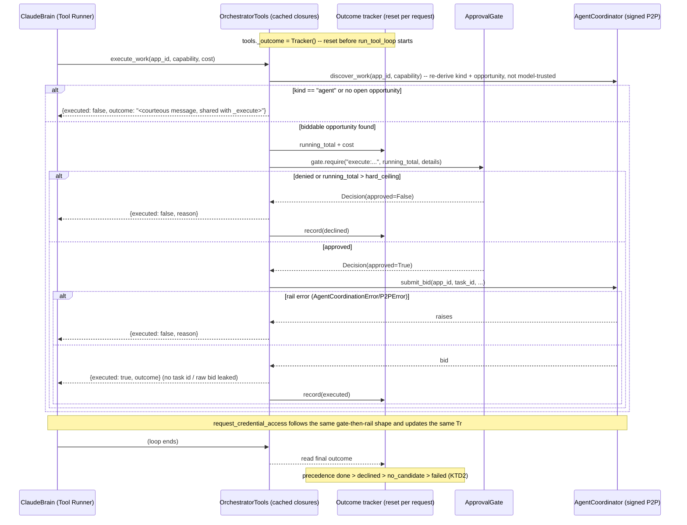

# Orchestrator Code-Review Remediation - Plan

## Goal Capsule

- **Objective:** Close every open finding from the interrupted `ce-code-review` pass on the orchestrator agent (branch `feat/orchestrator-agent`) until the feature is fully resolved — regression-proof the two P1 fixes already shipped this session, close the test-coverage gaps and hardening risk the correctness reviewer named, and run the reviewer roster that never got to start. One item (R3) is a scope addition, not a fix: giving the LLM-driven path a real, gated execution capability. "Fully resolved" includes that capability's own spend-safety edge cases (multi-call cost aggregation, unvalidated tool arguments), not just its happy path.
- **Authority hierarchy:** this plan > the correctness reviewer's recorded findings (`/tmp/compound-engineering-501/ce-code-review/20260721-164149-15856022/correctness.json`) > ad hoc judgment during implementation.
- **Stop conditions:** full repo test suite green; every finding from both review passes triaged to fixed, no-issue, or documented residual; the six reviewers that never ran (testing, maintainability, security, reliability, adversarial, agent-native) have run and their actionable output is addressed.
- **Execution profile:** code; incremental commit per unit, matching the convention already used for U21-U26.
- **Tail ownership:** `ce-work` (or equivalent executor) owns the shipping tail — commit per unit, final full-suite verification, then hand back for commit/PR.

---

## Product Contract

### Summary

Finish what the interrupted orchestrator code review started: regression-test the two P1 bugs already fixed, resolve the two findings left as residuals (an execution gap in the LLM-driven path, an ungraceful failure message), close four identified test-coverage gaps, harden one silently-permissive cost fallback, and run the code-review roster that a session limit cut off after only one of seven reviewers.

### Problem Frame

`agents/orchestrator/` (units U21-U26) shipped this session: a pluggable Brain, a bounded tool set over the ecosystem rails, an approval gate, the concierge agent loop, a CLI, and a full-stack E2E test — 704 repo tests green. A `ce-code-review` pass started against that diff; the **correctness** reviewer finished and found six issues before the session's API limit interrupted the run. Two were P1 security-relevant bugs (a secure-mode identity mismatch that 403'd every signed request, and a credential envelope leaking into the LLM's context in violation of the plan's own R6 guarantee) — both already fixed and committed in this session, along with a cheap REPL fix and a floor on model-supplied cost claims. Two findings were deliberately left unresolved: the LLM-driven path can never execute real work yet reports `done`, and an agent-ranked-first candidate fails with a raw error instead of the graceful message the code already writes for the analogous case elsewhere. The reviewer also named four test-coverage gaps and two residual risks (an unpinned SDK dependency, and a cost-derivation fallback that can silently auto-approve unparseable-cost work). The remaining reviewer roster — testing, maintainability, security, reliability, adversarial, agent-native — never dispatched.

### Requirements

**Regression safety for shipped fixes**
- R1. Add a regression test proving the CLI's `--require-signatures` wiring produces a session whose identity matches what every rail signs requests as (no silent 403 in secure mode).
- R2. Add a regression test proving the `request_credential_access` tool-runner wrapper never returns the sealed vault envelope to the LLM, even on a grant.

**Deferred findings**
- R3. `OrchestratorTools` gains a gated `execute_work` capability so the ClaudeBrain/tool-runner path can execute real work (a signed bid) under the same defense-in-depth gate as the deterministic path, and `OrchestratorAgent` derives `Result.status` from what the tool-runner loop actually did instead of hardcoding `done`. This is a net-new spend-capable capability, not a bugfix, and closes only when its own edge cases (below) are addressed, not merely its happy path: the tool grounds its own target instead of trusting model-supplied identifiers, its LLM-visible result is a minimal, explicit shape, and repeated calls in one loop cannot aggregate past the spend policy's ceiling.
- R4. When the top-ranked candidate is an agent (not executable by current rails), *both* driving paths return the same courteous "current rails only execute app work" explanation `_execute` already writes for this case, instead of a raw exception message — the deterministic path's `_handle_stepwise`, and the tool-runner path's `request_terms`/`execute_work` tool boundary, which hits the identical unhandled-exception risk. Neither path's asserted status/evidence shape in existing tests changes.

**Hardening**
- R5. `derive_cost`'s fallback for an unparseable or absent cost never silently auto-approves: it is treated as requiring human/policy consultation regardless of the configured auto-approve threshold, mirroring the fix already applied to model-supplied cost claims.
- R6. Pin a bounded `anthropic` SDK version range in `requirements.txt` so the beta surfaces this feature depends on (`beta_tool`, `messages.parse`, `beta.messages.tool_runner`) cannot shift silently under an unconstrained upgrade in *either* direction.

**Test coverage gaps**
- R7. Add coverage for the ClaudeBrain/tool-runner path exercising the real U22 tool implementations (not only a fully scripted fake message), including the credential-hygiene assertion on this path specifically.
- R8. Add coverage for `max_iterations` exhaustion in the tool-runner path landing on an honest, non-`done` status.
- R9. Replace the tautological `--require-signatures` CLI test with one that drives a real signed P2P call through a signature-enforcing stack.
- R10. Add coverage proving an empty line at the REPL prompt, or mid-clarification, re-prompts rather than ending the conversation.

**Complete the interrupted review**
- R11. Dispatch the six reviewers that never ran (testing, maintainability, security, reliability, adversarial or its cross-model peer, agent-native) against the full `feat/orchestrator-agent` diff, triage every finding, and apply or record each one.

**Spend-safety hardening for the new capability**
- R12. No sequence of `execute_work` (or `request_credential_access`) calls within one tool-runner loop can commit total spend beyond `policy.hard_ceiling`, even when each individual call is priced within the per-call auto-approve/gate thresholds.

### Scope Boundaries

**In scope:** `agents/orchestrator/{agent,tools,cli}.py`, `requirements.txt`, `tests/orchestrator/*`, `tests/integration/test_orchestrator_end_to_end.py`, and the six review personas that never ran against this diff.

#### Deferred to Follow-Up Work
- Changing agent-candidate-ranked-first *behavior* (falling through to the top app candidate and executing that instead) — the chosen fix is message-only; a future plan can revisit full fallthrough if the product wants agent candidates to be executable.
- Any finding the newly-completed review roster (U8) marks `advisory` or defers during its own Residual Work Gate — recorded, not treated as blocking this plan's completion.

**Outside this product's identity:** unchanged from the original orchestrator plan — the orchestrator coordinates, it does not perform domain work itself; no autonomous spending without a human-approval path.

---

## Planning Contract

### Key Technical Decisions

- **KTD1.** Gate `execute_work` inside the tool itself, exactly like `request_credential_access` — never in a wrapper layer the model's own reasoning could route around. *(session-settled: user-directed — chosen over leaving the LLM path execution-incapable: the agent module's own docstring already describes a "discover/rank/execute" middle for this path, and defense-in-depth requires the gate live at the tool boundary, mirroring Decision 3 of the original orchestrator plan.)*
- **KTD2.** Track what the tool-runner loop actually did via a small mutable outcome tracker — a resettable object living as an attribute on the shared `OrchestratorTools` instance (e.g. reset immediately before each `run_tool_loop` call), **not** rebuilt into fresh `@beta_tool` closures per request. The `@beta_tool` closures `build_beta_tools` produces are cached once per tools instance (unit U21-U26's simplification pass, commit `46ce3b7`) precisely because they are request-independent; a tracker captured at closure-build time would either silently defeat that cache or go stale across requests. The cached closures instead read the tracker's current value at *call* time — the tracker varies per request, the closures do not. `_handle_with_tool_runner` reads the tracker after the loop to derive `Result.status`, with an explicit precedence when more than one outcome was recorded in a single loop: **`done`** (execute_work ever reported real execution — once work is actually committed, nothing later in the loop un-executes it) **> `declined`** (a gate denial was recorded and nothing executed) **> `no_candidate`** (discovery returned empty and nothing executed or was denied) **> `failed`** (the loop ended with nothing terminal recorded, e.g. `max_iterations` exhausted).
- **KTD3.** For the agent-candidate case, `Result.status` and `evidence` keep the shape the existing reputation-ranking E2E test already asserts; only the reply text and the code path that produces it change (raising early with the courteous message `_execute` already writes for this case, instead of letting an unrelated rail exception surface as the generic failure text). Applied at both call sites that can reach an agent candidate: the deterministic `_handle_stepwise` and the tool-runner path's `request_terms`/`execute_work` tool boundary. *(session-settled: user-directed — chosen over falling through to the top app candidate, which would require rewriting that E2E assertion.)*
- **KTD4.** `derive_cost` distinguishes "no cost signal found" from "explicitly free": when no parseable cost exists anywhere in the terms, the effective cost floors at `policy.auto_approve_under` so the gate is always consulted; an explicit, parsed zero-cost term still auto-approves normally. *(session-settled: user-directed — chosen over failing closed outright, to keep legitimate non-machine-readable-cost work reachable via human approval instead of blocked.)*
- **KTD5.** Complete the reviewer roster using the same `ce-code-review` persona prompts and findings schema already used for the correctness pass (one reviewer at a time, foreground, per that skill's dispatch contract) so the second half of the review carries the same severity/confidence discipline as the first. Findings against the new `execute_work` code get the same scrutiny as findings against the pre-existing diff — "newly written in this plan" is not a reason to route a finding to residual instead of fixing it.
- **KTD6.** `execute_work` grounds its own execution target instead of trusting a raw model-supplied `task_id`: it re-derives the candidate's kind and open opportunity itself (mirroring `_execute`'s own `discover_work` call and `kind == "agent"` / empty-opportunities checks) rather than accepting an unvalidated id the model could invent, and wraps the `submit_bid` call so a rail failure (`AgentCoordinationError`/`P2PError`) returns `{"executed": False, "reason": ...}` instead of an unhandled exception — mirroring `request_credential_access`'s own failure handling. `_execute` and `execute_work` share this bid-submission logic (one implementation, called from both the deterministic and LLM-driven paths) instead of maintaining two hand-synced copies. The `@beta_tool` wrapper's LLM-visible result is a minimal, explicit shape — `{"executed": bool, "outcome": str}` only, never the coordinator's raw bid object or a task id — mirroring the R6 precedent that stripped `vault_response` from `request_credential_access`'s wrapper.
- **KTD7.** The outcome tracker (KTD2) also accumulates total approved cost across every `execute_work`/`request_credential_access` call in one loop; before authorizing a call, the gate check considers the running total, not just that call's own cost, so a sequence of individually-small approvals cannot commit aggregate spend past `policy.hard_ceiling`. (R12)

### High-Level Technical Design

The defense-in-depth chain gains a second gated tool alongside `request_credential_access`. `execute_work` never trusts a model-supplied target or cost outright: it re-derives the opportunity itself, checks the *cumulative* loop spend (not just this call) against the ceiling, and returns a minimal result shape to the model. Both tools update the same tracker — a mutable attribute reset on the shared `OrchestratorTools` instance per request, read by the already-cached `@beta_tool` closures, never rebuilt into fresh ones:

`Tr` is reset immediately before each `run_tool_loop` call and read once after — it exists only to answer "did anything real happen in this loop, and how much did it commit?" The `@beta_tool` closures themselves stay request-independent and cached; only `Tr`'s contents vary per request.

---

## Implementation Units

### Phase A — Regression safety and hardening (no new capability)

### U1. Regression tests for the two shipped P1 fixes

**Goal:** Prove the secure-mode identity fix and the credential-envelope-strip fix stay fixed. (R1, R2)

**Dependencies:** none.

**Files:**
- Modify: `tests/orchestrator/test_cli.py`
- Modify: `tests/orchestrator/test_tools.py`

**Approach:** For R1, assert that `build_agent` with `--require-signatures` produces a session, tools, and agent that all share one effective identity — the session's own `principal_id`, not the CLI's default `--agent-id`. For R2, call the `request_credential_access` `@beta_tool` wrapper directly against a fake gate/vault that grants access with a `vault_response` payload present, and assert the wrapper's JSON output has no `vault_response` key while the underlying `OrchestratorTools.request_credential_access` return value (used by the deterministic path and the agent's own evidence) still carries it.

**Test scenarios:**
1. `build_agent(Namespace(require_signatures=True, ...))` -> the returned agent's `session.principal_id`, `tools.agent_principal_id`, and `agent.agent_id` are all equal.
2. `request_credential_access` wrapper, gate approves with a vault grant present -> parsed JSON result has `granted: true` and no `vault_response` key.
3. The same call against the raw `OrchestratorTools.request_credential_access` (not the wrapper) still returns `vault_response` — the strip is wrapper-scoped, not a regression in the tools' own return contract.

**Verification:** `.venv/bin/python -B -m pytest tests/orchestrator/test_cli.py tests/orchestrator/test_tools.py -q` green.

---

### U2. Harden `derive_cost`'s unparseable-cost fallback

**Goal:** An unparseable or absent cost in the terms never silently auto-approves; it is always routed to the gate's callback. (R5, KTD4)

**Dependencies:** none.

**Files:**
- Modify: `agents/orchestrator/agent.py`
- Modify: `tests/orchestrator/test_orchestrator.py`

**Approach:** Distinguish "found an explicit zero-cost term" from "found nothing parseable" in `derive_cost`'s return path, and have `_handle_stepwise` floor the "nothing parseable" case at `self.gate.policy.auto_approve_under` before calling `gate.require` — mirroring the floor already applied to the LLM-supplied cost in the `request_credential_access` wrapper (`agents/orchestrator/tools.py`).

**Test scenarios:**
1. Terms with no cost-bearing field anywhere -> `gate.require` is called with cost `>= policy.auto_approve_under` (callback consulted), never silently approved.
2. Terms with an explicit, parseable `"0"` cost field -> still auto-approves without invoking the callback (the genuinely-free case is unaffected).
3. Terms with a real parseable cost above the floor -> unchanged behavior (regression guard).

**Verification:** `.venv/bin/python -B -m pytest tests/orchestrator/test_orchestrator.py -q` green.

---

### U3. Courteous agent-candidate message (both driving paths)

**Goal:** When the top-ranked candidate is an agent, both the deterministic path and the tool-runner path's `request_terms` tool return the courteous, already-written explanation instead of a raw exception message — without changing the existing E2E test's asserted status or evidence shape. (R4, KTD3)

**Dependencies:** none.

**Files:**
- Modify: `agents/orchestrator/agent.py`
- Modify: `agents/orchestrator/tools.py` (the `request_terms` `@beta_tool` wrapper reaches the identical `AgentCoordinator.discover_work`/`P2PClient.discover_app` chain for an agent-kind `app_id`, so it has the same raw-exception exposure as the deterministic path being fixed here)
- Modify: `tests/integration/test_orchestrator_end_to_end.py` (strengthen the reply-text assertion only; do not change the asserted `status` or `evidence["error"]` membership check)
- Modify: `tests/orchestrator/test_tools.py`

**Approach:** In `_handle_stepwise`, check `top["kind"] == "agent"` before calling `self.tools.request_terms(...)` (mirroring the check `_execute` already performs), and short-circuit with the same courteous outcome text `_execute`'s agent branch already writes, while still producing an `evidence["error"]`-shaped result that contains the candidate's id so the existing reputation-ranking assertion (`"agent:veteran" in result.evidence["error"]`) continues to hold. Apply the identical guard inside the `request_terms` tool implementation itself, so an LLM that ranks an agent candidate first and calls `request_terms` on it gets the same courteous, non-raising result rather than an unhandled exception surfacing through the tool-runner loop.

**Test scenarios:**
1. Top-ranked candidate has `kind == "agent"` (deterministic path) -> `Result.status == "failed"`, `reply` contains the courteous "current rails only execute app work" text (not the generic "ocurrió un problema" boilerplate), `evidence["error"]` contains the candidate's id.
2. Top-ranked candidate has `kind == "app"` -> unchanged behavior (regression guard).
3. `request_terms` tool called directly with an agent-kind `app_id` -> returns the same courteous outcome text as a data result, no unhandled exception.

**Verification:** `.venv/bin/python -B -m pytest tests/orchestrator/test_orchestrator.py tests/orchestrator/test_tools.py tests/integration/test_orchestrator_end_to_end.py -q` green.

---

### U4. Pin a bounded `anthropic` dependency range

**Goal:** Prevent the beta surfaces this feature depends on from shifting silently under an unconstrained upgrade, in either direction. (R6)

**Dependencies:** none.

**Files:**
- Modify: `requirements.txt`

**Approach:** Pin a bounded version range for `anthropic` (a floor at the version already verified working in this session, a ceiling below the next major/breaking line) rather than a floor-only pin — a floor alone still lets a routine `pip install -U` or lockfile refresh move forward onto a future release that renames or removes `beta_tool`, `messages.parse`, or `beta.messages.tool_runner`, which is the exact drift this unit exists to prevent. Document the bump process (raise the ceiling deliberately once the new range is verified) in a short comment next to the pin.

**Test scenarios:** Test expectation: none -- pure dependency-manifest change, no behavioral test.

**Verification:** `pip install -r requirements.txt` succeeds; full orchestrator suite still green.

---

### Phase B — New execution capability for the LLM path

### U5. Gated `execute_work` tool: self-grounded target, shared bid logic, minimal result shape

**Goal:** `OrchestratorTools` gains a gated capability to submit a real work bid, exposed to the Tool Runner exactly like `request_credential_access` — grounded in a target it verifies itself, not a raw model-supplied id, and sharing one bid-submission implementation with the deterministic path's `_execute`. (R3 part 1, R4 part 2, KTD1, KTD6)

**Dependencies:** none (parallel-safe with Phase A).

**Files:**
- Modify: `agents/orchestrator/tools.py`
- Modify: `agents/orchestrator/agent.py` (`_execute` calls the same shared bid-submission logic `execute_work` uses, instead of maintaining an independent copy)
- Modify: `tests/orchestrator/test_tools.py`

**Approach:** Add `OrchestratorTools.execute_work(app_id, capability, cost, details=None)` — note no `task_id` parameter: the model does not supply the execution target directly. Internally it re-derives the candidate's kind and its open opportunity itself, exactly as `_execute` already does (via `self.coordinator.discover_work(app_id, capability)`), so an untrusted model tool-call cannot point a signed bid at a target this request's own discovery never surfaced. `kind == "agent"` or no open opportunity short-circuits with the same courteous outcome text `_execute`'s analogous branches already write (KTD3/R4) — one shared implementation, not two hand-synced copies. Only once a real, self-discovered opportunity exists does it call `self.gate.require("execute:%s@%s" % (capability, app_id), running_cost, details)` (`running_cost` per KTD7/U6) before submitting the bid via the same helper `_execute` calls. Wrap the `submit_bid` call in try/except for `AgentCoordinationError`/`P2PError`, returning `{"executed": False, "reason": ...}` on a rail failure instead of letting it raise into the tool-runner loop — mirroring `request_credential_access`'s own failure handling. The `@beta_tool` wrapper's return to the model is a minimal, explicit shape only — `{"executed": bool, "outcome": str}` — never the coordinator's raw bid object or a task id (KTD6); the full result (including `task_id`/`bid`) stays available to direct/`RuleBrain` callers and the agent's own evidence via the underlying `OrchestratorTools` method, matching the R2 precedent of a wrapper-scoped strip. Floor any model-supplied `cost` at the current running total vs. `tools.gate.policy.auto_approve_under` — the same defensive pattern already applied to `request_credential_access`'s wrapper (the model proposes, the gate authorizes).

**Test scenarios:**
1. Gate denies (auto-deny callback) -> `{"executed": False, ...}`, no `submit_bid` call (spy coordinator).
2. Gate approves -> `submit_bid` called against the tool's own self-discovered opportunity (not a model-supplied id); the underlying `OrchestratorTools.execute_work` return value carries `task_id`/`bid`, but the `@beta_tool` wrapper's JSON output carries only `executed`/`outcome` (regression test in the same shape as U1's R2 test).
3. `execute_work` `@beta_tool` wrapper with a low model-claimed cost -> the callback is still consulted (cost floored against the running total vs. the policy threshold), never silently auto-approved.
4. Candidate `kind == "agent"` or no open opportunity -> `{"executed": False, ...}` with the same courteous outcome text `_execute` already writes (reuse via the shared helper, not a duplicated string).
5. `coordinator.submit_bid` raises `AgentCoordinationError`/`P2PError` (e.g. a stale opportunity claimed by another bidder between discovery and bid) -> `{"executed": False, "reason": ...}`, not an unhandled exception.
6. `_execute` (deterministic path) and `execute_work` (tool-runner path) produce identical bid results for the same candidate/opportunity — proves the shared implementation, not parallel drift-prone copies.

**Verification:** `.venv/bin/python -B -m pytest tests/orchestrator/test_tools.py tests/orchestrator/test_orchestrator.py -q` green.

---

### U6. Wire `execute_work` into the tool-runner path, derive an honest status, and cap cumulative spend

**Goal:** The ClaudeBrain/tool-runner path can execute real work, reports a `Result.status` that reflects what actually happened (with an explicit precedence rule), and cannot commit spend past the hard ceiling across multiple calls in one loop — closing the credential-hygiene and `max_iterations`-exhaustion test gaps on this path specifically. (R3 part 2, R7, R8, R12, KTD2, KTD7)

**Dependencies:** U5.

**Files:**
- Modify: `agents/orchestrator/agent.py`
- Modify: `agents/orchestrator/tools.py` (the tracker attribute and reset point live on `OrchestratorTools`, alongside the cached `_get_beta_tools`)
- Modify: `tests/orchestrator/test_orchestrator.py`
- Modify: `tests/integration/test_orchestrator_end_to_end.py`

**Approach:** Add a small outcome-tracker object as a resettable attribute on `OrchestratorTools` (e.g. `tools._outcome`), reset immediately before each `run_tool_loop` call in `_handle_with_tool_runner` — **not** rebuilt into the `@beta_tool` closures themselves, which stay cached and request-independent exactly as the U21-U26 simplification pass (commit `46ce3b7`) intended. `execute_work` and `request_credential_access` read and update this same attribute as they run: recording each outcome, and accumulating approved cost into a running total that both tools check against `policy.hard_ceiling` before authorizing the next call (R12/KTD7) — so several individually-small approvals cannot aggregate past the ceiling within one loop. After the loop ends, `_handle_with_tool_runner` reads the tracker to pick `Result.status` using KTD2's explicit precedence: `done` (execute_work ever reported real execution) `> declined` (a gate denial recorded, nothing executed) `> no_candidate` (discovery came back empty, nothing executed or denied) `> failed` (nothing terminal recorded, e.g. `max_iterations` exhausted). This closes the residual risk that the LLM path was only ever proven against a fully scripted fake — the new tests must drive the real U22 tool implementations through a scripted-but-real tool-runner, not just a scripted final message.

**Execution note:** Start from a failing test asserting the tracker distinguishes "executed" from "discussed but never executed," then a failing test for the cumulative-cost ceiling, before wiring both through; the credential-hygiene assertion for this path is the same "no plaintext/envelope in any brain input" check the E2E suite already applies to the deterministic path.

**Test scenarios:**
1. Tool-runner path where the model calls `discover_candidates` -> `rank_candidates` -> `request_terms` -> `execute_work` (approved) -> `Result.status == "done"`.
2. Tool-runner path where `execute_work`'s gate denies -> `Result.status == "declined"`, reply reflects the denial reason.
3. Tool-runner path where `discover_candidates` returns empty and no further tool is called -> `Result.status == "no_candidate"`.
4. Tool-runner path exhausts `max_iterations` with no terminal text and no recorded outcome -> `Result.status == "failed"` (not a fabricated `done`).
5. Precedence: a loop where `request_credential_access` is denied but `execute_work` later executes real work -> `Result.status == "done"` (KTD2's precedence rule, not the first-recorded outcome).
6. Cumulative ceiling: two `execute_work` calls in one loop, each individually within `auto_approve_under`, whose sum exceeds `hard_ceiling` -> the second call is refused on the running total, not silently approved (R12).
7. Two `OrchestratorAgent.handle_request` calls in sequence against the same `OrchestratorTools` instance -> the second request's tracker starts fresh (no cost or outcome carried over from the first request).
8. Tool-runner path with a real granting vault behind `request_credential_access` -> the sealed envelope and credential id never appear in any input the brain received (extends the E2E hygiene assertion, currently RuleBrain-only, to this path).
9. Covers the concierge flow end to end with `execute_work` actually submitting a signed bid against the real ephemeral stack (extend or add to `tests/integration/test_orchestrator_end_to_end.py`), closing the "only ever exercised with a scripted fake runner" residual risk.

**Verification:** `.venv/bin/python -B -m pytest tests/orchestrator/test_orchestrator.py tests/integration/test_orchestrator_end_to_end.py -q` green.

---

### Phase C — Remaining test gaps and review completion

### U7. CLI secure-mode and REPL test hardening

**Goal:** Replace the tautological secure-mode CLI test with one that proves a real signed call, and prove the REPL/clarification empty-input fix. (R9, R10)

**Dependencies:** none (parallel-safe with Phases A/B).

**Files:**
- Modify: `tests/orchestrator/test_cli.py`

**Approach:** For R9, drive `build_agent` with `--require-signatures` against a real signature-enforcing marketplace stack (mirroring the E2E suite's ephemeral-stack fixture pattern) and assert a signed `request_terms` call actually succeeds — not merely that a `SessionContext` object exists. For R10, feed a scripted input sequence containing a bare empty line (mid-REPL, and mid-clarification) and assert the conversation continues rather than ending, with a subsequent real input still processed correctly.

**Test scenarios:**
1. `--require-signatures` CLI wiring against a `require_signatures=True` marketplace -> a real signed request succeeds (not just session-object existence).
2. Same wiring against the same stack but *without* signatures -> rejected (401/`P2PError`), proving the test actually discriminates signed vs. unsigned.
3. REPL: empty line at the prompt -> conversation continues (no exit), next real input is processed.
4. Mid-clarification: empty answer -> the clarifying question is re-asked, not treated as "no answer available."

**Verification:** `.venv/bin/python -B -m pytest tests/orchestrator/test_cli.py -q` green.

---

### U8. Complete the interrupted code review

**Goal:** Dispatch the six reviewers that never ran against the full `feat/orchestrator-agent` diff (now including U1-U7), triage every finding, and apply or record each one. (R11, KTD5)

**Dependencies:** U1-U7 (review the diff after the known fixes land, so the reviewers aren't re-flagging things already being fixed in this same plan).

**Files:** Whatever the reviewers' findings touch — expected to stay within `agents/orchestrator/*.py` and `tests/orchestrator/*`, `tests/integration/test_orchestrator_end_to_end.py`.

**Execution note:** Dispatch `testing-reviewer`, `maintainability-reviewer`, `security-reviewer`, `reliability-reviewer`, `adversarial-reviewer` (or its cross-model peer per `ce-code-review`'s own routing), and `agent-native-reviewer` — one at a time, foreground — against the diff at that point, using the same persona prompts and findings schema the correctness pass already used. Triage exactly as the correctness pass was triaged in this session: verify each finding against the actual code before acting, apply what's safe and well-scoped, and record as a documented residual (with reason) anything that needs product judgment or would touch an already-asserted test's behavior. The diff under review now includes `execute_work` (U5/U6) — brand-new code from this same plan, not pre-existing — and it gets the same scrutiny as everything else (KTD5): a finding is not waved through just because it targets code this plan only just wrote.

**Test scenarios:** Test expectation: none as a fixed list -- scenarios depend on what each reviewer finds; any finding accepted and fixed gets its own regression test in the relevant `tests/orchestrator/*` file, following the same pattern as U1-U7.

**Verification:** All six reviewers have run; every P0/P1 finding is either fixed with a passing regression test or explicitly escalated as a blocker; every P2/P3 finding is recorded as a residual with its reason. Full orchestrator suite green after fixes land.

---

### U9. Final validation

**Goal:** Confirm the whole remediation closes cleanly against the full repository, not just the orchestrator package.

**Dependencies:** U1-U8.

**Files:** none (verification-only unit).

**Test scenarios:** Test expectation: none -- this unit runs existing suites, it does not add new tests.

**Verification:** `.venv/bin/python -B -m pytest -q` (full repo suite) green, at or above the 704-test baseline recorded before this remediation began; no unaddressed P0/P1 finding remains from either review pass.

---

## Verification Contract

- `.venv/bin/python -B -m pytest tests/orchestrator/ -q` green after every unit in Phases A-C.
- `.venv/bin/python -B -m pytest tests/integration/test_orchestrator_end_to_end.py -q` green after U6 and again after U8.
- `.venv/bin/python -B -m pytest -q` (full repo suite) green before this plan is considered done — no regression against the 704-test baseline.
- U8's review roster: all six listed reviewers actually ran (not skipped for capacity reasons without a documented retry); zero unresolved P0/P1 actionable findings.
- The `_get_beta_tools` cache (U21-U26, commit `46ce3b7`) is still exercised unchanged by U6's tests — the outcome tracker must not force the tool closures to be rebuilt per request.

## Definition of Done

- [ ] R1, R2 regression tests added and passing (U1).
- [ ] R5 hardened, R6 pinned with a bounded range (U2, U4).
- [ ] R4 shipped as a message-only fix at both call sites (deterministic and tool-runner); existing E2E status/evidence assertions untouched (U3).
- [ ] R3 `execute_work` added and gated identically to `request_credential_access`, grounding its own execution target rather than trusting a model-supplied id, sharing bid logic with `_execute`, and returning a minimal LLM-visible result shape (U5, KTD6).
- [ ] R12: cumulative spend across multiple `execute_work`/`request_credential_access` calls in one loop cannot exceed `hard_ceiling` (U6, KTD7).
- [ ] `Result.status` derived honestly in the tool-runner path per KTD2's explicit precedence rule, with the per-request tracker living as a resettable attribute on the shared `OrchestratorTools` instance — not rebuilt into fresh `@beta_tool` closures (U6).
- [ ] R7, R8 closed with new tests exercising the real tool-runner path (U6).
- [ ] R9, R10 closed with new tests (U7).
- [ ] R11: all six remaining reviewers dispatched against a diff that includes `execute_work`; every P0/P1 finding fixed (with a regression test) or explicitly escalated; every P2/P3 finding recorded as a residual (U8).
- [ ] Full repo suite green, no regression against the 704-test baseline (U9).
- [ ] No abandoned-attempt code left in the diff from any approach that didn't pan out.

## Sources & Research

- **Correctness reviewer artifact (this session):** `/tmp/compound-engineering-501/ce-code-review/20260721-164149-15856022/correctness.json` — the six findings this plan resolves, including exact evidence lines and suggested fixes.
- **Original orchestrator plan:** `docs/plans/2026-07-19-003-feat-orchestrator-agent-plan.md` — Decision 3 (human-in-the-loop belongs inside the tool) and Decision 5 (defense in depth: the LLM proposes, the code authorizes) that KTD1 and KTD4 extend to the new `execute_work` tool.
- **Pattern to mirror for `execute_work`:** `agents/orchestrator/agent.py`'s existing `_execute` method (the deterministic path's minimal real-execution logic already targeted for reuse, not duplication).
- **Cached tool-runner closures:** `agents/orchestrator/agent.py`'s `_get_beta_tools` (commit `46ce3b7`, "cached tool schemas") — the reason KTD2's outcome tracker is designed as a mutable attribute on the shared `OrchestratorTools` instance rather than state captured into per-request closures.
- **`ce-doc-review` pass on this plan (2026-07-21):** coherence, feasibility, security-lens, scope-guardian, and adversarial reviewers ran against this document before implementation began. Feasibility (confidence 100, spot-checked against `agents/orchestrator/agent.py`) and scope-guardian independently converged on the tracker/cache conflict (KTD2); security-lens and adversarial independently converged on the cumulative-spend gap (KTD7). Their findings shaped KTD2, KTD6, KTD7, and the U3/U5/U6 rewrites above.
