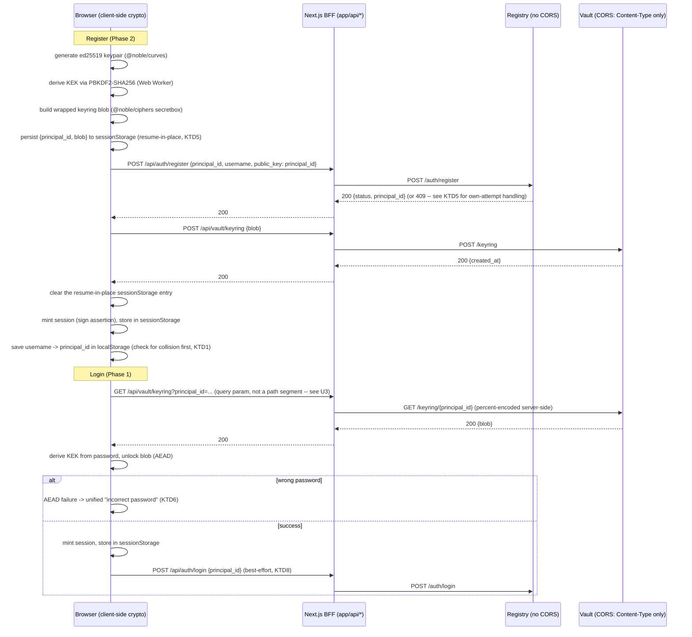

# Frontend Login and Register - Plan

## Goal Capsule

- **Objective:** ship real login and registration in the `frontend/` Next.js app, wired to the backend's existing signed-identity system (`principal_id`/ed25519, signed sessions, password-based encrypted keyring), replacing today's hardcoded mocks.
- **Product authority:** this plan. No upstream brainstorm document was written; scope was resolved through conversation and a Phase 0.7 solo scoping synthesis, confirmed by the user.
- **Open blockers:** none. The one blocking product question (how a returning user identifies themselves, given the backend has no username index) was resolved via explicit user confirmation — see KTD1.
- **Execution profile:** phased. Phase 1 (login with an existing identity) ships first; Phase 2 (self-service registration) ships second. Phase 1 does NOT deploy standalone to real users without accounts to log into — see the Bootstrap note under Dependencies.
- **Tail ownership:** standalone `ce-work` run.

---

## Product Contract

### Summary

Real login and registration for `frontend/`, connected to the backend's existing zero-knowledge identity system, replacing the hardcoded `UserChip`/`credentials-vault` mocks.

### Problem Frame

`frontend/` has zero real authentication today: `UserChip.tsx` hardcodes a fake user, and the `credentials-vault` pages are static mockups with no data fetching. The backend's real identity system already exists — `principal_id`/ed25519 keys, signed sessions (`libs/session.py`, `libs/signing.py`), and a password-based encrypted keyring in the Vault (`vault/crypto.py`, `libs/vault_client.py`) — but has never been implemented in a browser. The Registry's `POST /auth/login` is not real authentication (it is an existence check only); the actual authentication mechanism is the client-side keyring unlock, which exists only in Python today.

### Requirements

R1. A new user can register: choose a username and password, generate an identity client-side, and end up with a working signed session — with zero changes to the Python backend.
R2. A returning user can log in on the same browser/device with just username + password; the browser recalls the associated `principal_id` locally.
R3. A returning user on a new device can log in by supplying their `principal_id` (shown and emphasized at registration time) plus their password.
R4. All calls to the Registry and Vault are mediated by a Next.js backend-for-frontend (BFF); the browser never calls those services directly.
R5. The signed session lives only in browser `sessionStorage` (never a persistent cookie, never `localStorage`); it expires with the backend's existing 15-minute session TTL, and expiry surfaces a clear re-login prompt, never a silent failure.
R6. No password-recovery mechanism exists; the registration UX states this explicitly, since losing the password means losing the identity permanently.
R7. Once a session exists, `UserChip` and the rest of the shell reflect the real logged-in `principal_id` instead of the mock.
R8. A partial failure during the multi-step registration (Registry succeeds, Vault upload fails, or vice versa) is recoverable without regenerating a new identity.

### Scope Boundaries

**Deferred for later**
- Self-service registration (R1) ships as Phase 2, after login (R2/R3) ships as Phase 1.
- Wiring real Vault data into the existing `credentials-vault` mockup pages — this plan gets the user logged in; consuming the session elsewhere is follow-up work.

**Outside this product's identity**
- Password recovery (R6) — a deliberate permanent exclusion, not a Phase 2 item.
- Real backend username-uniqueness enforcement — declined explicitly during scoping; username is a local display label, not a login identifier (KTD1).
- Migrating the older Flask "web console" (`web/app.py`) to signed requests — already tracked separately in `docs/plans/2026-07-19-002-feat-phase-b5-session-signature-auth-plan.md`.
- Widening Vault's CORS policy, or enabling `require_signatures` on Registry/Vault for this deployment — this feature operates against the existing default (unsigned) deployment posture.

### Dependencies

Existing backend modules this plan reads and ports logic from, but never modifies: `libs/signing.py`, `libs/session.py`, `libs/request_auth.py`, `vault/crypto.py`, `libs/vault_client.py`, `registry/app.py`, `vault/app.py`.

**Bootstrap.** Phase 1 ships a global session gate (U5) before Phase 2's self-service registration exists, so the very first accounts must come from somewhere else. This plan does not build new bootstrap tooling: `libs/vault_client.py::register_user_keyring` plus the Registry's `POST /auth/register` already let an operator create a real `principal_id` + working keyring entirely from a Python shell, independent of any browser code. Provision the initial internal-team accounts this way before Phase 1 deploys; do not deploy U5's route guard to any environment that has zero provisioned accounts.

### Outstanding Questions

None blocking. One deferred, non-blocking item is tracked under Risks & Dependencies: client-side throttling of repeated failed-unlock attempts. A second deferred question — whether the Registry ever gains real username uniqueness later — is noted in Scope Boundaries as an explicitly declined backend change (KTD1).

---

## Planning Contract

### Key Technical Decisions

**KTD1. Returning-user identification: browser-local `principal_id` lookup.** *(session-settled: user-directed — chosen over "`principal_id` is the literal login credential" and "add a real backend username index": the backend index would expand scope into Registry/Python work the user explicitly declined; making the raw ~44-character base64 key the literal login string is poor UX.)* At registration, the `principal_id` is generated, shown, and the UX urges the user to save it. The browser also stores a `username -> principal_id` mapping in `localStorage` (the value is a public key, not a secret) so the same device can log in with just username + password afterward.

**KTD2. Browser crypto: `@noble/curves` (ed25519) + `@noble/ciphers` (secretbox / xsalsa20poly1305) — not `tweetnacl`, not `libsodium-wrappers`, not WebCrypto for these primitives.** *(session-settled: user-approved — supersedes the earlier `tweetnacl`-based brainstorm assumption after research: WebCrypto has no XSalsa20-Poly1305 primitive at all, so a JS/WASM library is mandatory regardless of the ed25519 choice, and `@noble/*` is the actively-maintained, independently-audited, byte-compatible choice over the now effectively-unmaintained `tweetnacl`.)* WebCrypto's native `crypto.subtle.deriveBits('PBKDF2', ...)` remains the KDF, run inside a Web Worker so 600,000 iterations never blocks the UI thread.

**KTD3. All Vault calls route through the Next.js BFF, not just Registry calls.** *(session-settled: user-approved, via the Phase 0.7 scoping synthesis.)* The Registry has zero CORS support (a hard requirement for a BFF on Registry calls); the Vault's CORS exists but only allowlists `Content-Type`, never the `X-AT-*` signed headers. Routing every Vault call through the BFF keeps one consistent client-calling convention and avoids ever needing to widen Vault's CORS policy.

**KTD4. Session storage: `sessionStorage`, not raw JS memory or a cookie.** Survives an accidental reload within the 15-minute TTL; isolated per tab — a second tab is an independent, separately-authenticated session, with no cross-tab sync in this plan.

**KTD5. Registration partial-failure handling: resume-in-place, persisted across a closed tab.** If Registry registration succeeds but the Vault keyring upload fails (network error, closed tab mid-flow), the client retries only the failed step against the SAME already-generated keypair/blob — it never regenerates a new identity for a retry. Holding that state in memory alone cannot survive a closed tab (closing the tab destroys the JS heap), so the already-encrypted keyring blob plus its `principal_id` (never the plaintext password or private key) is also written to `sessionStorage` for the duration of the in-flight registration only, cleared on success or explicit abandonment — safe to persist because it is ciphertext plus a public key, not a secret. Registry-then-Vault ordering is intentional: Registry registration is idempotent on `principal_id` (a retry safely 409s), which makes it the cheaper side to have already-succeeded when the failure happens. A 409 on the exact `principal_id` this client itself generated is therefore treated as confirmation to proceed to the Vault step, never as a collision (see U7); a 409 on a `principal_id` the client never submitted is the genuine, vanishingly rare collision case.

**KTD6. Failed-unlock messaging: a single unified "incorrect password" message.** Wrong password and a corrupted blob are cryptographically indistinguishable to the client — both raise the same AEAD authentication failure. A typo is overwhelmingly the more likely cause, so a separate "corrupted data" tier would mislead more often than it would help.

**KTD7. Registration requires a confirm-password field and a minimum password-strength check** (both client-side only, never transmitted). Confirm-password is the safety net against an undetectable, permanent typo, given R6's no-recovery design. The strength check exists because `GET /keyring/{principal_id}` has no auth or rate limit (see Risks & Dependencies) — anyone who learns a `principal_id` can fetch its encrypted blob and brute-force the password offline indefinitely; password strength is the only real defense against that, not just a UX nicety.

**KTD8. Registry's `POST /auth/login` call is best-effort and non-blocking to the login UX.** It is an existence-check / `last_active` bump, not the authentication authority — the actual authentication is the successful AEAD unlock. A failure on this call never blocks a successful login.

**KTD9. Repeated failed-unlock attempts get a client-side cosmetic delay only, not real rate limiting.** The Vault's `GET /keyring/{id}` has no server-side rate limit today, so an increasing client-side delay between attempts (U4) raises the bar against casual brute-forcing but does nothing against a client that skips the UI and calls the BFF directly — real protection would need server-side throttling on the Vault, which is backend scope this plan does not touch. A cheaper partial mitigation that IS in this plan's scope: U3's own BFF route (`/api/vault/keyring`) could add its own per-IP throttling without any Vault change, closing part of the gap; left as a follow-up rather than a required unit here, tracked as a residual risk below.

### High-Level Technical Design

**Trust boundary.** The browser holds the password and, transiently, the decrypted private key and DEK — never the server. The Next.js BFF is a byte-forwarding proxy for Vault calls: it must forward the exact request body bytes and any signed headers unchanged, never re-serializing JSON, since Vault-side signature verification (when later enabled) is sensitive to exact byte content. R4's "the browser never calls those services directly" is a client-code convention, not a network-enforced boundary: Vault already sends `Access-Control-Allow-Origin: "*"` on every response, so if Vault's port is reachable from outside the deployment, any external site's JS could call it directly today, bypassing the BFF entirely. This plan assumes Registry/Vault are network-reachable only from the BFF's server-side runtime — see Risks & Dependencies.

### System-Wide Impact

This plan establishes the frontend's first real auth boundary and its first global client state where neither existed before, so its cross-cutting effects are worth naming explicitly:

- **New auth boundary.** Every route under `AppShell` becomes session-gated for the first time (U5); today every route is unconditionally public. Verify the guard fails closed (unauthenticated visits redirect, never briefly flash authenticated content) as part of U5, not as an afterthought.
- **First global client state.** `SessionProvider` (U4) is the first Context provider in `frontend/` — before this plan, no page shares client state at all. Future features that need session data (e.g., wiring `credentials-vault` to real data, per Scope Boundaries) will depend on this provider's shape; changing it later is a breaking change to every consumer, not a local edit.
- **Cross-language protocol coupling.** `agentCrypto.ts` (U1) and `agentSession.ts` (U2) duplicate logic that today lives only in `vault/crypto.py` and `libs/signing.py`/`libs/request_auth.py`. Any future change to the Python canonical-string format, the KDF parameters, or the keyring blob shape must be mirrored in these TypeScript modules or the two implementations silently diverge — there is no shared source of truth once this plan ships. Flag this in review whenever either side changes.
- **No server-side changes.** Registry, Vault, and their CORS/signing posture are read-only inputs to this plan (see Scope Boundaries) — this plan cannot and does not affect any other consumer of those services (the demo Flask `web/` console, `apps/marketplace`, `apps/gig-board`, mobile).

### Risks & Dependencies

- **The BFF's network reachability to Registry/Vault is an unverified deployment assumption.** R4's mediation guarantee only holds if Registry/Vault are unreachable except from the BFF's own server-side runtime — Vault's permissive CORS header (`Access-Control-Allow-Origin: "*"`) means a public-internet-reachable Vault could be called directly by any external site's JS, bypassing the BFF. Verify this network topology before shipping; it is a deployment prerequisite, not something this plan's code can enforce.
- **The ephemeral session signing key lives in `sessionStorage`, not JS-memory-only** (KTD4, chosen deliberately so a reload survives within the TTL). Web Storage is readable by any script on the page, so an XSS bug anywhere in the app — not just the auth screens, since `SessionProvider` wraps the whole layout — could exfiltrate the live signing key for the rest of its 15-minute life. Accepted as part of KTD4's tradeoff; mitigate with a Content-Security-Policy restricting script sources as the app matures, rather than reopening KTD4's reload-survival guarantee.
- **Wiring real Vault data into the `credentials-vault` mockup pages (Scope Boundaries) has no tracked follow-up plan today**, unlike the web-console migration item, which cites `docs/plans/2026-07-19-002-feat-phase-b5-session-signature-auth-plan.md`. Flagged so it doesn't fall through silently; write a follow-up plan once this one ships.
- **KDF parameters are read from the fetched blob, not pinned by the client** (inherited from `vault/crypto.py::unlock_keyring_blob`, which this plan's `unlockKeyringBlob` mirrors exactly for compatibility). External research on this pattern (Bitwarden's documented 2023 design flaw) found that letting the server-supplied blob unilaterally dictate KDF iteration count lets a compromised server downgrade a client's effective security for an offline attack against stolen ciphertext. This plan intentionally mirrors the existing Python client's trust model rather than unilaterally diverging from it — fixing this would be a backend-wide decision (both `vault/crypto.py` and this TS port), out of scope here, and is flagged for a future follow-up rather than silently patched in only one language.
- **Client-side-only attempt throttling is cosmetic, not real rate limiting** (KTD9) — the Vault's `GET /keyring/{id}` has no server-side limit today. Out of scope; flagged for backend follow-up.
- **No test runner exists in `frontend/` before this plan** (confirmed by repo research — `package.json` has no Jest/Vitest/Playwright). U1 introduces Vitest as a new piece of infrastructure the whole `frontend/` project inherits, not just this feature; a conflicting choice made by unrelated future frontend work would need reconciling.
- **`@noble/curves`/`@noble/ciphers` are new dependencies** with no prior usage anywhere in this repo (KTD2) — supersedes the earlier `tweetnacl` assumption carried in from initial scoping; verify the exact package versions at implementation time, since this plan cites a 2026 research snapshot, not a pinned version.
- **This feature assumes `require_signatures=False`** stays the Registry/Vault deployment default (matches the rest of the ecosystem's current posture per `docs/plans/2026-07-19-002-feat-phase-b5-session-signature-auth-plan.md`). If that default is ever flipped on, the very first `POST /keyring` call during registration has no existing session to sign with yet — a bootstrapping gap this plan does not solve, since it doesn't apply under the current default.

---

## Implementation Units

### Phase 1 -- Login (existing identity)

### U1. Browser crypto primitives module

**Goal:** a reviewed, tested TypeScript module providing ed25519 keygen/sign and NaCl-SecretBox-compatible AEAD encrypt/decrypt, byte-compatible with `vault/crypto.py`.
**Requirements:** R1, R2, R3 (foundation for both flows).
**Dependencies:** none.
**Files:**
- Create `frontend/src/lib/agentCrypto.ts` -- ed25519 keygen/sign (`@noble/curves/ed25519`), secretbox encrypt/decrypt (`@noble/ciphers`), PBKDF2-SHA256 KDF wrapper (`crypto.subtle.deriveBits`, dispatched to a Web Worker), and `buildKeyringBlob`/`unlockKeyringBlob` functions mirroring `vault/crypto.py`'s `build_keyring_blob`/`unlock_keyring_blob` field-for-field (`encrypted_dek`, `salt`, `nonce`, `kdf`, `kdf_params`, `encrypted_private_key`).
- Create `frontend/src/lib/pbkdf2.worker.ts` -- the Web Worker entry point for the KDF step.
- Create `frontend/src/lib/agentCrypto.test.ts`.
- Modify `frontend/package.json` -- add `@noble/curves`, `@noble/ciphers`; add a test runner (Vitest -- lightest fit for a Next.js/TS project with no existing runner) plus its `test` script.
**Approach:** Port `vault/crypto.py`'s envelope-encryption chain (`generate_salt`, `derive_kek`, `generate_dek`, `wrap_dek`/`unwrap_dek`, `encrypt_data`/`decrypt_data`) 1:1. Keep the blob's on-wire JSON shape byte-identical (base64 fields, same key names) so a blob written by either language is readable by the other.
**Execution note:** Proof-first. This is the highest-risk module in the plan; write the round-trip and cross-language tests before wiring it into any UI.
**Test scenarios:**
- Happy path: `buildKeyringBlob(password, privateKey)` then `unlockKeyringBlob(password, blob)` returns the original private key and DEK.
- Cross-language round trip (the strongest proof available): using the repo's existing Python test server, register a keyring via this TS module's blob against a running `vault/app.py`, then fetch and unlock it with `libs/vault_client.py`'s `unlock_keyring`, and vice versa -- mirrors `tests/vault/test_credential_storage.py::test_store_keyring_then_unlock_from_another_device` but cross-language.
- Error path: `unlockKeyringBlob` with the wrong password throws a distinct error type, never returns partial/garbage data (Covers KTD6's precondition).
- Edge case: PBKDF2 with 600,000 iterations completes in the Web Worker without blocking `document` interactivity (assert via a timing/responsiveness check, not just a completion assert).
- Edge case: SecretBox nonce is freshly random per call (assert two encryptions of the same plaintext under the same key produce different ciphertext).
**Verification:** `npm run test` in `frontend/` passes; the cross-language round trip succeeds against a live local Vault instance.

### U2. Session-assertion module

**Goal:** a TypeScript port of the session-assertion minting logic, so the client can mint a usable session.
**Requirements:** R2, R3, R5.
**Dependencies:** U1.
**Files:**
- Create `frontend/src/lib/agentSession.ts` -- session assertion minting only: canonical, key-sorted JSON claims `{principal_id, session_public_key, issued_at, expires_at}`, ed25519-signed by the principal key, mirroring `libs/signing.py`'s `build_session_assertion`.
- Create `frontend/src/lib/agentSession.test.ts`.
**Approach:** Scoped down from the original draft, which also built per-request canonical-string signing and the `X-AT-*` header set mirroring `libs/request_auth.py`. Cut per doc review: no unit in this plan ever calls per-request signing (Registry/Vault run with `require_signatures=False` by default, and U3/U6's Approach confirm no signed headers are sent), so that code would have been untested-in-practice complexity with no current consumer. Per-request signing is real, needed work, but belongs to `docs/plans/2026-07-19-002-feat-phase-b5-session-signature-auth-plan.md`, which already owns the signature-enforcement rollout -- add it there when that plan turns `require_signatures` on, reusing this module's assertion output.
**Test scenarios:**
- Happy path: a minted assertion verifies against the reference Python verification logic's expectations (same claim shape, same signature scheme).
- Edge case: the session assertion's `expires_at` matches the backend's 15-minute `DEFAULT_SESSION_TTL`.
**Verification:** `npm run test` passes; a minted assertion round-trips through the Python verification logic's expected shape.

### U3. BFF route handlers -- login phase

**Goal:** Next.js Route Handlers that proxy the Registry and Vault calls login needs, forwarding bytes unchanged.
**Requirements:** R2, R3, R4 (Vault fetch is read-only here, no partial-failure surface).
**Dependencies:** none (thin proxies).
**Files:**
- Create `frontend/src/app/api/auth/login/route.ts` -- `POST`, proxies to Registry `POST /auth/login`.
- Create `frontend/src/app/api/vault/keyring/route.ts` -- `GET`, reads `principal_id` from the query string (`?principal_id=...`), proxies to Vault `GET /keyring/{principal_id}` with the segment percent-encoded server-side. **Not** a `[principalId]` dynamic path segment: `principal_id` is standard (non-URL-safe) base64 and contains a literal `/` in roughly half of all generated keys, which breaks both Next.js's route matching and Vault's own `/`-splitting router (`vault/app.py` expects exactly two path segments). A query parameter sidesteps the ambiguity entirely.
- Create `frontend/src/lib/backendConfig.ts` -- centralizes the Registry/Vault base URLs (env-var driven, matching `apps/marketplace/src`'s existing `import.meta.env.VITE_REGISTRY_URL`-style convention rather than hardcoding ports; `web/app.py` uses argparse CLI flags, not env vars, so it is not the right precedent to cite here).
**Approach:** Mirror `web/app.py::_handle_auth_login`'s error-passthrough shape (`{error: string}`) for consistency across the repo's front ends. No signing needed for these two calls in this deployment's default posture (KTD3's BFF-for-everything decision still applies for consistency, even though this specific call carries no signed headers today).
**Test scenarios:**
- Happy path: `GET /api/vault/keyring?principal_id=...` for an existing keyring returns the blob unchanged.
- Edge case: `principal_id` containing a literal `/` round-trips correctly (this is the common case, not a rare edge case -- construct the fixture to guarantee a `/` is present rather than relying on random generation).
- Error path: unknown `principal_id` returns the Vault's 404 passed through, not swallowed.
- Error path: Registry/Vault unreachable returns a distinct 502-shaped error the UI can render as "service unavailable," not a generic crash.
**Verification:** `npm run test` (route handler tests) passes; manual `curl` against a running dev server + local Registry/Vault confirms the proxy round trip, including a `principal_id` containing `/`.

### U4. Session context, login UI, session-expiry handling

**Goal:** the user-facing login screen and the app-wide session state it establishes.
**Requirements:** R2, R3, R5.
**Dependencies:** U1, U2, U3.
**Files:**
- Create `frontend/src/lib/SessionProvider.tsx` -- React Context (the app's first global client state; none exists today) backed by `sessionStorage`, following `ThemeToggle.tsx`'s established `useSyncExternalStore` + defensive `try/catch`-around-storage pattern. Stores only the ephemeral session keypair/assertion and the display `principal_id`/username -- never the password or the long-term private key, which is discarded after minting the session (per the backend's own `SessionContext.from_keyring_unlock` contract). Owns the expiry check: compares `expires_at` to `Date.now()` on an interval and on tab focus, clearing state past expiry (see U4 Approach).
- Modify `frontend/src/app/layout.tsx` -- wrap the app in `SessionProvider`.
- Create `frontend/src/app/login/page.tsx` -- Client Component, no `AppShell`/`Sidebar` (pre-auth screen). A single identifier field that defaults to "username" mode; toggling "use a different device" relabels the same field to "principal_id" (placeholder and validation swap accordingly) rather than revealing a second field. Password input.
- Create `frontend/src/app/login/LoginForm.tsx`.
- Create `frontend/src/app/login/LoginForm.test.tsx`.
**Approach:** Disable the form while a submission is in flight (matches the legacy `disabled={loading}` pattern in `web/src/pages/Auth/LoginPrincipal.jsx`), and capture the password into a local variable once before starting the PBKDF2 work rather than re-reading a controlled input mid-computation. Session expiry is enforced by `SessionProvider` comparing the assertion's `expires_at` to the client clock on an interval and on tab focus -- **not** by a signed-call 401, which cannot fire under this deployment's `require_signatures=False` default (U2 builds no per-request signing to trigger one). On expiry, clear the session and route to `/login` with a "your session expired" message (R5) -- no silent refresh, since re-authentication requires the password again. Surface the same clock-based check as a non-blocking warning toast at ~13-14 minutes as a courtesy before the hard cutoff. If a username has no local `principal_id` mapping (never registered on this device), auto-switch the field into "principal_id" mode with inline copy explaining why ("'[username]' isn't recognized on this device -- enter your principal_id instead") rather than a bare error.
**Test scenarios:**
- Happy path: correct username + password (same device, `localStorage` has the mapping) logs in and lands on the dashboard with `SessionProvider` populated.
- Happy path: correct `principal_id` + password (new-device path, toggle engaged) logs in identically.
- Error path: wrong password shows the unified KTD6 message; the form re-enables for another attempt.
- Edge case: rapid repeated failed attempts trigger a client-side, increasing cosmetic delay before the next attempt is allowed, with a visible countdown label on the disabled submit control (not a silent wait) -- defense-in-depth; the Vault's `GET /keyring/{id}` has no server-side rate limit today (KTD9).
- Edge case: username with no local `principal_id` mapping auto-switches to `principal_id` mode with the explanatory copy above, rather than failing silently.
- Integration: `SessionProvider`'s clock-based check firing past `expires_at` clears state and redirects to `/login` with the expiry message, with no network call involved.
**Verification:** `npm run test` passes; manual walkthrough of both login paths against a running dev stack, including forcing the clock-based expiry path.

### U5. Wire the shell to the real session

**Goal:** replace `UserChip`'s mock and add logout, so the rest of the app reflects a real logged-in identity.
**Requirements:** R7.
**Dependencies:** U4.
**Files:**
- Modify `frontend/src/components/shell/UserChip.tsx` -- read `principal_id`/username from `SessionProvider` instead of the hardcoded values; unauthenticated state is unreachable here since `AppShell` routes are behind the session gate.
- Modify `frontend/src/components/shell/AppShell.tsx` (or a new lightweight guard) -- redirect to `/login` when no active session exists.
- Add a logout action to `UserChip.tsx` -- clears `sessionStorage` (via `SessionProvider`) and redirects to `/login`. Client-only; there is no server-side session-revocation endpoint in this design (sessions are stateless assertions that self-expire).
**Approach:** No new files beyond what's listed; this unit is a rewiring pass, not new capability.
**Test scenarios:**
- Happy path: after login, `UserChip` shows the real `principal_id`/username.
- Happy path: logout clears the session and the next protected-route visit redirects to `/login`.
- Edge case: visiting a protected route with no session redirects to `/login` without flashing the authenticated shell first.
**Verification:** `npm run test` passes; manual walkthrough confirms `UserChip` and logout.

### Phase 2 -- Registration (new identity)

### U6. BFF route handlers -- registration phase

**Goal:** the Registry and Vault proxy routes registration needs.
**Requirements:** R1, R4, R8.
**Dependencies:** U3 (extends the same `backendConfig.ts`).
**Files:**
- Create `frontend/src/app/api/auth/register/route.ts` -- `POST`, proxies to Registry `POST /auth/register`, forwarding `{principal_id, username, public_key}` (passes through the 409-on-existing-`principal_id` case distinctly).
- Modify `frontend/src/app/api/vault/keyring/route.ts` (created in U3 for `GET`) -- add `POST`, proxies to Vault `POST /keyring`.
**Approach:** Same byte-forwarding, error-passthrough approach as U3. The register payload sends `public_key: principal_id` explicitly -- in this MVP the `principal_id` IS the public key (per `libs/session.py`'s own convention), and `registry/user_index.py::get_public_key` resolves a value stored separately at registration time, not derived automatically. Sending it now costs nothing and avoids a backfill migration if `require_signatures` is ever turned on later, since `RequestAuthenticator` fails closed for any principal with no resolvable public key.
**Test scenarios:**
- Happy path: register + upload keyring both succeed, distinct 200s.
- Error path: a genuine `principal_id` collision (should be exceedingly rare, since it's client-generated) returns a distinct "please retry" message, not a generic error (Covers the double-submit race noted in scoping).
**Verification:** `npm run test` passes; manual `curl` round trip.

### U7. Registration UI with resume-in-place recovery

**Goal:** the user-facing signup screen implementing the full register flow and its partial-failure recovery.
**Requirements:** R1, R6, R8.
**Dependencies:** U1, U2, U6, U4 (reuses `SessionProvider`).
**Files:**
- Create `frontend/src/app/register/page.tsx` -- Client Component, no `AppShell`.
- Create `frontend/src/app/register/RegisterForm.tsx` -- username, password, confirm-password (KTD7) fields with a client-side minimum-strength check on the password field; a "save your `principal_id`" success screen displaying the generated ID with a copy-to-clipboard affordance and the explicit no-recovery warning (R6), gated behind an explicit "I've saved my ID -- continue" action rather than auto-advancing once the session is minted, given a skipped/missed ID here is unrecoverable.
- Create `frontend/src/app/register/RegisterForm.test.tsx`.
**Approach:** Hold the generated keypair/blob in a local ref across the two network steps (Registry then Vault), and also persist `{principal_id, blob}` to `sessionStorage` for the duration of the in-flight registration (KTD5) -- the in-memory ref alone cannot survive a closed tab, which KTD5 explicitly names as a recovery trigger; the `sessionStorage` copy is what actually makes that trigger recoverable, since ciphertext plus a public key is safe to persist. Clear the `sessionStorage` entry on success or explicit abandonment. On the Vault step failing after Registry already succeeded (including reopening a closed tab mid-flow), offer an explicit "finish setting up your account" retry using the persisted material rather than restarting the whole form. Track locally which `principal_id` this client itself submitted to Registry; a 409 on that exact `principal_id` means the client's own earlier attempt already succeeded, so proceed straight to the Vault step -- only a 409 on a `principal_id` the client never submitted is a genuine collision, which is vanishingly rare since it's client-generated. Client-side username format validation (3-32 characters, alphanumeric plus `_`/`-`) runs before the PBKDF2 work starts, since there is no server-side uniqueness check to wait for (KTD1). Before writing the `username -> principal_id` mapping to `localStorage`, check for an existing entry under that username on this device; if one exists and differs, warn before overwriting rather than silently replacing it (a plausible case: a user who lost a password re-registers under the same remembered username, which would otherwise strand their old identity's local mapping).
**Test scenarios:**
- Happy path: username + matching, sufficiently strong passwords -> keypair generated -> Registry succeeds -> Vault succeeds -> success screen requires explicit acknowledgment -> session minted -> localStorage mapping saved -> lands on the dashboard.
- Error path: password and confirm-password mismatch, or password below the strength minimum, blocks submission before any crypto work starts.
- Error path (Covers R8/KTD5): Vault upload fails after Registry succeeds -> retry button re-attempts only the Vault upload with the SAME in-memory-and-`sessionStorage`-persisted keypair/blob, never regenerates.
- Error path (Covers R8/KTD5, the closed-tab case): simulate a closed tab mid-flow by reloading between the Registry and Vault steps -- the persisted `sessionStorage` entry lets the reloaded page detect and resume the in-flight registration rather than starting a fresh identity.
- Error path (Covers KTD5's 409 handling): Registry call fails with a network error, is retried, and the retry's 409 (because the first attempt actually landed) is treated as success-continue, not as a collision message.
- Error path: registering a username with an existing, different `localStorage` mapping on this device shows the overwrite warning before saving.
- Error path: Registry call itself fails (network) with no prior attempt on record -> nothing was created server-side yet, full retry is safe and correct.
- Edge case: double-submit (rapid double-click) is prevented by disabling the submit control synchronously on first click, before any async work starts.
**Verification:** `npm run test` passes; manual walkthrough of the happy path, the Vault-failure recovery path, and the closed-tab/reload recovery path (simulate by stopping the local Vault mid-flow, then reloading before retrying) against a running dev stack.

---

## Verification Contract

- `frontend/`: `npm run test` (Vitest, introduced in U1) must pass for every unit's test files.
- `npm run lint` (existing ESLint config) must pass with no new violations.
- `npm run build` must succeed (Next.js 16 type-checks and bundles the new routes/pages).
- Cross-language proof (U1, U2): round-trip a keyring blob and a session assertion between this TypeScript client and the existing Python `vault` test server / `libs/signing.py` verification logic, per each unit's test scenarios -- this is the plan's strongest correctness signal, since the whole feature's value is byte-compatibility with an existing system, not novel logic.
- Manual end-to-end walkthrough (U4, U7) against a locally running `registry`, `vault`, and `frontend` dev server: register a new identity, log out, log back in on the "same device" path, then again on the "new device" (paste `principal_id`) path.

## Definition of Done

- All Phase 1 units (U1-U5) implemented, tested, and merged before Phase 2 units begin.
- Every implementation unit's test scenarios pass; the cross-language round-trip proof in U1/U2 passes against a live local Vault/Registry.
- No abandoned-attempt code (e.g., an earlier `tweetnacl`-based spike, if one was started before KTD2 landed) remains in the diff.
- `UserChip` and the shell's route guard reflect a real session with no remaining hardcoded mock values.
- `docs/plans/2026-07-19-002-feat-phase-b5-session-signature-auth-plan.md`'s own deferred "web console migration" item is left untouched -- this plan does not modify `web/app.py` or `web/src/`.
