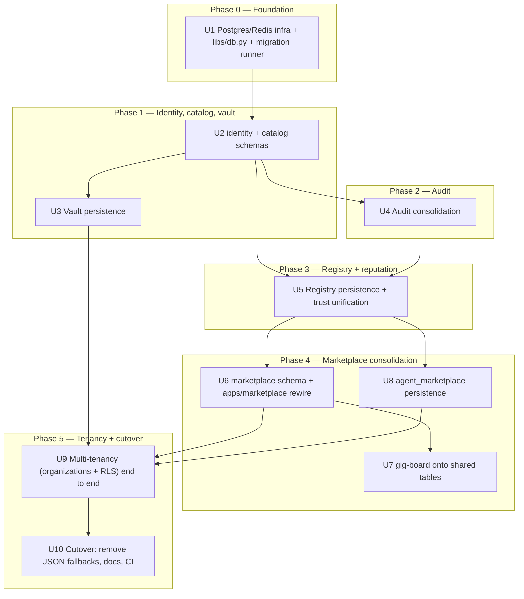

# Database Architecture Implementation - Plan

## Goal Capsule

- **Objective:** replace every in-memory `dict` / full-file-rewrite JSON store in the AgentTrust backend with a real PostgreSQL persistence layer, per the schema already designed in `docs/architecture/database-design.md`, without changing any rewired service's external HTTP contract.
- **Authority hierarchy:** `docs/architecture/database-design.md` is the schema source of truth (exact DDL, column types, indexes) — this plan sequences and scopes the *build*, it does not re-derive the schema. Where this plan and the design doc conflict, the design doc's DDL wins unless a unit explicitly amends it.
- **Stop conditions:** stop and ask before (a) changing any RFC-0001 JSON Schema in `schemas/`, (b) altering a rewired service's existing HTTP request/response shape, (c) deploying anything beyond local/CI docker-compose (no real cloud provisioning in this plan).
- **Execution profile:** `code`. Standard branch/test/commit lifecycle; no autonomous ship-to-prod step.
- **Tail ownership:** the implementer (`ce-work` or a human) owns running the full suite green and updating `docs/demo-runbook.md` / `README.md` before calling this done — see Definition of Done.

---

## Product Contract

### Summary

Give AgentTrust real, durable, multi-tenant-ready storage: seven PostgreSQL schemas (`identity`, `catalog`, `registry`, `trust`, `marketplace`, `vault`, `audit`) backing every existing service, plus Redis for the state that is deliberately ephemeral. Registry and Verification Service converge on one reputation table; `apps/marketplace`, `apps/gig-board`, and `agent_marketplace` converge on one `marketplace` schema. Every rewired service keeps its current external API.

### Problem Frame

Every store in this codebase today is a Python `dict` guarded by a lock, optionally mirrored to a JSON file rewritten in full on every write. There is no SQL database anywhere in the repo (confirmed: no `sqlite3`, no ORM, no `CREATE TABLE`). Two concrete failures already exist under that model: the Vault has zero persistence (a restart destroys every wrapped key and credential), and Registry/Verification Service keep two independent, unsynchronized reputation stores. `docs/architecture/database-design.md` already specifies the target schema and rationale; this plan is the build-out.

### Requirements

**Persistence**
- R1. Every backend store (registry, vault, audit, verification service, marketplace/gig-board/agent_marketplace) persists to PostgreSQL instead of in-memory dicts or JSON files, and survives a process restart with no data loss.
- R4. Vault storage stays zero-knowledge: the database only ever holds ciphertext / wrapped blobs, never plaintext, a KEK, or a DEK.
- R5. Audit entries are append-only and immutable at the database level (`UPDATE`/`DELETE` rejected), partitioned by month.
- R7. Capability search and reputation lookups run against indexed joins, not linear scans over JSON blobs.
- R9. Schema changes apply via versioned, ordered `.sql` migration files run by an idempotent runner (safe to re-run).

**Consolidation and reputation**
- R2. Registry and Verification Service read and write one canonical `trust.reputation_records` table — no independent reputation copies. *(session-settled: user-directed — chosen over keeping two federated stores: this is one product today, not a multi-vendor federation, so a shared table removes desync risk instead of building CDC infra for a federation case that doesn't exist yet)*
- R3. `apps/marketplace`, `apps/gig-board`, and `agent_marketplace` persist through one shared `marketplace` schema; the byte-identical duplicate directory `apps/gig_board` is deleted. *(session-settled: user-directed — chosen over persisting each of the three separately: avoids permanently maintaining three divergent systems that already do nearly the same thing)*

**Security and multi-tenancy**
- R6. Every tenant-scoped table carries `organization_id` and is protected by Row-Level-Security, so cross-tenant reads are impossible even via a crafted query. *(session-settled: user-approved — chosen over deferring multi-tenancy: retrofitting tenant isolation onto tables already holding real data is far more expensive than including it in the initial schema)*
- R8. Registry API keys are stored hashed, never in plaintext (closes a live gap in the current in-memory `Set[str]`).

**Compatibility and rollout**
- R10. Every rewired service's existing external HTTP API contract is preserved, and its existing test suite keeps passing unmodified, except where a call-out explicitly documents a behavior change (ratings history, gig-board's backing store, vault's audit assertions).
- R11. `.github/workflows/test.yml` provisions Postgres and Redis service containers so the full suite runs against real infrastructure in CI, not only locally.

### Scope Boundaries

**In scope:** all seven schemas, the shared `libs/db.py` access layer, the migration runner, rewiring registry / vault / audit / verification service / apps/marketplace / apps/gig-board / agent_marketplace, RLS multi-tenancy, CI provisioning, and updating `docs/demo-runbook.md` / `README.md` / `registry/DEPLOYMENT.md` for the new prerequisites.

**Deferred to Follow-Up Work**
- Wiring the Next.js frontend or the Flutter mobile app to real data — both remain mock-only after this plan; they are a separate product surface.
- Standing up PgBouncer and a read replica — documented as the scaling path in `docs/architecture/database-design.md` §11, not deployed here; a single primary is sufficient at initial launch scale.
- Adopting OpenSearch/Elasticsearch for capability or marketplace search — `pg_trgm` is sufficient at current volume.
- Automatic key rotation beyond what `identity.principal_keys` already supports structurally.

**Outside this product's identity:** escrow/payment holding, full Sybil resistance (staking, attestation aggregation) — unchanged from the scope already declared in the root `README.md`.

---

## Planning Contract

### Key Technical Decisions

- **KTD1 — Raw SQL via a thin per-store repository layer, no ORM.** *(session-settled: user-approved — chosen over an ORM/query builder: matches the codebase's existing 100%-stdlib, framework-free convention (`http.server.ThreadingHTTPServer`, no Flask, no dependency beyond `pytest`/`jsonschema`/`pynacl`/`requests`) and gives full control over query shape at the "no bottlenecks" scale the product targets)*
- **KTD2 — Plain versioned `.sql` files run by a small custom migration runner, no Alembic.** *(session-settled: user-approved — chosen over adopting a migration framework: one dependency fewer, consistent with KTD1, and there are no ORM models an autogeneration tool would key off anyway)*
- **KTD3 — Fold the Vault's local audit log into the one central `audit.audit_log` table.** *(session-settled: user-approved — chosen over keeping `vault/audit_log.py` as a second trail: today's two logs are unsynchronized, incomplete copies of each other, not an intentional fast-path/durable-path split)*
- **KTD4 — ULID surrogate keys for every new table**, not UUID4 — chosen for index locality at insert time: a random UUID4 primary key hits a random point in the B-tree on every insert, causing page splits at volume; a ULID sorts by creation time so inserts land at the append-heavy right edge of the index. Natural string identities (`principal_id`, `capability_id`) keep their existing form.
- **KTD5 — One Postgres cluster, one schema per domain**, not one database per service — chosen over physical separation now: gives each service a least-privilege DB role scoped to its own schema today (created in U1's `infra/roles.sql`, never the table-owning migration role), with a clean seam to split any schema into its own cluster later without an application rewrite.
- **KTD6 — New shared repository modules live in `libs/`** (`libs/db.py`, `libs/identity_repository.py`, `libs/capability_repository.py`, `libs/reputation_repository.py`), matching the existing convention where cross-service code lives in `libs/` (`libs/session.py`, `libs/signing.py`, `libs/audit_client.py`). Service-specific repositories (`registry/repository.py`, `vault/repository.py`, `audit/repository.py`, `apps/marketplace/server/repository.py`, `apps/gig-board/server/repository.py`, `agent_marketplace/repository.py`) stay local to their service.
- **KTD7 — Migrations are flat-numbered at the repo root** (`migrations/0001_identity.sql`, `migrations/0002_catalog.sql`, ...), not grouped into per-schema subdirectories — the schemas have a strict dependency order (identity → catalog → vault/audit → registry/trust → marketplace) and flat sequential numbering encodes that order directly instead of needing a second ordering mechanism across subdirectories.
- **KTD8 — Ratings become append-only history plus a materialized `rating_summary` row**, replacing today's "re-rating silently replaces the prior rating" behavior in `agent_marketplace/hiring.py` — a deliberate behavior change (R10 exception): the current behavior discards review history, which is a defect once ratings are durable rather than in-memory.
- **KTD9 — The optional JSON-file persistence paths are removed, not kept as a fallback**, once Postgres backs a store (`registry/index_store.py`'s `path=`, `registry/user_index.py`'s `path=`, `services/verification/reputation_store.py`'s `path=`/`revocation_path=`, and their corresponding `--*-file` CLI flags). Keeping both would be a half-finished dual-write state with no clear owner of truth.

### High-Level Technical Design

Units are grouped into five build phases, each depending only on phases before it. The design doc (`docs/architecture/database-design.md`) is the schema source of truth for every box below; this diagram sequences the build, it does not redefine the schema.

### Assumptions

- No production data exists yet in any of the current in-memory/JSON stores (everything is demo-scale) — this plan treats the migration as greenfield, not a live-data cutover, which is why no backfill/rollback-of-real-data unit is included.
- The team's local/CI environment can run Docker (needed for a local Postgres + Redis) — no managed cloud database is provisioned by this plan.

---

## Implementation Units

### Unit Index

| U-ID | Title | Key files | Depends on |
|---|---|---|---|
| U1 | Postgres/Redis infra + DB access layer + migration runner | `libs/db.py`, `migrations/`, `tools/migrate.py`, `infra/docker-compose.yml`, `infra/roles.sql` | — |
| U2 | `identity` + `catalog` schemas | `migrations/0001_identity.sql`, `migrations/0002_catalog.sql`, `libs/identity_repository.py`, `libs/capability_repository.py` | U1 |
| U3 | Vault persistence | `vault/app.py`, `vault/repository.py`, `migrations/0003_vault.sql` | U2 |
| U4 | Audit consolidation | `audit/audit_store.py` → `audit/repository.py`, `migrations/0004_audit.sql`, `vault/audit_log.py`, `audit/app.py` (auth) | U2 |
| U5 | Registry persistence + trust unification | `registry/repository.py`, `services/verification/reputation_store.py`, `libs/reputation_repository.py`, `migrations/0005_registry.sql`, `migrations/0006_trust.sql` | U2, U4 |
| U6 | `marketplace` schema + apps/marketplace rewire | `apps/marketplace/server/app.py`, `apps/marketplace/server/repository.py`, `migrations/0007_marketplace.sql` | U5 |
| U7 | gig-board onto shared marketplace tables | `apps/gig-board/server/app.py`, `apps/gig-board/server/repository.py`; delete `apps/gig_board/` | U6 |
| U8 | agent_marketplace (hiring/ratings) persistence | `agent_marketplace/hiring.py` → `agent_marketplace/repository.py`, `migrations/0008_hiring.sql` | U5 |
| U9 | Multi-tenancy (organizations + RLS) end to end | RLS policies across `registry`, `marketplace`, `audit`; per-service request entrypoints | U3, U6, U8 |
| U10 | Cutover: remove JSON fallbacks, CI, docs | `.github/workflows/test.yml`, `docs/demo-runbook.md`, `README.md`, `registry/DEPLOYMENT.md` | U9 |

---

### U1. Postgres/Redis infra, shared DB access layer, migration runner

**Goal:** stand up local/CI Postgres + Redis and give every service a single, shared way to get a pooled connection, run a transaction, and apply migrations.

**Requirements:** R1, R9, R11

**Dependencies:** none

**Files:**
- `infra/docker-compose.yml` (new) — `postgres:16` and `redis:7` services for local dev
- `infra/roles.sql` (new) — creates one least-privilege Postgres role per service (KTD5) with schema-scoped `GRANT`s, applied before migrations run; the migration/owner role that creates tables is kept distinct from every service's runtime role, so no service connects with owner privileges
- `libs/db.py` (new) — connection pool wrapper, transaction context manager, RLS org-context setter (sets `app.current_org_id` per KTD-driven RLS design)
- `migrations/` (new directory) — flat numbered `.sql` files, starting empty
- `tools/migrate.py` (new) — applies pending `migrations/*.sql` in filename order, tracked in a `schema_migrations(filename, applied_at)` table; re-running is a no-op
- `.github/workflows/test.yml` — add Postgres/Redis service containers, run `infra/roles.sql` then `tools/migrate.py` before `pytest`
- `requirements.txt` — add a Postgres driver and a Redis client
- `tests/lib/test_db.py` (new)

**Approach:** `libs/db.py` exposes a small `Database` class (pool init, `connection()` context manager, `transaction()` helper) so every service imports one thing instead of hand-rolling connection handling. The migration runner is intentionally minimal (KTD2) — read `migrations/`, diff against `schema_migrations`, apply missing files in order inside one transaction each. `infra/roles.sql` runs once, ahead of any migration, so every later schema's `ENABLE ROW LEVEL SECURITY` (U2, U9) has a real non-owner role to protect against.

**Test scenarios:**
- Happy path: runner applies three fixture migrations in order; `schema_migrations` records all three.
- Idempotency: running the runner twice against the same migration set applies nothing the second time.
- Edge case: a migration file that fails mid-statement rolls back and is not recorded as applied.
- Integration: a connection acquired through `libs/db.py` against the docker-compose Postgres can execute a query end to end; a Redis client round-trips a TTL'd key and the key expires.
- Security: a service's role (e.g. `vault_svc`) cannot read or write another service's schema (e.g. `trust.*`) — confirms the least-privilege grants from `infra/roles.sql` actually scope access.

**Verification:** `pytest tests/lib/test_db.py` passes with `infra/docker-compose.yml` up; CI run of `.github/workflows/test.yml` shows the new service containers healthy before the test step.

---

### U2. `identity` + `catalog` schemas

**Goal:** create the shared identity (principals, keys, organizations, teams) and capability-catalog tables every other schema depends on.

**Requirements:** R1, R6, R7, R9

**Dependencies:** U1

**Files:**
- `migrations/0001_identity.sql`, `migrations/0002_catalog.sql` (DDL per `docs/architecture/database-design.md` §3–4)
- `libs/identity_repository.py` (new)
- `libs/capability_repository.py` (new)
- `tests/lib/test_identity_repository.py`, `tests/lib/test_capability_repository.py` (new)

**Approach:** repository method names mirror the existing Store classes' vocabulary where one exists (e.g. `registry/agent_index.py`'s `find_by_capability`) so later units read as a storage swap, not a redesign. RLS policy on `identity.organization_members` is created here per the design doc's example (§3), setting the pattern every later tenant-scoped table follows in U9 — every `ENABLE ROW LEVEL SECURITY` statement is paired with `FORCE ROW LEVEL SECURITY`, so the policy also binds the table-owning migration role, not just ordinary callers (Postgres exempts owners from RLS by default otherwise).

**Test scenarios:**
- Happy path: register a principal, fetch it, rotate its key (old key revoked, new key active, exactly one active key enforced by the unique partial index).
- Edge case: registering a second "active" key for the same principal without first revoking the old one is rejected.
- Edge case: creating an organization, adding members with different roles, listing members by role.
- Integration: RLS isolation — a session connected as the identity service's least-privilege role (from U1's `infra/roles.sql`), scoped to org A, cannot read org B's `organization_members` rows even when queried directly; a second check confirms the migration/owner role is also blocked (proving `FORCE ROW LEVEL SECURITY` is in effect, not just `ENABLE`).
- Happy path: capability catalog CRUD; capability id pattern validation matches `schemas/capability.schema.json`'s existing regex.

**Verification:** `pytest tests/lib/test_identity_repository.py tests/lib/test_capability_repository.py` passes against the migrated Postgres instance.

---

### U3. Vault persistence

**Goal:** close the highest-severity gap — the Vault currently loses every wrapped key and credential on restart.

**Requirements:** R1, R4, R10

**Dependencies:** U2

**Files:**
- `migrations/0003_vault.sql` (DDL per design doc §8: `keyrings`, `credentials`, `credential_grants`)
- `vault/repository.py` (new)
- `vault/app.py` (swap in-memory dict access for repository calls)
- `tests/vault/test_credential_storage.py`, `tests/vault/test_credential_access.py`, `tests/vault/test_crypto.py`, `tests/vault/test_signature_enforcement.py` (existing — must keep passing unmodified)
- `tests/vault/test_persistence.py` (new)

**Execution note:** run the existing Vault test suite unmodified against the new repository first — it is the characterization suite proving the HTTP contract didn't move — before writing the new persistence-specific tests.

**Approach:** `vault/repository.py` only ever stores and returns opaque strings (ciphertext, nonces, wrapped keys) — it must never gain a decrypt path; this preserves the zero-knowledge property in `vault/crypto.py` untouched.

**Test scenarios:**
- Happy path: store a keyring, store a credential, grant an agent access, restart the service process, confirm all three are still readable.
- Edge case: a user cannot fetch another user's credential row (ownership check at the repository layer, not just the HTTP handler).
- Integration: keyring rotation (`PUT /keyring/{id}`) persists the new wrapped DEK and the old one is gone, across a restart.
- Regression: every existing Vault test in the files listed above passes unmodified.

**Verification:** full `tests/vault/` suite green; manually restarting `vault/app.py` mid-session (or an equivalent process-restart test) shows no data loss.

---

### U4. Audit consolidation

**Goal:** one durable, partitioned, append-only audit trail, replacing both the central in-memory store and the Vault's separate local log (KTD3).

**Requirements:** R1, R5, R10

**Dependencies:** U2

**Files:**
- `migrations/0004_audit.sql` (DDL per design doc §9: partitioned `audit_log`, `activity_types`)
- `audit/repository.py` (new; replaces `audit/audit_store.py`'s in-memory `List[dict]`)
- `audit/app.py` (wire to the new repository; add request authentication)
- `libs/request_auth.py` (import into `audit/app.py`, matching every other rewired service)
- `vault/audit_log.py` — remove; `vault/app.py` calls the shared `libs/audit_client.py` against the central service instead
- `tests/audit/*` (existing, extend for persistence and auth)
- `tests/vault/test_signature_enforcement.py` — update any assertion reading `vault/audit_log.py`'s local list to read the central store instead

**Approach:** enforce append-only at the database level (`REVOKE UPDATE, DELETE` + rule, per design doc §9) rather than relying on the HTTP layer's 405 alone. The migration creates the current month's partition; the repository ensures the next month's partition exists on first write past the boundary (idempotent, no external cron needed for this plan's scope). `audit/app.py` gains `libs/request_auth.RequestAuthenticator` on both `POST /audit` and `GET /audit` — every other rewired service already authenticates callers this way, and once this endpoint is the sole canonical trail (folding in Vault's log per KTD3), an unauthenticated write would let anyone forge an entry under an arbitrary `principal_id`.

**Test scenarios:**
- Happy path: append an entry, query it back by `principal_id`, `activity_type`, `resource_type`+`resource_id`, and a time range.
- Edge case: an attempted `UPDATE` or `DELETE` against `audit.audit_log` is rejected at the database level, not just the HTTP layer.
- Integration: a Vault action (credential grant) produces exactly one audit entry in the central store — no second entry in a separate Vault-local list.
- Regression: restarting the audit service does not lose previously written entries (this alone reverses today's in-memory-only behavior).
- Security: an unauthenticated `POST /audit` is rejected; a caller cannot forge an entry under a `principal_id` it cannot authenticate as.

**Verification:** `pytest tests/audit/` and the updated `tests/vault/test_signature_enforcement.py` pass; a direct SQL `UPDATE` attempt against `audit.audit_log` in a manual check is rejected.

---

### U5. Registry persistence + trust schema unification

**Goal:** move agent/app registration and capability search onto indexed Postgres tables, and collapse Registry's and Verification Service's reputation stores into the one canonical `trust.reputation_records` (R2).

**Requirements:** R1, R2, R7, R8, R10

**Dependencies:** U2, U4

**Files:**
- `migrations/0005_registry.sql`, `migrations/0006_trust.sql` (DDL per design doc §5–6)
- `registry/repository.py` (new; replaces `registry/agent_index.py`, `registry/index_store.py`, `registry/app_registry.py`'s in-memory state)
- `libs/reputation_repository.py` (new; shared by Registry and Verification Service)
- `services/verification/reputation_store.py` — rewire onto `libs/reputation_repository.py` instead of its own `_reputation`/`_portfolio` dicts
- `registry/user_index.py` — user CRUD stays here via `libs/identity_repository.py`; its reputation methods delegate to `libs/reputation_repository.py`
- `tests/registry/*` (existing — must keep passing), `tests/services/*` (existing verification tests)

**Approach:** this is the largest consolidation in the plan. `libs/reputation_repository.py` becomes the *only* code path that writes a reputation record; both `registry/app.py` and `services/verification/app.py` import it rather than keeping separate copies. Capability search moves from `agent_index.py`'s linear scan to the indexed `registry.agent_capabilities` join (design doc §5). API keys are hashed before storage (R8) — the raw token is returned to the caller once, at mint time, and never persisted.

**Test scenarios:**
- Happy path: register two agents with distinct capabilities; searching one capability returns only the matching agent, via the indexed join.
- Edge case: `min_reputation` excludes a capability-matching agent with no reputation history (neutral is not "passing" a threshold) — same behavior as today's `tests/registry/test_capability_search.py`, now against Postgres.
- Integration: a reputation update made through Verification Service is immediately visible to a Registry search with no manual sync step — this replaces today's in-process-sharing test with a real cross-service database read.
- Edge case: registering without a valid invite/API key returns 403; the stored key row holds only a hash, never the raw token.
- Regression: `tests/registry/test_agent_registration.py`, `test_public_key_authority.py`, `test_signature_enforcement.py`, `test_user_endpoints.py` pass unmodified.

**Verification:** `pytest tests/registry/ tests/services/` green; a manual query against `registry.api_keys` confirms no plaintext token is stored.

---

### U6. `marketplace` schema + apps/marketplace rewire

**Goal:** persist tasks, bids, negotiations, and work results; adopt the RFC-0001 Offer/CounterOffer schemas as the real wire shape for the price-negotiation flow (they exist in `schemas/` today but nothing emits them).

**Requirements:** R1, R3, R10

**Dependencies:** U5

**Files:**
- `migrations/0007_marketplace.sql` (DDL per design doc §7: `tasks`, `offers`, `counter_offers`, `bids`, `negotiation_messages`, `work_results`)
- `apps/marketplace/server/repository.py` (new)
- `apps/marketplace/server/app.py` (`TaskService` → repository-backed)
- `tests/marketplace/*` (existing — must keep passing)

**Approach:** `Task.negotiations[]` and `Task.bids[]` (today's unbounded embedded arrays) become real child-table queries (`marketplace.negotiation_messages`, `marketplace.bids`), paginated by `(task_id, created_at)`. `work_result` becomes one row per delivery in `marketplace.work_results` instead of a single overwritable slot, preserving redelivery history.

**Test scenarios:**
- Happy path: task lifecycle `open → accepted → delivered → completed` persists correctly and survives a restart.
- Edge case: negotiation thread with many messages returns in order, paginated, not as one unbounded blob.
- Integration: a second work-result submission on the same task creates a new row rather than overwriting the first (a change from today's single-slot behavior).
- Integration: an offer and a counter-offer round-trip through the actual `schemas/offer.schema.json` / `schemas/counter-offer.schema.json` validation.
- Regression: existing `tests/marketplace/` P2P and bid-acceptance tests pass against the new backing store.

**Verification:** `pytest tests/marketplace/` green; task/bid/negotiation state confirmed present in Postgres after a service restart.

---

### U7. gig-board onto shared marketplace tables

**Goal:** consolidate `apps/gig-board` onto the same `marketplace` tables as `apps/marketplace`, and remove the byte-identical duplicate `apps/gig_board` directory.

**Requirements:** R1, R3, R10

**Dependencies:** U6

**Files:**
- `apps/gig-board/server/repository.py` (new; thin adapter over `marketplace.tasks` / `marketplace.offers`)
- `apps/gig-board/server/app.py` (`GigBoardService` → repository-backed)
- delete `apps/gig_board/` (confirm byte-identical to `apps/gig-board/` before deleting, per the existing `diff` finding)
- `tests/gig-board/*` (existing — must keep passing)

**Approach:** a gig-board "Service" listing maps to a `marketplace.tasks` row scoped by a fixed capability convention (e.g. `gig-board.gigs`); "Gig" maps to the same task lifecycle apps/marketplace already uses. `gigs_completed` becomes a derived count query rather than a separately incremented field, so it can never drift from the underlying task rows.

**Test scenarios:**
- Happy path: register a gig-board service, create a gig, complete it — existing gig-board HTTP contract unchanged.
- Regression: existing `tests/gig-board/` tests pass against the shared backing store.
- Verification the deleted directory carried no unique code: a `diff -r apps/gig-board apps/gig_board` recorded before deletion shows no differences.

**Verification:** `pytest tests/gig-board/` green; `apps/gig_board/` no longer present in the repo.

---

### U8. agent_marketplace (hiring/ratings) persistence

**Goal:** persist hiring grants and ratings; move ratings from "replace on re-rate" to append-only history with a materialized summary (KTD8).

**Requirements:** R1, R3, R10

**Dependencies:** U5

**Files:**
- `migrations/0008_hiring.sql` (DDL per design doc §7: `hiring_grants`, `grant_capabilities`, `grant_credential_scopes`, `ratings`, `rating_summary`)
- `agent_marketplace/repository.py` (new)
- `agent_marketplace/hiring.py` (`HiringStore` → repository-backed)
- `tests/marketplace/*` covering `agent_marketplace` (existing — check current location; extend)

**Approach:** `status='expired'` becomes a query predicate (`expires_at < now()`) rather than a value written lazily on read, closing the gap where today's `HiringStore._view()` never persists the transition until an explicit revoke. Ratings insert a new row per submission; `rating_summary` updates via an incremental running-average trigger rather than a full re-scan.

**Test scenarios:**
- Happy path: create a hiring grant scoped to capabilities and credential scopes, confirm it's queryable as active.
- Edge case: a grant past `expires_at` reads as expired without any write having happened.
- Behavior change (flag clearly): re-rating the same agent inserts a second row and updates `rating_summary`'s average — it does not overwrite the first rating.
- Integration: revoking a grant sets `revoked_at` and the grant no longer appears in "active" queries.

**Verification:** relevant `pytest` suite for `agent_marketplace` green; a manual re-rate confirms two rows exist in `marketplace.ratings` for the same (agent, user) pair.

---

### U9. Multi-tenancy (organizations + RLS) end to end

**Goal:** make the `organization_id` + RLS design real across every tenant-scoped table, not just declared in `identity.organization_members` (U2).

**Requirements:** R6

**Dependencies:** U3, U6, U8

**Files:**
- RLS policies on `registry.agents` (via home org), `marketplace.tasks`, `audit.audit_log`
- `registry/app.py`, `vault/app.py`, `apps/marketplace/server/app.py`, `audit/app.py`, `agent_marketplace/app.py` — each request entrypoint sets `app.current_org_id` via `libs/db.py`'s helper before touching tenant-scoped tables
- `tests/lib/test_multi_tenancy.py` (new)

**Approach:** every service already picked up `libs/db.py` in earlier units; this unit adds the one missing piece per service — setting the org-context GUC per request — and adds the RLS policies themselves to the remaining tenant-scoped tables (identity's policy already exists from U2), each paired with `FORCE ROW LEVEL SECURITY` per the pattern U2 established. Every service connects using its own least-privilege role from U1's `infra/roles.sql`, never the migration/owner role, so RLS actually binds on the connection each service uses in practice.

**Test scenarios:**
- Integration: a session connected as a service's own least-privilege role, scoped to organization A, cannot read organization B's tasks, agents, or audit entries, even via a hand-crafted query bypassing the application layer's own filters.
- Happy path: a member with role `member` can read but not modify org settings that require `admin`/`owner` (role enforcement at the repository layer).
- Edge case: a principal with no `home_organization_id` (solo/unaffiliated agent) is unaffected by RLS — confirms the policy doesn't break the no-org case.

**Verification:** `pytest tests/lib/test_multi_tenancy.py` green; a manual cross-tenant query attempt (different `app.current_org_id`) returns zero rows instead of an error or leaked data.

---

### U10. Cutover: remove JSON fallbacks, update CI and docs

**Goal:** finish the migration — no dead dual-write paths, CI runs the full stack, operator docs reflect the new prerequisites.

**Requirements:** R9, R10, R11

**Dependencies:** U9

**Files:**
- `registry/index_store.py`, `registry/user_index.py`, `services/verification/reputation_store.py` — remove the now-dead `path=`/`revocation_path=` JSON-file arguments and their corresponding `--*-file` CLI flags (KTD9)
- `.github/workflows/test.yml` — confirm the Postgres/Redis service containers from U1 run the migrated schema before `pytest`
- `docs/demo-runbook.md` — add the Postgres/Redis prerequisite and migration step ahead of the existing four-process walkthrough
- `README.md` — update the "Run the demo" section
- `registry/DEPLOYMENT.md`, `registry/QUICKSTART.md` — update for the new persistence prerequisite

**Test expectation:** none — this unit is documentation and dead-code removal; correctness is proven by the full suite (see Verification Contract) still passing after the removals.

**Verification:** full `pytest` suite green with no references to the removed JSON-file arguments remaining (`grep -rn "path=" registry/ services/verification/` shows nothing wired to the deleted flags); a fresh clone following the updated `docs/demo-runbook.md` reaches a working four-process demo.

---

## Verification Contract

| Gate | Command | Applies to |
|---|---|---|
| Full suite + coverage | `pytest --cov=agents --cov=registry --cov=services --cov=web --cov-fail-under=80` | All units — existing CI gate, must stay green throughout |
| DB/Redis unit tests | `pytest tests/lib/` | U1, U2, U9 |
| Vault suite | `pytest tests/vault/` | U3, U4 |
| Audit suite | `pytest tests/audit/` | U4 |
| Registry + verification suite | `pytest tests/registry/ tests/services/` | U5 |
| Marketplace suite | `pytest tests/marketplace/` | U6, U7, U8 |
| Gig-board suite | `pytest tests/gig-board/` | U7 |
| e2e two-agent demo | `pytest tests/e2e -q` | U10 (final cutover check) |
| Migration idempotency | `python -m tools.migrate` run twice, second run applies nothing | U1, and after every new migration file |
| CI | `.github/workflows/test.yml` run, including new Postgres/Redis service containers | U1, U10 |

---

## Definition of Done

- All ten units implemented; every existing test file listed above passes unmodified except the explicitly-flagged behavior changes (ratings history in U8, gig-board's backing store in U7, vault's audit assertions in U4).
- `pytest --cov-fail-under=80` passes in CI with Postgres and Redis service containers provisioned.
- No dead code remains: the removed JSON-file persistence arguments (U10) are fully gone, not `#`-commented out; `apps/gig_board/` is deleted, not left alongside `apps/gig-board/`.
- A manual attempt to `UPDATE`/`DELETE` a row in `audit.audit_log` is rejected at the database level.
- A manual cross-tenant query (different `app.current_org_id`) against any RLS-protected table returns zero rows.
- `docs/demo-runbook.md` and `README.md` reflect the new Postgres/Redis prerequisite and a fresh clone can follow them to a working demo.

---

## Sources & Research

- `docs/architecture/database-design.md` — the schema source of truth (all DDL, ERD, scalability rationale) this plan builds against.
- In-session inventory of every current store (`registry/index_store.py`, `registry/agent_index.py`, `registry/user_index.py`, `registry/app_registry.py`, `audit/audit_store.py`, `vault/app.py`, `vault/audit_log.py`, `agent_marketplace/hiring.py`, `apps/gig-board/server/app.py`, `apps/marketplace/server/app.py`, `services/verification/reputation_store.py`, `libs/session.py`, `libs/signing.py`) — confirmed no SQL database, no ORM, and the exact in-memory shapes referenced throughout the Implementation Units above.
- `requirements.txt` and `registry/docker-compose.yml` — confirmed the project is stdlib-only today (no Flask, no ORM) and already has one precedent for a per-service `docker-compose.yml`, informing KTD1/KTD2 and U1's `infra/docker-compose.yml`.
- `.github/workflows/test.yml` — confirmed the current CI has no database service container, informing R11/U1/U10.
