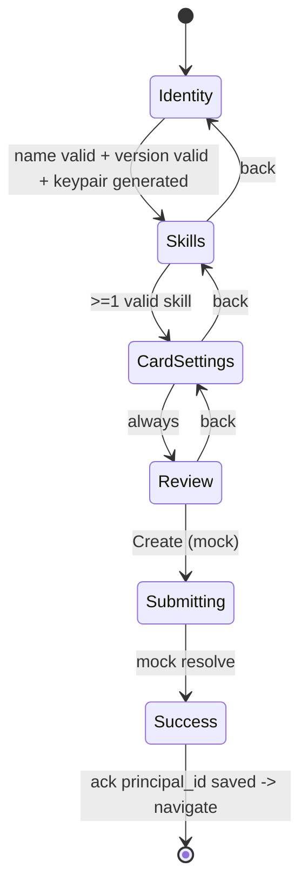

# feat: Create/Add Agent Flow — "New Agent" Wizard

**Target repo:** ACP-TASK (frontend app under `frontend/`)

## Summary

Build a professional, guided **Create/Add Agent** flow at a new route `/agents/new`, reached from the existing "New Agent" buttons on the agents listing. The flow is a multi-step wizard grounded in the real AgentTrust **agent card** model: identity (ed25519 Principal), skills/capabilities, card capability toggles, the required trust extension, and optional bearer security. Identity is a **real client-side ed25519 keypair** (reusing `agentCrypto.generateKeypair()`), so `principal_id = public_key`. Submission is **mock** (no registry call) and ends in a success screen that forces the user to save their `principal_id`, mirroring the existing registration flow. All data is inline/mock, consistent with the rest of the app.

**Product Contract preservation:** N/A — solo plan (`product_contract_source: ce-plan-bootstrap`), no upstream requirements doc.

---

## Problem Frame

The agents listing (`AgentListContent.tsx`) and its header render a "New Agent" button, but it is inert — there is no create-agent screen, so the primary action of the Agents surface dead-ends. Users cannot register a new agent into the ecosystem from the console.

The create flow must be coherent with the domain: an agent is a first-class **Principal** (ed25519 identity) wrapped by an **agent card** (`name`, `description`, `version`, `skills[]`, `capabilities.streaming/pushNotifications`, a declared **trust extension**, and optional `securitySchemes`). The registry's real `POST /agents/register` even **rejects** any card that does not declare the AgentTrust trust extension (`registry/app.py` `card_declares_trust_extension`) — so the UI must treat the trust extension as a required card property, not an optional nicety.

Scope for this plan is the **frontend UI and client-side identity generation only**; real backend registration is deferred.

---

## Scope Boundaries

**In scope**
- New route `frontend/src/app/agents/new/page.tsx` under `AppShell` (session-gated, `active="agents"`).
- Multi-step wizard component `CreateAgentContent.tsx`: Identity → Skills → Card settings → Review & create → Success.
- Real client-side ed25519 keypair generation (`principal_id = public_key`), private key held in-memory only.
- Per-step validation gating, back/next navigation, review summary.
- Mock submission → success screen with a mandatory "save your principal_id" acknowledgment gate, then navigate to the new agent's detail (`/agents/[principal_id]`) or the listing.
- Wire the existing "New Agent" entry points (list view header + grid view header in `AgentListContent.tsx`) to navigate to `/agents/new`.

### Deferred to Follow-Up Work
- Real backend registration: a BFF route `POST /api/agents/register` proxying the registry `POST /agents/register`, and (optionally) persisting the agent's wrapped private key to the vault keyring. The registry endpoint and its trust-extension requirement already exist; only the frontend wiring is deferred.
- Editing / deregistering existing agents (the detail Settings tab already sketches these actions).
- The separate "Import Agents" flow (the second header button).
- Real capability catalog / autocomplete for skill IDs (this plan uses free text with pattern validation).

---

## Requirements

- **R1** — A "New Agent" button on the agents listing navigates to a dedicated create screen at `/agents/new`, rendered inside the standard `AppShell` (session-gated).
- **R2** — The create screen is a guided multi-step wizard with a visible stepper, back/next navigation, and a Cancel affordance that returns to `/agents`; each step validates before advancing and shows inline, field-level error messages that explain what is invalid (a disabled Next is never the only feedback).
- **R3** — Step "Identity" captures `name` (required), `description`, `version` (default `0.1.0`), and a display `type`; it generates a real ed25519 keypair and shows the resulting `principal_id`.
- **R4** — Step "Skills" lets the user add/remove one or more `skills[]` entries, each with `id` (dot-namespaced, pattern-validated), `name`, `description`, and free-form `tags[]`.
- **R5** — Step "Card settings" toggles `capabilities.streaming` and `capabilities.pushNotifications`, always declares the required **trust extension** (surfaced as required, not removable), and optionally enables a bearer `securitySchemes` requirement.
- **R6** — Step "Review" shows the assembled agent card and `created_by` (current session principal), and a Create action performs a **mock** submission.
- **R7** — On success, the user must explicitly acknowledge they have saved their `principal_id` before leaving; the copy must be accurate about what is and isn't preserved (see Open Questions — the private key is discarded in the mock scope). Acknowledgment then navigates to `/agents`.
- **R8** — All styling uses the `--ag2-*` token system and the project's verbose Tailwind idiom, theme-aware (light/dark), matching the other agent components.
- **R9** — The wizard is keyboard- and screen-reader accessible: focus moves to the new step's heading on each transition, the active stepper item is marked `aria-current="step"`, and reused toggles expose `role="switch"` + `aria-checked`.

---

## Key Technical Decisions

- **KTD1 — Single client container holding a wizard state machine.** `CreateAgentContent.tsx` is `"use client"` and owns the full `CreateAgentDraft` plus a `step` enum; each step is a presentational sub-section rendered conditionally and gated by per-step validation. Mirrors the stage-based pattern in `frontend/src/app/register/RegisterForm.tsx`. *(session-settled: user-directed — chosen over a single-page scrollable form: guided UX for a rich domain model.)*
- **KTD2 — Real client-side ed25519 identity.** Reuse `generateKeypair()` / `b64encode` from `frontend/src/lib/agentCrypto.ts`; `principal_id = public_key` (same convention the user register BFF uses). The private key lives only in an in-memory ref and is never persisted (note: unlike `RegisterForm`, which persists a password-wrapped keyring, this mock flow discards the private key — so the save-ack covers only the public `principal_id`; see Open Questions Q1). *(session-settled: user-directed — chosen over a mock `agt_xxx` string: authentic Principal identity.)*
- **KTD3 — Mock submission, no registry call.** The Create action assembles the `agent_card` object in memory and simulates success (brief pending state) without any network request. Real `POST /agents/register` wiring is deferred. *(session-settled: user-directed — mock, per "datos mock inline salvo indicación contraria".)*
- **KTD4 — Trust extension is always declared.** Because the registry's `card_declares_trust_extension` rejects cards lacking the AgentTrust trust extension, the UI presents it as a **required, pre-declared** card property (uri const + `params.principal_id` + `verification_service_url`), shown read-only/required rather than as an optional toggle. Keeps the mock card shape valid for future real wiring.
- **KTD5 — `created_by` from the live session.** Read the current principal via `useSession()` (`frontend/src/lib/SessionProvider.tsx`) for `created_by`; the route sits under `AppShell`, which already gates on session and redirects signed-out users to `/login`, so no extra auth handling is needed.

---

## High-Level Technical Design

Wizard step lifecycle (each forward transition is gated by that step's validation; back transitions are always allowed):



Draft shape assembled across steps (directional, not a spec):

```
CreateAgentDraft {
  identity:   { name, description, version, type, principalId, publicKey }
  skills:     [ { id, name, description, tags[] } ]
  card:       { streaming, pushNotifications, trustExtensionRequired: true, bearerAuth }
  createdBy:  <session.principalId>
}
// on Create -> assemble agent_card { name, description, version,
//   capabilities: { streaming, pushNotifications, extensions:[trust/v1] },
//   skills, securitySchemes? }  (mock, in-memory only)
```

---

## Output Structure

```
frontend/src/
├── app/agents/new/
│   └── page.tsx                         # server route -> AppShell + CreateAgentContent
└── components/agents/
    ├── CreateAgentContent.tsx           # "use client" wizard container + steps
    └── CreateAgentContent.test.tsx      # vitest coverage
```

---

## Implementation Units

### U1. Route + wizard shell and draft state

**Goal:** Stand up `/agents/new` and the wizard container skeleton: step state machine, stepper UI, back/next footer, and the shared `CreateAgentDraft` state — with empty step bodies to be filled by U2–U5.
**Requirements:** R1, R2, R8, R9
**Dependencies:** none
**Files:**
- `frontend/src/app/agents/new/page.tsx` (create)
- `frontend/src/components/agents/CreateAgentContent.tsx` (create)
- `frontend/src/components/agents/CreateAgentContent.test.tsx` (create) — suite scaffolded here, extended incrementally by U2–U5
**Approach:**
- `page.tsx`: server component exporting `metadata` (`title: "New Agent — Console"`), rendering `<AppShell active="agents"><CreateAgentContent /></AppShell>` (no right panel, full-width like the listing). Mirror `frontend/src/app/agents/page.tsx`.
- `CreateAgentContent.tsx`: `"use client"`; `useState<StepKey>` (`identity | skills | card | review | success`) + `useState<CreateAgentDraft>`; a data-driven stepper (numbered pills with active/complete/upcoming styles) and a footer with Back / Next (or Create on review) plus a **Cancel** link that returns to `/agents` (nothing is persisted pre-success, so no confirm dialog). Define `StepKey`, `CreateAgentDraft`, and per-step `isStepValid(step, draft)` locally (types-local convention). Header block reuses the listing's title/subtitle idiom ("Create Agent" + guidance).
- **Validation display:** each step renders inline, field-level error text for invalid inputs (shown on blur and on a Next attempt), so a disabled Next is never the only signal. A small local `errorsFor(step, draft)` helper keeps messages colocated with `isStepValid`.
- **Accessibility (R9):** on each step transition move focus to the step's heading (`<h2 tabIndex={-1}>`), mark the active stepper pill `aria-current="step"`, and give pills accessible labels. Whether the stepper pills are clickable (jump to a completed step) is out of scope — they are display-only for now.
**Patterns to follow:** stage machine in `frontend/src/app/register/RegisterForm.tsx`; layout/tokens in `frontend/src/components/agents/AgentListContent.tsx`; route shape in `frontend/src/app/agents/page.tsx`.
**Test scenarios:**
- Renders the Identity step by default with the stepper showing step 1 active (`aria-current="step"`).
- Next is disabled while the current step is invalid and enabled once valid (drive via a valid Identity draft).
- An invalid input shows inline error text (not just a disabled Next).
- Back from a later step returns to the previous step without losing draft state.
- Cancel navigates to `/agents`.
- Stepper reflects completed vs upcoming steps.
`Execution note:` Build the shell with placeholder step bodies first so navigation/validation gating is verifiable before the step forms land.

### U2. Step 1 — Identity + ed25519 keypair generation

**Goal:** Capture `name`/`description`/`version`/`type` and generate a real ed25519 keypair, exposing `principal_id` (= public key) in the draft and UI.
**Requirements:** R3, R8
**Dependencies:** U1
**Files:**
- `frontend/src/components/agents/CreateAgentContent.tsx` (modify)
**Approach:**
- Inputs bound to `draft.identity`; `version` defaults to `0.1.0`; `type` is a display select (e.g. "AI Agent"). Validation: `name` non-empty; `version` simple semver shape (both surface inline errors per U1's validation-display rule).
- **Keypair generation is a one-time event, not on-entry.** Generate exactly once — on first arrival at the Identity step (or on an explicit action) — set `principalId = b64encode(publicKey)`, and persist both `principalId` and the private-key `useRef` across back/forward navigation so returning to Identity does **not** regenerate (which would silently change the very id the user is about to be forced to save). Provide an explicit **"Regenerate identity"** button gated behind a confirm ("this replaces your current principal_id"). The private key lives only in the in-memory `useRef`, never in draft/state that could be serialized, and **must never be console-logged or included in error/telemetry strings**.
- While generating, show a brief "Generating identity…" state for the `principal_id` readout and keep Next blocked until `principalId` is populated; an (unlikely) generation error surfaces an inline retry. On success show `principal_id` read-only (mono) with `key_algorithm: ed25519` fixed.
**Patterns to follow:** keypair usage in `frontend/src/app/register/RegisterForm.tsx` (`generateKeypair`, `b64encode`, in-memory ref for the private key).
**Test scenarios:**
- Entering a name enables advancing; empty/whitespace name blocks it (with inline error).
- Invalid version string (e.g. `abc`) blocks advancing; `0.1.0` passes.
- A `principal_id` is generated and displayed once; navigating away and Back to Identity does **not** change it.
- The explicit Regenerate action (after confirm) yields a different `principal_id`.
- The private key is never written into the serializable draft (assert draft/state shape excludes it) and is not passed to `console.*`.

### U3. Step 2 — Skills / capabilities editor

**Goal:** Add/remove `skills[]` rows with `id`, `name`, `description`, and `tags[]`, validating the dot-namespaced capability id.
**Requirements:** R4, R8
**Dependencies:** U1
**Files:**
- `frontend/src/components/agents/CreateAgentContent.tsx` (modify)
**Approach:**
- Repeating skill rows with add/remove controls. **Entry/empty state:** the step opens with one empty skill row expanded; when the user removes the last row, show an empty-state block ("Add at least one skill to continue") with an Add-skill button, and keep Next blocked.
- **Tags are a chip input** (not free text): type + Enter/comma commits a tag, backspace/× removes the last/target tag, values are trimmed, de-duplicated, and empties dropped. (Resolves the read-side "render as chips" expectation.)
- Validate each `id` against the dot-namespaced pattern from `schemas/capability.schema.json` — `^[a-z0-9][a-z0-9_-]*(\.[a-z0-9][a-z0-9_-]*)+$` (allows `_`/`-` within segments; do not use a stricter regex that rejects valid ids); require `name`. Invalid ids surface inline errors. Step is valid when ≥1 skill is fully valid.
**Patterns to follow:** chip/tag rendering in `frontend/src/components/agents/AgentCapabilitiesTab.tsx`; repeating-row list idioms in the agent tabs.
**Test scenarios:**
- The step opens with one empty skill row; removing all rows shows the empty state and blocks Next.
- Adding a valid skill (`terraform.generate`, name set) enables advancing.
- A skill id without a namespace dot (`terraform`) is flagged invalid (inline error) and blocks advancing.
- A skill id using an underscore/hyphen segment (`gig-board.gigs`) is accepted (regex parity with the schema).
- Removing the last valid skill re-blocks advancing.
- Chip input: Enter/comma commits a trimmed tag, duplicates and empties are dropped, × removes a tag; tags render as chips.

### U4. Step 3 — Card settings (capabilities, trust extension, security)

**Goal:** Toggle `capabilities.streaming` and `pushNotifications`, present the required trust extension, and optionally require bearer `securitySchemes`.
**Requirements:** R5, R8
**Dependencies:** U1
**Files:**
- `frontend/src/components/agents/CreateAgentContent.tsx` (modify)
**Approach:**
- Reimplement a Toggle affordance in the same style as `frontend/src/components/agents/AgentSettingsTab.tsx` (its `Toggle`/`ToggleRow` are module-local and not exported — either copy the pattern or first extract them into a shared component; do not assume an import path). Toggles expose `role="switch"` + `aria-checked` (R9). `streaming`/`pushNotifications`/`bearerAuth` are user toggles. The **trust extension** row is rendered as required/enabled and non-removable, with a short explanation that the registry requires it (KTD4). This step is always valid (all-optional except the fixed trust extension).
**Patterns to follow:** `Toggle` / `ToggleRow` style in `frontend/src/components/agents/AgentSettingsTab.tsx` (reimplement or extract; not currently exported).
**Test scenarios:**
- Toggling streaming/push/bearer updates the draft.
- The trust extension control is present and cannot be disabled/removed.
- Advancing is always permitted from this step regardless of toggle states.

### U5. Step 4 — Review & create + Success screen

**Goal:** Show the assembled agent card and `created_by`, perform a mock create with a brief pending state, then a success screen that gates navigation on a "saved my principal_id" acknowledgment.
**Requirements:** R6, R7, R8
**Dependencies:** U2, U3, U4
**Files:**
- `frontend/src/components/agents/CreateAgentContent.tsx` (modify)
**Approach:**
- Review renders a read-only summary: identity, `principal_id`, `created_by` (from `useSession()`), skills chips, card toggles, trust extension, security. Create button assembles the mock `agent_card` object (including `capabilities.extensions:[trust/v1]`), sets a short `submitting` state, then transitions to `success` (no network).
- Success screen shows the `principal_id` with a **copy affordance that gives transient feedback** (on click, copy to clipboard and swap the label to "Copied" for ~2s with an `aria-live` announcement, then revert), and a required checkbox/ack that must be checked before Continue enables. The ack copy must be accurate for the mock scope — it acknowledges the generated `principal_id`, and must **not** imply the agent's identity/private key is preserved (see Open Questions Q1). Continue navigates via `useRouter().push` to **`/agents`** — not `/agents/[principal_id]`, because that detail route renders a static, non-id-keyed mock (`AgentContent` hardcodes "DevOps Agent") and the mock-created agent exists in no store, so a per-id detail would be misleading.
**Patterns to follow:** success/acknowledgment gate in `frontend/src/app/register/RegisterForm.tsx`; summary/list idioms in the agent tabs.
**Test scenarios:**
- Review reflects values entered in earlier steps, including `created_by` from the session (null-guard `session?.principalId`).
- Create transitions to a submitting state then to success without a network call.
- The copy affordance shows a transient "Copied" confirmation.
- Continue is disabled until the save-ack is checked; checking it enables Continue.
- Continue navigates to `/agents`.
`Execution note:` Assert the mock nature — spy on `fetch` to confirm no request is issued on Create.

### U6. Wire "New Agent" entry points

**Goal:** Make the existing "New Agent" buttons navigate to `/agents/new`.
**Requirements:** R1
**Dependencies:** U1
**Files:**
- `frontend/src/components/agents/AgentListContent.tsx` (modify)
**Approach:**
- Replace the inert "New Agent" `<button>` in both the list-view and grid-view headers with a Next `<Link href="/agents/new">` styled identically (preserve the `#5D20DC` purple pill). Leave "Import Agents" inert (deferred).
**Patterns to follow:** `Link` usage in `frontend/src/components/agents/AgentListContent.tsx` (row links) and `frontend/src/components/shell/Sidebar.tsx`.
**Test scenarios:**
- The "New Agent" control renders as a link whose href is `/agents/new`.
- `Test expectation:` styling parity is visual-only; covered by the href assertion plus manual check.

---

## Verification Contract

- `npx tsc --noEmit` passes with no new errors.
- `npx eslint src/components/agents/ src/app/agents/` passes clean.
- `npm test` — `CreateAgentContent.test.tsx` passes, covering step gating, keypair generation, skill validation, mock submit, and the save-ack navigation gate.
- Manual: from `/agents`, clicking "New Agent" opens `/agents/new`; completing the wizard reaches a success screen showing a generated `principal_id`; acknowledging navigates back to `/agents`. Verify keyboard navigation through the steps and both light and dark themes.

## Definition of Done

- All six units implemented; `/agents/new` renders under `AppShell` and is session-gated.
- Wizard completes end-to-end with a real ed25519 `principal_id`, mock submission, and the enforced save-ack.
- "New Agent" buttons navigate to the flow.
- Typecheck, lint, and the new test file are green; styling matches the `--ag2-*` system in both themes.

---

## Open Questions

- **Q1 — Save-ack semantics vs. discarded private key.** The success ack tells the user the identity "cannot be recovered", but in the settled mock scope (KTD2 real keypair + KTD3 no persistence) only the **public** `principal_id` is surfaced; the real ed25519 private key that controls the identity is held in a ref and discarded on navigation. Unlike `RegisterForm` — which persists a password-wrapped keyring so the key *is* recoverable — this flow saves only a public label. **Decision needed:** (a) keep the real keypair but make the ack copy honest ("this is a demo identity; private-key export/keyring arrives with real registration"), or (b) add a password-wrapped export/keyring path now (larger scope, closer to RegisterForm). Recommended: (a) for this mock milestone, and revisit at the deferred `POST /agents/register` wiring. This plan currently assumes (a) — see R7 and U5.
- **Q2 — Post-reload recovery.** If the user reloads on the success screen, the in-memory private key is gone and the mock agent exists nowhere; the ack is the only safeguard. Acceptable for the mock scope; revisit with real wiring.

---

## Risks & Dependencies

- **Private-key handling.** The private key must stay in an in-memory ref and never enter serializable state, storage, or logs (unlike registration, this flow does not persist a keyring). Mitigation: assert its absence from draft/state and from `console.*` in tests (U2).
- **Future real wiring shape.** Keeping the mock `agent_card` object shaped exactly as the registry expects (trust extension declared, `skills[].id` present) de-risks the deferred `POST /agents/register` wiring. Mitigation: KTD4 keeps the card valid by construction.
- **Capability id pattern drift.** The UI regex should track `schemas/capability.schema.json`; if the backend pattern differs, validation could reject valid ids. Low impact in mock mode; revisit when wiring real registration.

---

## Sources & Research

- Frontend architecture (mock-data verdict, BFF routes, session, `--ag2-*` tokens, component conventions): prior repo exploration this session.
- Domain model (agent card, `skills[]`, capability schema, trust extension requirement, Principal/ed25519): `registry/app.py` (`POST /agents/register`, `card_declares_trust_extension`), `registry/agent_index.py` (`register_agent`), `schemas/capability.schema.json`, `schemas/principal.schema.json`, `schemas/a2a-extension-descriptor.schema.json`.
- Reusable frontend building blocks: `frontend/src/lib/agentCrypto.ts` (`generateKeypair`, `b64encode`), `frontend/src/app/register/RegisterForm.tsx` (stage machine + save-ack), `frontend/src/lib/SessionProvider.tsx` (`useSession`), `frontend/src/components/agents/AgentSettingsTab.tsx` (Toggle), `frontend/src/components/agents/AgentListContent.tsx` (entry points, tokens).
