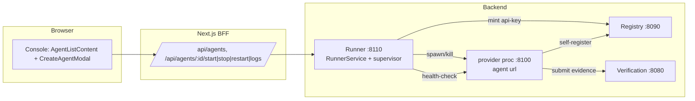
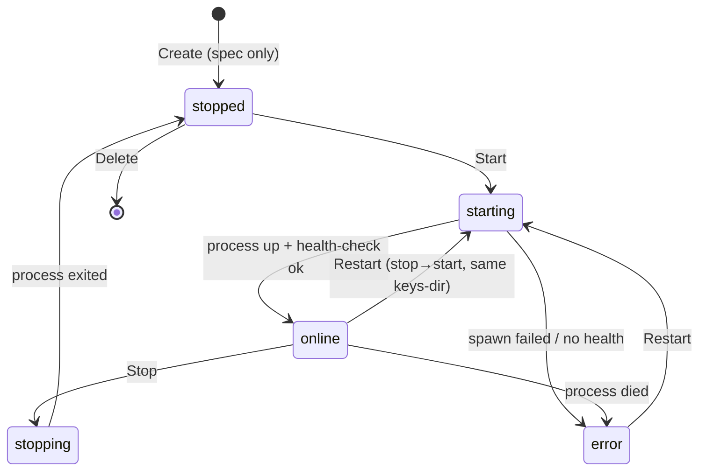
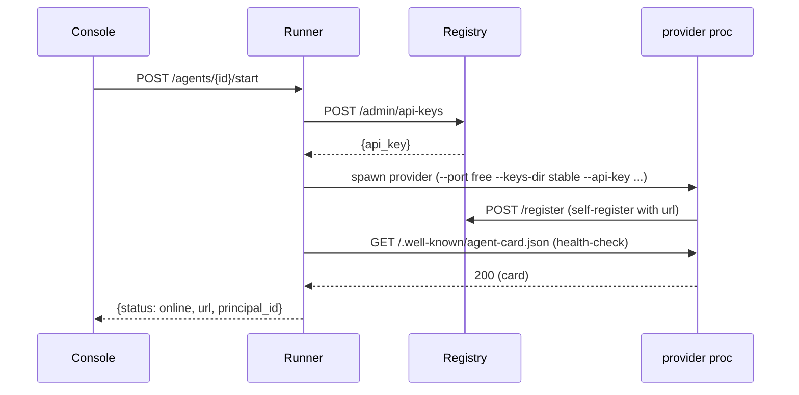

# feat: Agent Runtime Lifecycle from the Console

**Target repo:** ACP-TASK (Python backend at repo root; Next.js frontend under `frontend/`)

## Summary

Close the gap between **registering** an agent (a passive directory card) and **running** one (a live A2A process). Introduce a new backend **runner** service — a managed subprocess supervisor — that owns an agent's ed25519 identity and its process lifecycle. From the console the user goes **Create** (define a spec: name, capabilities, template, pricing) → **Deploy/Start** (the runner mints+persists the keypair and launches the real `agents/provider/agent.py`, which self-registers with a live `url`) → **Online** (the console shows real status via a health-check to that `url`) → **Manage** (Stop / Restart / Logs, with a Scale placeholder). The console's agent list and status become **runner-backed** (the runner is the lifecycle source of truth); the registry stays the discovery layer that running agents self-register into.

Scope is **local-dev, managed subprocess** — no containers/K8s, no production spawn hardening (both deferred).

---

## Problem Frame

Today "Create Agent" writes a directory card via the registry's `POST /agents/register` (U5 `agent_index`) and stops there: no process runs, the card has no endpoint, and the console's client-generated private key is discarded. Meanwhile a *real* agent is a running process (`agents/provider/agent.py`) that exposes a `url`, speaks A2A (`task.request → task.offer → task.counter → task.accept → task.result`), self-registers as a U4 card (`POST /register` → `/search`), and accrues reputation via independent verification. These are **two different registration indexes** and there is no bridge, so the console can't reflect which agents actually run.

This plan makes the console able to *deploy and operate* real agents without a terminal. The runner becomes the control-plane backend the console talks to for the agent list, status, and lifecycle actions; the running agents remain ordinary protocol participants that self-register into the registry for discovery.

Verified this session: registry runs on `:8090` (`GET /agents` → `list_all_agents`; `POST /agents/register`; `POST /admin/api-keys` mints invite keys; running providers appear in `/search`). Verification service on `:8080`. A provider runs with `python -m agents.provider.agent --port P --verification-url U --registry-url R --api-key K --keys-dir D --list-price X --min-price Y` and self-registers on start. Running two providers + the one-shot requester completed a full verified task end to end.

---

## Scope Boundaries

**In scope**
- New backend **runner** service (stdlib HTTP, like `registry/app.py`) on a new port (default `:8110`): agent-definition store (with on-disk persistence), process supervisor, health-checked status, logs.
- Runner owns identity: a stable per-agent `keys-dir` so the launched provider reuses the SAME ed25519 keypair across Start/Stop/Restart (persistent `principal_id`).
- One runtime **template** to start: `terraform-provider` → launches `agents/provider/agent.py`.
- BFF routes repointed/added: `GET/POST /api/agents`, `GET /api/agents/[id]`, `POST /api/agents/[id]/{start,stop,restart}`, `GET /api/agents/[id]/logs`, plus `getRunnerUrl()`.
- Console: Create-as-spec (drop the discarded client keypair), runner-backed list with **real** Online/Offline/Error status, Start/Stop/Restart controls, a Logs viewer, and status polling. Scale is a disabled placeholder.

### Deferred to Follow-Up Work
- Containerized/K8s/serverless runtimes; multi-host scaling; the real "Scale" action.
- Production spawn security (sandboxing, resource limits, auth on the runner, multi-tenant isolation).
- Additional templates and bring-your-own-code / connect-existing-endpoint (BYO `url`).
- Re-adopting live child processes after a runner restart (MVP: they show as `stopped`).
- Reworking the agent **detail** route (`/agents/[id]`, currently a static mock) to show live lifecycle.

---

## Requirements

- **R1** — A new runner service manages agent **definitions** (create/list/get/delete) and persists them to disk so they survive a runner restart (listed as `stopped`).
- **R2** — "Create" in the console defines a spec — name, description, version, **template**, capabilities (from `frontend/src/data/capabilities.ts`), and pricing (`list_price`, `min_price`) — and does **not** generate or discard a client-side keypair.
- **R3** — "Start/Deploy" makes the runner mint (or reuse) a persistent ed25519 identity in a per-agent `keys-dir`, obtain a registry invite api-key, assign a free port, and launch the template's process, which self-registers with its live `url`.
- **R4** — Stopping an agent terminates its process; restarting reuses the **same** `keys-dir` (same `principal_id`); a stopped/crashed agent is distinguishable from a running one.
- **R5** — The console shows **real** status per agent — `online` (process alive AND health-check to its `url` passes), `offline`/`stopped`, `error`/`crashed` — not a constant label.
- **R6** — The console can view an agent's recent **logs**.
- **R7** — The console's agent list and status are sourced from the **runner** (lifecycle source of truth); the registry remains the discovery index that running agents self-register into.
- **R8** — Start/Stop/Restart actions are available per agent; Scale is present but disabled (placeholder).
- **R9** — The runner binds to localhost and treats spawning as dev-only; command arguments come from validated template config, never raw user strings.

---

## Key Technical Decisions

- **KTD1 — A managed-subprocess runner service is the control plane for agent lifecycle.** New stdlib-HTTP service `runner/app.py` (mirroring `registry/app.py`'s structure: a `RunnerService` with pure logic + a thin HTTP layer) supervises `agents/provider` child processes. *(session-settled: user-directed — chosen over Docker/K8s or serverless: local-dev MVP, smallest path to a working end-to-end lifecycle.)*
- **KTD2 — The runner owns identity via a stable per-agent `keys-dir`.** "Create" stores a spec with no keypair; on first Start the provider generates its ed25519 keypair *inside the runner-assigned `keys-dir`* and reuses it on every subsequent Start (stable `principal_id`). This resolves the discarded-private-key problem and makes identity coherent across restarts. *(session-settled: user-directed — chosen over client-side keypair in the modal: the modal discards the private key, breaking identity.)*
- **KTD3 — The console lists agents from the runner, not the registry.** `GET /api/agents` is repointed from the registry to the runner so the list reflects **managed, real-status** agents. The registry `list_all_agents` / `/search` stays the discovery layer for protocol participants. *(session-settled: user-directed — chosen over listing registry U5 cards: passive cards don't reflect who actually runs.)*
- **KTD4 — Status is computed live, not stored.** The runner derives status from (process liveness) AND (a health-check GET to the agent's `url`, e.g. `/.well-known/agent-card.json`). No persisted "online" flag to drift. Surfaced to the console; polled while any agent is transitioning.
- **KTD5 — Behavior comes from a named template.** MVP ships one template, `terraform-provider`, that declares its real capability (`terraform.generate`) and builds the `agents.provider.agent` launch command. The 225-entry capability catalog is *advertised* metadata; only template-backed skills actually execute. New templates and BYO-code are follow-ups.
- **KTD6 — The runner mints its own registry invite keys.** On Start the runner calls the registry `POST /admin/api-keys` to obtain the api-key the provider needs to self-register (avoids manual key handling). Dev-only; production would gate `/admin/api-keys`.

---

## High-Level Technical Design

**Components and who talks to whom** (the console never spawns processes; it asks the runner):



**Agent lifecycle state machine** (the runner tracks this per agent):



**Deploy sequence** (Start):



Runner agent-definition shape (directional, not a spec):

```
AgentDef {
  id, name, description, version, template,
  capabilities: [ids], list_price, min_price,
  keys_dir, log_path,
  runtime: { pid?, port?, url?, principal_id?, status, started_at? }
}
```

---

## Output Structure

```
runner/
├── __init__.py
├── app.py                 # RunnerService (pure logic) + stdlib HTTP layer + __main__
├── store.py               # AgentDef store with JSON persistence
├── supervisor.py          # subprocess spawn/kill/liveness + port allocation + log capture
└── templates.py           # template registry (terraform-provider → launch command + capability)

tests/runner/
├── test_definitions.py    # create/list/get/delete + persistence
├── test_supervisor.py     # start/stop/restart lifecycle + status + logs (stub/echo process)
└── test_templates.py      # template → command building + validation

frontend/src/
├── app/api/agents/
│   ├── route.ts                       # GET (list, → runner) + POST (create def, → runner)
│   └── [id]/
│       ├── route.ts                   # GET one, DELETE
│       ├── start/route.ts             # POST → runner start
│       ├── stop/route.ts              # POST → runner stop
│       ├── restart/route.ts           # POST → runner restart
│       └── logs/route.ts              # GET → runner logs
├── lib/backendConfig.ts               # + getRunnerUrl()
└── components/agents/
    ├── CreateAgentModal.tsx           # rework: spec-only (template + pricing), drop keypair
    ├── AgentListContent.tsx           # runner-backed list + real status + Start/Stop/Restart + polling
    └── AgentLogsModal.tsx             # logs viewer
```

---

## Implementation Units

### U1. Runner service scaffold + agent-definition store

**Goal:** Stand up `runner/app.py` (`RunnerService` + stdlib HTTP + `--port` default 8110, `--registry-url`, `--verification-url`, `--data-dir`) with CRUD over agent **definitions**, persisted to disk. No process spawning yet.
**Requirements:** R1, R7, R9
**Dependencies:** none
**Files:** `runner/__init__.py`, `runner/app.py`, `runner/store.py`, `tests/runner/test_definitions.py`
**Approach:** Mirror `registry/app.py` structure — a pure `RunnerService` holding a `DefinitionStore`, plus a thin `ThreadingHTTPServer` handler. `POST /agents` validates {name, template, capabilities (non-empty), list_price, min_price} and returns a definition with `status: "stopped"` and an assigned `keys_dir`/`log_path` under `--data-dir`. `GET /agents` / `GET /agents/{id}` / `DELETE /agents/{id}`. `store.py` persists definitions as JSON to `--data-dir` and reloads on boot. Bind to `127.0.0.1`.
**Patterns to follow:** `registry/app.py` (`RegistryService`, handler, `__main__`), `registry/agent_index.py` (in-memory dict + lock), `registry/index_store.py` for any on-disk persistence pattern.
**Test scenarios:** create returns a stopped def with a stable id + keys_dir; list/get/delete round-trip; missing/empty capabilities or unknown template → 422; invalid price (non-numeric, min > list) → 422; definitions reload from disk on a fresh `RunnerService` pointed at the same data-dir.
**Verification:** `tests/runner/test_definitions.py` green; `GET /healthz` 200; a created definition survives a service restart as `stopped`.

### U2. Template registry + launch-command builder

**Goal:** Define the `terraform-provider` template: its real capability (`terraform.generate`), and a validated builder that produces the `agents.provider.agent` argv from a definition + assigned port + api-key + keys-dir.
**Requirements:** R3, R5 (declares capability), R9
**Dependencies:** U1
**Files:** `runner/templates.py`, `tests/runner/test_templates.py`
**Approach:** A small registry `{ "terraform-provider": Template(...) }`. `build_command(defn, port, api_key)` returns an argv list (never a shell string) for `python -m agents.provider.agent --port <port> --verification-url <ver> --registry-url <reg> --api-key <key> --keys-dir <defn.keys_dir> --list-price <n> --min-price <n>`. Prices/ports are numeric-validated; the template controls the executable, so no raw user string reaches the command (R9).
**Patterns to follow:** the provider CLI in `agents/provider/agent.py` (`--port/--verification-url/--registry-url/--api-key/--keys-dir/--list-price/--min-price`).
**Test scenarios:** builder emits the expected argv for a valid def; unknown template → error; non-numeric/negative price rejected; argv is a list of strings (no shell interpolation); the declared capability is `terraform.generate`.
**Verification:** `tests/runner/test_templates.py` green.

### U3. Process supervisor: start / stop / restart + status + logs

**Goal:** Spawn/track/kill provider child processes with per-agent keys-dir and captured logs; mint the registry api-key on start; assign a free port; expose lifecycle + status + logs endpoints.
**Requirements:** R3, R4, R5, R6, R8, KTD2, KTD4, KTD6
**Dependencies:** U1, U2
**Files:** `runner/supervisor.py`, `runner/app.py` (add endpoints), `tests/runner/test_supervisor.py`
**Approach:** `POST /agents/{id}/start` → mint api-key (`POST {registry}/admin/api-keys`), allocate a free localhost port, spawn via the template argv with stdout/stderr redirected to `log_path`, record `pid/port/url`, set `status: starting`. `stop` terminates the process (SIGTERM→SIGKILL fallback) → `stopped`. `restart` = stop then start with the **same keys-dir** (stable `principal_id`). `GET /agents/{id}` computes live status: process alive AND a short health-check GET to the agent's `url` (`/.well-known/agent-card.json`) → `online`; process dead → `error` (unexpected) or `stopped`. `GET /agents/{id}/logs?tail=N` returns recent log lines. Keys persist in keys-dir so the identity is stable (see U8).
**Execution note:** Use a stub/echo executable (not the real provider) in tests so lifecycle/status/log capture is exercised deterministically without network; keep the real provider for manual/e2e verification.
**Patterns to follow:** `agents/provider/agent.py` self-registration + `/.well-known/agent-card.json`; existing services' health endpoints.
**Test scenarios:** start spawns a process and reports `online` once healthy (stub returns a card); stop terminates it → `stopped`; a crashed process surfaces `error`, not `online`; restart reuses the same keys-dir; two agents get distinct ports (no collision); logs endpoint returns captured stdout; start twice is idempotent/refused while running; port cleaned up on stop.
**Verification:** `tests/runner/test_supervisor.py` green; manual: start a real `terraform-provider`, confirm it appears in the registry `/search` and health-check passes.

### U4. BFF routes: repoint list + create, add lifecycle + logs

**Goal:** Point the console's agent API at the runner and add lifecycle/logs proxies.
**Requirements:** R2, R6, R7, R8
**Dependencies:** U3
**Files:** `frontend/src/lib/backendConfig.ts` (add `getRunnerUrl()`), `frontend/src/app/api/agents/route.ts` (repoint GET→runner list, POST→runner create-def), `frontend/src/app/api/agents/[id]/route.ts` (GET/DELETE), `frontend/src/app/api/agents/[id]/start/route.ts`, `.../stop/route.ts`, `.../restart/route.ts`, `.../logs/route.ts`, co-located `.test.ts` files
**Approach:** `getRunnerUrl()` reads `process.env.RUNNER_URL` (default `http://127.0.0.1:8110`), mirroring `getRegistryUrl`. Each route is a thin proxy mirroring `frontend/src/app/api/agents/register/route.ts` (byte/JSON forward, 502 on unreachable). Repoint `GET /api/agents` and `POST /api/agents` to the runner; the old `POST /api/agents/register` (→ registry) is superseded — remove or leave unused and note it.
**Patterns to follow:** `frontend/src/app/api/agents/register/route.ts`, `frontend/src/app/api/agents/route.ts`, `frontend/src/lib/backendConfig.ts`.
**Test scenarios:** GET proxies runner list and forwards status/body; POST forwards the create-def body; start/stop/restart POST to the right runner path; logs GET forwards; runner-unreachable → 502 `{error}`; each route has a co-located test like the existing BFF routes.
**Verification:** BFF route tests green; `tsc`/`eslint` clean.

### U5. CreateAgentModal rework — define a spec, not an identity

**Goal:** Turn creation into spec definition: name, description, version, **template**, capabilities, and **pricing** — dropping the client-side ed25519 keypair generation and the "save your principal_id" success gate.
**Requirements:** R2, KTD2
**Dependencies:** U4
**Files:** `frontend/src/components/agents/CreateAgentModal.tsx`, `frontend/src/components/agents/CreateAgentModal.test.tsx`
**Approach:** Remove the Identity keypair step's key generation (`generateKeypair`, the private-key ref, the success save-ack). Replace the Identity step with basics (name/description/version) + a **Template** selector (MVP: `terraform-provider`, showing its real capability) + **pricing** inputs (`list_price`/`min_price`, numeric-validated). Keep the capability-table picker (advertised capabilities). Create posts to `POST /api/agents` and closes; a "Deploy now" affordance may immediately call Start (U6) or leave it `stopped`. Success screen becomes "Agent created (stopped) — Start it to go live", no principal_id gate (identity is assigned at Deploy by the runner).
**Patterns to follow:** existing `CreateAgentModal` wizard/stepper, toggle, and capability picker; validation-display pattern already in the modal.
**Test scenarios:** no keypair is generated and no private-key ref exists; create posts {name, template, capabilities, list_price, min_price} to `/api/agents`; invalid pricing (min > list, non-numeric) blocks advancing with inline errors; template selector defaults to `terraform-provider` and drives the declared capability; success state says the agent is stopped and offers Start; `fetch` is called with `/api/agents` on create.
**Verification:** `CreateAgentModal.test.tsx` green; `tsc`/`eslint` clean.

### U6. AgentListContent — runner-backed list, real status, lifecycle controls

**Goal:** List managed agents from the runner with real Online/Offline/Error status and per-row Start/Stop/Restart; poll while any agent is transitioning.
**Requirements:** R5, R7, R8
**Dependencies:** U4
**Files:** `frontend/src/components/agents/AgentListContent.tsx`, `frontend/src/components/agents/AgentListContent.test.tsx` (new)
**Approach:** Fetch `GET /api/agents` (now runner-shaped: definitions + runtime status). Map the Status column to real `online`/`stopped`/`error` (colored dot + label) instead of a constant "Active". Add Start/Stop/Restart controls per row (and/or in a row menu) that POST to the lifecycle routes then refetch. Poll (e.g. every ~3s) while any agent is `starting`; stop polling when settled. Keep the existing capability chips, owner, and reputation-derived graphics where the runner surfaces them (principal_id/url appear once running); Scale is a disabled control. Preserve loading/empty/error states.
**Execution note:** Guard the polling effect against the `set-state-in-effect` rule as done previously (fetch core sets state only after await); clear the interval on unmount.
**Patterns to follow:** current `AgentListContent` fetch/loading/empty/error + `--ag2-*` table; the sparkline/stars/status idioms already there.
**Test scenarios:** renders runner agents with correct status dots; clicking Start posts to `/api/agents/{id}/start` and refetches; Stop/Restart likewise; an `error` agent shows the error state; empty list shows the empty state with a Create CTA; polling starts when an agent is `starting` and stops when none are; Scale control is disabled.
**Verification:** `AgentListContent.test.tsx` green; `tsc`/`eslint` clean; manual: Start an agent from the UI and watch it flip to Online.

### U7. Agent logs viewer

**Goal:** Let the user view an agent's recent logs from the console.
**Requirements:** R6
**Dependencies:** U4, U6
**Files:** `frontend/src/components/agents/AgentLogsModal.tsx`, `frontend/src/components/agents/AgentLogsModal.test.tsx`, wire a "Logs" action in `AgentListContent.tsx`
**Approach:** A modal (reuse the modal shell pattern from `CreateAgentModal`) that fetches `GET /api/agents/{id}/logs?tail=N`, renders mono log lines in a scrollable box, with a Refresh and optional auto-tail. Empty/error states.
**Patterns to follow:** `CreateAgentModal` overlay/dialog shell; mono/scroll list idioms.
**Test scenarios:** opening fetches logs and renders lines; Refresh refetches; empty logs show an empty state; a fetch error shows an error with retry; Escape/close works.
**Verification:** `AgentLogsModal.test.tsx` green; `tsc`/`eslint` clean.

### U8. Persistent identity across restarts (provider keys-dir reuse)

**Goal:** Guarantee an agent keeps the **same** `principal_id` across Stop/Start/Restart by reusing its keys-dir.
**Requirements:** R3, R4, KTD2
**Dependencies:** U3
**Files:** `agents/provider/agent.py` (only if it does not already reuse keys-dir), `tests/runner/test_supervisor.py` (add identity-stability assertion), possibly `tests/agents/` for a provider-key-reuse unit
**Approach:** Confirm the provider's `--keys-dir` behavior loads an existing keypair when present and only generates when absent (the runbook says it generates locally, git-ignored — verify reuse). If it regenerates every start, make it load-if-exists-else-generate. The runner already assigns a stable per-agent keys-dir (U3), so with reuse the `principal_id` is stable.
**Execution note:** Start with a failing test asserting identity stability (start → capture principal_id → stop → start → same principal_id) before touching the provider.
**Test scenarios:** Covers R4. start→stop→start yields the same `principal_id`; a fresh keys-dir yields a new one; deleting the definition (and its keys-dir) makes the next Start mint a new identity.
**Verification:** identity-stability test green; manual: restart a deployed agent and confirm the registry shows the same principal.

---

## Verification Contract

- Backend: `python3 -m pytest tests/runner/ -q` green; existing `tests/registry/` still green.
- Frontend: `npx tsc --noEmit` clean; `npx eslint src/components/agents/ src/app/api/agents/` clean; `npm test` green (new/updated modal, list, logs tests).
- Manual end-to-end (local): start registry (`:8090`), verification (`:8080`), runner (`:8110`); in the console Create a `terraform-provider` agent, click Start, watch it flip to **Online**; confirm it appears in the registry `/search?capability=terraform.generate`; run the requester and confirm a verified task; view Logs; Stop → status Offline; Restart → same `principal_id`.

## Definition of Done

- Runner service supervises provider subprocesses with persistent per-agent identity, health-checked status, and logs.
- Console: Create defines a spec (no discarded keypair); the list is runner-backed with real status; Start/Stop/Restart and Logs work; Scale is a visible placeholder.
- BFF routes proxy the runner; `getRunnerUrl()` added.
- All Verification Contract gates pass; manual end-to-end lifecycle demonstrated.

---

## Risks & Dependencies

- **Spawning processes from a web-triggered backend is dangerous.** Mitigation (dev-only): runner binds to localhost; only template-controlled executables run; all command args are validated/numeric; no raw user string enters the command (R9, KTD5). Production hardening (auth, sandbox, limits) is explicitly deferred.
- **Provider may regenerate keys each start** → identity would churn. Mitigation: U8 verifies/enforces keys-dir reuse before relying on stable `principal_id`.
- **Orphaned processes on runner restart.** MVP: child processes die with the runner (or are left untracked); on restart, agents show `stopped` and can be re-Started. Re-adoption via pid files is deferred — note it, don't silently imply persistence.
- **Port exhaustion / collisions.** Allocate from a bounded localhost range and release on stop; test distinct-port assignment (U3).
- **Two indexes (U4 registry card vs U5 principal vs runner def).** The runner is the console's source of truth; the registry remains discovery. Keep the mapping explicit (the runner records the running agent's `principal_id`/`url`); do not try to unify the registry indexes in this plan.
- **Dependency:** the registry `POST /admin/api-keys` must be reachable from the runner (KTD6); the registry and verification service must be running for a deployed agent to self-register and complete verified tasks.

---

## Open Questions

- **Q1 — Should Create auto-Deploy or leave the agent stopped?** Default assumption: Create leaves it `stopped` with a Start affordance (clean separation of spec vs deploy); a "Deploy now" shortcut is optional. Revisit if users expect one-click create+run.
- **Q2 — Capability honesty.** The catalog advertises 225 capabilities but only the template's real skill (`terraform.generate`) executes. Do we constrain the picker to template-supported skills, or clearly label advertised-vs-executing? Assumption: label it; constrain in a later multi-template iteration.

---

## Sources & Research

- Runtime + protocol (verified this session): `agents/provider/agent.py` (CLI, `agent_card()` with `url`, `register_with_registry` via `POST /register`, `handle_payload` task lifecycle, `/.well-known/agent-card.json`), `docs/demo-runbook.md` (exact run commands, ports 8080/8090/8100, `POST /admin/api-keys`).
- Registry: `registry/app.py` (`list_all_agents`, `register_agent`, `/search`, `/admin/api-keys`, stdlib HTTP structure), `registry/agent_index.py`.
- Frontend integration points: `frontend/src/lib/backendConfig.ts`, `frontend/src/app/api/agents/route.ts`, `frontend/src/app/api/agents/register/route.ts`, `frontend/src/components/agents/CreateAgentModal.tsx`, `frontend/src/components/agents/AgentListContent.tsx`, `frontend/src/data/capabilities.ts`.
