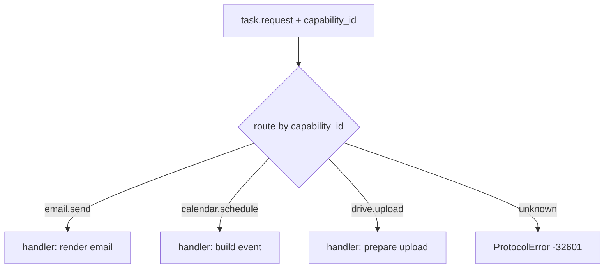

# feat: Side-effecting agents — secure Google execution, agent collaboration, multi-capability

## Summary

Today a Tessera agent can only *produce artifacts* (e.g. a Terraform file it returns inline). It cannot perform **real-world side-effecting actions** — send an email, schedule a Google Calendar/Meet meeting, upload to Drive — because five capabilities are missing: (1) no secure OAuth custody or brokered provider-access path; (2) the protocol and SDK are single-capability and cannot sustain structured multi-turn needs; (3) evidence only models artifact hashes, not task-bound action attestations; (4) the orchestrator cannot decompose and continue chained sub-tasks; (5) there are no durable safety controls for irreversible actions.

This plan builds all five, **phased**, on the existing base (identity + signature challenge, Registry discovery, negotiation, the vault, the approval gate, and the verification/reputation service). The centerpiece of Phase 1 is a complete, user-facing **"Connect Google"** flow: the *user* authorizes their own Google account once via OAuth; the refresh token enters a server-managed, KMS-backed OAuth custody mode; and from then on privileged work runs **on the user's behalf** without exposing Google tokens to an agent.

The credential broker is built **provider-agnostic** with **Google as the first concrete connector**, so Microsoft/Slack can be added later without re-architecting.

**Two facts corrected after review, load-bearing for execution:**
- The **SDK is an external package** — `treessera` (repo `github.com/reymanuel010899/treessera-python`, PyPI `treessera`), which imports nothing from this monorepo. SDK-side changes ship as **treessera releases the monorepo then pins** — they are NOT edits under `sdk/` here. `libs/config.py` already reads `TREESSERA_URI`, so no URI consolidation is needed.
- For any operation using a user's connected account, the design is **broker-mediated execution** (KTD8): the discovered agent understands the task, asks for missing information, and prepares or requests the action; Tessera authorizes it and calls the provider API. A possibly-untrusted agent never receives a Google bearer token. This closes both the approved-action gap for writes and the scope/TTL gap for reads.

---

## Goal Capsule

**For** a Tessera user who wants agents to do real work in their Google account,
**the** platform will let them connect their Google account once and then delegate
side-effecting tasks (email, calendar, Drive) to Verified agents,
**so that** actions run on their behalf with least-privilege, time-boxed, approved
credentials and produce independently-verifiable receipts —
**unlike today**, where agents can only return inert artifacts and hold no path to the user's Google account.

**Done looks like:** a user asks to schedule an interview; the orchestrator finds a scheduling agent; the agent returns structured missing-information requests; the orchestrator answers from authorized context when possible and asks the user only what remains; the agent prepares the exact Calendar event; the user approves it; Tessera executes it through the broker; the result carries a provider receipt that is bound to the task and independently verified; the agent's reputation increments.

---

## Problem Frame

The demo we ran end-to-end proves the negotiation loop works (`trust.challenge → task.request → task.offer → task.accept → task.result`) but the provider is single-capability and returns evidence inline without external verification. To reach the product vision — *agents that do things in your accounts* — the platform must cross a trust boundary it has never crossed: **acting on a user's third-party account on behalf of an agent it may not control** (an agent can be hosted anywhere, by anyone).

The design principle that makes this safe: **the user grants Tessera revocable authority; only the OAuth custody service and credential broker can touch provider tokens; the discovered agent remains responsible for understanding and preparing the task; Tessera performs every provider call that uses the user's connected account.** The agent never sees a refresh token, access token, or user password. It interacts with typed Tessera capabilities such as `calendar.create`, `gmail.send`, and `drive.upload`.

---

## Scope Boundaries

**In scope (this plan, phased):**
- Provider-agnostic credential-broker abstraction + Google as the first concrete connector.
- Full user-facing "Connect Google" OAuth 2.0 flow (frontend + backend + vault storage), bound to the authenticated user.
- A server-managed, KMS-backed OAuth credential mode alongside the existing zero-knowledge vault mode.
- Broker-mediated provider access for both reads and writes; external agents receive short-lived Tessera capability leases, never Google tokens.
- Multi-capability protocol (`capability_id` in `task.request`) + SDK multi-handler routing + per-skill `inputSchema` (SDK changes shipped via the external `treessera` package).
- Receipt-based evidence + verification against the Google APIs.
- Orchestrator multi-step decomposition, output chaining, and multi-turn `needs_input`/`needs_permission`/`needs_approval` conversations with discovered agents.
- Safety for irreversible actions: immutable action proposals, payload-bound one-use approval, dry-run/preview, persisted idempotency, transaction-time identity re-verification, signed execution attestations, and server-side credential revocation.

**Out of scope (explicit non-goals):**
- Non-Google providers (Microsoft Graph, Slack) — the broker is designed to accept them, but no second connector is built here.
- A general workflow/DAG engine — decomposition is bounded to linear/simple-dependency chains.
- Undo/rollback of external effects beyond compensation notes (a sent email cannot be unsent).

### Deferred to Follow-Up Work
- Second connector (Microsoft/Slack) once the broker interface is proven with Google.
- Rich workflow branching/parallelism in the orchestrator.

### Delivery Gates

1. **Secure foundation:** BFF session, managed OAuth custody, connector/executor contracts, capability leases, and revocation pass their threat-model tests before any real provider write is enabled.
2. **First vertical — `calendar.schedule`:** one discovered agent handles missing details, reads availability through Tessera, previews an event, obtains approval, creates it, and returns a verified attestation. This is the first production pilot.
3. **Second vertical — `email.send`:** enable only after the Calendar pilot proves conversation completion, approval comprehension, no token leakage, and crash-safe execution.
4. **Third vertical — `drive.upload`:** enable after file/permission-specific approval UI and receipt privacy controls pass.
5. **Multi-step release:** schedule + follow-up email ships after both single-capability verticals meet reliability and verification targets.

---

## Key Technical Decisions

**KTD1 — The user owns and can revoke the Google authorization; Tessera has managed custody and agents receive no provider tokens.** (session-settled: user-directed — chosen over "each agent brings its own Google account".) The user explicitly authorizes Tessera to act on their behalf. Tessera stores the refresh token under managed OAuth custody and keeps every provider access token inside the credential broker. External agents receive only short-lived, one-use Tessera capability leases accepted by the broker. Rationale: Google decides the real access-token scopes and lifetime; Tessera cannot safely promise downscoped, custom-TTL Google tokens to untrusted agents.

**KTD2 — Provider-agnostic broker, Google first, with separate credential and action contracts.** (session-settled: user-approved — chosen over "Google-only, concrete".) `CredentialConnector` owns authorize/exchange/refresh/revoke/scope metadata. `ActionExecutor` owns typed reads/writes and returns receipts. Google supplies the first pair of implementations. Rationale: OAuth lifecycle and action execution evolve independently; separating them prevents provider-specific branches from accumulating in the orchestrator.

**KTD3 — Add an explicit `managed_oauth` custody mode backed by AWS KMS; do not misrepresent it as zero-knowledge.** The existing user-unlocked vault mode remains unchanged for secrets Tessera must not decrypt autonomously. OAuth automation uses per-credential AES-GCM data keys wrapped by a dedicated regional AWS KMS customer-managed key. Only the credential-broker IAM role may call `Decrypt`; OAuth ingestion may call `Encrypt/GenerateDataKey` but cannot execute provider actions. Tokens are decrypted in memory only, never returned, never logged, rewrapped during key rotation, and deleted after confirmed provider revocation. Local tests use a contract-compatible fake, never a production fallback key. Rationale: the repo's deployment direction is AWS, and unattended refresh is impossible if the server can never obtain the decryption key.

**KTD4 — Approval is a one-use server-side authorization bound to an immutable action proposal.** A preview becomes an immutable, versioned `ActionProposal`. Approval binds user, agent, credential, capability, canonical payload hash, idempotency key, expiry, and proposal version. The broker atomically consumes it before execution. Any payload change creates a new proposal and requires approval again. Rationale: passing the same in-memory object is not a production authorization boundary and does not prevent replay or concurrent-request confusion.

**KTD5 — The broker, not the agent, issues a signed execution attestation.** Evidence gains provider receipts, but an external ID alone is insufficient. The attestation binds task, user, agent, credential, capability, approved-payload hash, provider receipt, idempotency key, timestamp, and outcome. The verifier validates the signature, account ownership, receipt, and material provider fields before reputation changes. Rationale: an untrusted agent must not earn reputation by replaying or substituting another valid provider ID.

**KTD6 — `capability_id` becomes explicit in `task.request`.** The provider routes to a per-capability handler; the card publishes `inputSchema` per skill. Rationale: a multi-skill agent cannot route a request today, and third parties cannot know what to send without a schema.

**KTD7 — The orchestrator re-verifies identity (`trust.challenge`) at transaction time for privileged capabilities.** Discovery-time trust from the Registry is not sufficient when an action is about to access the user's connected account. Rationale: defense in depth against a stale or hijacked registry listing. This proves identity, not honesty; broker mediation and payload-bound authorization provide the enforcement boundary.

**KTD8 — Tessera executes every operation that uses a user's connected account.** (session-settled: user-approved.) The discovered agent remains the task specialist: it converses through the orchestrator, requests missing inputs, reasons about the task, and produces typed action proposals. It calls Tessera's capability gateway to request reads or writes; the broker performs the provider API call and returns filtered data or a receipt. Public computation and actions using an agent's own clearly separated credentials may still execute agent-side. Rationale: the agent does the work while Tessera supplies controlled “secure hands”; no untrusted process receives reusable authority over the user's account.

**KTD9 — Irreversible execution uses persisted idempotency and reconciliation.** The broker persists proposal, authorization, execution attempt, idempotency key, and receipt before reporting completion. A timeout after a provider call enters `execution_unknown`; the broker reconciles using a provider receipt or provider-supported idempotency before retrying. Rationale: in-process protection is inadequate for email, calendar invitations, file sharing, or future financial actions.

**KTD10 — OAuth uses a first-party BFF session and a one-use server-side transaction.** The existing signed identity challenge establishes an opaque server session delivered through a `Secure`, `HttpOnly`, `SameSite=Lax` cookie. OAuth initiation stores user, provider, requested scopes, hashed `state`, PKCE verifier, return target, and a 10-minute expiry server-side. The callback must match and atomically consume that transaction. No user identity travels in query parameters or inside trusted client state. Rationale: browser storage is not backend authentication and cannot safely bind a provider callback to a Tessera principal.

**KTD11 — Agent↔orchestrator collaboration is multi-turn and structured.** A discovered agent can return `needs_input`, `needs_permission`, `needs_approval`, `working`, `completed`, `partial`, or `failed`, with missing fields, reason, valid options, recommended default, and whether the field is blocking. The orchestrator first resolves needs from conversation context and authorized Tessera data, then asks the user only for unresolved blocking information in natural language. Rationale: the agent supplies domain expertise; the orchestrator supplies memory, context, permission routing, and a coherent user conversation.

**KTD12 — Privileged actions follow a durable state machine.** `proposed → previewed → approved/rejected/expired → executing → succeeded/failed/execution_unknown → verified/unverified`. Transitions are persisted and audited. Approval expiry, payload change, credential change, or agent identity failure prevents execution. Rationale: irreversible work cannot be represented safely by a single synchronous request/response.

---

## High-Level Technical Design

### Connect-Google flow (Phase 1, one-time, user-driven, session-bound)

```mermaid
sequenceDiagram
    actor User
    participant FE as Frontend (Integrations)
    participant BFF as BFF + session store
    participant OA as OAuth service (Google connector)
    participant G as Google
    participant V as Managed OAuth custody (KMS)
    User->>FE: Click "Connect Google"
    FE->>BFF: POST connect (Secure HttpOnly session)
    BFF->>BFF: create one-use OAuth transaction (state hash + PKCE + expiry)
    BFF->>OA: initiate(user principal, incremental scopes, transaction)
    OA-->>User: redirect to Google consent
    User->>G: approve capability-specific scopes
    G-->>OA: callback(code, state)
    OA->>BFF: validate session; atomically consume state + PKCE transaction
    OA->>G: exchange code -> refresh_token
    OA->>V: envelope-encrypt refresh_token with per-record key wrapped by KMS
    OA-->>FE: connected ✅ (ana@gmail.com)
```

### Agent collaboration + broker-mediated provider access

```mermaid
sequenceDiagram
    actor U as User
    participant O as Orchestrator
    participant A as Agent
    participant B as Capability gateway / broker
    participant V as Managed OAuth custody
    participant G as Google
    U->>O: "Programa una entrevista mañana"
    O->>A: task.request(calendar.schedule, known context)
    A-->>O: needs_input(start_time, attendee, duration)
    O->>O: resolve authorized context/preferences first
    O-->>U: ask only unresolved blocking detail
    U->>O: "A las 10 con Juan"
    O->>A: task.continue(resolved fields)
    A-->>O: preview(ActionProposal v1)
    O-->>U: show exact event + account + consequences
    U->>O: approve proposal v1
    O->>B: execute(one-use authorization, proposal hash)
    B->>V: obtain provider access token internally
    B->>G: create approved event
    G-->>B: event_id + meet_link
    B->>B: persist receipt + signed execution attestation
    B-->>A: task.result(filtered receipt; no token)
    A-->>O: completed(human-facing result)
    O-->>U: "Scheduling Pro programó la entrevista"
```

### Multi-capability routing (Phase 2, in the external `treessera` SDK + native provider)



---

## Requirements

- **R1** — A user can connect their own Google account through a first-party authenticated BFF session and a one-use, PKCE-protected OAuth transaction; account-linking CSRF is prevented and no token reaches the browser or an agent.
- **R2** — OAuth refresh tokens use explicit `managed_oauth` custody with per-record envelope encryption and KMS-wrapped keys; only the broker service identity can decrypt them, only in memory, with complete redacted audit.
- **R3** — Provider brokering is provider-agnostic through separate `CredentialConnector` and `ActionExecutor` contracts; Google is the first concrete implementation.
- **R4** — An agent can declare and serve multiple capabilities; `task.request` carries `capability_id` and the agent routes to the correct handler; each skill publishes an `inputSchema`. (SDK side shipped via the `treessera` package.)
- **R5** — The broker signs an execution attestation binding the receipt to the task, user, agent, credential, capability, approved payload, idempotency key, and timestamp; the verifier confirms both the attestation and material provider fields before reputation changes.
- **R6** — The orchestrator can decompose a goal into ordered sub-tasks across capabilities and chain outputs (e.g. `event_id` → email body).
- **R7** — Privileged actions use an immutable preview, payload-bound one-use approval, broker-mediated execution, persisted idempotency, reconciliation of unknown outcomes, and a durable audited state machine.
- **R8** — The orchestrator re-verifies agent identity via the signature challenge at transaction time for side-effecting capabilities.
- **R9** — The SDK (`treessera` package) exposes multi-handler routing, typed `needs_*` responses, conversation continuation, preview creation, capability-gateway calls, and receipt/result handling without any provider credential API.
- **R10** — Disconnecting blocks new broker use immediately, enters `pending_revocation`, retries provider revocation safely, and deletes the encrypted credential and grants only after success or confirmed `invalid_token`; no secret appears in a response or log.
- **R11** — A discovered agent can request missing information or permission through structured statuses; the orchestrator resolves authorized context first, asks the user only for unresolved blocking information, preserves the same task/agent across turns, and sends the answer back through `task.continue`.
- **R12** — Google access tokens never leave the broker. Scope and expiry enforcement exposed to agents applies to Tessera capability leases, not to the Google bearer token; denied incremental scopes disable only their corresponding capabilities.

---

## Implementation Units

> **SDK / cross-repo note (read before Phase 2).** The SDK is the external `treessera` package (`github.com/reymanuel010899/treessera-python`, PyPI `treessera`), which imports nothing from this monorepo. Units whose files are marked `[treessera repo]` are changes made and released **in that repository**, then pinned here as a new `treessera` version. Monorepo-side units edit `agents/`, `libs/`, `vault/`, `services/`, `frontend/` locally. A unit may have both a `[treessera repo]` part and a monorepo part; they are coordinated by a version pin, not a shared working tree.

### Phase 0 — Prerequisites

### U0. Establish the first-party authenticated BFF session
**Goal:** Convert Tessera's existing signed principal proof into an opaque server-side web session suitable for OAuth and approval callbacks.
**Requirements:** R1
**Dependencies:** none
**Files:** `frontend/src/app/api/session/route.ts`, `services/session/app.py`, `services/session/repository.py`, `frontend/src/lib/agentSession.ts`, `tests/session/test_session_lifecycle.py`
**Approach:** After the existing identity challenge succeeds, create an opaque random session id in a server-side store and return it only through a `Secure`, `HttpOnly`, `SameSite=Lax` cookie. Rotate on authentication, enforce idle and absolute expiry, bind sensitive transitions to CSRF protection, and never treat `sessionStorage` as backend identity.
**Test scenarios:** a signed principal creates one session; unauthenticated requests fail; fixation attempts fail after rotation; expired/revoked sessions fail; JavaScript cannot read the cookie; two users cannot reuse the same OAuth transaction.
**Verification:** session tests green; OAuth and approval endpoints can derive a verified user principal without query parameters.

### U1. Pin the external `treessera` SDK; confirm URI alignment
**Goal:** Establish the SDK as a pinned external dependency and confirm the trust-URI is already aligned — replacing the earlier (incorrect) "consolidate SDK to main" premise. The SDK was deliberately extracted to its own repo (`db45561`); there is nothing to merge.
**Requirements:** R4, R9 (enabler)
**Dependencies:** none
**Files:** `requirements.txt` (pin `treessera==<version>`), `sdk/README.md` (already the pointer — verify)
**Approach:** Add `treessera` as a version-pinned dependency wherever the backend consumes it (if it does). Confirm `libs/config.py` already reads `TREESSERA_URI` and the SDK's `treessera/config.py` resolves to the same URI — no change needed. Establish the release-and-pin workflow used by all `[treessera repo]` units below.
**Patterns to follow:** existing dependency pinning in `requirements.txt`; `sdk/README.md` (the split pointer).
**Test scenarios:** `TREESSERA_URI` in `libs/config.py` equals the SDK's default; a card produced by the pinned `treessera` version declares `https://treessera.com/extensions/trust/v1`. Test expectation: config alignment check only, no behavior change.
**Verification:** the pinned `treessera` imports (`from treessera import Agent`) and its URI matches `libs/config.py`.

---

### Phase 1 — Google connect + credentials (the foundation)

### U2. CredentialConnector + ActionExecutor contracts; Google implementation
**Goal:** Provider-agnostic credential lifecycle and action-execution boundaries, with Google as the first implementation.
**Requirements:** R3, R10, R12
**Dependencies:** none
**Files:** `libs/connectors/__init__.py`, `libs/connectors/base.py`, `libs/connectors/google.py`, `libs/config.py` (Google client id/secret/redirect from env), `tests/connectors/test_google_connector.py`
**Approach:** `CredentialConnector` defines authorization URL generation with PKCE, code exchange, refresh, revocation, granted-scope inspection, and a scope catalog. `ActionExecutor` defines `execute(capability_id, payload, provider_context) -> receipt` and typed read operations that return filtered data. Google refresh records the provider's actual `expires_in` and granted scopes; it does not accept a fictitious requested TTL or claim refresh-time downscoping. Secrets come from the environment/secret manager only.
**Patterns to follow:** `libs/config.py` env pattern; `libs/vault_client.py` HTTP helpers.
**Test scenarios:** authorization includes PKCE, offline access, state, incremental scopes, and redirect; refresh preserves and reports actual provider authority; send/create/upload and filtered reads route through `ActionExecutor`; unsupported capability fails closed; revocation and network failures are typed.
**Verification:** connector/executor tests pass with mocked Google HTTP; no live secrets committed; the orchestrator has no Google-specific branch.

### U3. OAuth authorization-code flow (backend), session-bound → store refresh token
**Goal:** Secure OAuth initiation/callback using the authenticated BFF session and a one-use server-side transaction.
**Requirements:** R1, R2, R10, R12
**Dependencies:** U0, U2, U4
**Files:** `services/oauth/__init__.py`, `services/oauth/app.py`, `services/oauth/repository.py`, `frontend/src/app/api/integrations/google/{connect,callback}/route.ts`, `tests/oauth/test_oauth_flow.py`
**Approach:** Initiation derives `user_principal` from the server session and stores `{transaction_id, user, provider, requested_scopes, state_hash, pkce_verifier, return_to, expires_at, consumed_at}` for 10 minutes. The callback validates the same session, constant-time state match, PKCE, redirect, expiry, and one-use consumption before exchanging the code. Request `access_type=offline` and incremental capability-specific scopes. Preserve an existing refresh token when reconnect exchange returns none. Inspect granted scopes and enable only the matching capabilities.
**Execution note:** Start from failing integration tests for account-linking CSRF, transaction replay, missing refresh token on reconnect, and partial scope consent.
**Test scenarios:** valid transaction stores one managed credential; mismatched user/state/PKCE, expired or replayed transaction stores nothing; callback never exposes tokens; reconnect preserves a valid refresh token when Google omits a replacement; denied scopes disable only corresponding capabilities.
**Verification:** session-bound OAuth integration tests green; transaction is atomically consumed; no token material reaches frontend or logs.

### U4. Managed OAuth custody + broker-only provider-token access
**Goal:** Store and use refresh tokens autonomously without weakening or mislabeling the existing zero-knowledge vault mode.
**Requirements:** R2, R12
**Dependencies:** U2
**Files:** `vault/app.py`, `vault/repository.py`, `vault/managed_oauth_crypto.py`, `libs/aws_kms.py`, `libs/vault_client.py`, `tests/vault/test_managed_oauth.py`
**Approach:** Add credential custody mode `managed_oauth`. Generate a per-record data key, encrypt token material with authenticated encryption, wrap the data key with the configured AWS KMS customer-managed key, and store ciphertext plus key ARN/version. IAM separates OAuth ingestion (`GenerateDataKey`/encrypt) from credential-broker execution (`Decrypt`). The broker-only internal use boundary never exposes tokens through a public HTTP response or to an agent. Existing zero-knowledge credentials retain their current encryption and unlock semantics.
**Execution note:** threat-model and test the service-identity boundary before implementing provider calls. Redact token-shaped fields centrally.
**Test scenarios:** broker service can use a managed credential; user, agent, verifier, and generic orchestrator principals cannot unwrap it; ciphertext tampering fails; key-version rotation rewraps safely; zero-knowledge credentials remain unchanged; responses and logs contain no token.
**Verification:** custody tests green; KMS permissions are least-privilege; audit records credential/action identifiers without secret material.

### U5. Frontend "Connect Google" flow + real disconnect
**Goal:** An Integrations UI to connect Google (session-bound), see connected state, and disconnect — where disconnect revokes the token **at Google** and deletes the stored credential.
**Requirements:** R1, R10
**Dependencies:** U0, U2, U3, U4
**Files:** `frontend/src/app/integrations/page.tsx`, `frontend/src/components/integrations/ConnectGoogleCard.tsx`, `frontend/src/app/api/integrations/google/route.ts` (BFF proxy, forwards the session), `frontend/src/components/integrations/ConnectGoogleCard.test.tsx`, `vault/app.py`, `vault/repository.py`, `libs/vault_client.py`, `tests/vault/test_delete_credential.py`
**Approach:** "Connect" hits the authenticated BFF and returns from callback to Integrations with a safe result code. The UI models disconnected, initiating, redirected, denied, callback-failed, connected, reconnecting, disconnecting, and pending-revocation states. Disconnect immediately blocks new broker operations, stores `pending_revocation`, retries Google revocation using the still-encrypted token, and deletes the credential/grants only after success or confirmed `invalid_token`. Explain incremental scopes before redirect and show which capabilities are enabled.
**Patterns to follow:** `frontend/src/app/api/vault/` proxy routes; existing vault `RequestAuthenticator` ownership checks; existing card components + `--ag2-*` tokens; the fetch-on-mount `eslint-disable react-hooks/set-state-in-effect` pattern.
**Test scenarios:** every UI state renders with a recovery action; denial does not look connected; pending revocation blocks use and retries; successful revocation deletes credential/grants; non-owner cannot disconnect; keyboard, focus restoration, screen-reader announcements, mobile payload layout, and token secrecy pass.
**Verification:** component tests pass; manual: connect reaches Google consent (session-bound) and returns connected; disconnect invalidates at Google.

---

### Phase 2 — Multi-capability protocol + SDK

### U7. Add capability and multi-turn collaboration envelopes
**Goal:** Make the requested capability explicit and standardize how an agent asks the orchestrator for missing input, permission, or approval.
**Requirements:** R4, R11
**Dependencies:** U1
**Files:** `libs/protocol.py` (new: message-type constants + envelope helpers, mirroring the `treessera` package's `protocol` module as the reference shape), `agents/provider/agent.py` (read `capability_id`), `agents/requester/agent.py` + `agents/orchestrator/tools.py` (`provider_request_offer` sends `capability_id`), `tests/protocol/test_capability_id.py`
**Approach:** `task.request` gains an optional `capability_id`; absent falls back only for a single-capability agent. Add `task.needs_input`, `task.needs_permission`, `task.needs_approval`, `task.progress`, and `task.continue` envelopes with stable `task_id`/`conversation_id`. A need declares missing fields, reason, valid options, recommended default, blocking flag, and input schema. Centralize constants and envelope validation in `libs/protocol.py`.
**Patterns to follow:** the `treessera` package's `protocol` module (reference only, external).
**Test scenarios:** capability routing works; every collaboration status validates; continuation resumes the same task and agent; duplicate continuation is idempotent; unknown capability and unknown conversation fail clearly; single-capability back-compat remains.
**Verification:** protocol tests green; provider/requester/orchestrator import from `libs/protocol`.

### U8. Multi-capability provider routing + per-skill inputSchema
**Goal:** An agent can register multiple handlers, route by capability, publish schemas, and pause/resume while awaiting orchestrator input.
**Requirements:** R4, R9, R11
**Dependencies:** U7
**Files:** `[treessera repo]` `treessera/provider.py` (`@agent.task("email.send")` multi-handler; route by capability; pending keyed with its capability), `[treessera repo]` `treessera/card.py` (per-skill `inputSchema`/`outputSchema`), `agents/provider/agent.py` (parallel change for the native provider), `[treessera repo]` `tests/test_multi_capability.py`
**Approach:** The decorator accepts an optional capability id; a bare `@agent.task` remains the single-capability shortcut. Dispatch stores capability, task state, and conversation id so a handler can return a typed need and later resume on `task.continue` without restarting discovery or negotiation. `build_card` accepts per-skill input/output schemas and declares which needs the agent may emit.
**Execution note:** new domain behavior test-first (routing + schema publication).
**Patterns to follow:** the `treessera` provider dispatch + pending-task map; `card.py` skill normalization.
**Test scenarios:** two capabilities route correctly; a scheduling handler pauses for a missing start time and resumes with the answer; the same agent/task persists; cards publish schemas/statuses; malformed need or unregistered capability fails; single-capability compatibility remains.
**Verification:** `treessera` multi-capability tests green; native provider parallel; card publishes schemas; monorepo pins the new version.

### U9. Client/orchestrator capability routing + required schema validation
**Goal:** Requester and orchestrator name the capability and reject invalid inputs before negotiation or continuation.
**Requirements:** R4
**Dependencies:** U7, U8
**Files:** `[treessera repo]` `treessera/client.py` (`negotiate(..., capability_id=...)`), `agents/orchestrator/tools.py` (`provider_request_offer` passes capability_id), `[treessera repo]` `tests/test_client_multicap.py`
**Approach:** Discovery already indexes per capability; carry the same capability id into negotiation. Validate initial and continuation inputs against the discovered schema using one pinned validator and return concise, user-safe field errors. Validation is required, not optional; it does not replace agent clarification for semantically missing information.
**Test scenarios:** client sends the discovered capability_id; input violating the schema is rejected client-side; valid input negotiates normally. Covers R4.
**Verification:** client multi-capability tests green (treessera); orchestrator passes capability_id.

---

### Phase 3 — Multi-step orchestration / decomposition

### U19. Intelligent agent-needs conversation loop
**Goal:** Let the discovered agent request anything it needs while the orchestrator maintains one fluent, context-aware conversation with the user.
**Requirements:** R9, R11
**Dependencies:** U7, U8, U9
**Files:** `agents/orchestrator/brain.py`, `agents/orchestrator/tools.py`, `agents/orchestrator/conversation_state.py`, `frontend/src/components/concierge/`, `tests/orchestrator/test_agent_needs_loop.py`
**Approach:** Persist task, selected agent, capability, known inputs, unresolved needs, permissions, and user answers. On a typed need, resolve in order: current conversation; already-authorized profile/contact/provider data through Tessera capabilities; explicit user preferences; safe recommended default requiring confirmation; then a concise user question. Never ask for data already known or expose protocol fields. Send the resolved fields to the same agent with `task.continue`. Treat user corrections such as “mejor a las 11” as updates to the current proposal, not as a new task or agent search.
**Test scenarios:** agent requests time/duration/contact; orchestrator resolves contact and preferred duration but asks only for time; ambiguous contact produces a natural choice; unauthorized lookup asks permission; user correction updates the same task; session timeout closes safely; agent failure produces a truthful concise explanation.
**Verification:** end-to-end conversation remains on the same task/agent across multiple turns and produces a valid preview without repeated or robotic questions.

### U13. Goal decomposition into ordered capability sub-tasks
**Goal:** The orchestrator turns a natural goal into an ordered list of `(capability, input)` sub-tasks.
**Requirements:** R6
**Dependencies:** U9, U19
**Files:** `agents/orchestrator/brain.py` (decomposition step), `agents/orchestrator/tools.py` (`plan_subtasks` helper), `tests/orchestrator/test_decomposition.py`
**Approach:** Add a bounded decomposition step producing a small ordered plan with declared dependencies (linear/simple, not a general DAG). Each sub-task flows through discover → verify → offer → collaborate on missing inputs → preview → approve when required → broker execute → verify.
**Patterns to follow:** existing `brain.py` tool-loop and `OutcomeTracker`.
**Test scenarios:** a two-capability goal yields two ordered sub-tasks with the dependency marked; a single-capability goal yields one; an unsatisfiable capability surfaces cleanly. Covers R6.
**Verification:** decomposition tests green.

### U14. Output chaining + partial-failure handling
**Goal:** Outputs of one sub-task feed the next; a mid-chain failure stops safely with a clear partial-result report.
**Requirements:** R6, R7
**Dependencies:** U13
**Files:** `agents/orchestrator/tools.py` (chain executor: substitute prior outputs into later inputs), `tests/orchestrator/test_chaining.py`
**Approach:** A simple reference mechanism lets sub-task N reference sub-task M's output field. On failure, stop the chain, report completed sub-tasks (with receipts) and the failed one — no automatic rollback of external effects, with a clear compensation note.
**Test scenarios:** event id from sub-task 1 appears in sub-task 2's input; failure in sub-task 2 leaves sub-task 1's receipt intact and reports partial completion; sub-tasks run in declared order. Covers R6.
**Verification:** chaining tests green; partial failure reported, no double execution.

---

### Phase 4 — Safety for irreversible actions

### U16. Dry-run / preview for side effects
**Goal:** An agent can create an immutable, versioned action proposal without performing an external effect.
**Requirements:** R7
**Dependencies:** U8
**Files:** `[treessera repo]` `treessera/provider.py` (honor `dry_run` in `task.accept`, return the rendered effect + no external call, request no write token), `[treessera repo]` `treessera/client.py` (`preview(...)`), `[treessera repo]` `tests/test_dry_run.py`
**Approach:** `task.accept` with `dry_run: true` returns a typed provider-neutral proposal. The orchestrator canonicalizes it, assigns `proposal_id` and version, hashes it, persists `proposed/previewed`, and displays it through U15. Agent/user changes create a new version and invalidate approval of the old version. Preview requests no provider token and performs no external call.
**Test scenarios:** preview performs no side effect; canonicalization is deterministic; modified payload creates v2 and expires v1 approval; invalid schema fails before display; ordinary provider reads occur only through the capability gateway.
**Verification:** preview tests green; exact persisted proposal hash flows into approval, execution, and attestation.

### U15. Per-action approval of the specific payload (irreversibility)
**Goal:** Present and persist a one-use authorization for the exact immutable action proposal.
**Requirements:** R7
**Dependencies:** U0, U4, U16
**Files:** `agents/orchestrator/approval.py`, `agents/orchestrator/action_repository.py`, `frontend/src/components/concierge/ActionApprovalCard.tsx`, `frontend/src/app/api/actions/[proposal_id]/approve/route.ts`, `tests/orchestrator/test_irreversible_approval.py`, `frontend/src/components/concierge/ActionApprovalCard.test.tsx`
**Approach:** Render a capability-specific approval card in the concierge showing agent, connected account, recipients/participants, time zone, content, files/permissions, risk, and expiry. Approve/reject through the authenticated BFF session. Persist a one-use authorization bound to `{user, agent, credential, capability, proposal_version, canonical_payload_hash, idempotency_key, expires_at}`. Consume atomically at execution. Payload/account/agent changes, expiry, or prior consumption invalidate it. Cost gating remains an additional policy.
**Patterns to follow:** the existing `SpendPolicy`/`Decision` branch structure.
**Test scenarios:** irreversible + $0 prompts; exact proposal approves once; replay, expired approval, modified payload, wrong user/agent/account, and concurrent consume fail; rejection performs no call; keyboard/mobile/screen-reader behavior works.
**Verification:** approval tests green; the broker can execute only a currently authorized immutable proposal.

### U6. Broker-mediated execution path + wire it into the accept flow
**Goal:** Let the discovered agent request privileged provider operations through Tessera while keeping all provider credentials inside the broker.
**Requirements:** R2, R3, R7, R12 (KTD8)
**Dependencies:** U4, U15, U16
**Files:** `agents/orchestrator/tools.py` (extend `request_credential_access` for the oauth mint path; add a broker-execute step in `execute_work`/`provider_accept` that performs the approved call and captures the receipt), `libs/connectors/google.py` (write operations: send email / create event / upload), `tests/orchestrator/test_broker_execution.py`
**Approach:** Expose typed broker capabilities such as `calendar.availability`, `calendar.create`, `gmail.send`, and `drive.upload`. The agent calls these through Tessera with a short-lived capability lease; the broker authenticates agent/task/user context, validates permission or one-use action authorization, obtains the provider token internally from U4, calls `ActionExecutor`, and returns filtered data or a receipt. No read or write Google token leaves the broker. Persist state transitions and produce the signed attestation for U10/U12.
**Execution note:** proof-first — assert no agent-visible response contains a provider token and every privileged call is attributable to the discovered agent and user authorization.
**Patterns to follow:** existing `request_credential_access` gate-first/fail-closed structure; `provider_accept` result handling.
**Test scenarios:** approved email/calendar/Drive actions execute once and return receipts; availability read returns only authorized normalized data; missing/expired lease, wrong agent/task, denied scope, approval mismatch, custody failure, or provider failure fails closed; no provider token reaches the agent.
**Verification:** every connected-account operation traverses the broker; agents still initiate and receive task results; credentials remain isolated.

### U17. Persisted idempotency + unknown-outcome reconciliation
**Goal:** A retry or broker restart does not silently duplicate an irreversible provider action.
**Requirements:** R7 (KTD9)
**Dependencies:** U6
**Files:** `agents/orchestrator/tools.py`, `agents/orchestrator/action_repository.py`, `agents/orchestrator/reconciliation.py`, `tests/orchestrator/test_idempotency.py`
**Approach:** Persist idempotency key and action state before execution. Atomically claim `approved → executing`; store receipt before returning. Timeout after dispatch becomes `execution_unknown`; reconcile through provider-supported idempotency or a narrowly scoped lookup before retry. Concurrent workers cannot claim the same action.
**Test scenarios:** concurrent/repeated requests produce one provider call; restart returns stored receipt; crash before call safely retries; crash after call enters unknown and reconciles without duplicate; unresolved unknown requires operator/user resolution.
**Verification:** fault-injection tests green across process restart and ambiguous provider responses.

### U18. Transaction-time identity re-verification
**Goal:** Before executing a side-effecting capability, the orchestrator runs the signature challenge against the agent.
**Requirements:** R8
**Dependencies:** U1, U15
**Files:** `agents/orchestrator/tools.py` (challenge before execution for side-effecting capabilities), `runner/trust_challenge.py` (reuse `prove_identity`), `tests/orchestrator/test_txn_reverify.py`
**Approach:** For capabilities flagged side-effecting, run `prove_identity(card_url, principal_id)` immediately before execution; abort with a clear reason on failure. (Proves identity, not honesty — KTD8 handles the dishonest-but-identified agent.)
**Patterns to follow:** `runner/trust_challenge.py::prove_identity`.
**Test scenarios:** honest agent re-verifies and proceeds; an agent that now fails the challenge is refused before any effect; pure-compute capabilities skip re-verification. Covers R8.
**Verification:** re-verify tests green; a failing challenge blocks execution.

---

### Phase 5 — Receipt-based evidence + external verification

### U10. Broker-signed execution attestation model + SDK support
**Goal:** Evidence can represent a broker-signed execution attestation with provider receipts alongside artifact hashes.
**Requirements:** R5, R9
**Dependencies:** U6
**Files:** `agents/orchestrator/attestation.py`, `schemas/evidence.schema.json`, `tests/verification/test_evidence_schema.py`, `[treessera repo]` `treessera/evidence.py` (`consume_execution_attestation(...)`), `[treessera repo]` `tests/test_receipt_evidence.py`
**Approach:** The broker authors `execution_attestation` containing task/user/agent/credential/capability identifiers, canonical approved-payload hash, provider receipt, idempotency key, execution timestamp, outcome, broker key id, and signature. Sensitive provider fields are minimized or hashed. The SDK treats it as opaque authoritative evidence and cannot author or replace it.
**Test scenarios:** broker attestation serializes and verifies; tampered task, payload hash, receipt, timestamp, or signature fails; authoritative schema accepts attestation-only and mixed artifact evidence while rejecting unknown shapes; sensitive recipients are not exposed unnecessarily.
**Verification:** evidence/schema/signature tests green; a broker-executed result carries one valid attestation.

### U11. Verification service confirms attestations against provider APIs
**Goal:** Verify that a broker-signed receipt belongs to the approved task and that material provider fields match.
**Requirements:** R5
**Dependencies:** U2, U4, U6, U10
**Files:** `services/verification/app.py`, `services/verification/verifiers/google.py`, `tests/verification/test_receipt_verification.py`
**Approach:** Validate broker signature and one-time attestation identity first. Ask the capability gateway—not the vault for a raw token—to read the exact receipt under the attested user/credential context. Compare provider account, capability, external id, timestamps, and supported material fields against the approved payload's normalized projection. Verdict is `verified`, `rejected`, or `unverified`; only `verified` changes reputation.
**Patterns to follow:** existing verdict and portfolio path.
**Test scenarios:** valid bound attestation verifies and increments reputation; receipt from another user/task/agent or replayed attestation rejects; material mismatch rejects; denied read permission yields `unverified`; artifact-hash evidence remains compatible.
**Verification:** reputation increments only on a confirmed task-bound provider action.

### U12. Broker submits evidence; SDK receives verified outcome
**Goal:** Remove the untrusted agent from evidence authorship while preserving attribution and developer ergonomics.
**Requirements:** R5, R9
**Dependencies:** U6, U10, U11
**Files:** `agents/orchestrator/tools.py`, `services/verification/app.py`, `[treessera repo]` `treessera/provider.py`, `[treessera repo]` `tests/test_evidence_submission.py`
**Approach:** After provider execution, the broker signs and submits the attestation directly, then returns the receipt and `evidence_status` to the agent and orchestrator. The agent may add non-authoritative artifacts but cannot replace the broker attestation.
**Test scenarios:** broker submission produces an attributed verified result; agent substitution or replay fails; verifier outage returns `pending/unverified` without claiming verification; no provider action means no execution attestation.
**Verification:** reputation attribution names the discovered agent while evidence authority remains broker-owned.

---

## Verification Contract

- **Unit/integration suites green:** `tests/connectors`, `tests/oauth`, `tests/vault`, `tests/protocol`, `tests/verification`, `tests/orchestrator`, and the `treessera` package's own suite (in its repo).
- **No secret leakage:** no response, browser storage, agent message, trace, metric, exception, or log contains a refresh/access token; connector logging uses centralized redaction.
- **Custody boundary:** only the broker service identity can unwrap `managed_oauth`; zero-knowledge credentials retain their previous semantics; KMS rotation and ciphertext-tamper tests pass.
- **OAuth binding:** first-party session, state, PKCE, expiry, redirect, and one-use transaction all validate; reconnect preserves an existing refresh token when Google returns none.
- **Real least privilege:** Google tokens never leave the broker. Tessera capability leases enforce agent/task/capability/expiry/use-count; incremental denied scopes disable only matching features.
- **Approved-action integrity:** the consumed authorization matches user, agent, account, capability, proposal version, canonical payload hash, idempotency key, and expiry.
- **Conversation continuity:** the orchestrator preserves the selected agent/task across `needs_*` turns, resolves authorized context before asking, and applies corrections to the current proposal.
- **Receipt truthfulness:** broker signature, task binding, provider ownership, receipt, and material fields verify before reputation increments.
- **Crash safety:** persisted state and fault injection prove that concurrent requests, retries, and restarts do not duplicate an irreversible effect; ambiguous outcomes reconcile or stop.
- **Server-side revocation:** disconnect blocks use immediately and retains encrypted material only while safely retrying provider revocation.
- **Manual end-to-end:** ask “schedule an interview tomorrow” → discover scheduling agent → agent requests missing details → orchestrator resolves/asks → immutable preview → accessible approval → broker creates Calendar event → signed attestation → provider verification → agent receives credit and user receives a natural completion message.

## Definition of Done

- A user connects Google through a secure BFF session; the refresh token is KMS-envelope-encrypted under explicit managed custody; disconnect blocks access, revokes at Google, and then deletes it.
- A discovered agent can ask for missing information through the orchestrator, resume the same task, and prepare an action without seeing provider credentials.
- The orchestrator uses conversation context and authorized connected data before asking the user, then asks only concise blocking questions.
- A user approves an accessible, exact, versioned payload; the broker atomically consumes the authorization and executes it through `ActionExecutor`.
- Google tokens never leave the broker for either reads or writes; the agent receives only filtered data or provider receipts through typed Tessera capabilities.
- The broker signs an execution attestation; the verifier binds it to the task and provider result before the discovered agent receives reputation credit.
- A two-step goal (schedule + email) decomposes, chains the event id into the email, and reports partial completion on a mid-chain failure.
- An approved Drive upload is executed by the broker, returns a verified `drive_file_id` receipt, and never exposes a write-capable token to the agent.
- Dry-run previews the effect without performing it; persisted idempotency and reconciliation prevent silent duplicate execution across retries and restarts.
- All Verification Contract suites pass; no secret leaks in any tested response **or log**.

---

## Risks & Dependencies

- **Google OAuth app review / scopes:** sensitive scopes (gmail.send, gmail.readonly, calendar) require Google verification of the OAuth app for production. Mitigation: develop against a test project with test users; treat production verification as an ops prerequisite.
- **Google scope breadth:** Google may issue access tokens with broader or longer authority than one Tessera operation. Mitigation: tokens never leave the broker; capability leases and `ActionExecutor` enforce Tessera's narrower boundary; request scopes incrementally and disable declined capabilities.
- **Managed-custody compromise:** a compromised broker/KMS role could act as users. Mitigation: isolated service identity, KMS policy, per-record keys, egress allowlist, redacted audit, anomaly alerts, rapid revocation, and no generic token-return endpoint.
- **Secret management:** Google client credentials and KMS configuration live in a secret manager/config, never the repo; CI scans for committed secrets.
- **Receipt privacy:** attestations can expose recipients, file names, and participants. Mitigation: store only fields required for binding/verification, hash where possible, define retention/deletion, and redact user-facing traces.
- **Cross-repo coordination:** SDK-side units (U8, U9, U10, U12, U16) ship as `treessera` releases the monorepo pins (U1) — a release-and-pin step gates each, not a shared working tree.

## Open Questions (deferred to implementation)

- Confirm the operational AWS KMS rotation interval and break-glass procedure; AWS KMS and the service/IAM boundary are settled.
- Define retention windows for OAuth audits, action proposals, signed attestations, and minimized provider metadata.
- Decide whether users can later create narrow standing mandates; the first release requires per-action approval for Calendar, Gmail, and Drive writes.
- Select provider-specific reconciliation strategies where an API lacks native idempotency.
- Define the first pilot cohort and success metrics for the vertical `calendar.schedule` + `email.send` experience.

## Assumptions

- The SDK is the external `treessera` package; its feature work ships as releases this monorepo pins (U1). `libs/config.py` already aligns on `TREESSERA_URI`.
- A staging Google Cloud project with OAuth credentials and test users is available for manual end-to-end verification.
- Existing vault repository, authentication, ownership, grant, and audit patterns are reused, but `managed_oauth` has a separate server-controlled KMS encryption path from zero-knowledge credentials.
- The current signed identity challenge can establish the first-party BFF session introduced in U0.
- Google tokens cannot be treated as custom-TTL, per-action capabilities; Tessera capability leases are the enforceable agent-facing authority.

## Sources & Research

- Codebase grounding (this repo, `main`, verified during review): `libs/vault_client.py` (`store_credential`/`grant_access`/`request_access`/`revoke_access`/`list_credentials`), `vault/app.py` (`/credentials`, `/credentials/{id}/grants`, `/credentials/{id}/access`, `RequestAuthenticator` signer-binding), `agents/orchestrator/approval.py` (`SpendPolicy`, `Decision`, `ApprovalGate.require(action, cost, details=None)`), `agents/orchestrator/tools.py` (`request_credential_access`, `execute_work`, `provider_request_offer`/`provider_accept`), `services/verification/app.py` (`POST /evidence`, `GET /reputation/{principal_id}`, `/verification-results`, `/portfolio`, `/revocations`), `services/verification/reputation_store.py` + `libs/reputation_repository.py` (`record_verdict`, `get_reputation`, `add_portfolio_entry`), `agents/provider/agent.py` (single `CAPABILITY_ID`, `_handle_*`, `_make_evidence`, `_submit_evidence`), `runner/trust_challenge.py` (`prove_identity`), `registry/app.py` (`/register`, `/search`, `/admin/api-keys`), `libs/config.py` (`TRUST_EXTENSION_URI` via `TREESSERA_URI`), `frontend/src/app/api/{vault,agents,client}` (BFF proxy pattern).
- **SDK is external:** `sdk/README.md` (pointer), `github.com/reymanuel010899/treessera-python`, PyPI `treessera`. The `sdk/python` tree was removed from the monorepo in commit `db45561`; history preserved in git log. Package import is `from treessera import Agent` (renamed from `agenttrust`).
- Google OAuth web-server flow and offline access: `https://developers.google.com/identity/protocols/oauth2/web-server`.
- Google OAuth security, token storage, incremental authorization, and revocation policy: `https://developers.google.com/identity/protocols/oauth2/policies` and `https://developers.google.com/identity/protocols/oauth2/resources/best-practices`.

---

## Review notes (2026-07-29, ce-doc-review + user architecture decisions)

Settled and integrated:
- OAuth automation uses explicit KMS-backed `managed_oauth` custody; the existing zero-knowledge mode remains separate.
- A signed Tessera identity establishes a secure first-party BFF session; OAuth uses server-side state, PKCE, expiry, and one-use consumption.
- Google access and refresh tokens never leave the broker. Short-lived Tessera capability leases are the only agent-facing authority.
- The discovered agent remains responsible for the specialized task and requests missing information through structured multi-turn statuses; the orchestrator supplies memory, context, permissions, and natural conversation.
- Tessera executes every provider operation that uses a user's connected account through provider-neutral `ActionExecutor` implementations.
- Preview, approval, execution, attestation, and verification form one durable state machine with payload-bound one-use authorization.
- The broker authors signed execution evidence; provider receipts are bound to the user, task, agent, credential, payload, and idempotency key.
- Irreversible actions use persisted idempotency and unknown-outcome reconciliation across process restarts.
