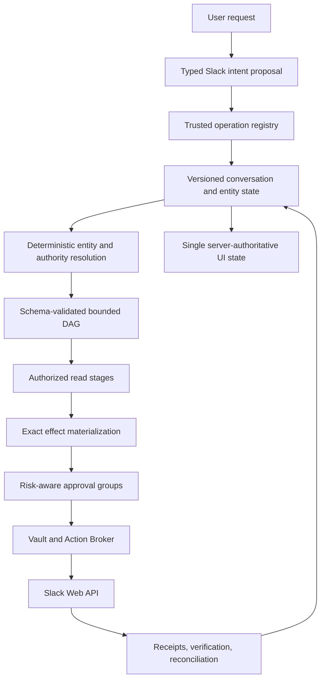
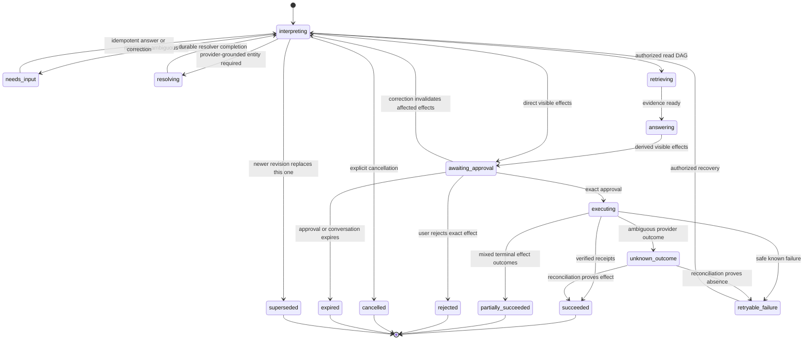
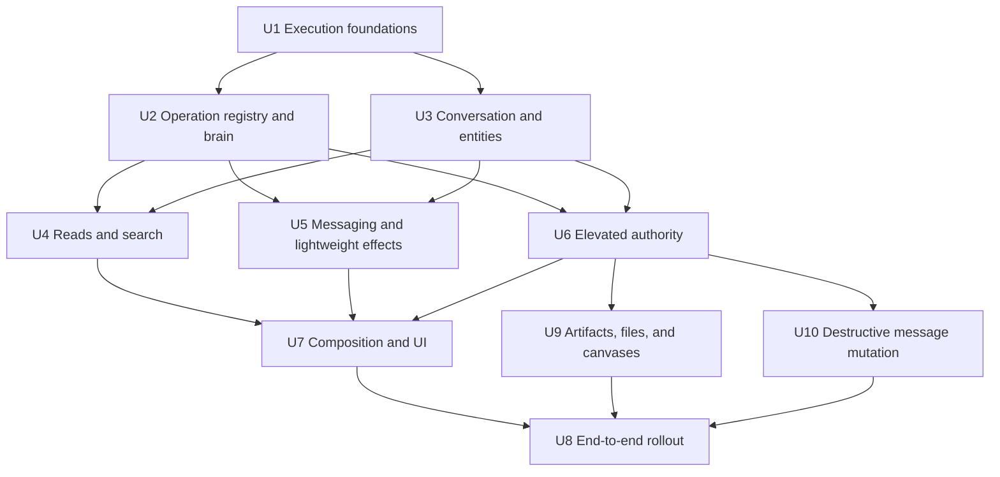
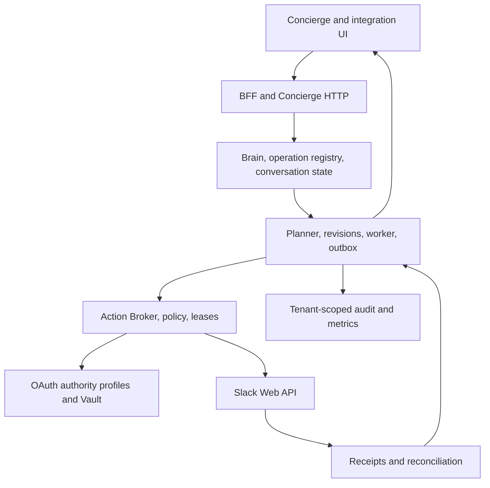

# General Slack Orchestration in Concierge

## Summary

Extend the existing ACP-TASK Concierge into a catalog-driven Slack orchestrator that can understand broad Spanish, English, and mixed-language requests, compose authorized Slack operations, preserve conversational context, and execute them through the existing Vault, workflow, approval, broker, worker, and audit boundaries. This is an expansion inside the current repository, not a separate project.

The system will be bot-first and capability-driven. User-token and Enterprise administration capabilities remain optional authority profiles with separate consent and policy. “Any supported Slack task” means an operation present in a frozen, versioned release manifest and permitted by the installed Slack product, token type, scopes, tenant policy, rollout family, and exact user approval—not arbitrary Web API access invented by a model. Current availability and prerequisites must be discoverable before a user commits to a complex flow.

---

## Current Execution Checkpoint & Laptop Handoff

> **Latest authoritative checkpoint — 2026-08-03 (U3 complete):** U3 is
> finished and committed. The earlier 2026-08-03 pause checkpoint and the
> 2026-07-31 handoff are historical evidence, superseded by this section.

### Completion checkpoint — 2026-08-03

**Branch:** `codex/feat-conversational-slack-concierge`

**Current phase:** Phase 1 — Safety and contracts

**Last unit completed:** U3 — Versioned conversational turns and grounded Slack
entity graph (all slices).

**Next unit:** U4 — Complete grounded reads, search, and evidence presentation.
Its Phase 1 prerequisite, the measured per-method rate tier and the strategy
choice that follows from it, was taken on 2026-08-03 and resolved in favour of
conventional pagination under ordinary budgets. See
`docs/operations/slack-phase1-rate-tier.md` and the note below, including the
two caveats that bound the result.

**Full repository verification at this checkpoint:** `1224 passed, 4 skipped`.

#### Phase 1 is not closed

U1-U3 are complete, the U2 language gate passed, and the rate-tier gate was
measured and resolved on 2026-08-03. Five exit items remain, none of which are
code:

| Phase 1 exit item | Status |
|---|---|
| U1-U3 hardening | **Complete** |
| U2 bilingual/typo language-quality gate | **Passed** — evidence in `docs/operations/slack-phase1-language-gate.md` |
| Product baselines established | **Not started** — U3E built the data source (`concierge_outcome_events`, `conversation_outcome_baseline`); nothing has been measured from it yet |
| V1 operation manifest frozen | **Not started** |
| High-frequency bot message/read canary | **Not started** |
| Measured per-method rate tier + explicit strategy decision | **Measured 2026-08-03 — resolved** — evidence in `docs/operations/slack-phase1-rate-tier.md`; see the note below |
| Sequential-chaining vs. composition comparison | **Not started** — scopes U7's compound-DAG slice |
| First 2-3 bot-authorized jobs released behind a tenant flag | **Not started** |
| R25 go/no-go checkpoint per hypothesis family | **Not started** — gates U9 and U10 |

**The rate-tier gate resolved in favour of the simplest option.** The installed
app is not on the restricted non-Marketplace tier: `conversations.history`
applied no per-request message cap, and 80 calls in 26.8 seconds drew zero
`429`. U4 therefore needs neither a Marketplace listing, nor user-token/AI
search, nor a low-volume read UX redesign, and U6's elevated authority profile
does not need to move into Phase 2. Two caveats bound that conclusion: the
probe was a 27-second burst rather than a sustained run, and the reason the
2025 non-Marketplace restriction does not apply is unexplained. Confirm the
app's listing and tier status with Slack before freezing U4's rate policy.

Two later units remain conditional rather than merely sequenced: U9 and U10 are
funded only if their R25 demand checkpoint passes, and U7's compound-DAG slice
proceeds only if the chaining comparison shows measurable improvement. U4's own
gate is now resolved.

#### Current progress

| Unit | Status | Verified result |
|---|---|---|
| U1 — Execution foundations | **Complete** | Foundation implementation and regression coverage remain green. |
| U2 — Registry and typed brain | **Complete** | The untouched live V3 gate passed with `openai/gpt-oss-120b`: 100% operation accuracy, 100% required-slot accuracy, zero authority violations, and zero transport failures across 24 cases. Evidence is committed in `docs/operations/slack-phase1-language-gate.md`. |
| U3A — Versioned turns and CAS | **Complete / committed** | Durable client-turn idempotency, conversation `state_version`, exclusive active-turn reservation, atomic state/outbox commit, RLS migration foundations, and worker support for `conversation.turn_committed`. |
| U3B — Entity graph and corrections | **Complete / committed** | Minimized provider snapshots keyed by `provider_entity_id` with monotonic versions, owner/connection/team binding, fail-closed stale and expired reads, and correction lineage from prior to replacement entity reference. |
| U3C — Durable paginated resolver | **Complete / committed** | Resolver runs persist cursors, budgets, and page counts; replayed provider callbacks are ignored by page token; exactly one `conversation.resolver_completed` event is committed with the run; the worker owns continuation and pages runs forward; conversation GET is strictly read-only. |
| U3D — Isolation and expiry integration | **Complete / committed** | Tenant/principal switch, expiry with an unapproved effect, two-tab rebase, turn replay, and safe ambiguity labels are covered in `tests/integration/test_conversational_slack_tenant_isolation.py`. |
| U3E — Product-outcome events | **Complete / committed** | `concierge_outcome_events` now has writers, an owner-bound sequence, a metric-only allowlist, and per-tenant baseline aggregation for the Phase 1 and R25 gates. |
| U4-U10 / U8 rollout | **Pending** | U4 is next; later units stay gated by their Phase 1 checkpoints. |

#### Commits that close U3

- `e87921b feat(concierge): add versioned idempotent turns` (U3A)
- `0b3a888 feat(concierge): persist grounded Slack entity context` (U3B)
- `fcf40d7 feat(concierge): resolve Slack entities durably across pages` (U3C)
- `05b76df test(concierge): prove conversation isolation, expiry, and rebase` (U3D)
- `31fc357 feat(concierge): measure conversation outcomes without content` (U3E)

#### Architecture decisions worth carrying into U4

- **Resolver continuation moved off the request path.** `web/concierge.py`'s
  `do_GET` no longer calls `resume_resolved_slack_turn`. The workflow worker
  owns continuation through `apply_slack_resolver_completion`, and
  `build_worker()` constructs a `DynamicWorkflowService` for that purpose.
  Any new polling endpoint must stay read-only.
- **Pagination is driven by the run, not the workflow.** A page that finds no
  match leaves the conversation in `retrieving`; the worker calls
  `continue_slack_resolver_run` for runs whose cursor has an undispatched
  `next`. This is also the restart-recovery path.
- **Idempotency keys.** Resolver runs dedupe on
  `(tenant, conversation, connection, entity_kind, query_hash, requested_state_version)`;
  pages dedupe on page token; completion dedupes on
  `slack-resolver:<resolver_run_id>`.
- **Two allowlists guard privacy.** `SLACK_ENTITY_FIELDS` bounds what a
  provider snapshot may retain, and `OUTCOME_METRIC_FIELDS` bounds what a
  metrics row may retain. Extend those, rather than passing richer payloads.

#### Working-tree note for the next session

`docs/brainstorms/`, `scripts/dev-stack.sh`, `scripts/run_action_broker.py`,
and four `frontend/src/**` files are modified or untracked but were **not**
authored as part of U3 and are intentionally left uncommitted. Do not stage
them with a blanket `git add -A`.

---

### Historical checkpoint — 2026-07-31

**Checkpoint date:** 2026-07-31  
**Branch:** `codex/feat-conversational-slack-concierge`  
**Current phase:** Phase 1 — Safety and contracts  
**Current unit:** U2 — Operation registry and typed brain contract  
**Promotion decision:** **NO-GO** until the new blind V3 language holdout passes  
**Safe resume point:** Add rate-aware pacing/retry support to the V3 live harness, run the untouched V3 holdout once with the 120B candidate, record the result, and either close U2 or continue improving U2 without starting U3+

This is the authoritative handoff checkpoint for continuing the work on another computer. The U2 implementation and its focused automated tests are green, but U2 is intentionally **not complete** because its mandatory real-model language-quality gate has not passed. No threshold should be lowered and no previous diagnostic corpus should be promoted retroactively.

### Unit progress

| Unit | Status | Current result |
|---|---|---|
| U1 — Execution foundations | **Complete** | Typed references, revision/effect safety, policy revalidation, failure taxonomy, durable outbox/projection recovery, migration, and restart/idempotency coverage implemented. The accumulated U1 verification reached 153 passing tests. |
| U2 — Registry and typed brain | **In progress / implementation green** | Versioned operation manifest, fail-closed registry, typed Groq contract, contextual slots/corrections, live operation projection, safe fallback, conversation continuity, and evaluation harnesses implemented. Latest focused U2 run: 80 passing tests; an earlier broader integration-focused run reached 82 passing tests. |
| U2 Phase 1 language gate | **NO-GO** | Operation selection reached the target on one 120B run, but required-slot accuracy missed the threshold. Blind V2 exposed indexed compound-slot and translated context-reference evaluation problems. Those contracts are fixed; the untouched blind V3 corpus exists but its live run has not been executed. |
| U3-U10 | **Pending / gated** | Do not begin later units until the U2 language gate passes, as required by the Phase 1 exit criterion. |

### What is already implemented

- Added typed Slack capability outputs, schema/reference validation, stable logical effect identity, superseded-revision authorization, recursive receipt safety, named provider failure classes, a versioned deterministic `PolicyEvaluator`, broker revalidation, and restart-safe durable projection/outbox foundations.
- Added `migrations/0013_general_slack_foundations.sql` with the new execution foundations and compatible repository behavior.
- Added the frozen `config/slack_operations_v1.yaml` manifest and `agents/orchestrator/slack_operations.py`. The runtime projection is joined against the trusted capability catalog and fails closed on drift.
- Added strict `SlackInterpretation` models for operations, indexed slots and provenance, corrections, dependencies, blockers, locale, and confidence. Provider IDs, scopes, connection authority, and approvals are rejected as model-supplied authority.
- Updated `GroqBrain` to receive only the live visible operation projection, return typed Slack interpretations, preserve operation confidence separately from slot ambiguity, and fall back safely when the provider is unavailable.
- Updated conversation handling to preserve resolved context and exact message text across turns and corrections, ground only human-facing names, and ask one blocking question instead of restarting the request.
- Updated dynamic workflow routing to build the visible registry from installations, enabled capabilities, effective scopes, feature flags, and policy. Unsupported or recovery states are named rather than silently falling through legacy behavior.
- Compound requests can be interpreted and preserved, but compound execution still returns `compound_execution_unavailable` deliberately until the U7 DAG execution slice exists.
- Added the static language corpus, tuning corpus, blind V2/V3 holdouts, live harnesses, and `docs/operations/slack-phase1-language-gate.md` for auditable gate results.

### Language-gate evidence and current blocker

Required promotion thresholds remain at least 90% exact operation accuracy, at least 85% required-slot accuracy, zero authority-field violations, and zero transport failures.

| Model / corpus | Operation | Required slots | Authority | Transport | Decision |
|---|---:|---:|---:|---:|---|
| `llama-3.3-70b-versatile`, first live run | 62.50% indicative | 72.73% indicative | 0 | 13/24 | NO-GO; incomplete/rate-limited |
| `llama-3.3-70b-versatile`, second live run | 20.83% fallback-contaminated | 0% fallback-contaminated | 0 | 24/24 | NO-GO; daily tokens exhausted |
| `openai/gpt-oss-120b`, original corpus | 91.67% | 81.82% | 0 | 0/24 | NO-GO; slots below 85% |
| `openai/gpt-oss-120b`, blind V2 | 87.50% | 60.00% | 0 | 2/24 | NO-GO; contract/evaluator issues exposed |

Additional diagnostics rejected `qwen/qwen3.6-27b` as a candidate. After adding general contract examples and indexed slots, the non-blind 120B tuning corpus reached 90% operation accuracy with 71.43% literal-slot accuracy; inspection showed that at least one apparent miss was a correct translated contextual reference graded by an invalid lexical comparison. Blind V3 therefore grades `literal`, `context_reference`, and `missing` slots separately and requires `provenance=conversation` for contextual references.

The remaining immediate engineering issue is provider pacing in `tests/evals/test_slack_phase1_blind_holdout_v3.py`: unlike the earlier harness, V3 does not yet consume the bounded pacing/retry environment variables. A direct 120B capacity probe succeeded but reported only about 4,745 tokens remaining in the current minute window with a roughly 24.4-second token reset. Running all 24 cases without pacing would create avoidable transport failures and invalidate the one-shot gate.

The repository default remains `llama-3.3-70b-versatile`. `openai/gpt-oss-120b` is only the current evaluation candidate selected through `GROQ_MODEL`; production has not been switched.

### Exact resume sequence on the laptop

1. Check out or pull `codex/feat-conversational-slack-concierge` and preserve the whole feature worktree. Configure `GROQ_API_KEY` locally without committing or printing it.
2. Confirm the static baseline:

   ```bash
   .venv/bin/pytest -q \
     tests/orchestrator/test_brain.py \
     tests/orchestrator/test_slack_operations.py \
     tests/orchestrator/test_slack_conversation.py \
     tests/orchestrator/test_dynamic_workflow_service.py \
     tests/evals/test_slack_phase1_quality.py \
     tests/evals/test_slack_phase1_blind_holdout_v2.py \
     tests/evals/test_slack_phase1_blind_holdout_v3.py
   ```

3. Before consuming the blind V3 holdout, port the bounded pacing and `429 Retry-After` handling from the earlier live harness into V3. It must count exhausted retries as transport failures and must never count deterministic fallback output as a live-model success.
4. Run the blind V3 holdout once, using approximately 26 seconds between requests under the observed 120B token window:

   ```bash
   RUN_GROQ_BLIND_V3_EVALS=true \
     GROQ_MODEL=openai/gpt-oss-120b \
     GROQ_EVAL_PACING_SECONDS=26 \
     GROQ_EVAL_RATE_LIMIT_RETRIES=2 \
     GROQ_EVAL_MAX_RETRY_AFTER_SECONDS=30 \
     GROQ_EVAL_REQUEST_TIMEOUT_SECONDS=20 \
     .venv/bin/pytest -q -s \
     tests/evals/test_slack_phase1_blind_holdout_v3.py::test_live_groq_phase1_blind_holdout_v3
   ```

5. Record the emitted `SLACK_PHASE1_BLIND_V3_GATE` summary in `docs/operations/slack-phase1-language-gate.md` without storing the API key, headers, or raw provider payloads.
6. Mark U2 complete and begin U3 only if V3 achieves all four thresholds. Otherwise keep U2 active, classify the failures by operation/slot/transport cause, fix the general contract or model configuration, and require a newly authored untouched holdout for the next promotion attempt.

### Git and secret-safety handoff

- The working tree is intentionally dirty because it contains the complete U1/U2 implementation plus the earlier Slack/OAuth/conversation fixes that are the baseline of this plan.
- Do not commit `.env`, `GROQ_API_KEY`, provider responses, authorization headers, or local certificates/credentials.
- Review `.local/` before staging; it is local runtime state and should normally stay out of the commit.
- Review the untracked `frontend/pnpm-lock.yaml` and `frontend/pnpm-workspace.yaml` separately before including them, because they are not required evidence for the U1/U2 backend checkpoint.
- Avoid a blind `git add .`; stage the reviewed feature files and this plan explicitly. No commit, push, or production-model change had been performed at this checkpoint.

---

## Problem Frame

The completed conversational Slack plan established durable conversation state, deterministic entity grounding, bounded reads, exact write previews, brokered execution, and a modal UI. It supports common channel reads, posts, replies, DMs, and channel listings, while some connector primitives for reactions and files exist without complete conversational flows.

Natural-language Slack intake is still primarily a growing conditional parser. Operations, required slots, feature flags, planner behavior, materialization, and recovery are duplicated across multiple switches. Groq does not currently produce a dedicated typed Slack intent, multi-step Slack requests collapse to one operation, output schemas are too weak for safe references, and asynchronous entity resolution can stop without a durable resumption consumer. Expanding this shape operation by operation would create inconsistent permissions, repeated questions, approval gaps, and brittle language handling.

The current worktree also contains uncommitted fixes for tenant-wide Slack use, OAuth recovery, broader channel intents, and conversation continuity. Execution must treat those changes as the baseline to stabilize before building the expansion.

Before enabling new families, establish a privacy-safe product baseline from conversation/error telemetry or a short discovery sample: top attempted Slack jobs, completion and abandonment, repeated clarifications, unsupported requests, and manual fallbacks. The first release targets the two or three highest-value bot-authorized jobs; later families remain hypotheses until promotion gates demonstrate demand and outcome improvement.

---

## Requirements

- R1. The existing Concierge must understand ordinary Spanish, English, typo-tolerant, and mixed-language Slack requests without requiring command syntax or phrase-specific handlers for every operation.
- R2. Groq or another configured brain may propose a typed intent and DAG, but only trusted operation definitions, schemas, live connection snapshots, deterministic entity resolvers, policy, and approval may authorize execution.
- R3. A declarative Slack operation registry must define conversational aliases, slots, resolvers, capability recipes, authority-profile requirements, presentation, and rollout family. The trusted capability catalog remains the sole authority for schemas, scopes, effects, risk, retry/reconciliation, preview fields, and verifiers; their joined projection must fail closed on incompatibility.
- R4. Unsupported, unavailable, plan-restricted, or scope-restricted requests must receive a precise explanation and recovery path rather than a generic question or bare failure.
- R5. Server-side conversation state must preserve operation candidates, resolved workspace/channel/person/message/thread/file entities, pending effects, corrections, provenance, locale, and one blocking need across turns.
- R6. Client history and Slack content may help language understanding but may never supply provider IDs, tenant authority, scopes, approval, or executable instructions.
- R7. Replayed HTTP turns, concurrent polls, duplicate approvals, and process restarts must not create duplicate workflows, presentations, proposals, or Slack effects.
- R8. Channels, users, messages, threads, files, and reactions must be grounded against the selected connection and workspace, with pagination and stale-entity revalidation where relevant.
- R9. Reads and searches must be bounded, paginated, rate-aware, provenance-preserving, and presented with period, partial-result disclosure, authors, dates, and Slack permalinks when supported.
- R10. Search must use the least-privileged supported Slack interface. User-token or AI-search authority must be explicit and must never be silently substituted for bot authority.
- R11. Message posts, replies, DMs, reactions, files, canvases, bookmarks, pins, edits, deletes, and channel mutations must be available only when their trusted descriptors, executors, token profiles, scopes, and policies are installed.
- R12. Every externally visible write must be materialized with exact targets and payload before approval; corrections must invalidate only affected slots and every derived approval.
- R13. Destructive, administrative, bulk, or cross-workspace actions must require reinforced approval and policy checks. Message edit/delete must prove the acting authority is permitted to mutate that message.
- R14. File operations must use opaque, hash-bound, TTL-limited artifact references rather than transporting raw bytes through chat history, model prompts, workflow JSON, or browser responses.
- R15. Compound requests must compile to bounded DAGs with typed output references, explicit data-flow disclosures, separate visible effect previews, deterministic dependency ordering, and truthful partial-success semantics.
- R16. No read authorization may cover a write. No approval may cover unresolved, changed, newly derived, or superseded effects.
- R17. Provider failures must distinguish pre-dispatch rejection, missing scope, token/lifecycle failure, membership failure, rate limit, safe retry, partial completion, and unknown outcome; unknown writes must reconcile before retry.
- R18. Tenant membership, installation lifecycle ownership, connection identity, token profile, credential version, scope snapshot, rollout, policy, revision, payload, and lease must be revalidated at the appropriate boundaries.
- R19. The frontend must render one server-authoritative conversation/effect state, actionable clarifications, grouped previews, recovery actions, evidence, and terminal outcomes without maintaining a conflicting workflow state machine.
- R20. Every operation family must be independently rollable, observable, auditable, and disableable without breaking existing connected-workspace status or previously supported Slack flows.
- R21. Data derived from private channels, personal search, files, canvases, or another workspace must retain source connection, classification, purpose, model visibility, and allowed destinations; private-to-public, user-to-bot, cross-workspace, and cross-provider egress is denied by default and must be disclosed when explicitly authorized. Bot-authorized reads of private channels, group DMs, and private files additionally require the requesting principal's mapped Slack identity to be a member of the target conversation; absent a mapping or membership, the read is denied with a named limitation, overridable only by an explicit, audited tenant-policy grant surfaced in the preview.
- R22. Reinforced approval must be a verifiable step-up contract for destructive, admin, or bulk effects: recent reauthentication, short TTL, exact before/after consequence, hard cardinality limit, separate approval, live precondition revalidation, and invalidation on any authority, policy, target, membership, ownership, quantity, or resource-state change.
- R23. New persistent tables must enforce tenant-scoped composite keys/FKs, state and version invariants, RLS, append-only audit, and an atomic turn/state/outbox boundary. Local SQLite repositories must enforce the same tenant predicates and state contract where engine features differ.
- R24. Ordinary low-risk requests must have a progressively disclosed happy path: one concise target/action confirmation, no repeated resolved slots, and technical provenance/scope details available on demand. Reinforced UI appears only for elevated effects.
- R25. Each family must pass product promotion gates—completion, time-to-outcome, clarification burden, preview conversion/correction, recovery, abandonment, repeat use, and demonstrated demand—before broader authority or complexity is funded or enabled.

---

## Scope Boundaries

### In scope

- Expansion inside the existing ACP-TASK services, databases, frontend, and deployment model.
- Bot-authorized messaging, threads, DMs, channel/private-channel reads, users, reactions, files, canvases, bookmarks, pins, and workspace-level channel operations that Slack permits for the installed app.
- Optional user-token search and optional Enterprise admin authority as explicitly separate connection profiles.
- Multi-turn clarifications, corrections, references, composed read/write requests, approval groups, partial outcomes, and safe recovery.
- New PostgreSQL migrations plus compatible local SQLite repository behavior where the current local stack requires it.

### Deferred to Follow-Up Work

- Proactive Slack Events API ingestion, mentions, scheduled monitoring, and event-triggered automations. The operation and entity contracts must not block this future work, but this plan remains request-driven from Concierge.
- A public third-party plugin/marketplace SDK for arbitrary external capability authors. This plan generalizes the internal trusted Slack catalog only.
- Organization-wide semantic indexing or permanent storage of complete Slack history.
- Automatically executing any Slack method that lacks a reviewed descriptor, executor, verifier, policy, and tests.
- Bulk and cross-workspace effects unless a future reviewed descriptor defines a bounded batch, source-to-sink policy, reinforced approval, per-effect receipts, partial-outcome semantics, and a dedicated rollout gate. Until then, the planner rejects them explicitly.

### Outside this product's identity

- A raw Slack API console where a model selects method names or arbitrary parameters.
- Silent escalation from bot authority to user or admin authority.
- Treating model confidence, Slack content, display names, or prior chat text as authorization.
- Claiming transactional atomicity across independent Slack effects.
- Blind retries of effects whose provider outcome is uncertain.

---

## Context & Research

### Relevant Code and Patterns

- `libs/integrations/catalog.py`: trusted definitions, live connection snapshots, effects, risk, preview fields, retry policy, and verifier binding.
- `agents/orchestrator/planner.py`: catalog projection, schema validation, tenant-bound DAG compilation, dependency checks, and controlled output references.
- `agents/orchestrator/slack_conversation.py`: current deterministic bilingual intake and entity grounding; retain as fallback and resolver helper, not primary open-ended understanding.
- `agents/orchestrator/dynamic_workflow_service.py`: conversational coordination, entity resolution, planning, read presentation, and exact write materialization.
- `agents/orchestrator/workflow_repository.py` and `agents/orchestrator/action_repository.py`: durable revisions, approvals, claims, leases, retries, receipts, and conversation projections.
- `libs/connectors/slack.py`: closed Slack executor, filtered outputs, rate policy, and existing messaging/reaction/file primitives.
- `services/oauth/app.py`, `vault/`, and `services/action_broker/`: managed OAuth custody and the only provider execution boundary.
- `frontend/src/components/client/ClientConsole.tsx` and `frontend/src/components/concierge/`: current modal, preview, progress, evidence, and approval patterns.
- `migrations/0011_workflow_runs.sql` and `migrations/0012_conversational_concierge.sql`: production persistence and RLS conventions.

### Institutional Learnings

- Generality must come from trusted primitive capabilities and bounded DAG composition, not named workflows or a larger intent switch.
- Conversation memory is short-lived structured context, not authority; every resolved entity remains connection- and tenant-bound.
- Approval binds materialized effects, not the conversational goal that produced them.
- End-to-end claims must cross OAuth, Vault, planner, broker, worker, restarts, receipts, verification, reconciliation, HTTP, and UI.
- Slack provider content is untrusted input. Presenters may summarize minimized evidence but cannot access tools or mutate plans.
- The previous Slack feature required a final brokered-flow correction after apparently complete unit coverage; this successor therefore carries integration and restart tests in every risky family.

### External References

- [Slack Web API methods](https://docs.slack.dev/reference/methods/): authoritative inventory and method-specific token, scope, rate, and product constraints.
- [Slack OAuth installation](https://docs.slack.dev/authentication/installing-with-oauth/): bot and user scope separation, optional scopes, and OAuth v2 authority responses.
- [Slack token types](https://docs.slack.dev/authentication/tokens/): bot, user, workflow, configuration, and token-purpose boundaries.
- [Slack rate limits](https://docs.slack.dev/apis/web-api/rate-limits/): per-method/per-workspace limits, pagination requirements, and `Retry-After` behavior.
- [2025 Slack history/replies rate-limit changes](https://docs.slack.dev/changelog/2025/05/29/rate-limit-changes-for-non-marketplace-apps/): new-install constraints that require distribution-aware budgets.
- [Slack message search](https://docs.slack.dev/reference/methods/search.messages/): user-token search authority and legacy-status considerations.
- [Slack real-time search](https://docs.slack.dev/reference/methods/assistant.search.context/): AI-search alternative, action-token requirements, pagination, and citation fields.
- [Slack Canvas API](https://docs.slack.dev/surfaces/canvases/): document content, channel association, and product limitations.
- [Slack Admin API scope requirements](https://docs.slack.dev/reference/scopes/admin.usergroups.read/): Enterprise-wide installation and admin/owner authorization constraints.

---

## Key Technical Decisions

| Decision | Resolution and rationale |
|---|---|
| General-language interpretation | Add a typed Slack intent/plan contract to the interchangeable brain interface. Groq proposes operations and human references; application code validates and grounds them. The deterministic parser remains a safe fallback. |
| Operation extensibility | Introduce a conversational Slack operation registry for aliases, slots, resolvers, capability recipes, authority-profile requirements, recovery, and presentation. Join it with the existing trusted capability catalog, which remains the only source for schemas, scopes, effect, risk, retry, preview, verifier, and executable binding. |
| Authority profiles | Represent bot, user, and Enterprise admin grants as separate connection-authority profiles. Bot is the default; missing authority returns an explicit consent or policy need. |
| Conversation model | Evolve the current short-lived state into a versioned intent working set with durable turn idempotency and grounded entity provenance. Workflow and action repositories remain authoritative for approvals/execution/receipts; an idempotent read model projects them into the conversation response. Do not add cross-session memory. |
| Entity model | Persist minimized workspace, channel, user, message, thread, file, and reaction references with connection/workspace binding, observation time, and ownership facts needed for mutation policy. |
| Files | Stage browser or generated content into a broker-readable artifact store and pass only opaque references, metadata, hash, size, MIME, tenant, principal, and expiry through workflows. |
| Composition | Preserve bounded DAGs from intent through execution. Reads may feed later materialization, but each visible effect becomes an exact approval item after upstream values resolve. |
| Approval granularity | Authority binds each `effect_id + effect_version + exact payload hash`. A group is presentation that may capture multiple effect decisions, not one indivisible authorization. Changing one effect invalidates it and its dependents while unchanged independent effect approvals survive. High-risk/destructive/admin effects remain separately reinforced. |
| Concurrency | Add compare-and-swap conversation/revision transitions and idempotent turn/effect keys; GET polling remains read-only and workers/outbox consumers own state advancement. |
| Deterministic policy | Add one versioned policy evaluator as the authoritative decision point for tenant, principal, authority profile, capability, entity provenance, data classification, effect class, batch size, and current provider state. Persist its decision/hash and revalidate mutable preconditions before dispatch. |
| Data-flow policy | Attach source connection, classification, purpose, model visibility, and allowed destinations to derived values. Compiler and broker both deny unsafe egress by default and approval displays any explicitly allowed disclosure. |
| Failure semantics | Classify failures by dispatch certainty and recovery ownership. Retry policy is descriptor-driven, and reconciliation is mandatory for ambiguous effects. |
| Output safety | Define allowlisted output schemas and validate reference paths. Apply recursive redaction before receipts, workflow output, presenter input, browser payloads, logs, or model prompts. |
| Rollout | Ship by operation family and authority profile with incremental OAuth scope bundles. Never request every future scope during ordinary installation. |
| Slack Connect | Keep externally shared channels default-deny. Future enablement requires participant-organization provenance, explicit egress policy, reinforced previews, and dedicated negative tests. |
| Audit | Persist append-only tenant-scoped correlation events for consent, profile selection, grounding, planning, policy, preview, approval/step-up, dispatch, verification, reconciliation, artifact lifecycle, and kill switches. Store identifiers, versions, and hashes—not tokens, raw content, or temporary URLs. |

---

## Open Questions

### Resolved During Planning

- Separate project or current repository: extend ACP-TASK; do not create a separate application.
- Meaning of “anything in Slack”: any reviewed catalog operation permitted by Slack product, token, scopes, tenant policy, and approval.
- Destructive/admin actions: include them behind reinforced approval, explicit authority profiles, and rollout flags.
- Proactive/event-driven operation: keep request-driven execution in scope and defer Events API ingestion.
- Model role: Groq interprets and proposes; deterministic systems authorize, ground, materialize, and execute.

### Deferred to Implementation

- Exact Slack method coverage within each family: confirm each method's current availability, token type, scope, rate tier, and product-plan constraints while implementing its descriptor.
- Artifact backend for local versus production: select the existing compatible object-storage/KMS mechanism after inventorying deployment infrastructure; the opaque artifact contract is fixed.
- Real-time Search eligibility: enable only if the Slack application qualifies and required action/user token authority can be represented safely; otherwise expose bounded channel reads and user-token search where permitted.
- Enterprise admin rollout: implementation may land dormant until an Enterprise Grid test organization and org-admin consent are available.

---

## High-Level Technical Design

> *This illustrates the intended approach and is directional guidance for review, not implementation specification. The implementing agent should treat it as context, not code to reproduce.*



The intended conversational lifecycle is:



The implementation must keep separate conversation, workflow, approval, effect, and projection transition contracts. For every transition, name its owner, CAS precondition, terminality, approval invalidation behavior, projection event, and UI action; the diagram above is the user-visible composition of those machines, not a shared database enum.

---

## Implementation Units



### U1. Harden schemas, concurrency, and execution certainty

**Goal:** Make the shared workflow and broker foundations safe enough for a larger capability catalog and multi-effect requests.

**Requirements:** R2-R4, R7, R15-R18, R20.

**Dependencies:** Current uncommitted Slack/OAuth/conversation fixes must be stabilized as the execution baseline.

**Files:**

- Modify: `libs/integrations/catalog.py`
- Modify: `agents/orchestrator/workflow_models.py`
- Modify: `agents/orchestrator/planner.py`
- Modify: `agents/orchestrator/workflow_repository.py`
- Modify: `agents/orchestrator/action_repository.py`
- Modify: `agents/orchestrator/workflow_executor.py`
- Modify: `agents/orchestrator/workflow_broker_dispatcher.py`
- Modify: `services/action_broker/app.py`
- Modify: `services/action_broker/reconciliation.py`
- Create: `agents/orchestrator/policy.py`
- Create: `migrations/0013_general_slack_foundations.sql`
- Test: `tests/integrations/test_capability_definitions.py`
- Test: `tests/orchestrator/test_dynamic_planner.py`
- Test: `tests/orchestrator/test_workflow_repository.py`
- Test: `tests/orchestrator/test_action_repository.py`
- Test: `tests/orchestrator/test_workflow_broker_dispatcher.py`
- Test: `tests/orchestrator/test_policy.py`
- Test: `tests/integration/test_workflow_restart_recovery.py`

**Approach:**

- Replace generic Slack output descriptors with allowlisted schemas and validate every plan reference against the declared source output path and destination input path.
- Add conversation/revision/effect versions and compare-and-swap transitions so superseded or concurrently edited revisions cannot continue dispatching.
- Model a durable `operation_instance` containing one or more immutable, versioned `effect_instance` records. Keep one stable logical effect ID and payload hash across monotonic dispatch attempts; no new attempt may dispatch while an earlier attempt is dispatched or outcome-unknown.
- Move workflow-driven conversation advancement out of GET polling into a durable worker/outbox claim with idempotent projection. Commit turn insertion, conversation CAS, and outbox insertion atomically; define tenant/conversation ordering, immutable event and deduplication keys, claim lease and visibility timeout, retry/backoff, dead-letter handling, projection watermarks, and retention.
- Add a versioned `PolicyEvaluator` as the shared planner/broker decision contract and persist its inputs, decision version, and hash for dispatch-time revalidation.
- Apply one universal broker predicate to every bot, user, and admin read/write at lease issue and lease consumption: tenant membership, immutable authority binding, connection lifecycle, credential version, effective scopes, descriptor/rollout/policy version, approval/hash/expiry, artifact validity, entity provenance, and mutable provider preconditions. Drift pauses or replans without dispatch.
- Separate provider errors into pre-dispatch rejection, deterministic provider rejection, rate limit, transient safe retry, partial effect, and post-dispatch ambiguity.
- Version proposal idempotency by authorized attempt while keeping one logical effect identity across reconciliation and safe retry.
- Apply recursive output/receipt redaction and size limits before persistence or egress.
- Enforce per-principal and per-tenant inbound turn rate limits, a cap on concurrently active conversations and pending resolver workflows per tenant, and a bounded brain-invocation budget per conversation, all applied before brain or resolver dispatch.
- Deliver schema changes through expand/backfill/validate/contract phases with mixed-version compatibility, resumable backfills, PostgreSQL constraint/RLS validation, and an explicit SQLite compatibility procedure; never edit an applied migration.

**Execution note:** Start with characterization tests for current retry, polling, and superseded-revision behavior, then add failing concurrency and dispatch-certainty cases before changing shared repositories.

**Patterns to follow:** Existing immutable workflow revisions, `plan_graph_hash`, credential-version snapshots, one-use leases, requested-read authorization, execution attestations, and reconciliation records.

**Test scenarios:**

- Happy path: compile a two-step typed plan whose second input references a declared first-step output; persist and execute in dependency order.
- Error path: reject an output reference to an undeclared path, wrong provider type, future step, unrelated branch, or stale descriptor.
- Concurrency: two polls or worker callbacks observe one resolver completion and create exactly one next transition.
- Concurrency: a running step from a superseded revision fails authorization before provider dispatch.
- Retry: a deterministic `missing_scope`, `not_in_channel`, or rate limit never becomes `unknown_outcome`.
- Unknown outcome: a network timeout after a side-effecting dispatch blocks retry until reconciliation records success or absence.
- Restart: stop the worker after claim, provider receipt, and conversation projection boundaries; resume without duplicating any provider effect.
- Security: nested token-like fields and oversized provider output are recursively redacted or rejected before storage and browser/model egress.
- Rate limiting: sustained turn spam from one principal cannot exhaust another principal's Slack read budget, flood the outbox/DLQ, or exceed the per-conversation brain budget.

**Verification:** Shared workflow tests prove typed references, CAS transitions, read-only polling, exact retry identity, failure taxonomy, recursive redaction, and restart-safe execution.

### U2. Introduce the declarative Slack operation registry and typed brain contract

**Goal:** Replace operation-specific language switches with one extensible contract that Groq and the deterministic fallback can both target safely.

**Requirements:** R1-R6, R11, R15, R18, R20.

**Dependencies:** U1.

**Files:**

- Create: `agents/orchestrator/slack_operations.py`
- Create: `config/slack_operations_v1.yaml`
- Modify: `agents/orchestrator/brain.py`
- Modify: `agents/orchestrator/workflow_models.py`
- Modify: `agents/orchestrator/slack_conversation.py`
- Modify: `agents/orchestrator/dynamic_workflow_service.py`
- Modify: `agents/orchestrator/planner.py`
- Modify: `libs/integrations/catalog.py`
- Test: `tests/orchestrator/test_brain.py`
- Test: `tests/orchestrator/test_slack_operations.py`
- Test: `tests/orchestrator/test_slack_conversation.py`
- Test: `tests/orchestrator/test_dynamic_workflow_service.py`

**Approach:**

- Define an operation descriptor for intent aliases, required and optional slots, entity kinds, supporting capabilities, authority profile, effect class, risk, feature family, preview strategy, recovery, and presenter.
- Freeze the V1 manifest before implementation with exact supported/conditional methods, authority and product prerequisites, exclusions, and family flags. Completeness and documentation are measured against this versioned manifest, not the mutable runtime catalog.
- Extend the brain interface with a structured Slack interpretation contract containing operation candidates, slots with provenance, corrections, dependencies, blockers, locale, and confidence—not executable IDs or authority.
- Project only installed and policy-visible operations to Groq. Validate its output against the registry and downgrade low-confidence or invalid proposals to one precise clarification.
- Keep `normalize_name` and deterministic language rules for safe fallback, candidate matching, common commands, and no-model operation; do not duplicate the complete registry in parser branches.
- Generate operation availability and limitation responses from live registry/connection state, including status questions such as whether Slack is connected.
- Add an early language-quality gate: run a small, independently authored bilingual and typo-heavy evaluation sample against the real Groq brain's typed-intent contract, with explicit go/no-go accuracy thresholds, before any later unit begins; record the result as a Phase 1 exit criterion.

**Execution note:** Implement registry contract and fake-brain tests before routing any production turn through Groq.

**Patterns to follow:** `TrustedCapabilityDefinition`, Pydantic workflow models, `brain_label`, safe Groq JSON parsing, and deterministic planner rejection.

**Test scenarios:**

- Happy path: varied Spanish, English, typo-heavy, and mixed-language requests map to the same operation and slots without phrase-specific workflow code.
- Happy path: “¿tienes acceso a Slack?” maps to connection status and answers from live installations without asking for an operation.
- Clarification: ambiguous intent returns one question while preserving every high-confidence slot.
- Correction: “no #general, mejor #anuncios” changes only the channel slot and invalidates derived effects.
- Unsupported: a request for a method absent from the trusted registry returns a named limitation, not a fabricated plan.
- Security: model output containing Slack IDs, scopes, connection IDs, approvals, or an unregistered capability is ignored or rejected.
- Fallback: without Groq, common operations remain usable and uncommon operations report the fallback limitation honestly.
- Catalog drift: disabling one operation family removes it from model projection without changing unrelated intents.

**Verification:** Brain, registry, coordinator, and service tests prove language flexibility while all authority and executable structure remain deterministic.

### U3. Build versioned conversational turns and a grounded Slack entity graph

**Goal:** Preserve complex multi-turn requests and provider-grounded references without trusting client history or losing slots during asynchronous resolution.

**Requirements:** R5-R8, R12, R15, R18-R19.

**Dependencies:** U1, U2.

**Files:**

- Modify: `agents/orchestrator/conversation_state.py`
- Modify: `agents/orchestrator/workflow_models.py`
- Modify: `agents/orchestrator/workflow_repository.py`
- Modify: `agents/orchestrator/dynamic_workflow_service.py`
- Modify: `services/workflow_worker/app.py`
- Create: `migrations/0014_slack_conversation_entities.sql`
- Test: `tests/orchestrator/test_conversation_state.py`
- Test: `tests/orchestrator/test_workflow_repository.py`
- Test: `tests/orchestrator/test_dynamic_workflow_service.py`
- Test: `tests/services/test_workflow_worker.py`
- Test: `tests/integration/test_conversational_slack_tenant_isolation.py`

**Approach:**

- Persist idempotent user turns, versioned intent/slot state, effect candidates, a single blocking need, and correction provenance under tenant/principal/conversation binding.
- Persist privacy-safe product-outcome events — attempted operation family, completion, abandonment, clarification count, correction/rejection, terminal outcome — alongside turn/conversation state so Phase 1 baselines and R25 promotion gates have concrete data sources.
- Add minimized entity records for workspace, channel, user, message, thread, file, and reaction, each bound to connection/team and observation metadata.
- Persist resolver cursors and budgets so large workspaces page durably instead of resolving from only the first page.
- Introduce a durable resolver-completion event/outbox consumed by the workflow worker or coordinator service; HTTP polling only reads projected state.
- Enforce state/version checks, tenant-scoped composite foreign keys, fail-closed PostgreSQL RLS, least-privilege service roles, and equivalent mandatory tenant predicates in SQLite repositories for every new table.
- Define reference precedence and correction semantics for “ahí”, “ese mensaje”, “la anterior”, “ella”, and explicit replacements.
- Revalidate stale or mutation-sensitive entities immediately before materializing an effect.

**Execution note:** Add migration/repository tests first, including concurrent and replayed turn cases.

**Patterns to follow:** Opaque conversation IDs, TTL/content expiry, tenant-bound repository reads, `apply_conversation_answer`, workflow claims, and append-only audit events.

**Test scenarios:**

- Replay: resend the same client turn id after a timeout and receive the same conversation transition without a duplicate workflow.
- Pagination: resolve a channel or person found after page one and persist cursor/progress across a worker restart.
- Context: read one thread, then interpret “respóndele ahí” against the server-grounded thread rather than client history.
- Correction: replace only the named person while preserving workspace, channel, locale, and message text.
- Ambiguity: two matching people return safe candidate labels without leaking email or unneeded profile data.
- Expiry: expire a conversation while an unapproved effect exists and prevent later shorthand from reusing its entities.
- Tenant isolation: switch session/tenant between resolution and continuation and deny every entity, workflow, and effect reference.
- Concurrency: two tabs update the same conversation version; one succeeds and the other receives current state for explicit rebase.

**Verification:** Migration and integration coverage proves durable resumable resolution, idempotent turns, correction semantics, provenance, expiry, and tenant isolation.

### U4. Complete grounded reads, search, and evidence presentation

**Goal:** Support broad Slack questions and searches with bounded retrieval, typed evidence, citations, and transparent partial results.

**Requirements:** R3-R10, R15, R17-R21.

**Dependencies:** U1-U3 for bot-default reads; U6's bot scope-bundle slice only where new read scopes are required. User-token or AI-search authority additionally requires U6's elevated-profile slice.

**Files:**

- Modify: `libs/integrations/catalog.py`
- Modify: `libs/connectors/slack.py`
- Modify: `agents/orchestrator/result_presenter.py`
- Modify: `agents/orchestrator/dynamic_workflow_service.py`
- Modify: `services/action_broker/rate_limits.py`
- Test: `tests/connectors/test_slack_actions.py`
- Test: `tests/orchestrator/test_result_presenter.py`
- Test: `tests/integration/test_conversational_slack_reads.py`
- Test: `tests/integration/test_workflow_restart_recovery.py`

**Approach:**

- Define typed channel, thread, DM/MPIM where authorized, users, file metadata, reaction, permalink, and search output schemas.
- Turn `BoundedSlackRead` into the durable read plan used in production: pagination, date boundary, author filtering, thread expansion, permalink fan-out, budgets, and partial-reason projection.
- Add a search abstraction that selects a permitted bot AI-search, explicit user-token search, or bounded known-channel strategy; never broaden visibility silently.
- Make rate policy distribution-aware and method/workspace-specific, respecting cursor requirements and `Retry-After` without holding leases during wait.
- Present only cited minimized evidence and preserve query, period, token perspective, partiality, and source provenance.
- Propagate source connection, Slack visibility, data classification, purpose, model visibility, and allowed destinations on every derived value. Deny private-to-public, user-to-bot, cross-workspace, cross-provider, and externally shared Slack Connect flows unless a reviewed policy explicitly permits and previews the disclosure.
- Enforce requester visibility for bot-mediated private reads: the requesting principal's mapped Slack identity must be a member of the target private channel, group DM, or file context, failing closed with a named limitation and an explicit, audited tenant-policy override path.

**Execution note:** Characterize the current single-page read, then make the durable bounded pipeline the only conversational read path.

**Patterns to follow:** Existing Slack filters, `_page` cursor envelope, result-presenter isolation, workflow content TTL, and persisted presentation hashes.

**Test scenarios:**

- Read: answer what one person wrote over an explicit period with author, date, range, and message permalinks.
- Default: omit the period and disclose the default seven-day window.
- Pagination: cross several pages and stop exactly at time/message budgets with a partial explanation.
- Thread: preserve parent/reply relationships and cite only messages used in claims.
- Search authority: user-token search returns only that user's Slack-visible results; bot authority cannot silently call it.
- Requester visibility: a tenant member who is not a member of a private channel cannot read it through bot authority; the denial names the limitation and the audited policy-override path.
- Search fallback: unavailable Real-time Search returns a consent/limitation state or bounded-channel strategy, never a workspace-wide claim.
- Rate limit: persist retry time, resume after `Retry-After`, and keep completed pages without duplication.
- Prompt injection: malicious message/file/canvas text remains evidence and cannot add operations, recipients, approvals, or scopes.
- Partial citation: one permalink failure yields a disclosed partial answer or excludes unsupported claims according to presenter policy.

**Verification:** Real workflow fixtures prove bounded, rate-aware, restart-safe, cited reads and searches under each supported authority profile.

### U5. Add messaging and lightweight collaboration effects

**Goal:** Complete ordinary posts, replies, DMs, reactions, pins, and bookmarks through exact previews, receipts, and reconciliation.

**Requirements:** R3-R8, R11-R18, R20.

**Dependencies:** U1-U3 for bot-default messaging; U6's bot scope-bundle slice only where new write scopes are required.

**Files:**

- Modify: `libs/integrations/catalog.py`
- Modify: `libs/connectors/slack.py`
- Modify: `agents/orchestrator/slack_operations.py`
- Modify: `agents/orchestrator/dynamic_workflow_service.py`
- Modify: `services/action_broker/app.py`
- Modify: `services/action_broker/reconciliation.py`
- Modify: `services/verification/verifiers/slack.py`
- Test: `tests/connectors/test_slack_actions.py`
- Test: `tests/services/test_slack_verifier.py`
- Test: `tests/orchestrator/test_slack_reconciliation.py`
- Test: `tests/integration/test_conversational_slack_writes.py`

**Approach:**

- Complete descriptors and executors for post, reply, DM, reaction add/remove, pin, and bookmark where permitted.
- Correct compound scope requirements such as DM open plus message post; do not model one operation as one scope when Slack requires several.
- Materialize exact destinations and payloads in previews.
- Implement method-specific verification and reconciliation rather than treating every provider error as ambiguous.

**Execution note:** Implement each new descriptor as a vertical slice—schema, scope, executor, receipt, verifier, reconciliation, conversation preview, and tests—before registering the next operation.

**Patterns to follow:** Existing exact Slack draft hashes, proposal/lease dispatch, receipt allowlists, `SlackReceiptVerifier`, and unknown-outcome reconciliation.

**Test scenarios:**

- Reaction: resolve “ponle 👍 a ese mensaje”, preview exact message/reaction, handle `already_reacted`, and remove only when explicitly requested.
- DM: require all necessary scopes, preserve the user target, and classify `conversations.open` success plus uncertain post as a partial/unknown sequence.
- Correction: change text, destination, artifact, reaction, or target after preview and prove all affected approvals are invalid.
- Provider errors: map deterministic permission/membership/product errors to actionable recovery while preserving exact drafts.

**Verification:** Vertical integration tests demonstrate each lightweight collaboration family's authority, exact preview, dispatch, receipt, verification, correction, and recovery contract.

### U6. Add incremental OAuth authority profiles and elevated channel/admin operations

**Goal:** Support least-privilege scope upgrades, optional user search, and policy-gated channel or Enterprise administration without conflating installation ownership with tenant execution.

**Requirements:** R3-R4, R10-R13, R17-R20, R22.

**Dependencies:** U1-U3.

**Files:**

- Modify: `libs/connectors/slack.py`
- Modify: `libs/config.py`
- Modify: `services/oauth/app.py`
- Modify: `services/oauth/repository.py`
- Modify: `vault/managed_oauth_crypto.py`
- Modify: `services/action_broker/app.py`
- Modify: `libs/integrations/catalog.py`
- Modify: `agents/orchestrator/slack_operations.py`
- Modify: `services/session/app.py`
- Create: `migrations/0015_slack_authority_profiles.sql`
- Modify: `frontend/src/components/integrations/ConnectSlackCard.tsx`
- Test: `tests/oauth/test_slack_oauth_flow.py`
- Test: `tests/oauth/test_integration_connections.py`
- Test: `tests/vault/test_managed_oauth.py`
- Test: `tests/orchestrator/test_broker_execution.py`
- Test: `frontend/src/components/integrations/ConnectSlackCard.test.tsx`

**Approach:**

- Deliver U6 as two independently shippable slices: (a) bot incremental scope bundles, the only slice bot-default families may require; and (b) user and Enterprise-admin authority profiles, which gate exclusively user-token, elevated channel, and admin operations. Bot read/write families must never wait on slice (b).
- Implement the R22 step-up contract: a session-service challenge endpoint attests a fresh authentication event within a named freshness window, the frontend prompts re-authentication when the attestation is missing or stale, and the approval endpoint rejects reinforced approvals whose session lacks a fresh attestation. A stale session fails closed.
- Persist separate authority profiles and encrypted credentials for bot, user, and Enterprise admin grants, each with subject, installation, scopes, lifecycle, version, and consent owner.
- Bind authority profile ID, Slack subject, ACP principal, team/enterprise, consent owner, effective scopes, credential version, and policy decision through OAuth state, plan, revision, proposal, lease, receipt, and audit. Personal authority is requester-equals-token-subject by default; any delegation requires a separate tenant/operation/purpose/audience/TTL-bound grant.
- Replace the monolithic frontend capability request with incremental bundles by operation family and show why each upgrade is needed.
- Maintain tenant-wide use for tenant-authorized bot capabilities while keeping credential lifecycle and personal user-token actions owner/subject constrained.
- Add channel create/rename/topic/purpose/member invite/remove/archive/unarchive only where token type, membership, Slack product, tenant policy, and reinforced approval permit them.
- Define and test the Enterprise Admin extension boundary and explicit rejection path, but defer its executors and credential custody until an Enterprise Grid test organization and consenting admin/owner are available. Never merge unqualified dormant `admin.*` dispatch code or emulate it with workspace tokens.
- Revalidate authority profile and scopes immediately before every elevated dispatch and surface the correct owner/admin recovery action.
- Use strongly bound, single-use OAuth state and revalidate current admin/owner status at every Enterprise dispatch.

**Execution note:** Land bot scope bundles first; keep user and admin profiles disabled until custody, subject binding, and negative authorization tests pass.

**Patterns to follow:** Managed OAuth envelope context, credential rotation CAS, stable `connection_id`, owner-only lifecycle controls, tenant execution snapshots, and feature-family flags.

**Test scenarios:**

- Scope upgrade: request only the missing family scopes, rotate custody, preserve connection identity, and retire the old credential.
- User authority: one user grants search; another tenant member cannot search through that personal token unless explicit policy permits delegated use.
- Bot versus user: planner sees only operations compatible with the selected authority profile.
- Channel operation: preview and approve a rename/topic/member change with exact workspace/channel/users and verify live permissions before dispatch.
- Destructive channel action: reinforced approval expires or invalidates on channel state, policy, scope, or tenant changes.
- Enterprise admin: workspace-level installation cannot register or execute an `admin.*` capability.
- OAuth recovery: missing/revoked credential produces actionable reconnect for the correct owner instead of a stale connected state.
- Tenant isolation: the same Slack workspace cannot become executable in another Tessera tenant through OAuth races or profile selection.

**Verification:** OAuth, Vault, broker, UI, and policy tests prove least-privilege incremental authority and strict bot/user/admin separation.

### U7. Preserve compound plans and unify the conversational UI

**Goal:** Execute broad and composed Slack requests as one coherent server-authoritative conversation with exact effect groups, corrections, progress, and partial outcomes.

**Requirements:** R1-R8, R12, R15-R20, R22, R24-R25.

**Dependencies:** U4-U6. U9- and U10-specific effect-group card variants land as small follow-on extensions inside those units when their families arrive; artifacts and destructive mutation are not prerequisites for the state-ownership unification.

**Files:**

- Modify: `agents/orchestrator/planner.py`
- Modify: `agents/orchestrator/dynamic_workflow_service.py`
- Modify: `agents/orchestrator/workflow_models.py`
- Modify: `agents/orchestrator/workflow_repository.py`
- Modify: `web/concierge.py`
- Modify: `frontend/src/app/api/client/request/route.ts`
- Modify: `frontend/src/app/api/client/conversations/[conversation_id]/route.ts`
- Modify: `frontend/src/components/client/ClientConsole.tsx`
- Modify: `frontend/src/components/concierge/WorkflowPreviewCard.tsx`
- Modify: `frontend/src/components/concierge/WorkflowProgressCard.tsx`
- Create: `frontend/src/components/concierge/EffectGroupCard.tsx`
- Test: `tests/orchestrator/test_dynamic_planner.py`
- Test: `tests/orchestrator/test_dynamic_workflow_service.py`
- Test: `tests/web/test_concierge.py`
- Test: `frontend/src/components/client/ClientConsole.integration.test.tsx`
- Test: `frontend/src/components/concierge/EffectGroupCard.test.tsx`

**Approach:**

- Deliver U7 as two slices: (a) the server-authoritative UI/state-ownership unification every released family requires, and (b) multi-effect DAG composition, which proceeds only if the Phase 1 sequential-chaining comparison demonstrated measurable improvement.
- Preserve validated multi-step plans instead of replacing them with a single-step revision when one write materializes.
- Resolve reads and derived values first, then create exact visible effect groups with typed dependencies and data-flow disclosures.
- Define group approval, per-effect reinforced approval, rejection, cancellation, correction, partial completion, and compensation messaging without promising atomicity.
- Keep conversation state authoritative for intent, slots, references, and blocking needs; keep workflow/action records authoritative for approval and execution. The conversation endpoint is a versioned, idempotent read-model projection over both.
- Remove mutation from GET polling; frontend polls one conversation endpoint and renders cards from server-projected state.
- Return aggregate version, projection watermark, stable IDs, terminal flags, allowed actions, and explicit projection-lag state; the client rejects stale snapshots and never restores invalid approvals optimistically.
- Provide accessible editing/review controls that submit corrections as idempotent conversational turns rather than mutating drafts locally.
- EffectGroupCard renders one row per effect with its own approve/reject control and distinct risk-tier styling for reinforced effects; a partial-outcome state renders each effect's individual terminal outcome plus one group-level summary line (e.g., "1 of 2 completed") without implying an aggregate pass/fail result.
- Provide a per-effect collapsible details control: collapsed by default for ordinary low-risk requests, expanded by default whenever reinforced approval applies, exposing scopes, provenance, and technical fields on demand per R24.
- Live regions announce only when the projected status text actually changes between polls, and focus restores to the last-interacted control (not the top of the card) after any server-driven re-render.

**Execution note:** Start with failing end-to-end contract tests for a read-derived write and a two-effect partial failure before changing UI state ownership.

**Patterns to follow:** Existing opaque conversation IDs, BFF cookie forwarding, exact workflow preview, evidence cards, CSRF approval, and persisted presentation.

**Test scenarios:**

- Compound: “resume lo de ayer y publícalo en #general” runs a bounded read, displays sources, then previews the exact derived post before approval.
- Compound: “reacciona al último mensaje y avisa a María” displays two exact effects and never lets approval for one authorize the other unexpectedly.
- Correction: change only the second effect and preserve completed reads plus the unchanged first effect while invalidating the group approval.
- Partial outcome: first effect succeeds and second fails safely; UI reports both truthfully and offers only valid recovery.
- Rejection: reject one destructive effect without cancelling unrelated approved reads or leaving a stale pending draft.
- Concurrency: double approve, double poll, refresh, and two tabs cannot duplicate effects or regress visible state.
- Expiry: conversation expires before dispatch and policy determines whether exact approval must be renewed; no shorthand survives expiry.
- Accessibility: keyboard users can inspect sources, effect details, risk, scopes, approval, and recovery with deterministic focus movement.
- Accessibility: semantic groups and headings, accessible action names/descriptions, busy/error association, focus placement/restoration, non-repeating live-region updates, reduced motion, axe checks, and keyboard integration tests pass for asynchronous updates.

**Verification:** HTTP and frontend integration tests prove one coherent state machine for compound plans, approvals, corrections, partial outcomes, and recovery.

### U9. Add quarantined artifacts, files, and canvases

**Goal:** Provide a backend-neutral, hostile-content-safe artifact lifecycle for file and canvas workflows.

**Requirements:** R8, R11-R18, R20-R23.

**Dependencies:** U1-U3, U6, and completion of the artifact-backend infrastructure inventory.

**Files:**

- Create: `services/artifacts/repository.py`
- Create: `services/artifacts/app.py`
- Modify: `libs/integrations/catalog.py`
- Modify: `libs/connectors/slack.py`
- Modify: `services/action_broker/app.py`
- Modify: `services/verification/verifiers/slack.py`
- Create: `migrations/0016_slack_artifacts.sql`
- Test: `tests/services/test_artifact_service.py`
- Test: `tests/integration/test_conversational_slack_writes.py`

**Approach:**

- Complete a pre-U9 architecture gate that selects the local and production storage/KMS implementations and proves they can satisfy staged-finalize semantics, streaming, tenant isolation, reference holds, orphan cleanup, and deletion evidence without changing the workflow contract. The same gate selects and validates the local and production malware/DLP/archive-bomb scanning mechanism, or defines an explicit, policy-approved reduced-scanning posture for local development.
- Artifact staging enters through the existing session-authenticated, CSRF-protected BFF pattern; staged artifacts bind tenant, principal, and originating conversation at creation; only workflows of the staging principal's conversation may reference an artifact; enforce per-tenant total-storage and staging-rate quotas.
- Freeze a backend-neutral lifecycle before implementation: staged, quarantined, scanned, finalized, leased, consumed, held, expired, purged, and rejected, with hash-bound metadata and two-phase orphan cleanup.
- Stream with hard size limits; sniff MIME against an allowlist; scan for malware, DLP, and archive bombs; encrypt immutable objects; issue single-purpose short-lived broker grants; keep bytes and temporary URLs out of prompts, workflow JSON, browser payloads, logs, receipts, and audit details.
- For Slack-hosted downloads, allowlist expected hosts, validate every redirect and resolved address, and block private/metadata IPs, DNS rebinding, and unsafe unfurls.
- Implement file upload/share and canvas create/update/delete as separate descriptor vertical slices with exact metadata/content-hash previews and lifecycle-aware verification.

**Test scenarios:**

- Quarantine rejects MIME confusion, oversized streams, malware/DLP hits, archive bombs, private-IP redirects, and DNS rebinding before broker access.
- A referenced artifact cannot expire mid-dispatch; abandoned and superseded artifacts purge after holds release with deletion evidence.
- File and canvas bytes/content never cross a prohibited model, browser, log, receipt, or audit boundary.
- Restart and retry do not duplicate uploads or delete artifacts required for reconciliation.
- Cross-tenant and cross-principal artifact references are denied; per-tenant staging-rate and total-storage quotas bound the upload path.

**Verification:** Artifact contract tests and brokered Slack integration tests prove isolation, scanning, retention, exact previews, restart safety, and verifiable purge.

### U10. Add destructive message mutation

**Goal:** Add message edit/delete only with provider-proven ownership, reinforced approval, and unknown-outcome reconciliation.

**Requirements:** R8, R11-R13, R16-R18, R20-R23.

**Dependencies:** U1-U3, U6.

**Files:**

- Modify: `libs/integrations/catalog.py`
- Modify: `libs/connectors/slack.py`
- Modify: `agents/orchestrator/slack_operations.py`
- Modify: `services/action_broker/app.py`
- Modify: `services/action_broker/reconciliation.py`
- Modify: `services/verification/verifiers/slack.py`
- Test: `tests/connectors/test_slack_actions.py`
- Test: `tests/orchestrator/test_slack_reconciliation.py`
- Test: `tests/integration/test_conversational_slack_writes.py`

**Approach:**

- Permit bot edits/deletes only for messages proven to belong to the same app/installation receipt; keep user-authorized mutation disabled until a separately reviewed ownership policy exists.
- Reinforced approval requires recent reauthentication, short TTL, a separately presented exact before/after consequence, hard cardinality limits, and live revalidation of ownership, authority, policy, target, membership, quantity, and provider state.
- Treat approval as effect/version/payload-hash specific; invalidate it on any drift and reconcile every ambiguous dispatch before allowing another attempt.

**Test scenarios:**

- Edit an app-authored message and reject another user's message under bot authority.
- Delete approval expires or invalidates after any target, text, ownership, scope, policy, or provider-state change.
- A reinforced approval is rejected when the session lacks a fresh step-up reauthentication attestation; expiry of the freshness window invalidates pending reinforced approvals.
- A post-dispatch timeout enters unknown outcome and cannot retry until reconciliation proves success or absence.
- Bulk and cross-workspace mutation are explicitly rejected unless a future bounded descriptor and policy are installed.

**Verification:** Ownership, approval, TOCTOU, reconciliation, replay, and negative-authorization tests pass before this family can be enabled.

### U8. Prove operation families end to end and roll out safely

**Goal:** Validate security, reliability, language quality, and operability across the complete Slack expansion before enabling each family.

**Requirements:** R1-R25.

**Dependencies:** U1-U7, U9-U10.

**Files:**

- Create: `tests/evals/slack_concierge_cases.jsonl`
- Create: `tests/evals/test_slack_concierge_quality.py`
- Modify: `tests/integration/test_conversational_slack_reads.py`
- Modify: `tests/integration/test_conversational_slack_writes.py`
- Modify: `tests/integration/test_conversational_slack_tenant_isolation.py`
- Modify: `tests/integration/test_workflow_restart_recovery.py`
- Modify: `frontend/src/components/client/ClientConsole.integration.test.tsx`
- Modify: `docs/operations/slack-integration-runbook.md`
- Modify: `docs/operations/dynamic-orchestrator-runbook.md`
- Modify: `agents/orchestrator/README.md`
- Modify: `README.md`
- Modify: `.env.example`

**Approach:**

- Build a versioned evaluation corpus of complete, fragmented, corrected, ambiguous, typo-heavy, bilingual, adversarial, unsupported, and compound Slack conversations.
- Freeze an independently authored blind holdout before production intent tuning; keep tuning/holdout sets separate, adjudicate expected operation/slots, and report unsupported and conditional V1-manifest coverage.
- Score intent, slot retention, clarification count, grounded-entity accuracy, unsupported honesty, approval correctness, and terminal-state truthfulness separately from prose style.
- Add a descriptor conformance suite requiring every operation to prove schema, scope/token profile, risk, preview, executor, filtered output, receipt, verifier, reconciliation, error mapping, audit, and rollout behavior.
- Validate append-only audit coverage for consent, authority selection, grounding, planning, policy, preview, approval/step-up, dispatch, verification, reconciliation, artifact lifecycle, and kill switches while forbidding tokens, raw provider content, and temporary URLs.
- Exercise real service composition with Slack fixtures and restart/failure injection at each durable boundary.
- Roll out foundation, reads/search, collaboration writes, channel management, user authority, and Enterprise admin as separate guarded families with kill switches and health metrics.
- Define the product-outcome metric set and per-family gate reporting (completion, time-to-outcome, clarification burden, preview conversion, abandonment, repeat use, failure-without-retry) sourced from the U1/U3 funnel instrumentation; no family enablement decision may run without these data sources.
- Document HTTPS local operation, Slack app manifests/scope bundles, test workspace setup, reconnect/upgrade flows, worker requirements, artifact retention, audit queries, and incident rollback.

**Execution note:** Use test-first vertical rollout; a family cannot be enabled merely because its connector method works.

**Patterns to follow:** Existing integration fixtures, Groq/Claude fake brains, rollout versions, runbook health checks, full backend regression, and Next.js 16 local documentation.

**Test scenarios:**

- Language matrix: paraphrases for every operation family meet agreed intent/slot thresholds without adding phrase-specific production handlers.
- Clarification matrix: fragmented requests ask only for truly missing information and never repeat resolved slots.
- Security matrix: cross-tenant/workspace IDs, prompt injection, stale scopes, revoked credentials, superseded revisions, nested secrets, and forged approvals all fail closed.
- Reliability matrix: 429, timeouts, process restarts, duplicate turns, duplicate approvals, partial effects, and reconciliation produce no duplicate provider effects.
- Authority matrix: bot, personal user, and Enterprise admin profiles expose only compatible operations and recovery owners.
- Descriptor matrix: every registered operation has the required schema-to-UI-to-broker-to-verifier evidence or remains rollout-disabled.
- Browser acceptance: exercise representative read, search, reaction, file, edit/delete, channel management, and compound flows over local HTTPS in a dedicated non-production workspace.
- Regression: existing Google, agent, Vault, OAuth, workflow, and previously supported Slack flows remain green.

**Verification:** Quality gates, descriptor conformance, full regressions, failure injection, and HTTPS browser acceptance prove each enabled family is understandable, authorized, restart-safe, and truthful.

---

## System-Wide Impact



- **Interaction graph:** Natural-language turns enter through the existing BFF, become validated operation/slot state, resolve entities through workflows, materialize exact effects, cross approval and broker boundaries, then project verified results back to one conversation state.
- **Error propagation:** Provider and policy failures become typed domain outcomes with recovery ownership; internal details and tokens remain server-side.
- **State lifecycle risks:** Conversation versions, resolver outbox events, workflow revisions, effect groups, artifact expiry, proposals, leases, receipts, and presentations require coordinated idempotency and cleanup.
- **API surface parity:** Brain implementations, offline fallback, Python HTTP contracts, Next.js BFF types, worker projections, runbooks, and tests must recognize the same operation and state vocabulary.
- **Integration coverage:** Unit mocks cannot prove token profile selection, OAuth custody, worker resumption, Slack error certainty, artifact isolation, tenant RLS, or browser approval; each needs cross-layer tests.
- **Unchanged invariants:** Tokens remain inside Vault/Broker, only trusted catalog capabilities execute, tenant boundaries remain fail-closed, reads cannot authorize writes, and uncertain writes cannot be blindly retried.

---

## Dependencies / Prerequisites

- Stabilize and commit or intentionally incorporate the current uncommitted Slack/OAuth/conversation fixes before U1 begins.
- Maintain a dedicated Slack test workspace and channels with bot scopes for ordinary families.
- Obtain a consenting test user for user-token search tests; never reuse personal production authority.
- Enterprise admin implementation requires an Enterprise Grid test organization and org-admin/owner consent; otherwise keep that family disabled.
- Choose and configure a production artifact storage backend compatible with KMS, tenant isolation, TTL deletion, and broker-only byte access.
- Keep official Slack method documentation as execution-time authority because methods, scopes, availability, and limits can change.

---

## Risk Analysis & Mitigation

| Risk | Likelihood | Impact | Mitigation |
|---|---|---|---|
| Capability breadth creates privilege creep | High | High | Incremental scope bundles, separate authority profiles, descriptor conformance, family flags, and live scope revalidation. |
| Groq fabricates operations, entities, or authority | Medium | High | Typed proposal only, registry allowlist, deterministic grounding, schema validation, and negative adversarial tests. |
| Compound effects partially succeed | High | High | Explicit DAG/effect states, exact per-effect receipts, truthful partial outcomes, compensation only when modeled, and no atomicity claim. |
| Duplicate external effects from retries/concurrency | Medium | High | Turn/revision/effect idempotency, CAS transitions, one-use leases, provider keys where available, and reconciliation gates. |
| Admin or destructive operation causes broad damage | Medium | High | Reinforced approval, policy allowlists, ownership checks, small batch limits, dry-run previews, short approval expiry, and rollout disabled by default. |
| Slack content drives prompt injection or data exfiltration | High | High | Untrusted-content boundary, minimized evidence, tool-free presenter, recursive redaction, egress disclosures, and adversarial corpus. |
| User-token search expands visibility | Medium | High | Subject-bound custody, explicit consent, policy-controlled delegation, search provenance, bounded results, and no silent bot/user substitution. |
| Slack rate/product changes degrade reads | High | Medium | Method/workspace rate state, cursor persistence, distribution-aware budgets, partial disclosure, feature flags, and current official-doc checks. |
| Files are hostile, leak, or outlive their purpose | Medium | High | Quarantine, streaming limits, MIME sniffing, malware/DLP/archive controls, SSRF-safe downloads, immutable encrypted objects, reference holds, verifiable purge, broker-only bytes, and audit. |
| Migration diverges between SQLite and PostgreSQL | Medium | Medium | Repository contract tests against both supported modes, migration tests, RLS coverage, and staged rollout. |
| Outbox duplication or reordering regresses state | Medium | High | Atomic state/outbox commit, aggregate ordering, leases/visibility timeouts, dedupe keys, projection watermarks, DLQ, replay tests, and idempotent consumers. |
| Authority is revoked between approval and dispatch | Medium | High | Universal versioned policy predicate at lease issue/consume, immutable authority binding, live scope/lifecycle/ownership revalidation, and safe pause on drift. |
| Turn spam amplifies brain cost and starves the tenant's shared Slack budget | Medium | High | Per-principal/tenant inbound turn limits, active-conversation and pending-resolver caps, per-conversation brain budgets, pre-dispatch enforcement, and cross-principal starvation tests. |

---

## Phased Delivery

### Phase 1: Safety and contracts

- Establish product baselines and freeze the V1 operation manifest.
- Use U1-U3 to harden existing flows, then exercise the provisional shared contracts through a high-frequency bot message/read canary built only from functionality the current flows already support. The heterogeneous artifact-backed or elevated-authority canary moves to the start of Phase 2, once U6 and the artifact-backend gate exist and before generic schemas freeze.
- Run the U2 language-quality gate: a small, independently authored bilingual and typo-heavy evaluation sample against the real Groq brain's typed-intent contract, with explicit go/no-go accuracy thresholds, recorded as a Phase 1 exit criterion before later units are funded.
- Measure the installed Slack app's actual per-method rate tier in the test workspace and decide explicitly between Marketplace listing, AI-search/user-token strategies, or a redesigned low-volume read UX; that decision is a prerequisite for enabling U4.
- Run the sequential-chaining-versus-composition comparison on the canary jobs so its outcome scopes U7's compound-DAG slice before that slice is built.
- Qualify and release the first two or three high-frequency bot-authorized jobs behind a tenant flag before freezing generic schemas or expanding breadth.
- Close Phase 1 with an R25 go/no-go checkpoint per hypothesis family (artifacts/canvases, destructive mutation, user-token search, Enterprise admin): only families with demonstrated demand are funded for construction in later phases.

### Phase 2: Read and collaboration families

- U4 and U5 proceed directly on U1-U3 under default bot authority; U6's bot scope-bundle slice lands only where a family needs scopes the current installation lacks.
- Exercise the deferred heterogeneous canary (artifact-backed or elevated-authority) at the start of this phase, before generic schemas freeze.
- U6's user/Enterprise-admin authority-profile slice lands behind flags and gates only the elevated families; it is never a prerequisite for bot reads or messaging.
- U4 enables complete bounded reads/search under explicit authority; U5 enables ordinary messaging and lightweight collaboration effects.
- U9 (quarantined artifacts, files, canvases) and U10 (destructive message mutation) begin construction only if their Phase 1 demand checkpoint passed.

### Phase 3: Elevated operations and composition

- U6's channel/admin policies are enabled only after their custody and negative authorization gates pass.
- U7's server/frontend state-ownership unification ships for all released families; its compound-DAG slice proceeds only if the Phase 1 chaining comparison demonstrated measurable improvement.

### Phase 4: Qualification and rollout

- U8 runs evaluation, conformance, adversarial, restart, tenant, browser, and full-regression gates before enabling families progressively.

---

## Success Metrics

- At least 95% intent-family accuracy and 98% required-slot retention on the versioned Slack evaluation corpus for enabled operations.
- For each promoted family, improve task completion and median successful time-to-outcome against its baseline while meeting explicit thresholds for clarification turns, preview-to-approval conversion, correction/rejection, recovery, abandonment, repeat weekly use, and failure-followed-by-no-retry-within-session rate (the observable proxy for manual-Slack fallback).
- No repeated clarification for a server-resolved slot across acceptance and replay tests.
- 100% of registered write/admin descriptors have exact preview, policy, receipt, verifier, reconciliation, and negative authorization coverage.
- Zero duplicate Slack effects in concurrency, retry, restart, and unknown-outcome test matrices.
- 100% cross-tenant and cross-authority negative tests fail closed at planner, approval, dispatcher, broker, OAuth, and HTTP boundaries.
- Every grounded factual answer includes its reviewed period, partiality, and source provenance appropriate to the selected authority.
- Each enabled operation family has observable success, deterministic failure, retry, unknown, scope, latency, and rate-limit metrics plus a documented kill switch.
- Full multi-effect DAG composition is built only if the Phase 1 comparison against sequential conversational chaining measurably improves completion, clarification, correction, or time-to-outcome; the comparison runs before the composition slice is funded, not after it ships.
- Existing backend and frontend regressions, including Google and prior Slack conversations, remain green.

---

## Alternative Approaches Considered

- Expand `interpret_slack_turn` with more phrases: rejected because language, slots, policy, execution, and recovery would continue diverging across switches.
- Let Groq call arbitrary Slack Web API methods: rejected because it bypasses trusted descriptors, scopes, schemas, approval, broker controls, and stable product behavior.
- Request every Slack scope during installation: rejected because it violates least privilege, mixes token profiles, harms consent, and cannot satisfy Enterprise-specific requirements.
- Build a separate Slack automation service/project: rejected because ACP-TASK already owns the required session, tenant, workflow, Vault, broker, audit, and Concierge boundaries.
- Implement only one-step actions: rejected because the stated goal includes broad requests whose useful behavior often requires resolution, reads, derived outputs, and multiple exact effects.

---

## Documentation / Operational Notes

- Update Slack app manifest examples by authority profile and operation family; never publish real IDs, tokens, signing secrets, or redirect-state values.
- Document which operations require bot membership, user consent, Enterprise Grid, special Slack products, or marketplace/search eligibility.
- Add operational dashboards for operation family, method/workspace rate limits, resolver backlog, conversation CAS conflicts, effect states, reconciliation age, credential health, and artifact deletion.
- Add incident procedures for provider outage, credential revocation, rate-limit storms, stuck outbox events, unknown effects, leaked artifact suspicion, and family kill switches.
- Keep local HTTPS on `https://localhost:3000` and verify OAuth redirects against the exact registered origin.
- Consult `frontend/node_modules/next/dist/docs/` before modifying Next.js 16 routes or server/client data boundaries.

---

## Sources & References

- Prior conversational contract: `docs/plans/2026-07-30-001-feat-conversational-slack-concierge-plan.md`
- Prior secure dynamic orchestration: `docs/plans/2026-07-29-002-feat-secure-slack-dynamic-orchestration-plan.md`
- Provider authentication security: `docs/plans/2026-07-16-001-feat-provider-auth-security-plan.md`
- Database architecture: `docs/plans/2026-07-22-002-feat-database-architecture-plan.md`
- Architecture reference: `docs/architecture/database-design.md`
- Slack operations runbook: `docs/operations/slack-integration-runbook.md`
- Dynamic orchestrator runbook: `docs/operations/dynamic-orchestrator-runbook.md`
- Official Slack API references listed under Context & Research.

---

## Definition of Done

- Requirements R1-R25 are implemented and traced to automated tests, operational gates, explicitly disabled authority-dependent families, or demand-gated families intentionally left unbuilt with their planner rejection paths tested.
- The conversational operation registry is authoritative only for aliases, slots, resolvers, recovery, presentation, and capability recipes; `TrustedCapabilityDefinition` remains authoritative for executable schema, scope, effect, risk, retry, verifier, and rollout metadata, with a fail-closed joined conformance test.
- Groq can propose broad and compound Slack requests without obtaining authority or bypassing deterministic grounding.
- Conversations preserve slots and corrections, resume asynchronous resolution durably, and remain idempotent under replay, concurrency, restart, and expiry.
- Grounded reads/searches are bounded, rate-aware, cited, partiality-aware, and restricted to the selected authority's visibility.
- Every enabled write/admin operation has exact preview, appropriate approval strength, live revalidation, provider receipt, verification, and reconciliation.
- Files use opaque artifact references with quarantine, hostile-content scanning, SSRF-safe retrieval, enforced encryption/integrity, tenant binding, broker-only access, reference holds, expiry, and verifiable purge.
- Bot, personal user, and Enterprise admin authority remain distinct in OAuth, Vault, planning, execution, UI, audit, and tests.
- Compound plans preserve dependencies and report partial outcomes truthfully without claiming atomicity.
- The frontend renders one server-authoritative conversation/effect lifecycle and no longer owns a conflicting post-approval state machine.
- Descriptor conformance, evaluation corpus, adversarial security, tenant isolation, restart/failure injection, HTTPS browser acceptance, and full regressions pass for every enabled family.
- Documentation and monitoring make scope upgrades, recovery, rollout, rollback, and unsupported Slack limitations understandable without exposing secrets.
