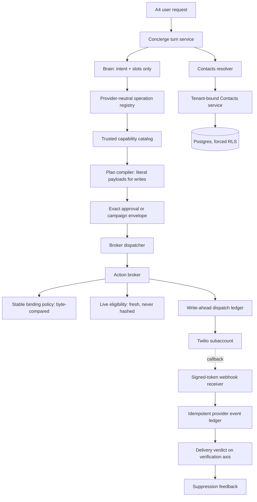
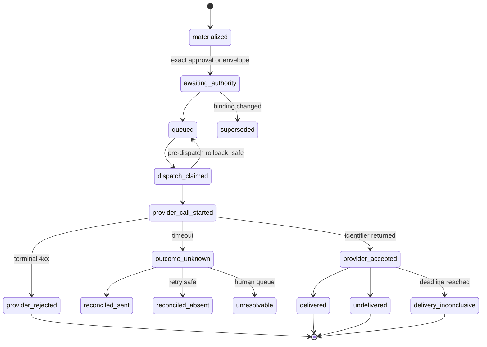
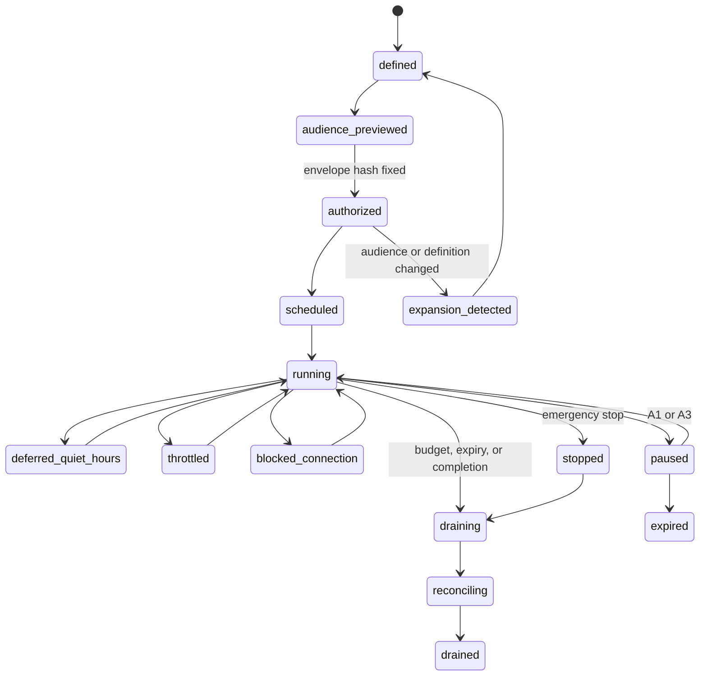
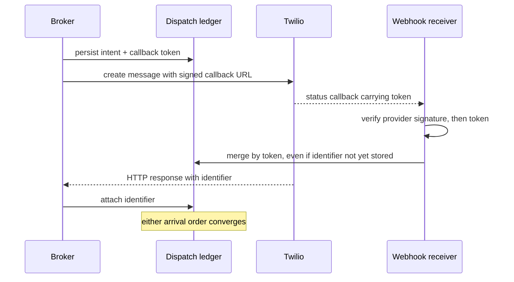
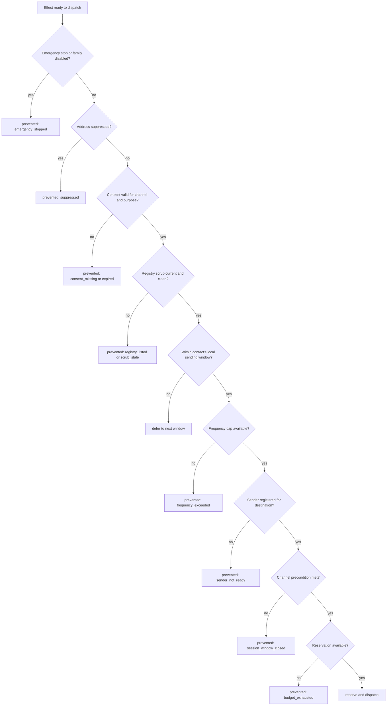

# General Twilio Orchestration and Contacts Directory

## Goal Capsule

- **Objective:** Extend the ACP-TASK Concierge into a catalog-driven Twilio orchestrator for SMS, WhatsApp, and voice, backed by a tenant-isolated Contacts directory, executing through the existing Vault, workflow, approval, broker, worker, and audit boundaries.
- **Authority hierarchy:** The trusted capability catalog outranks the operation manifest. A requirement outranks a Key Technical Decision on product behavior; a KTD outranks a unit on implementation mechanism. Where this plan and the origin document disagree, the origin wins on product intent.
- **Execution profile:** Six phases, dependency-ordered. Phase 1 is blocking for every later phase. No paid effect ships before U1, U10, U11, and U13 are green.
- **Stop conditions:** Stop and surface rather than guess when a change would widen product scope, weaken a fail-closed path, or require choosing between two defensible readings of a requirement. The Open Questions section names the ones already known.
- **Tail ownership:** Each phase ends at a measured gate recorded in `docs/operations/`, not at "tests pass".

---

## Product Contract

### Summary

Add general Twilio orchestration and an account-isolated Contacts directory to ACP-TASK, mirroring the five-layer authority separation the Slack integration established. Contacts ships first because every communication effect resolves through it. Messaging, campaigns, and voice follow as independently gated families. Conversational voice runs on the xAI Grok speech-to-speech runtime bridged over Twilio Media Streams, keeping the LLM, its tools, and every private-data lookup on ACP-TASK infrastructure.

The regulatory machinery — consent evidence, quiet hours, opt-out, suppression, frequency, spend — is built as a per-jurisdiction rule table with one market activated at launch and the rest hot-patchable as data.

### Problem Frame

Customers coordinate communications through a mixture of personal telephone numbers and Twilio numbers. Contacts, consent, ownership, conversation history, and responsibility for follow-up disperse across those channels, while a request as ordinary as "send Juana a WhatsApp" still requires a person to find the right number and drive the Twilio console by hand.

Twilio introduces risks the Slack work never faced. Effects cost money and cannot be unsent. They reach people who did not opt into ACP-TASK. Outcomes are frequently ambiguous rather than success or failure. Voice happens in real time against an unauthenticated caller. And autonomous campaigns multiply every one of those risks by the size of an audience.

Three facts discovered during planning reshape the work more than any requirement does. Twilio offers **no idempotency key** on message or call creation, so exactly-once must be built in ACP-TASK's own ledger. WhatsApp permits **one WABA per Twilio account**, which forces subaccount-per-customer rather than making it a choice. And Twilio **consolidates billing at the parent account** with no per-subaccount ceiling, so every spend control in this product is ours to build.

### Actors

- A1. Account administrator — configures Twilio, the contact hierarchy, permissions, consent policy, campaign limits, and emergency controls for one ACP-TASK account.
- A2. Contact manager — creates, imports, organizes, corrects, and validates contacts within authorized branches.
- A3. Campaign operator — prepares audiences and campaigns within branches where they hold campaign authority.
- A4. Ordinary user — asks the Concierge to communicate with a named contact and reviews exact effects when approval is required.
- A5. ACP-TASK agent — interprets requests, proposes contacts and effects, and operates only through trusted capabilities and current policy.
- A6. External contact — receives or initiates SMS, WhatsApp, or voice communication and can opt out.
- A7. Human responder — receives transferred calls according to department, language, schedule, and fallback rules.

### Key Flows

- F1. Connect and prepare Twilio
  - **Trigger:** An account administrator enables Twilio for an ACP-TASK account.
  - **Actors:** A1, A2
  - **Steps:** Connect the Twilio authority, provision or bind a subaccount, prove ownership of each selected communication identity, register senders for their destination markets, configure callback URLs, set limits, import or build the contact hierarchy, record authorization evidence, verify readiness.
  - **Outcome:** Only the current account can discover and use its Twilio connection, senders, contacts, and policies.
  - **Covered by:** R1, R2, R3, R8, R13, R16, R21, R24

- F2. Send an individual message or place a call
  - **Trigger:** A user asks in natural language to contact a named person.
  - **Actors:** A4, A5, A6
  - **Steps:** Identify an allowed capability, resolve the canonical contact, select a currently authorized channel and a sender able to reach it, materialize the exact destination and content or call definition, obtain approval, dispatch at most once, reconcile, and report the verified or uncertain outcome.
  - **Outcome:** The intended contact receives one authorized communication, or the user receives an actionable reason it could not be sent.
  - **Covered by:** R4, R8, R9, R10, R14, R15, R22, R23, R25, R27

- F3. Run an autonomous campaign
  - **Trigger:** An authorized operator activates a campaign definition.
  - **Actors:** A1, A3, A5, A6
  - **Steps:** Choose a permitted branch, list, or segment; fix content, channels, schedule, limits, and budget; review the eligible audience and its exclusions; authorize; then execute individual effects under that unchanged authorization while enforcing live eligibility per effect.
  - **Outcome:** Eligible contacts are processed within the authorized envelope, with per-contact outcomes, aggregate progress, spend visibility, pause, and emergency stop.
  - **Covered by:** R7, R10, R11, R12, R13, R14, R15, R21, R26, R28

- F4. Handle an inbound call
  - **Trigger:** A contact calls an ACP-TASK-managed Twilio number.
  - **Actors:** A5, A6, A7
  - **Steps:** Verify the provider signature, resolve the receiving identity to its account, check emergency stop, disclose the automated nature and obtain recording consent where required, answer only from an approved public corpus, and transfer by department, language, schedule, and fallback rule.
  - **Outcome:** The caller receives an allowed answer or reaches the best configured human destination without the agent exposing private information or performing sensitive actions.
  - **Covered by:** R5, R6, R8, R14, R17, R21, R24

- F5. Handle an inbound message
  - **Trigger:** A contact sends SMS or WhatsApp to an ACP-TASK-managed identity.
  - **Actors:** A5, A6
  - **Steps:** Verify the signature, resolve the identity to its account, persist the event idempotently, apply opt-out keywords as an immediate suppression, open or refresh the WhatsApp session window, and associate to a contact only when the address already resolves within that account.
  - **Outcome:** Inbound intent — especially opt-out — is honored before the next outbound effect, without creating or mutating contact records.
  - **Covered by:** R5, R7, R12, R16, R19, R23, R25

### Requirements

**Trusted Twilio orchestration**

- R1. Twilio must be a first-class, account-scoped integration with observable connection status, reconnect and disconnect controls, enabled capability families, owned sender identities, and a fail-closed unavailable state.
- R2. "Any supported Twilio task" must mean an operation present in a versioned trusted catalog and permitted by the live connection, account policy, actor authority, rollout state, destination consent, and provider state; a model must never invent arbitrary Twilio API operations or parameters.
- R3. SMS, WhatsApp, and voice must be independently enableable, observable, rate- and spend-limited, auditable, and disableable without breaking the other families.
- R4. The Concierge must interpret ordinary Spanish, English, typo-tolerant, and mixed-language requests for individual messages and calls, multi-step requests, and campaign preparation without requiring command syntax.
- R5. The product must receive and associate inbound SMS, WhatsApp messages, delivery events, calls, and call outcomes with the correct account, Twilio identity, contact when known, and conversation or campaign context.
- R6. The inbound voice agent may disclose approved public information and transfer calls, but it must not access private contact data for the caller, modify records, or perform sensitive business actions on the caller's instructions.

**Account-isolated Contacts**

- R7. Each ACP-TASK account must have a completely isolated Contacts directory; no user, agent, search, campaign, import, export, or provider callback may reveal or use another account's contact data.
- R8. Contacts must support an account-owned hierarchy of organizations, departments, and freely nested subfolders, with navigation by path, safe branch moves, global search within authorized branches, and no cyclic ancestry.
- R9. Each person must have one canonical contact record and one primary tree location, while lists, tags, and dynamic segments may reference that record across campaign and operational groupings without creating copies.
- R10. A contact must carry the communication information needed to make safe decisions, including names, channel addresses, locale and timezone where known, authorized channels, consent evidence and status, exclusions, activity history, and current suppression state.
- R11. Branch permissions must be independently grantable for viewing, editing, administering, and using contacts in campaigns; permissions inherit to descendants unless an authorized administrator applies an explicit restriction.
- R12. Contacts may be added manually, imported during or after Twilio setup, or proposed conversationally by an agent. Agent proposals and changes to identity, destination, consent, or permissions require an authorized human decision before becoming usable.
- R13. When a name resolves to multiple records, the system may prefer the most recently human-confirmed match only when it remains policy-compatible; tied, conflicting, stale, or insufficient matches require disambiguation before any effect is materialized.

**Effects, approval, and campaigns**

- R14. Every individual outbound communication outside an active campaign authorization must present the exact canonical contact, masked destination, channel, sender identity, content or call purpose, and estimated material consequence before human approval; changing any of these invalidates approval.
- R15. A campaign may execute individual messages or calls without per-effect human approval only after an authorized operator fixes and authorizes its audience rule, content or voice behavior, channels, senders, schedule, frequency, budget, concurrency, duration, and stop conditions. Expansion or material change invalidates that authorization.
- R16. Campaign eligibility must be evaluated again before each effect. Missing or expired consent, opt-out, suppression, permission loss, budget exhaustion, quiet hours, frequency limits, or emergency stop must prevent dispatch even if the contact was eligible when the campaign began.
- R17. Voice campaigns and inbound voice handling must support configurable human transfer by department, language, operating hours, primary destinations, fallback destinations, and a truthful no-responder outcome.

**Reliability, safety, and accountability**

- R18. Replayed requests, concurrent workers, retries, provider timeouts, restarts, duplicate callbacks, and repeated approvals must not produce duplicate messages or calls. Ambiguous provider outcomes must be reconciled before another potentially duplicative dispatch.
- R19. Every connection, contact change, consent decision, resolution, campaign authorization, policy decision, dispatch, delivery event, call transfer, suppression, reconciliation, and emergency action must produce a tenant-scoped audit trail without exposing secret credentials or unnecessary contact content.
- R20. Account administrators must be able to pause a campaign, disable one capability family, disable a sender, enforce hard spend and volume ceilings, and invoke an account-wide Twilio emergency stop with a clear view of effects already dispatched versus prevented.

**Added during planning**

These state behavior the origin requirements imply but leave unspecified, and without which the origin requirements cannot be implemented or tested. Each names the origin requirement it completes.

- R21. Every outbound effect must reach a terminal delivery verdict within a per-channel deadline; a missing final provider verdict at the deadline is recorded as inconclusive, never as pending indefinitely. Completes R18 and makes the outcome buckets in R20 sum.
- R22. Delivery truth is a verdict distinct from dispatch success. Provider acceptance means only that Twilio returned an identifier; delivery, non-delivery, and call disposition are later provider-driven verdicts. Completes R5.
- R23. Consent is scoped per address, channel, and purpose category. Suppression is a separate axis from consent, and address usability is a third. A restrictive transition — opt-out, suppression, bounce — is self-executing and immediate; a permissive transition — grant, un-suppress, re-opt-in — requires an authorized human decision. Completes R10, R12, and R16, and resolves their apparent conflict.
- R24. A communication identity must be globally unique across accounts, possession-verified before enablement, and time-versioned so that a provider callback is attributed to the account that owned the identity at the event's timestamp. Completes R7 for the provider-callback surface it names.
- R25. Live eligibility must be re-evaluated immediately before every effect, not only campaign effects. Completes R16.
- R26. A hard spend ceiling is a reservation ceiling: cost is reserved at dispatch against a worst-case estimate and settled on completion. Completes R15 and R20, neither of which is enforceable as a read-check.
- R27. An outbound call's approved definition comprises its voice persona and version, verbatim opening script, allowed-topic policy and version, maximum duration, transfer policy, and recording flag. Completes R14, whose "content or call purpose" is otherwise not hashable.
- R28. Emergency stop applies account-wide to inbound handling as well as outbound dispatch, and its effect on calls already in conversation is an explicit configured choice. Completes R20.

### Acceptance Examples

- AE1. **Covers R7, R8, R11.** Given two ACP-TASK accounts connected to Twilio, when a user searches, browses, imports, or targets a campaign, only contacts and branches authorized inside that user's current account are available.
- AE2. **Covers R9, R13, R14.** Given "Juana" has one canonical record in `Acme/Ventas` and belongs to both `VIP` and `Renovaciones`, when a user asks to send her a WhatsApp message, the preview references that one record and does not create or choose a duplicate.
- AE3. **Covers R12.** Given the Concierge is told a new phone number for Juan, when the agent proposes adding it, the number remains unavailable for communication until an authorized contact manager approves the proposal and its consent state.
- AE4. **Covers R14.** Given an approved SMS draft, when the user changes its text, recipient, destination number, sender, or channel, the previous approval becomes invalid and dispatch remains blocked until the revised effect is approved.
- AE5. **Covers R15, R16.** Given an authorized campaign aimed at a branch and its descendants, when a contact opts out after campaign activation but before their turn, that contact is suppressed without requiring the campaign to be recreated.
- AE6. **Covers R15, R20.** Given an autonomous call campaign reaches its spend ceiling or an administrator activates emergency stop, when more contacts remain queued, no new calls begin and the product distinguishes completed, in-progress, prevented, and uncertain outcomes.
- AE7. **Covers R6, R17.** Given an inbound caller asks for private account information, when the voice agent cannot answer under its public-information policy, it refuses to disclose the data and offers transfer using the configured department, language, schedule, and fallback rules.
- AE8. **Covers R18.** Given Twilio times out after accepting a message or call request, when the worker resumes, ACP-TASK reconciles the original effect instead of blindly dispatching a duplicate.
- AE9. **Covers R2, R3.** Given the model proposes a Twilio operation that is absent from the trusted catalog or disabled for the account, when the plan is validated, the operation is rejected with a named limitation and no provider call occurs.
- AE10. **Covers R9, R15.** Given one contact belongs to two lists both targeted by a single campaign, when the audience is materialized, exactly one effect exists for that person on that channel.
- AE11. **Covers R7, R24.** Given a number released by one account and acquired by another, when a delivery callback for the first account's effect arrives after the transfer, it is attributed to the account that owned the number at the event timestamp and is invisible to the new owner.
- AE12. **Covers R14, R16.** Given an approved free-form WhatsApp message, when the recipient's session window closes before dispatch, the effect is blocked and requires approval of a template variant; no silent substitution occurs.
- AE13. **Covers R18, R22.** Given duplicated and out-of-order status callbacks for one effect, when all are processed, the effect holds one non-regressing verdict and no duplicate provider call was made.
- AE14. **Covers R20, R28.** Given an administrator activates emergency stop while calls are in conversation, when the configured choice is to end them, live calls terminate per that choice, inbound handling degrades to transfer-only, and the outcome report distinguishes ended-by-stop from completed.

### Success Criteria

- Users can ask ACP-TASK to contact a named authorized person without locating a number or operating the Twilio console.
- Administrators can organize large directories through a familiar hierarchy while using lists and segments without duplicating people.
- Campaign operators can run bounded autonomous messaging and calling campaigns and understand eligible, excluded, completed, failed, and uncertain outcomes.
- External contacts' current consent, opt-outs, quiet hours, and suppression reliably override campaign intent.
- Inbound callers receive an approved public answer or a predictable human-transfer path without exposure of private data.
- Cross-account contact access and cross-account Twilio execution are denied in positive, negative, concurrent, callback, and recovery scenarios.

### Scope Boundaries

#### In scope

The full origin scope: Twilio connection and sender management, SMS, WhatsApp, outbound and inbound voice with human transfer, autonomous campaigns, and the Contacts directory with hierarchy, permissions, lists, segments, consent, and suppression. Plus the shared-foundation refactors Phase 1 names, which are prerequisites rather than adjacent cleanup.

#### Deferred to Follow-Up Work

- Number purchase, porting, hosting, and release from within ACP-TASK. Phase 3 binds numbers already provisioned in the Twilio console.
- A2P brand and campaign registration, and WhatsApp template authoring, as ACP-TASK surfaces. The plan reads and enforces their state; it does not create them.
- Cross-provider composition, such as a Slack read feeding a Twilio send. The compound-plan floor is unfinished for Slack alone.
- Agent-driven duplicate-merge reasoning. Deterministic import dedupe plus human review satisfies the origin requirements.
- Import column-mapping proposals and agent-authored segments or campaigns.
- Multi-channel fallback ladders, where a failed SMS retries as voice. That is a different effect requiring different consent.

#### Deferred for later

- Rich sales-pipeline functionality such as deals, forecasting, marketing attribution, and full CRM replacement beyond the contact, activity, segmentation, and communication needs defined here.
- Additional communication providers behind the same product surface; the requirements preserve a catalog-driven shape but this scope delivers Twilio.
- Automated private-data lookup or transactional business actions during inbound voice conversations; these require a separate identity-verification and delegated-authority product decision.

#### Outside this product's identity

- A raw Twilio API console where a model chooses unreviewed methods or arbitrary parameters.
- Cross-account directories, discoverability, campaign audiences, credential reuse, or communication execution.
- Purchased, scraped, or otherwise unverified contact lists treated as authorized recipients.
- Unlimited autonomous outreach without consent, suppression, budget, frequency, schedule, permission, audit, and emergency controls.
- Treating a folder path, display name, model confidence, inbound message, or caller statement as authorization.

### Key Decisions

- One product, not a separate Twilio application: extend ACP-TASK's existing integration, orchestration, approval, and audit experience. Governs R1, R2.
- Trusted capability breadth over arbitrary API access: usefulness comes from reviewed catalog operations and bounded composition. Governs R2.
- S3-like hierarchy plus HubSpot-like contact behavior. Governs R8, R9, R10.
- Account isolation is the primary boundary; organizations and departments organize contacts inside one account. Governs R7, R11, R24.
- One primary location per contact; cross-cutting membership uses lists, tags, and segments. Governs R9.
- Branch-level permission dimensions are separate authorities inheriting downward with explicit restrictions. Governs R11.
- Exact approval for individual effects, bounded authorization for campaigns. Governs R14, R15, R16, R25.
- Voice agent as public-information front line; sensitive actions and private-data access remain unavailable. Governs R6, R17.

---

## Planning Contract

### Key Technical Decisions

- KTD1. **Provider-neutral operation registry before any Twilio code.** `agents/orchestrator/slack_operations.py` hardcodes the manifest version, rejects operation ids not prefixed `slack.`, and rejects definitions whose provider is not Slack. Generalize it to a provider-parameterized registry rather than forking a Twilio copy, so the rule that a manifest may never declare authority has one implementation. *(session-settled: user-approved — chosen over forking a Twilio copy: two copies of the authority-join logic diverge, and authority is the one thing that must not.)* Governs R2.
- KTD2. **Twilio authority is modeled as synthetic scopes derived from verified account state.** The whole authority spine is scope-shaped — the policy evaluator and the runtime registry both require the definition's required scopes to be a subset of the connection snapshot's scopes — and Twilio has no scopes. Derive them: per family, per sender, per destination geography, per approved WhatsApp template. Disabling a sender then becomes scope removal plus a credential-version bump, and every in-flight binding fails closed through paths that already exist. Governs R1, R3, R20.
- KTD3. **Split R2's single gate into stable binding policy and live eligibility.** The broker re-evaluates policy at dispatch and requires the result to be byte-equal to the stored decision. Consent, opt-out, suppression, quiet hours, frequency, budget, sender readiness, and the WhatsApp window all change legitimately between plan time and dispatch, so folding them into that decision hash makes every lawful suppression indistinguishable from tampering. Live eligibility is evaluated server-side inside the same transaction that consumes the lease, produces its own reason code, and never enters the decision hash. Governs R2, R16, R25.
- KTD4. **Delivery truth lives on the verification axis, not the execution axis.** Execution status completed means only that Twilio accepted the request and returned an identifier. Delivery, non-delivery, and call disposition are later verdicts on `verification_status`, whose `inconclusive` value already exists and is unused. Collapsing the two would force a rewrite of the executor and break completion persistence. Governs R21, R22.
- KTD5. **A campaign is a generator, not a workflow revision.** The plan compiler caps a revision at ten steps, the executor claims exactly one step per call, the worker drains one revision synchronously before touching the next, and reference resolution cannot index a list. A campaign therefore mints one short revision per contact-cycle under its own claim loop, concurrency cap, and tenant fairness. Governs R15, R16.
- KTD6. **The campaign envelope is a third authorization mode.** Workflow approvals already carry explicit-write and requested-read modes gated by a step-authorization predicate. Add campaign-envelope, authorized once, admitting write steps only while the envelope hash, budget, and stop conditions hold. Approval time-to-live becomes a per-mode parameter — the current default of fifteen minutes is meaningless for a multi-day campaign, so envelope duration is a separate field. Governs R15.
- KTD7. **The envelope binds a cohort snapshot, not just an audience rule.** A rule and its materialization diverge; without a snapshot and a ceiling, "expansion invalidates authorization" is unfalsifiable and a routine branch move silently changes reach. Bind rule hash, snapshot id, and cohort ceiling, with late arrivals excluded by default. Governs R15.
- KTD8. **The webhook is the primary reconciler; provider polling is the fallback.** Twilio's message list filters only by destination, origin, and a day-granular date, with no correlation identifier, so interval queries degrade badly — two identical messages to one number in the same second are indistinguishable. Instead, carry a signed self-identifying token in the callback URL so correlation never depends on the provider identifier. This also resolves a callback arriving before the dispatch response is persisted, and attributes callbacks for effects the system has no record of. It is not retrofittable onto effects already in flight. Governs R18, R24, AE8, AE13.
- KTD9. **Exactly-once is a write-ahead ledger in ACP-TASK.** Twilio supports no idempotency key on message or call creation — verified against the message resource, call resource, and request references. Persist intent against our own dispatch key before the provider call, record the returned identifier after, and on timeout move to an explicit ambiguous state rather than retrying. Rate-limit responses are the one documented always-safe retry. Governs R18.
- KTD10. **Twilio write payloads must be literal, never references.** Approved-template matching permits any resolved value at a reference node with no type or domain constraint, so a recipient behind a reference can change after approval and the check still passes — which defeats the acceptance example that says changing the recipient invalidates approval. Enforce at plan-compile time: every field named in a write's preview fields must be literal. Campaign safety therefore rests on an audience-membership proof bound to the envelope, not on template matching. Governs R14, AE4.
- KTD11. **Contacts live in Postgres under forced row-level security.** The conversational runtime is SQLite with no RLS, organization binding is never called on the request path, the action repository has no tenant predicate at all, and an unmapped principal silently lands in the local tenant. A directory of personal data cannot inherit that surface. The orchestrator reads contacts through a tenant-bound service, never a direct join, and the local-tenant fallback becomes a hard failure. *(session-settled: user-approved — chosen over following the concierge's SQLite path: SQLite offers no backstop, and one forgotten predicate is a cross-account leak of personal data.)* Governs R7.
- KTD12. **Consent, suppression, and address usability are three independent axes.** A contact can simultaneously hold a valid grant and a bounce suppression; one enum cannot express that. Consent is scoped per address, channel, and purpose — without purpose scoping a marketing opt-out blocks a service notification, or a marketing campaign runs on transactional consent. Governs R10, R12, R23.
- KTD13. **Restrictive consent transitions self-execute; permissive ones require a human.** This resolves the direct conflict between the requirement that consent changes need human approval and the requirement that inbound opt-outs suppress immediately. Twilio's automatic keyword handling restores provider-level reachability without ACP-TASK gaining consent, so the two are tracked separately. Governs R12, R16, R23.
- KTD14. **Spend is a reservation ledger, not a read-check.** Two concurrent campaigns each pass a read-check and jointly exceed the ceiling. Voice cost is unknown until the call ends, and SMS is billed per segment. Reserve at dispatch on worst-case duration times destination rate, settle on completion. The account ceiling strictly dominates the campaign budget and carries a distinct reason code so an operator does not pointlessly re-authorize. Governs R15, R20, R26.
- KTD15. **Twilio topology is one subaccount per customer account.** Not a preference — WhatsApp permits one WABA per Twilio account, and Twilio's own ISV guidance maps each customer to an exclusive subaccount with its own secondary customer profile, brand, and numbers. Consequences the plan must absorb: billing consolidates at the parent with no per-subaccount cap, parent suspension cascades, main-account API keys cannot reach subaccount resources, and multi-tenancy throughput fairness explicitly excludes US A2P traffic. Governs R1, R3, R7.
- KTD16. **WhatsApp template and free-form sends are distinct trusted capabilities.** Their preconditions differ — a free-form send requires an open session window, a template send requires an approved template of a matching category. A single capability makes that precondition invisible to the policy layer, which is the exact failure mode the trusted catalog exists to prevent. Governs R2, R16, AE12.
- KTD17. **Conversational voice runs on the xAI Grok speech-to-speech runtime over Twilio Media Streams.** Grok's realtime endpoint supports G.711 μ-law natively, so audio passes from the phone leg to the model without transcoding; it is full-duplex with native turn-taking, supports function calling and automatic language detection across twenty-plus languages, and is compatible with the OpenAI Realtime specification. Tool execution stays on ACP-TASK infrastructure, which is what keeps the private-data boundary ours. Pin an explicit model version rather than the moving alias — an approval that hashes a voice persona must be reproducible. *(session-settled: user-directed — chosen over Twilio ConversationRelay: speech-to-speech removes the text round-trip, costs less per minute, and needs no transcoding given native μ-law.)* Governs R6, R17, R27.
- KTD18. **Telephony stays in our subaccounts regardless of the voice runtime.** The durable lock-in is the number and its reputation, not the model. With numbers, brands, and caller-ID reputation held in ACP-TASK subaccounts, changing voice runtime is a re-point, not a port and not a reputation rebuild. Write the tool layer as a plain HTTP surface with no vendor-specific types. Governs R17.
- KTD19. **Regulatory rules are a hot-patchable per-jurisdiction data table with one market active at launch.** Quiet hours, consent evidence requirements, registry scrub cadence, recording consent mode, and disclosure obligations are data, not code. Several jurisdictions' details could not be confirmed against primary sources during planning, and a dozen of them will move. *(session-settled: user-approved — chosen over activating the United States, Spain, and Latin America at once: the machinery is identical either way, and unverified rules should not become deployed code.)* Governs R16, R25.
- KTD20. **Capability families and emergency stop become durable per-tenant state.** Every kill switch today is a process-wide environment variable requiring a restart, and per-account enablement is derived from granted OAuth scopes at callback — a path Twilio never takes. Emergency stop is enforced in the broker, not only the orchestrator, because the orchestrator is the thing being stopped. Governs R3, R20, R28.
- KTD21. **Candidate disambiguation binds identifiers, not display labels.** The Concierge's candidate buttons return a display string, with the identifier used only as a render key. That is tolerable for Slack, where the value is re-resolved against an entity graph, and unacceptable when the resolved value determines who receives a paid message. Governs R13.

### High-Level Technical Design

#### Dispatch path

The two policy boxes are the load-bearing separation. Binding policy answers "is this actor allowed to run this capability on this connection" and its answer must not drift. Eligibility answers "may this specific person be contacted right now" and its answer is expected to drift.

#### Individual effect lifecycle

Execution status and verification status are orthogonal axes that already exist. Delivery truth is assigned to the second.

`dispatch_claimed` is the only state after claim from which retry is safe. Everything past `provider_call_started` requires reconciliation before another attempt.

#### Campaign lifecycle

`deferred_quiet_hours` and `throttled` are normal oscillations, not errors. `blocked_connection` exists because connection loss is currently retryable with a capped attempt count — a ten-minute provider outage would otherwise convert an entire campaign into attempt exhaustion. A campaign cannot reach `drained` while any effect is unreconciled, because the uncertain outcome bucket must be truthful.

#### Webhook-first correlation

The token makes the callback self-identifying, so correlation never depends on the provider identifier having been persisted first. A callback that arrives is proof the effect happened, even when the HTTP response was lost.

#### Live eligibility gate

Registry-scrub staleness fails closed. Deferral is distinct from denial: a deferred contact returns, a denied one is terminal for this cycle.

### Assumptions

- Account and tenant are the same isolation boundary. The origin says account; the codebase says tenant everywhere. If one account may span tenants, every isolation test asserts the wrong boundary — resolve before the first migration.
- Customers hold or will provision Twilio identities capable of the enabled families in their operating regions.
- Existing personal and Twilio contacts described as authorized must still carry durable evidence, scope, status, and expiration; an undocumented assertion is not evidence.
- Personal numbers participate only through a supported migration, forwarding, verification, or linking arrangement.
- Campaign autonomy assumes an authorized operator is accountable for the fixed definition even though individual effects receive no separate approval.

### Open Questions

#### Resolved during planning

- Separate project or current repository: extend ACP-TASK.
- Model role: the model interprets and proposes; deterministic code authorizes, grounds, materializes, and executes. Send and call steps compile directly from resolved contact state rather than from a model-authored graph — the Slack baseline measured zero completion for model-planned read paths against full completion for compiled ones.
- Twilio account topology: subaccount per customer, forced by the WhatsApp one-WABA rule (KTD15).
- Provider-event reconciliation mechanism: signed callback token as primary, polling as fallback (KTD8).
- Voice runtime: Grok speech-to-speech over Media Streams with a pinned model version (KTD17).
- Idempotency: none available from Twilio; a write-ahead ledger is the substitute (KTD9).

#### Deferred to implementation

- Which single market is activated at launch, and therefore which jurisdiction rows are enabled first.
- Exact Twilio method coverage inside each family: confirm availability, credential type, rate tier, and product-plan constraints while implementing each descriptor.
- What `credential_version` means for a static Twilio credential, which has no refresh token and rotates manually. Decide before it becomes an accidental invariant.
- Whether an "exists but not visible" affordance is offered when a contact resolves outside the requester's authorized branches. The affordance is itself a disclosure; the alternative silently invites a duplicate.
- Answering-machine detection for transfer legs, or redefining no-responder as "no leg reached an answered state within the transfer budget". The second is truthful about what is observable; the first is probabilistic and adds latency.

#### Requires verification before the affected rule is enabled

Planning could not confirm these against primary sources. Each is enabled as data only after direct verification, and none is a design input.

- Whether Colombia's contact-window and frequency rules extend beyond debt collection to general outreach. This is the difference between a simple quiet-hours check and a stateful per-contact frequency governor.
- Mexico's exclusion-registry refresh cadence, and Colombia's exclusion-registry query mechanics.
- Spain's Robinson list query validity period, and the reported mobile-number restriction for commercial calls.
- United States state-level AI-disclosure statutes and their operative dates. The European transparency duties are confirmed; the state layer is not.
- State quiet-hours overlays that are stricter than the federal window.

### System-Wide Impact

- **Tenant isolation.** This is the first product surface holding personal data of people who are not ACP-TASK users. It forces the Postgres decision (KTD11) and makes the existing untenanted action repository and the local-tenant fallback into blocking defects rather than latent ones.
- **Authority model.** Adding a non-OAuth provider changes the credential connector contract, the policy evaluator's scope subset check, and the authority-profile enumeration, which currently denies anything other than the bot profile. Slack and Google behavior must remain observably unchanged.
- **Execution certainty.** Paid, irreversible effects raise the cost of every ambiguity the Slack work tolerated. Four existing defects become communication incidents at campaign volume.
- **Audit.** The broker emits nothing to the audit service today; its trail is a signed attestation and a proposal row. Dispatch, delivery, transfer, suppression, spend, and emergency actions all need a tenant-scoped trail. The existing outcome-metric allowlists are deliberately content-free and must not be widened to carry compliance evidence — that is a separate store.
- **Receipt hygiene.** Forbidden receipt keys cover tokens only. A Twilio receipt carries a destination phone number into stored receipts, workflow output, and browser payloads. No masking helper exists anywhere in the repository.
- **Local development.** A Twilio callback cannot reach a localhost development server. A public tunnel base URL becomes a required local-dev variable.
- **Coverage floor.** CI enforces a coverage minimum; a large surface of new code lands against it.

### Risks & Dependencies

| Risk | Impact | Mitigation |
|---|---|---|
| Blind retry after an ambiguous outcome double-sends a paid effect | Duplicate messages to real people; no provider-side guard exists | Ambiguous is a terminal state until reconciled (KTD9); the campaign scheduler may skip an ambiguous contact but never retry it |
| Consent folded into the hashed binding decision | Every lawful suppression surfaces as a tampering error and no skip reason is recorded | KTD3 splits the evaluators; a test asserts a mid-campaign opt-out produces a named skip, not a stale-policy denial |
| Campaign payloads materialized at authorization time | Template matching rejects every per-contact dispatch | Envelope binds a cohort snapshot and an audience-membership proof (KTD7, KTD10) |
| Provider outage burns the retry budget | A ten-minute outage mass-fails a campaign as attempt exhaustion | Connection loss pauses the campaign and freezes attempt counters |
| Number reassigned between accounts | Callbacks for the prior owner's effects reach the new owner: a cross-account leak | Identity ownership is globally unique, possession-verified, and time-versioned (R24, KTD8) |
| Voice model alias moves under a hashed approval | An approved call definition is no longer reproducible | Pin an explicit model version (KTD17) |
| Unverified regulatory rules encoded as behavior | The product enforces rules that do not apply, or misses ones that do | Rules are data, one market active, verification gate before enabling a row (KTD19) |
| Parent-account suspension | Every tenant loses service simultaneously | Accepted consequence of the forced topology (KTD15); monitor parent-account health as a first-class signal |
| Existing credential-disappearance defect | A connection reports healthy while its credential is absent | Carried from the Slack baseline; a third connector reuses that path, so reproduce it before Phase 3 ships |

---

## Implementation Units

### Unit index

| U-ID | Title | Key files | Depends on |
|---|---|---|---|
| U1 | Repair the four execution-certainty defects | `agents/orchestrator/workflow_broker_dispatcher.py`, `services/workflow_worker/app.py` | — |
| U2 | Make the operation registry and broker seams provider-neutral | `agents/orchestrator/slack_operations.py`, `services/action_broker/app.py` | U1 |
| U3 | Support non-OAuth credentials and synthetic Twilio scopes | `libs/connectors/base.py`, `agents/orchestrator/policy.py` | U2 |
| U4 | Make capability families and emergency stop durable per-tenant state | `services/action_broker/composition.py`, `migrations/0015_provider_control_plane.sql` | U2, U3 |
| U5 | Create the Contacts store and hierarchy under row-level security | `migrations/0016_contacts.sql`, `libs/contacts_repository.py` | U1 |
| U6 | Model consent, suppression, and address usability as independent axes | `migrations/0017_contact_consent.sql`, `libs/contacts_consent.py` | U5 |
| U7 | Add branch permissions, lists, tags, and dynamic segments | `migrations/0018_contact_permissions.sql`, `libs/contacts_permissions.py` | U5, U6 |
| U8 | Expose Contacts as trusted capabilities with grounded resolution and a review queue | `config/contacts_operations_v1.yaml`, `frontend/src/components/contacts/` | U2, U7 |
| U9 | Establish the Twilio connection, subaccounts, senders, and identity ownership | `libs/connectors/twilio.py`, `migrations/0019_twilio_identities.sql` | U3, U4 |
| U10 | Receive and reconcile Twilio provider events | `services/twilio_webhook/app.py`, `libs/twilio_signature.py` | U9 |
| U11 | Send SMS through a write-ahead dispatch ledger | `config/twilio_operations_v1.yaml`, `agents/orchestrator/dispatch_ledger.py` | U8, U10 |
| U12 | Record delivery truth and feed suppression | `agents/orchestrator/delivery_verdict.py` | U10, U11 |
| U13 | Evaluate live eligibility separately from binding policy | `agents/orchestrator/eligibility.py`, `libs/jurisdiction_rules.py` | U6, U11 |
| U14 | Reserve and settle spend against account and campaign ceilings | `libs/spend_ledger.py`, `migrations/0021_spend.sql` | U11, U13 |
| U15 | Add WhatsApp template and session-window handling | `libs/connectors/twilio.py`, `migrations/0022_whatsapp.sql` | U12, U13 |
| U16 | Authorize campaigns through a bounded envelope | `agents/orchestrator/campaign_repository.py` | U13, U14 |
| U17 | Generate and pace campaign effects | `services/campaign_worker/app.py` | U16 |
| U18 | Place outbound voice effects with exact approval | `config/twilio_operations_v1.yaml`, `agents/orchestrator/voice_definition.py` | U13, U14 |
| U19 | Bridge Twilio Media Streams to the Grok speech-to-speech runtime | `services/voice_bridge/app.py` | U18 |
| U20 | Handle inbound calls and human transfer | `services/twilio_webhook/app.py`, `libs/transfer_routing.py` | U19 |
| U21 | Gate language quality and roll out by family | `tests/evals/twilio_language_cases.jsonl`, `docs/operations/` | U11, U15, U17, U20 |

---

### Phase 1 — Shared foundations

Nothing in later phases is safe until these land. Each addresses a defect or gap that becomes a communication incident once effects cost money.

### U1. Repair the four execution-certainty defects

**Goal:** Make dispatch certainty trustworthy before any irreversible effect uses it.

**Requirements:** R18, R21.

**Dependencies:** None.

**Files:**

- Modify: `agents/orchestrator/workflow_broker_dispatcher.py`
- Modify: `agents/orchestrator/workflow_executor.py`
- Modify: `agents/orchestrator/workflow_repository.py`
- Modify: `services/workflow_worker/app.py`
- Test: `tests/orchestrator/test_workflow_broker_dispatcher.py`
- Test: `tests/orchestrator/test_action_repository.py`
- Test: `tests/integration/test_workflow_restart_recovery.py`

**Approach:**

1. Move proposal creation inside the guard that classifies dispatcher failures, so the duplicate-prevention refusal is reported as a known-safe pre-dispatch rejection rather than laundered into an unknown outcome. Today it escapes into a bare exception handler and manufactures phantom uncertainty.
2. Invoke the existing reconciliation machinery from the worker tick. The reconciler, the provider-side reconciler, and the reconciliation-application method all exist and have no caller outside tests, which makes an unknown outcome permanently terminal and permanently blocks that proposal id.
3. Add a sweeper for proposals stuck in an executing state past a lease deadline, routing them into reconciliation.
4. Reclassify connection-unavailable so it pauses rather than consuming retry attempts.

**Execution note:** Add characterization tests for current retry, reconciliation, and failure-classification behavior before changing any of it.

**Patterns to follow:** The existing failure taxonomy separating pre-dispatch rejection from post-dispatch ambiguity; the outbox claim, lease, and dead-letter shape.

**Test scenarios:**

- Happy path: a reconciler run against an unknown outcome that the provider confirms transitions the effect to completed with its identifier and performs exactly one provider create across the whole sequence.
- Error path: a duplicate-prevention refusal raised before any provider call is classified as pre-dispatch and leaves the effect safely retryable.
- Error path: reconciliation that cannot reach the provider leaves the effect unknown, still blocks a new attempt, and creates a human-resolvable item.
- Concurrency: two worker ticks observing the same unknown outcome produce one reconciliation verdict.
- Restart: stopping the worker after claim, after provider receipt, and after projection resumes without duplicating an effect.
- Regression: existing Slack and Google flows remain green.

**Verification:** An unknown outcome is no longer terminal, and no failure path that precedes a provider call is reported as uncertain.

### U2. Make the operation registry and broker seams provider-neutral

**Goal:** Allow a third provider without duplicating the authority join.

**Requirements:** R2, R3.

**Dependencies:** U1.

**Files:**

- Modify: `agents/orchestrator/slack_operations.py`
- Modify: `libs/integrations/catalog.py`
- Modify: `services/action_broker/app.py`
- Modify: `services/action_broker/composition.py`
- Modify: `services/workflow_worker/app.py`
- Modify: `agents/orchestrator/policy.py`
- Test: `tests/orchestrator/test_slack_operations.py`
- Test: `tests/integrations/test_capability_definitions.py`

**Approach:**

1. Parameterize the registry by provider and manifest version, replacing the hardcoded operation-id prefix check and the provider equality check. Keep the trusted-only field rejection exactly as it is — it is the invariant the whole design rests on.
2. Replace the credential branch in the broker's provider operation path, which reads a sealed credential document directly for one named provider, with a per-runtime credential strategy.
3. Fix the scope check that inspects only the first required scope; make it a subset check. A compound Slack capability already declares two scopes and is under-validated today.
4. Register provider definitions from one place rather than the two hardcoded composition sites.
5. Bump the policy evaluator version, since decision hashes are compared for staleness at dispatch.

**Execution note:** This refactors shipped Slack code. Prove observable Slack and Google behavior is unchanged before adding anything Twilio-shaped.

**Patterns to follow:** The precedent set when Google was placed behind the runtime registry — a dedicated early unit whose acceptance criterion was that existing providers stay green.

**Test scenarios:**

- Happy path: a manifest for a non-Slack provider loads, joins to its catalog definitions, and produces a model projection carrying no authority fields.
- Error path: a manifest declaring any trusted-only field is rejected with the existing error.
- Error path: a manifest operation with no matching catalog definition fails closed.
- Security: a capability requiring two scopes is denied when the connection grants only one.
- Regression: every existing Slack and Google operation resolves, dispatches, and verifies unchanged.

**Verification:** A second provider's manifest loads through the same code path as Slack's, and the trusted catalog remains the only source of schema, scope, effect, risk, retry, and verifier.

### U3. Support non-OAuth credentials and synthetic Twilio scopes

**Goal:** Represent an account-identifier-plus-token credential and derive authority from verified account state.

**Requirements:** R1, R2, R3.

**Dependencies:** U2.

**Files:**

- Modify: `libs/connectors/base.py`
- Modify: `libs/integrations/catalog.py`
- Modify: `agents/orchestrator/policy.py`
- Modify: `services/oauth/app.py`
- Modify: `services/integrations/`
- Create: `migrations/0015_provider_control_plane.sql`
- Test: `tests/connectors/test_connector_contracts.py`
- Test: `tests/orchestrator/test_policy.py`
- Test: `tests/migrations/test_provider_control_plane.py`

**Approach:**

1. Split the credential connector contract so the authorization-redirect and refresh methods are optional for providers that do not use them. The rotation path currently raises when no refresh token exists.
2. Define synthetic scopes per KTD2 and derive them from verified account state at connection time and on re-verification, rather than from a consent callback.
3. Decide and document what credential version means for a manually rotated static credential, then enforce it consistently across binding, snapshot, and live comparison.
4. Add a Twilio authority profile to the policy evaluator, which currently denies everything but the bot profile.

**Patterns to follow:** The tenant-carrying composite foreign keys and forced row-level-security block used by every existing migration.

**Test scenarios:**

- Happy path: a static credential is stored, sealed, and resolved without any refresh attempt.
- Error path: a rotation attempt against a provider with no refresh authority returns a named limitation rather than raising.
- Error path: an operation whose synthetic scope was removed after a sender was disabled fails closed at dispatch with a named reason.
- Security: a credential-version mismatch across binding, snapshot, and live state denies dispatch.
- Regression: OAuth providers keep their existing authorization, refresh, and revoke behavior.

**Verification:** A non-OAuth provider connects, carries derived authority, and fails closed on every drift the OAuth providers already fail closed on.

### U4. Make capability families and emergency stop durable per-tenant state

**Goal:** Give administrators a runtime control plane instead of process-wide environment variables.

**Requirements:** R1, R3, R20, R28.

**Dependencies:** U2, U3.

**Files:**

- Modify: `services/action_broker/composition.py`
- Modify: `services/action_broker/app.py`
- Modify: `agents/orchestrator/dynamic_workflow_service.py`
- Modify: `migrations/0015_provider_control_plane.sql`
- Create: `frontend/src/components/integrations/CapabilityFamilyControls.tsx`
- Test: `tests/orchestrator/test_family_state.py`
- Test: `tests/integration/test_emergency_stop.py`

**Approach:**

1. Add tenant-scoped family, sender, and emergency-stop state, replacing the environment-variable dispatch policy and the hardcoded runtime operation allowlist. Wire the existing unused constructor seams for family flags and policy visibility.
2. Enforce emergency stop in the broker, not only the orchestrator, per KTD20.
3. Keep the existing paused-by-policy behavior so stopped work parks rather than fails, and extend the resume path, which today un-pauses only two literal reasons.
4. Ensure a family disable gates writes only; reconciliation reads must survive it, or a disabled family strands its own unknown outcomes permanently.

**Test scenarios:**

- Happy path: disabling one family for one tenant leaves the other families and every other tenant unaffected.
- Happy path: emergency stop parks queued work and the administrator sees dispatched, prevented, in-progress, and uncertain counts.
- Error path: a family disabled while an effect is unreconciled still permits the reconciliation read.
- Concurrency: a stop activated during a dispatch attempt either prevents it or records it as dispatched, never both.
- Restart: family and stop state survive a process restart with no environment change.
- Security: one tenant's administrator cannot alter another tenant's control plane.

**Verification:** Every switch the origin requirements grant an administrator is durable, tenant-scoped, effective without a restart, and enforced at the broker.

---

### Phase 2 — Contacts

### U5. Create the Contacts store and hierarchy under row-level security

**Goal:** Establish the canonical contact record and its account-owned tree.

**Requirements:** R7, R8, R9, R10.

**Dependencies:** U1.

**Files:**

- Create: `migrations/0016_contacts.sql`
- Create: `libs/contacts_repository.py`
- Modify: `web/concierge.py`
- Test: `tests/migrations/test_contacts_migration.py`
- Test: `tests/contacts/test_contacts_repository.py`
- Test: `tests/integration/test_contacts_isolation.py`

**Approach:**

1. Model organizations, departments, and freely nested folders with path navigation, a cycle guard on move, and tenant-carrying composite foreign keys.
2. Model one canonical contact per person with exactly one primary tree location, and addresses as separate rows so consent can attach to an address rather than a person.
3. Apply the forced row-level-security block and tenant-isolation policy used by every existing migration, per KTD11.
4. Convert the local-tenant fallback on the request path into a hard failure, and bind the organization identifier on every request that reaches contacts.
5. Add the tenant predicate to the action repository, which has none today and will hold destinations and message bodies.

**Execution note:** Write the cross-tenant negative tests before the read paths exist, so isolation is proven rather than assumed.

**Patterns to follow:** Composite unique keys carrying tenant so a cross-tenant child is structurally impossible; migration tests asserting on the migration text.

**Test scenarios:**

- Happy path: create a nested branch, place a contact, navigate by path, and move a subtree.
- Edge case: a move that would create cyclic ancestry is rejected.
- Edge case: two accounts holding the same phone number keep separate canonical records.
- Error path: a query lacking the tenant predicate fails rather than returning rows.
- Security: Covers AE1. A tenant-A session presenting a tenant-B identifier receives a not-found-shaped response, with no tenant-B bytes in body or logs.
- Security: an unmapped principal fails hard instead of landing in a default tenant.

**Verification:** Isolation holds at the database layer, not only in application predicates, and every contact read path is tenant-bound.

### U6. Model consent, suppression, and address usability as independent axes

**Goal:** Make consent decisions legally defensible and mechanically enforceable.

**Requirements:** R10, R12, R16, R23.

**Dependencies:** U5.

**Files:**

- Create: `migrations/0017_contact_consent.sql`
- Create: `libs/contacts_consent.py`
- Test: `tests/contacts/test_consent_axes.py`
- Test: `tests/contacts/test_consent_transitions.py`

**Approach:**

1. Implement the three axes from KTD12 as separate append-only state, with consent scoped per address, channel, and purpose category.
2. Store the evidence fields the regulatory envelope requires: capture method and timestamp, jurisdiction at capture, verbatim disclosure text snapshot, default-unchecked proof, legal basis, source, actor, and expiry.
3. Implement the permissive-versus-restrictive asymmetry from KTD13 as the transition authority rule.
4. Model revocation scope so it can be widened from per-program to cross-topic without a migration.
5. Set retention at a five-year floor, longer for recording evidence, using the existing content-expiry and purge pattern for message bodies while retaining the opt-out decision and its provenance beyond content expiry.

**Test scenarios:**

- Happy path: a contact holds a valid grant on one channel and a suppression on another simultaneously, and both are readable.
- Happy path: Covers AE5. An inbound opt-out suppresses immediately with no human step.
- Error path: an attempt to grant consent without a human decision is rejected.
- Error path: an un-suppress attempt by an agent or a contact manager is rejected; only an administrator may perform it.
- Edge case: provider-level keyword restart restores reachability without restoring consent, and the two are separately observable.
- Edge case: a marketing opt-out does not block a transactional effect on the same address.
- Edge case: consent past its expiry is treated as absent.
- Security: consent evidence is retained past message-body expiry.

**Verification:** No single enum collapses the three axes, and every transition's required authority and evidence are enforced rather than documented.

### U7. Add branch permissions, lists, tags, and dynamic segments

**Goal:** Make authority over contacts independently grantable and inheritable.

**Requirements:** R9, R11.

**Dependencies:** U5, U6.

**Files:**

- Create: `migrations/0018_contact_permissions.sql`
- Create: `libs/contacts_permissions.py`
- Modify: `libs/contacts_repository.py`
- Test: `tests/contacts/test_branch_permissions.py`
- Test: `tests/contacts/test_lists_and_segments.py`

**Approach:**

1. Implement view, edit, administer, and campaign-use as four independent dimensions inheriting to descendants with explicit restriction, per the origin's branch-permission decision.
2. Implement lists, tags, and dynamic segments as references to canonical records, never copies.
3. Add the redacted audience projection: an operator holding campaign-use but not view must be able to review counts, an exclusion-reason histogram, and masked destinations without names or notes.
4. Add the backend masking helper, which does not exist anywhere in the repository, and make the mask discriminating enough to distinguish two contacts — country, last digits, branch path, and last-contacted.

**Test scenarios:**

- Happy path: a grant on a branch inherits to descendants and an explicit restriction overrides it.
- Happy path: one contact appears in two lists without a second record existing.
- Error path: a principal with campaign-use but not view receives the redacted projection and no names.
- Error path: a principal with view but not campaign-use cannot target that branch.
- Edge case: moving a branch re-derives inherited permissions for its descendants.
- Security: Covers AE1. Search results never span branches the principal cannot view.

**Verification:** The four dimensions are separately grantable and separately enforced, and no permission path returns an unmasked destination.

### U8. Expose Contacts as trusted capabilities with grounded resolution and a review queue

**Goal:** Give the agent a read and propose surface that cannot leak, invent, or silently mutate.

**Requirements:** R2, R4, R12, R13, R7.

**Dependencies:** U2, U7.

**Files:**

- Create: `config/contacts_operations_v1.yaml`
- Modify: `libs/integrations/catalog.py`
- Modify: `agents/orchestrator/workflow_models.py`
- Modify: `agents/orchestrator/dynamic_workflow_service.py`
- Modify: `frontend/src/components/client/ClientConsole.tsx`
- Create: `frontend/src/components/contacts/ContactsTree.tsx`
- Create: `frontend/src/components/contacts/ProposalQueue.tsx`
- Test: `tests/orchestrator/test_contacts_operations.py`
- Test: `tests/contacts/test_resolution.py`
- Test: `frontend/src/components/contacts/ProposalQueue.test.tsx`

**Approach:**

1. Declare the read capabilities — search, resolve, get, tree navigation, list membership, consent read, activity read, segment preview — and the propose capabilities, carved by entity kind and verb rather than by use case.
2. Implement resolution as a durable resolver run reusing the existing outcome vocabulary, where ambiguous is a first-class outcome that blocks materialization.
3. Extend the authority-free scalar validation so a model can never emit a destination, contact identifier, list identifier, or provider identifier as a slot value. The existing guard covers provider identifiers whose invention fails harmlessly; an invented phone number is syntactically valid, belongs to a real person, and costs money.
4. Bind candidate selection to identifiers rather than display labels, per KTD21.
5. Ship the proposal review queue in this unit. Without it the propose capability creates records nobody can approve, and the agent re-proposes the same contact each turn.

**Execution note:** The parity assertion belongs here as an executable test, not a review checklist — the repository already carries three trusted Slack capabilities that no interface can reach.

**Patterns to follow:** The declarative manifest split where the manifest owns language and presentation only; the field allowlist bounding what a snapshot retains.

**Test scenarios:**

- Happy path: a Spanish request naming a person resolves to one candidate with masked addresses and consent status.
- Happy path: Covers AE2. A person in two lists resolves to one canonical record and the account's contact count is unchanged.
- Happy path: Covers AE3. A proposed number is absent from resolution results and unusable for effects until approved.
- Error path: Covers AE9. A model-proposed capability absent from the catalog is rejected at plan-compile with a named limitation and no provider call.
- Error path: a model emitting a literal phone number as a slot value is rejected.
- Edge case: Covers AE1. Two candidates named the same in different accounts never appear together.
- Edge case: two candidates in one account, one recently human-confirmed but now consent-expired, force disambiguation rather than auto-selection.
- Integration: selecting a candidate binds its identifier and record version into the approval, and a subsequent edit to that record invalidates the pending approval.
- Parity: every contacts operation reachable from the interface has a manifest entry and a renderable presentation.

**Verification:** The agent can find and propose but never create usable contact data, and no resolution path crosses an account or a branch the requester cannot view.

---

### Phase 3 — Individual messaging effects

### U9. Establish the Twilio connection, subaccounts, senders, and identity ownership

**Goal:** Connect Twilio per account with verified, uniquely owned communication identities.

**Requirements:** R1, R3, R7, R24.

**Dependencies:** U3, U4.

**Files:**

- Create: `libs/connectors/twilio.py`
- Create: `migrations/0019_twilio_identities.sql`
- Modify: `services/integrations/`
- Create: `frontend/src/components/integrations/ConnectTwilioCard.tsx`
- Modify: `frontend/src/components/integrations/IntegrationsContent.tsx`
- Test: `tests/connectors/test_twilio_connection.py`
- Test: `tests/integration/test_identity_ownership.py`

**Approach:**

1. Implement the credential connector and action executor for Twilio, following the Slack executor's idioms: a route map per capability, typed error categories, allowlisted receipts, and tolerance for already-in-desired-state outcomes.
2. Bind one subaccount per account per KTD15, minting subaccount-scoped API keys since main-account keys cannot reach subaccount resources.
3. Make each communication identity globally unique across accounts, possession-verified before enablement, and time-versioned for callback attribution per R24.
4. Record per-sender readiness — registration state, destination markets, and expiry — as the synthetic scopes from U3.
5. Replace the static Twilio card in the integrations list with a live connection surface exposing per-family controls from U4.
6. Detect out-of-band drift: a callback URL edited in the provider console silently stops inbound, and the connection would otherwise report healthy.

**Test scenarios:**

- Happy path: connecting an account provisions or binds a subaccount and enumerates its owned identities.
- Error path: claiming an identity already owned by another account is rejected before enablement.
- Error path: an unverified identity cannot be enabled for sending.
- Error path: partial capability, where messaging is live but a WhatsApp sender is not yet approved, reports per-family readiness rather than a single connected flag.
- Edge case: a disconnected connection stops work rather than stalling it into attempt exhaustion.
- Security: credentials never leave the broker; receipts carry no token and no unmasked destination.
- Regression: reproduce the credential-disappearance defect recorded in the Slack baseline against this third connector before enabling any send.

**Verification:** Two accounts can connect Twilio with no shared identity, no shared credential, and no path by which one can address the other's numbers.

### U10. Receive and reconcile Twilio provider events

**Goal:** Build the repository's first inbound provider surface, correctly, once.

**Requirements:** R5, R7, R18, R19, R24, F5.

**Dependencies:** U9.

**Files:**

- Create: `services/twilio_webhook/app.py`
- Create: `libs/twilio_signature.py`
- Modify: `migrations/0019_twilio_identities.sql`
- Modify: `scripts/dev-stack.sh`
- Test: `tests/services/test_twilio_webhook.py`
- Test: `tests/integration/test_callback_isolation.py`

**Approach:**

1. Verify the provider signature before producing any response. The scheme is a keyed hash over the full URL and sorted form fields, and the key is the subaccount's token — so the validator must resolve the tenant before it can validate. Nothing in the repository parses form-encoded bodies or preserves a raw body today.
2. Issue the signed self-identifying callback token from KTD8 at dispatch and merge on it, so either arrival order converges and a callback for an effect with no stored identifier is still attributable.
3. Persist events idempotently on the existing outbox shape, which already carries a tenant-scoped dedupe key, claim, attempt, and dead-letter handling. Return success quickly; the provider timeout is short.
4. Implement a status rank so a verdict never regresses, with an explicit rule for conflicting terminal states.
5. Resolve the receiving identity to its account by ownership at the event timestamp, never by current ownership.
6. Store an authenticated but unknown event rather than dropping it — it is the only evidence the effect occurred.
7. Handle inbound messages per F5: apply opt-out keywords as immediate suppression, refresh the session window, and associate to a contact only when the address already resolves in that account. Never create or mutate a contact from a callback.
8. Add a public tunnel base URL to local development; a callback cannot reach a localhost server.

**Execution note:** Start with a failing test for signature rejection, then for the token merge in both arrival orders.

**Test scenarios:**

- Happy path: a valid status callback updates its effect's verdict.
- Happy path: Covers AE5. An inbound opt-out suppresses the address before the next effect is dispatched.
- Error path: an invalid or absent signature is rejected with no state change.
- Error path: a valid signature for an unknown identifier is stored as unattributed rather than dropped.
- Edge case: Covers AE13. Duplicated and out-of-order callbacks converge on one non-regressing verdict.
- Edge case: a callback arriving before the dispatch response is persisted merges correctly by token.
- Security: Covers AE11. A callback for an identity that changed accounts is attributed by ownership at the event timestamp and is invisible to the new owner.
- Integration: an inbound message opens the session window and the window is observable to the eligibility gate.

**Verification:** Every inbound path is signature-verified, tenant-attributed by time-versioned ownership, and idempotent under replay and reordering.

### U11. Send SMS through a write-ahead dispatch ledger

**Goal:** Deliver the first paid effect with at-most-once semantics ACP-TASK owns end to end.

**Requirements:** R2, R3, R14, R18, R25, F2.

**Dependencies:** U8, U10.

**Files:**

- Create: `config/twilio_operations_v1.yaml`
- Create: `agents/orchestrator/dispatch_ledger.py`
- Modify: `libs/connectors/twilio.py`
- Modify: `libs/integrations/catalog.py`
- Modify: `agents/orchestrator/planner.py`
- Modify: `frontend/src/components/concierge/WorkflowPreviewCard.tsx`
- Test: `tests/connectors/test_twilio_actions.py`
- Test: `tests/orchestrator/test_dispatch_ledger.py`
- Test: `tests/integration/test_sms_end_to_end.py`

**Approach:**

1. Declare the SMS capabilities and their manifest operations, including the coverage inventory that records every Twilio method deliberately not built and why. Twilio's excluded surface is far larger than Slack's, and that inventory is what makes the no-invented-operations rule testable.
2. Implement the write-ahead ledger from KTD9: persist intent and callback token before the provider call, record the identifier after, and move to ambiguous on timeout rather than retrying.
3. Enforce the literal-payload rule from KTD10 at plan-compile time, so no write field named in the preview can be a reference.
4. Extend the preview contract with canonical contact identity, masked destination, sender identity, channel, content, estimated cost, and budget remaining. The last two decide whether a send is safe at that moment and are absent from the origin requirement.
5. Add the receipt masking arm so a destination never reaches stored receipts, workflow output, or the browser unmasked.
6. Bind the contact record version into the approval so a correction by another user between preview and dispatch invalidates it.
7. Implement channel and sender selection as a deterministic rule, not a model choice — the origin lists authorized channels but never ranks them, and an unranked choice makes the same request produce different channels on different days.

**Execution note:** Implement the ledger test-first, driving the ambiguous state from an injected timeout before the happy path exists.

**Test scenarios:**

- Happy path: a Spanish request resolves a contact, previews the exact effect, and on approval sends exactly one message.
- Error path: Covers AE4. Changing text, contact, destination, sender, or channel invalidates approval and blocks dispatch.
- Error path: mutating the payload after lease issue but before the provider call is refused.
- Error path: a terminal provider rejection reaches a terminal reported state rather than parking indefinitely.
- Edge case: Covers AE8. A timeout after acceptance moves to ambiguous, blocks retry, and reconciles to exactly one provider create.
- Edge case: a rate-limit response is retried safely without reconciliation.
- Concurrency: two workers claiming the same effect produce one provider call.
- Security: the approved graph for a write contains no reference nodes.
- Security: no receipt, workflow output, or browser payload carries an unmasked destination.

**Verification:** One approval produces at most one message under timeout, retry, restart, and concurrency, and every preview field the approval hashes is literal.

### U12. Record delivery truth and feed suppression

**Goal:** Report what actually happened, and let delivery evidence protect future sends.

**Requirements:** R5, R10, R21, R22.

**Dependencies:** U10, U11.

**Files:**

- Create: `agents/orchestrator/delivery_verdict.py`
- Modify: `agents/orchestrator/workflow_repository.py`
- Modify: `libs/contacts_consent.py`
- Modify: `migrations/0017_contact_consent.sql`
- Test: `tests/orchestrator/test_delivery_verdict.py`
- Test: `tests/integration/test_outcome_correction.py`

**Approach:**

1. Assign delivery truth to the verification axis per KTD4, using the existing inconclusive value that is currently unused.
2. Set per-channel verdict deadlines per R21 and land undelivered verdicts as inconclusive at the deadline rather than leaving them pending forever.
3. Distinguish carrier rejection from provider-side failure: only the former is durable evidence that an address is dead or opted out, and only the former feeds suppression.
4. Map provider-blocked opt-out responses to suppression rather than to a retryable failure — a tenant using provider-side advanced opt-out sees a rejection, not a suppression, and misclassifying it produces retries against a permanent block.
5. Add an asynchronous outcome correction so a user told "sent" learns the message was not delivered twenty minutes later, after the conversation ended. The existing outcome-event enumeration has no value for this.
6. Populate authorized channels from delivery evidence, so a landline rejection permanently disables that channel for the address and routes future contact to voice.

**Test scenarios:**

- Happy path: an accepted message reaching a delivered verdict records it on the verification axis without changing execution status.
- Edge case: no final verdict by the deadline records inconclusive, and the effect leaves the pending set.
- Edge case: a landline rejection disables the messaging channel for that address.
- Edge case: a provider-side failure does not suppress, while a carrier rejection does.
- Error path: a provider-blocked opt-out is recorded as suppression, never as a retryable failure.
- Integration: a verdict arriving after the conversation ended produces a correction the user can see.

**Verification:** Dispatch success and delivery truth are never conflated, no effect stays pending past its deadline, and suppression is driven by evidence rather than by hand.

### U13. Evaluate live eligibility separately from binding policy

**Goal:** Let lawful suppression happen without looking like tampering.

**Requirements:** R2, R16, R25, R23.

**Dependencies:** U6, U11.

**Files:**

- Create: `agents/orchestrator/eligibility.py`
- Create: `libs/jurisdiction_rules.py`
- Modify: `services/action_broker/app.py`
- Modify: `agents/orchestrator/policy.py`
- Create: `migrations/0020_jurisdiction_rules.sql`
- Test: `tests/orchestrator/test_eligibility.py`
- Test: `tests/orchestrator/test_quiet_hours.py`

**Approach:**

1. Implement the second evaluator per KTD3, run server-side inside the transaction that consumes the lease, producing its own named reason and never entering the decision hash.
2. Implement the gate in the order the design diagram fixes, with deferral distinct from denial.
3. Implement the jurisdiction rule table per KTD19 as data, with one market active and a verification gate before any row is enabled.
4. Implement quiet hours from the contact's physical location with provenance and confidence, not from the number's prefix. Where confidence is low, take the intersection of plausible zones rather than guessing, and log the resolved zone and applied rule on every dispatch.
5. Enforce registry-scrub freshness as fail-closed, since a stale scrub is a compliance failure that looks like success.
6. Apply eligibility to individual effects as well as campaign effects per R25 — the origin requirement covers campaigns only, so an individually approved message to someone who opted out thirty seconds ago would otherwise send.

**Execution note:** Use an injected clock throughout; none of these scenarios is testable against wall time.

**Test scenarios:**

- Happy path: an eligible contact passes every gate and dispatches.
- Error path: each gate denies with its own distinct reason, and none produces a stale-policy error.
- Edge case: Covers AE5. An opt-out landing after authorization but before that contact's turn denies with a named reason while the campaign continues.
- Edge case: an opt-out landing after dispatch is not reported as prevented, and the report states the ordering honestly.
- Edge case: a contact in quiet hours defers and returns in the next window rather than being denied.
- Edge case: a stale registry scrub fails closed.
- Edge case: low-confidence location resolves to the intersection of plausible zones.
- Security: the binding policy decision remains byte-equal across a legitimate eligibility change.

**Verification:** A mid-campaign suppression produces a named per-contact skip and never a stale-or-denied dispatch error.

### U14. Reserve and settle spend against account and campaign ceilings

**Goal:** Make a hard ceiling actually hard.

**Requirements:** R15, R20, R26.

**Dependencies:** U11, U13.

**Files:**

- Create: `libs/spend_ledger.py`
- Create: `migrations/0021_spend.sql`
- Modify: `agents/orchestrator/eligibility.py`
- Modify: `services/action_broker/app.py`
- Test: `tests/orchestrator/test_spend_ledger.py`
- Test: `tests/integration/test_concurrent_ceilings.py`

**Approach:**

1. Implement reservation and settlement per KTD14, with atomic decrement so concurrent campaigns cannot jointly exceed a ceiling.
2. Estimate worst case per channel: message segments for text, maximum duration times destination rate for voice.
3. Make the account ceiling strictly dominate the campaign budget, with distinct reason codes so an operator does not re-authorize pointlessly.
4. Meter the per-brand daily volume cap in ACP-TASK. The provider's warning callbacks for that cap were retired, so the signal no longer exists.
5. Surface spend and remaining budget in the preview and in campaign progress.

**Test scenarios:**

- Happy path: a reservation is taken at dispatch and settled to actual cost on completion.
- Edge case: a voice call settling above its reservation is recorded and the overage is visible.
- Edge case: an effect that never dispatches releases its reservation.
- Error path: two concurrent campaigns cannot jointly exceed the account ceiling.
- Error path: account exhaustion and campaign exhaustion carry distinct reasons.
- Edge case: the per-brand daily cap is metered locally and blocks at the threshold.
- Concurrency: parallel reservations against one ceiling never oversubscribe.

**Verification:** A ceiling cannot be exceeded by any interleaving, and voice cost is bounded before the call rather than discovered after.

### U15. Add WhatsApp template and session-window handling

**Goal:** Ship WhatsApp without silently substituting content or sending into a closed window.

**Requirements:** R2, R3, R14, R16, F5.

**Dependencies:** U12, U13.

**Files:**

- Modify: `libs/connectors/twilio.py`
- Modify: `config/twilio_operations_v1.yaml`
- Create: `migrations/0022_whatsapp.sql`
- Modify: `agents/orchestrator/eligibility.py`
- Test: `tests/connectors/test_whatsapp_actions.py`
- Test: `tests/integration/test_whatsapp_window.py`

**Approach:**

1. Declare template send and free-form send as distinct capabilities per KTD16, with distinct preconditions visible to the policy layer.
2. Track the session window per contact and sender, derived from inbound history — which means a missed inbound event makes the system believe the window is closed, and that failure direction is the safe one.
3. Register approved templates with name, language, category, and variable bindings; enforce category against consent purpose.
4. Track per-sender quality and messaging tier, and treat a restricted or flagged sender as unavailable through the synthetic scope mechanism.
5. Block rather than substitute when a window closes between approval and dispatch, requiring approval of the template variant.
6. Bind WhatsApp onboarding to the one-WABA-per-account constraint and make the signup flow resumable — the provider's embedded signup times out with no progress saved.

**Test scenarios:**

- Happy path: a free-form reply inside an open window sends.
- Happy path: a template send outside the window sends with correct variable binding.
- Error path: Covers AE12. A window closing between approval and dispatch blocks the effect and requires template approval; no substitution occurs.
- Error path: a template whose category does not match the consent purpose is denied.
- Edge case: a paused or disabled template makes its effects ineligible.
- Edge case: a flagged sender becomes unavailable without affecting other senders.
- Integration: an inbound message opens the window and the eligibility gate observes it.

**Verification:** The window and template preconditions are enforced by the policy layer, not by the connector, and no approved content is ever silently replaced.

---

### Phase 4 — Campaigns

### U16. Authorize campaigns through a bounded envelope

**Goal:** Let one human authorization cover many effects without losing exactness.

**Requirements:** R15, R11, R19.

**Dependencies:** U13, U14.

**Files:**

- Create: `agents/orchestrator/campaign_repository.py`
- Create: `migrations/0023_campaigns.sql`
- Modify: `agents/orchestrator/workflow_repository.py`
- Create: `frontend/src/components/campaigns/CampaignAuthorization.tsx`
- Test: `tests/orchestrator/test_campaign_envelope.py`
- Test: `frontend/src/components/campaigns/CampaignAuthorization.test.tsx`

**Approach:**

1. Add the third authorization mode per KTD6, reusing the existing approval invalidation rather than inventing a parallel one, and separating approval time-to-live from envelope duration.
2. Bind the envelope to a cohort snapshot and ceiling per KTD7, with late arrivals excluded by default and an explicit opt-in.
3. Compute the envelope hash over audience rule, snapshot, content or voice definition, channels, senders, schedule, frequency, budget, concurrency, duration, and stop conditions. Any material change invalidates authorization.
4. Ship the operator surface in this unit: eligible audience, exclusion list with per-contact reasons, and estimated spend. Without it the campaign requirements are unauditable.
5. Dedupe the audience at materialization on canonical contact and channel, enforced by a database constraint rather than application logic.
6. Decide and implement whose authority sustains the campaign — the account plus the branch grant, with the authorizing operator's departure requiring re-affirmation within a window rather than either silently continuing or silently stopping.

**Test scenarios:**

- Happy path: an operator previews an audience with exclusions and authorizes; the envelope hash is recorded.
- Happy path: Covers AE10. A contact in two targeted lists produces exactly one effect.
- Error path: widening the audience rule or raising the budget after authorization invalidates it and halts queued effects.
- Error path: an operator without campaign-use on the branch cannot authorize.
- Edge case: an operator with campaign-use but not view sees the redacted projection and can still review exclusions.
- Edge case: a branch moved into the target subtree after authorization does not enlarge the cohort.
- Edge case: losing the authorizing operator's permission triggers re-affirmation rather than silent continuation.
- Security: the envelope carries no unmasked destinations.

**Verification:** An expansion is mechanically detectable, and the operator can see who will be contacted and who will not, and why.

### U17. Generate and pace campaign effects

**Goal:** Execute a campaign as many small authorized effects, safely and observably.

**Requirements:** R15, R16, R18, R20, R28.

**Dependencies:** U16.

**Files:**

- Create: `services/campaign_worker/app.py`
- Modify: `agents/orchestrator/campaign_repository.py`
- Modify: `services/action_broker/rate_limits.py`
- Modify: `scripts/dev-stack.sh`
- Test: `tests/services/test_campaign_worker.py`
- Test: `tests/integration/test_campaign_lifecycle.py`

**Approach:**

1. Implement the generator per KTD5: one short revision per contact-cycle, its own claim loop, concurrency cap, and tenant fairness. The existing engine cannot express a campaign as a single revision.
2. Implement the campaign state machine from the design section, including deferral and throttling as normal oscillations and connection loss as a pause that freezes attempt counters.
3. Distinguish concurrency from throughput and enforce both across processes. The current limiter is in-memory, per-process, and reactive after a rate-limit response.
4. Reuse the existing delayed-work substrate for pacing and quiet-hours deferral rather than adding a queue.
5. Gate drained on reconciliation reaching a verdict or a deadline, so the uncertain bucket is truthful.
6. Make an expired envelope a real terminal that cancels remaining effects with a reason and emits a report, and forbid extending it — the audience has drifted, so an extension is a new campaign.
7. Add a contact-never-eligible-within-window outcome, which the origin's four buckets omit and whose absence makes operators believe the audience was smaller than it was.
8. Add a bulk reconciliation path: a worker crash moves expired write leases to unknown, which at campaign volume quarantines many effects at once.

**Execution note:** Drive the lifecycle from failure injection — crash the worker mid-campaign, sever the connection, expire the envelope — before optimizing the happy path.

**Test scenarios:**

- Happy path: a campaign over several contacts completes with per-contact outcomes and an aggregate report.
- Edge case: Covers AE5. A mid-campaign opt-out is prevented with a named reason while the campaign continues and the envelope is unchanged.
- Edge case: contacts in quiet hours defer and send in their next window.
- Edge case: a connection outage pauses the campaign without consuming retry attempts.
- Edge case: an envelope expiring mid-run cancels remaining effects with a reason and reports.
- Edge case: contacts never eligible within the window land in their own outcome bucket.
- Error path: Covers AE6. Reaching the spend ceiling starts no new effects and the five outcome buckets — completed, in-progress, prevented, uncertain, and never-eligible-within-window — are mutually exclusive and sum to the audience.
- Error path: Covers AE14. Emergency stop halts new dispatch, applies the configured choice to live work, and degrades inbound handling.
- Concurrency: two campaign workers never double-dispatch one contact-cycle.
- Restart: a crash mid-campaign resumes without duplicate effects and bulk-reconciles quarantined ones.
- Rate limiting: two broker processes jointly respect one throughput ceiling.

**Verification:** A campaign is observable, pausable, stoppable, and truthful about every contact's outcome, including the uncertain ones.

---

### Phase 5 — Voice

### U18. Place outbound voice effects with exact approval

**Goal:** Make a call's definition as exactly approvable as a message's text.

**Requirements:** R14, R17, R27, R3.

**Dependencies:** U13, U14.

**Files:**

- Modify: `config/twilio_operations_v1.yaml`
- Create: `agents/orchestrator/voice_definition.py`
- Modify: `libs/connectors/twilio.py`
- Modify: `frontend/src/components/concierge/WorkflowPreviewCard.tsx`
- Test: `tests/connectors/test_voice_actions.py`
- Test: `tests/orchestrator/test_voice_definition.py`

**Approach:**

1. Define the approved call definition per R27 — persona and version, verbatim opening script, allowed-topic policy and version, maximum duration, transfer policy, recording flag — all literal and all hashed. Without this the origin's exact-approval requirement is vacuous for voice, which is half the product.
2. Pin the voice model version per KTD17 so an approved persona is reproducible.
3. Implement the call status lifecycle on the verification axis alongside messaging, with its own deadline.
4. Reserve spend on maximum duration times destination rate per U14, settling on completion.

**Test scenarios:**

- Happy path: an approved call definition places one call and records its disposition.
- Error path: changing persona, script, topic policy, duration, transfer policy, or recording flag invalidates approval.
- Edge case: a call exceeding its maximum duration is terminated and settled.
- Edge case: a busy or unanswered disposition reaches a terminal verdict.
- Edge case: a call with no final disposition by its deadline records inconclusive.
- Security: the model cannot emit a destination; only a resolver output reaches the call.

**Verification:** Every element of a call that a human approved is hashed, and none of it can change between approval and dial.

### U19. Bridge Twilio Media Streams to the Grok speech-to-speech runtime

**Goal:** Carry live audio between the phone leg and the model without giving up the private-data boundary.

**Requirements:** R6, R17, R4.

**Dependencies:** U18.

**Files:**

- Create: `services/voice_bridge/app.py`
- Create: `libs/grok_realtime.py`
- Modify: `scripts/dev-stack.sh`
- Modify: `requirements.txt`
- Test: `tests/services/test_voice_bridge.py`
- Test: `tests/integration/test_voice_tools.py`

**Approach:**

1. Open a bidirectional media stream on the Twilio leg and a realtime session on the model side, passing G.711 μ-law through without transcoding per KTD17.
2. Execute all tool calls on ACP-TASK infrastructure. This is the mechanism by which the private-data boundary stays ours; the runtime sees audio and transcript only.
3. Bind the session to its capability projection at open time, and to a pinned model version.
4. Handle session lifecycle: reconnect, model unavailability, caller silence, and a hard maximum duration.
5. Write the tool surface as a plain HTTP contract with no vendor-specific types per KTD18, so the runtime is replaceable.
6. Declare the transcript as content with an expiry, using the existing content-expiry and purge pattern.

**Execution note:** This is mostly transport and lifecycle. Prefer a runtime smoke test against a real call leg over unit coverage of the socket plumbing, and reserve unit tests for capability binding and tool dispatch.

**Test scenarios:**

- Happy path: a call opens a session, exchanges audio both ways, and closes cleanly.
- Happy path: a Spanish caller and an English caller are both handled without configuration change.
- Error path: the model runtime being unavailable degrades to transfer or voicemail, never dead air.
- Error path: a tool call requesting a capability outside the session's projection is refused at the tool layer.
- Edge case: caller silence and maximum duration both terminate the session and settle spend.
- Edge case: a mid-session reconnect does not duplicate the call or lose the disclosure state.
- Security: the session's resolved capability projection contains no contact-read capability.
- Security: the transcript carries an expiry and is purged.

**Verification:** Audio flows with no transcoding, every tool executes on our side, and no private-data capability is reachable from a voice session.

### U20. Handle inbound calls and human transfer

**Goal:** Answer strangers safely and get them to a human predictably.

**Requirements:** R5, R6, R17, R19, R28, F4.

**Dependencies:** U19.

**Files:**

- Modify: `services/twilio_webhook/app.py`
- Create: `libs/transfer_routing.py`
- Create: `migrations/0024_voice_routing.sql`
- Create: `frontend/src/components/voice/RoutingConfiguration.tsx`
- Test: `tests/services/test_inbound_voice.py`
- Test: `tests/integration/test_transfer_routing.py`

**Approach:**

1. Implement the inbound states the origin flow omits: unauthenticated, unrouted, agent-unavailable, disclosure split into pending, complete and abandoned, and recording consent as its own sub-state. Recording consent is not retrofittable — two-party jurisdictions invalidate recordings already taken.
2. Resolve the called identity to its account by ownership, never to a default tenant.
3. Bind the session to an empty contacts projection per KTD17's boundary, and answer only from a separately authored per-account public corpus. An empty projection is provable; a filter over the contacts store is not.
4. Define a principal type for an unauthenticated external caller. Nothing in the policy layer accepts one today.
5. Implement transfer routing with an explicit precedence among department, language, schedule, and fallback — the origin names four dimensions and no ordering, which two implementers would resolve differently. Evaluate schedules at dial time per leg, in the responder's local time, distinct from the contact's quiet hours.
6. Give each leg a ring deadline and the transfer a total budget, and define what the caller hears during each.
7. Make no-responder truthful per the resolution chosen in Open Questions, and create a durable work item on the department's queue rather than dropping the caller.
8. Allow the voice agent to create a suppression on a caller's spoken request — restrictive only, never a consent grant, never a data change. Without this carve-out a caller cannot verbally opt out, which is not optional in several jurisdictions.
9. Write post-call activity against a per-account unfiled branch when the caller is unknown, without creating a contact.

**Test scenarios:**

- Happy path: an inbound call discloses, answers from the public corpus, and ends.
- Happy path: Covers AE7. A request for private data is refused and transfer is offered using the configured routing inputs.
- Error path: an unsigned or unroutable call plays a generic message and hangs up without touching a default tenant.
- Error path: the model runtime being down degrades to transfer, not silence.
- Edge case: a shift boundary crossed mid-conversation routes by the schedule at dial time, not at call start.
- Edge case: the primary responder not answering falls back in order and reports no-responder truthfully with a queued work item.
- Edge case: a caller saying stop creates a suppression and no other record change.
- Edge case: an unknown caller's activity lands in the unfiled branch and creates no contact.
- Security: the session invokes zero contact-read capabilities, asserted at the tool layer.
- Security: a caller asserting administrative authority gains no capability.
- Integration: Covers AE14. Emergency stop degrades inbound handling to transfer-only.

**Verification:** No inbound path reaches contact data, routing is deterministic given its configured inputs, and every caller reaches a human, a truthful outcome, or a queued follow-up.

---

### Phase 6 — Qualification

### U21. Gate language quality and roll out by family

**Goal:** Prove the agent understands real requests before real people receive the results.

**Requirements:** R4, R19, R20.

**Dependencies:** U11, U15, U17, U20.

**Files:**

- Create: `tests/evals/twilio_language_cases.jsonl`
- Create: `tests/evals/twilio_blind_holdout.jsonl`
- Create: `tests/evals/test_twilio_language_gate.py`
- Create: `scripts/twilio_canary.py`
- Create: `docs/operations/twilio-integration-runbook.md`
- Create: `docs/operations/twilio-language-gate.md`

**Approach:**

1. Build a bilingual corpus following the existing eval shape, with an always-on validity test grounding every expected operation against the live manifest, and an environment-gated live gate.
2. Gate destination-bearing slot accuracy separately from and more strictly than operation accuracy. The Slack gate failed on slot accuracy while operation accuracy looked healthy, and here the slot in question is which human receives a message.
3. Include interrogative and indirect phrasings, which the Slack corpus missed and which then classified as unsupported in production.
4. Include unsupported rows that must produce a named limitation rather than a nearest-neighbor operation.
5. Validate improvements against an independently authored blind holdout; never add failing cases to the corpus.
6. Build a canary per family that runs against a dedicated test subaccount and verified destinations only — these jobs cost money and reach real people.
7. Write the runbook and the gate evidence documents, each recording the decision contract, what was measured, the outcome, and the limits of that evidence.

**Test scenarios:**

- Happy path: the corpus validity test grounds every expected operation against the manifest and asserts the locale and style mix.
- Happy path: the gate reports operation accuracy and destination-slot accuracy separately against their own thresholds.
- Error path: an unsupported request produces a named limitation rather than the nearest operation.
- Edge case: interrogative and indirect Spanish phrasings resolve to the right operation.
- Security: the gate asserts zero authority violations.
- Integration: the canary completes one effect per family against the test subaccount and verified destinations only.

**Verification:** Each family passes its own gate with recorded evidence and stated limits before it is enabled for any tenant.

---

## Verification Contract

| Gate | Command | Proves |
|---|---|---|
| Unit and integration | `python -m pytest` | Every unit's test scenarios; coverage stays at or above the enforced floor |
| Migration safety | `python -m pytest tests/migrations` | Forced row-level security present, no destructive statements, tenant-carrying keys |
| Tenant isolation | `python -m pytest tests/integration/test_contacts_isolation.py tests/integration/test_callback_isolation.py` | Cross-account denial at planner, approval, dispatcher, broker, and callback |
| Execution certainty | `python -m pytest tests/integration/test_workflow_restart_recovery.py` | Zero duplicate effects under concurrency, retry, restart, and unknown outcome |
| Campaign lifecycle | `python -m pytest tests/integration/test_campaign_lifecycle.py` | Envelope invalidation, live suppression, emergency stop, truthful outcome buckets |
| Frontend | `npm test --prefix frontend` | Approval invalidation, proposal queue, campaign authorization surfaces |
| Language gate | `RUN_GROQ_EVALS=true python -m pytest tests/evals/test_twilio_language_gate.py` | Operation and destination-slot accuracy against separate thresholds, zero authority violations |
| Per-family canary | `python scripts/twilio_canary.py --family <family>` | One real effect per family against a test subaccount and verified destinations |

The language gate and the canary are manual exit gates, not continuous-integration steps. Gate evidence is recorded in `docs/operations/`, never inlined into this plan.

---

## Definition of Done

- Requirements R1 through R28 are implemented and traced to automated tests, operational gates, or explicitly disabled families with their rejection paths tested.
- Acceptance examples AE1 through AE14 each have a mechanically verifiable test.
- The operation registry is provider-neutral and authoritative only for language and presentation; the trusted catalog remains the only source of schema, scope, effect, risk, retry, and verifier, with a fail-closed joined conformance test.
- No model output can become a destination, contact identifier, or provider identifier without passing through a resolver.
- Contacts are isolated at the database layer, and cross-account access is denied at every surface including the provider callback.
- Every write capability has an exact literal preview, a masked destination, a provider receipt, a verification verdict, a reconciliation path, and negative authorization coverage.
- One approval produces at most one provider effect under timeout, retry, restart, and concurrency.
- Consent, suppression, and address usability are separately modeled, and restrictive transitions self-execute while permissive ones require an authorized human.
- Spend ceilings cannot be exceeded by any interleaving, and emergency stop is durable, tenant-scoped, enforced at the broker, and covers inbound handling.
- Inbound voice sessions resolve a capability projection containing no contact-read capability, asserted structurally before any behavioral assertion.
- Each family passes its language gate and canary with recorded evidence and stated limits before being enabled.
- Every unverified regulatory rule is either verified and enabled as data, or left disabled and named in Open Questions — none is encoded as behavior on unverified evidence.
- Abandoned experimental code from approaches that did not pan out is removed rather than left in the diff.

---

## Sources & Research

**Origin and prior plans**

- Origin requirements: `docs/brainstorms/2026-08-03-general-twilio-orchestration-requirements.md`
- General Slack orchestration, the structural template for this plan: `docs/plans/2026-07-31-001-feat-general-slack-orchestration-plan.md`
- Conversational Concierge contract: `docs/plans/2026-07-30-001-feat-conversational-slack-concierge-plan.md`
- Adding a second provider behind the runtime registry: `docs/plans/2026-07-29-001-feat-side-effecting-agents-google-plan.md`
- Provider authentication security: `docs/plans/2026-07-16-001-feat-provider-auth-security-plan.md`
- Measured Slack baselines and gate evidence: `docs/operations/slack-phase1-baseline.md`, `docs/operations/slack-phase1-language-gate.md`, `docs/operations/slack-phase1-rate-tier.md`

**Code the plan depends on**

- Authority separation and trusted definitions: `libs/integrations/catalog.py`, `agents/orchestrator/slack_operations.py`, `config/slack_operations_v1.yaml`
- Approval binding and invalidation: `agents/orchestrator/action_repository.py`, `agents/orchestrator/workflow_repository.py`, `agents/orchestrator/workflow_broker_dispatcher.py`
- Dispatch and policy: `services/action_broker/app.py`, `services/action_broker/composition.py`, `agents/orchestrator/policy.py`
- Execution and recovery: `agents/orchestrator/workflow_executor.py`, `services/workflow_worker/app.py`, `services/action_broker/reconciliation.py`
- Tenant isolation precedent: `migrations/0009_rls_policies.sql`, `migrations/0013_general_slack_foundations.sql`

**External references**

- Twilio message and call resources, and the general request reference — the basis for the finding that no idempotency key exists on message or call creation.
- Twilio subaccount documentation — isolation properties, consolidated billing, API-key scoping, the subaccount cap, and irreversible closure.
- Twilio ISV re-architecture guidance — subaccount per customer, secondary customer profiles, per-brand registration.
- Twilio WhatsApp sender registration for independent software vendors — the one-WABA-per-account constraint and resumable embedded signup.
- Twilio webhook and connection-override documentation — the default retry policy covering connection timeouts only, and the fixed ceiling on call-related requests.
- Twilio event delivery documentation — at-least-once delivery, out-of-order events, and the four-hour retry horizon.
- Twilio security documentation — the request signature scheme.
- Twilio messaging multi-tenancy documentation — throughput fairness, and its exclusion of United States application-to-person traffic.
- xAI voice documentation — the speech-to-speech realtime endpoint, native G.711 μ-law support, function calling, automatic language detection, and versioned model naming.
- Federal telephone consumer protection rules — calling-time restrictions in the called party's local time, registry currency, revocation methods and the ten-business-day duty, and identification with an automated opt-out.
- WhatsApp Business Platform documentation — the session window, template approval and pausing, messaging tiers, and quality states.

Jurisdictional details for Latin America, Spain, and United States state-level artificial-intelligence disclosure could not be confirmed against primary sources during planning. They are enumerated under Open Questions and are enabled only as verified data rows.
