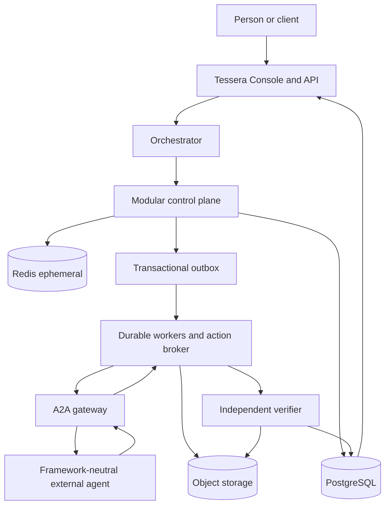
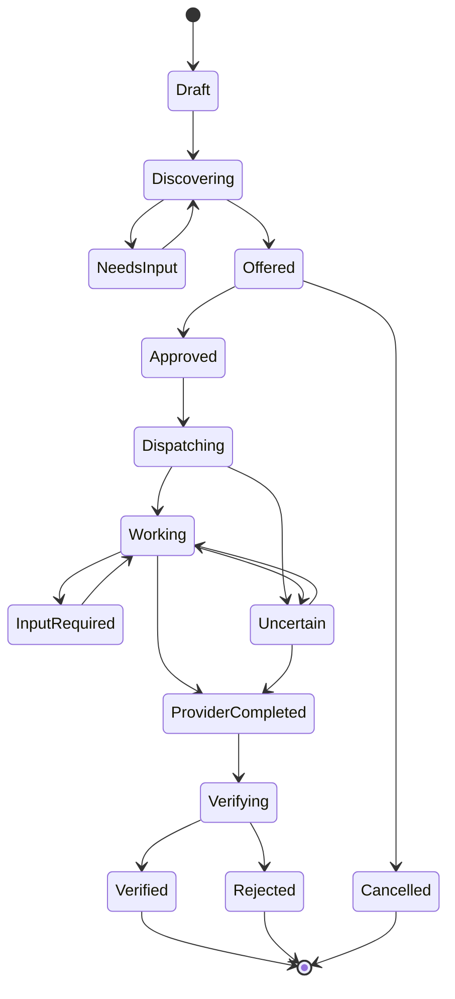
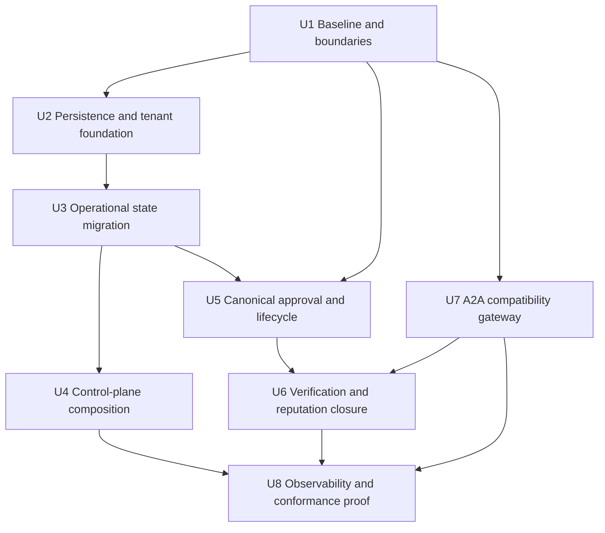
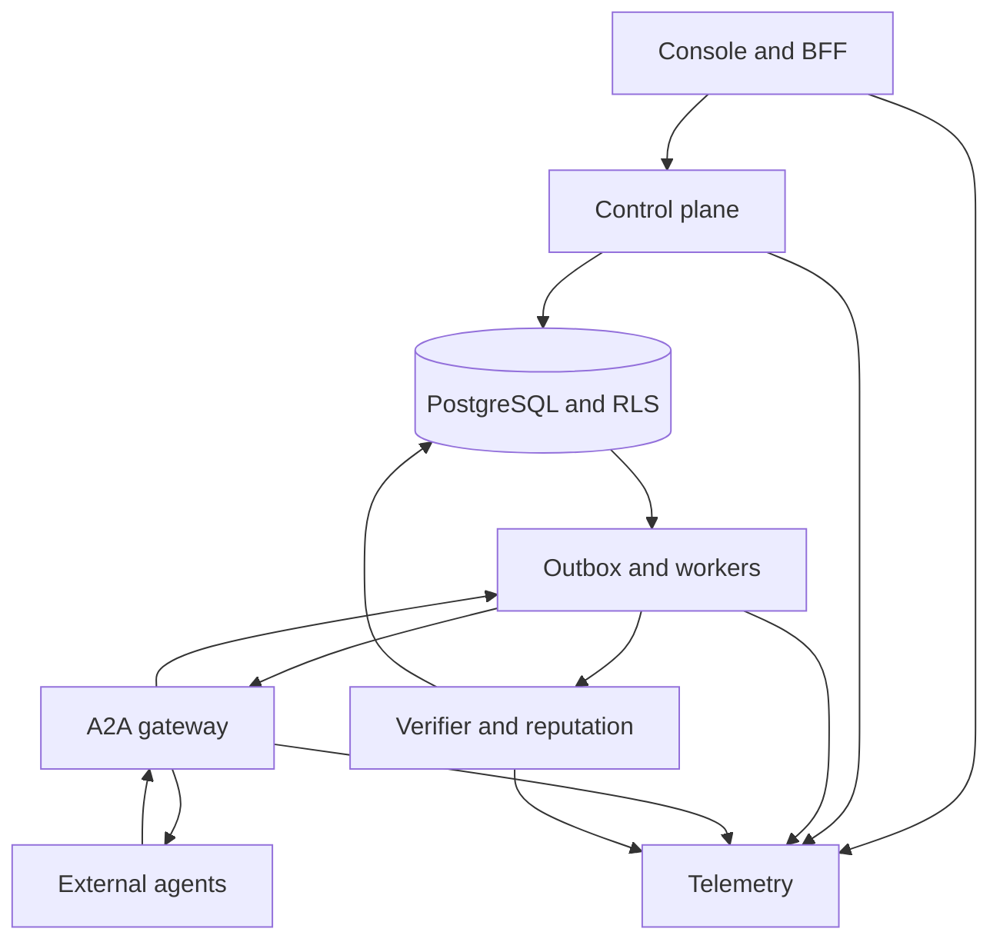

# refactor: Consolidate Tessera around the open agent network

## Summary

Consolidate Tessera around one canonical product path: a person states an outcome, the orchestrator discovers framework-neutral A2A agents, compares grounded offers, obtains exact human approval, supervises durable execution, independently verifies the result, and updates portable reputation. Preserve the protocol and compatibility surfaces while reducing persistence divergence, service sprawl, and vertical-product drift.

---

## Problem Frame

The repository contains a strong protocol core and working implementations of identity, discovery, negotiation, approvals, provider integrations, evidence, and reputation. It has also accumulated CRM, campaigns, communications integrations, organizational dashboards, and many separately launched processes before the universal agent-network path was closed end to end.

The resulting architecture has three sources of avoidable risk:

- the same product flow has multiple orchestration and approval paths with different safety properties;
- permanent state is split between PostgreSQL and several local SQLite repositories, preventing reliable horizontal scaling;
- the public A2A/trust protocol, control-plane product, and vertical applications are not represented as explicit architectural boundaries.

The immediate objective is consolidation, not a rewrite and not another feature expansion.

---

## Requirements

- R1. Preserve framework neutrality: an agent built with Eve, n8n, Python, Vercel AI SDK, LangGraph, or another runtime can participate through the same public A2A and Agent Card contract.
- R2. Establish one canonical flow from natural-language request through discovery, offer comparison, exact approval, execution, independent verification, reputation update, and user-visible result.
- R3. Make PostgreSQL the only production source of truth for durable control-plane and execution state; Redis remains limited to disposable cache, rate-limit, presence, and short-lock state.
- R4. Enforce strict tenant isolation for every tenant-owned row with one request binding (`app.current_org_id`), `WITH CHECK`, `FORCE ROW LEVEL SECURITY`, and no globally visible `NULL` compatibility branch.
- R5. Keep external communication aligned with the published A2A specification and carry Tessera trust semantics as an extension rather than inventing a competing transport.
- R6. Make long-running work crash-recoverable, idempotent, cancellable, observable, and safe to retry without duplicate provider effects.
- R7. Reduce operational complexity through a modular control-plane composition while retaining independently scalable boundaries for the public A2A gateway, workers/action execution, and independent verification.
- R8. Preserve existing APIs and agent integrations during migration through explicit compatibility adapters and characterization tests.
- R9. Prove the architecture using at least three independently implemented external agents and measurable concurrency, latency, recovery, and isolation gates.
- R10. Freeze secondary vertical expansion until the canonical flow and production foundation meet the success metrics in this plan.
- R11. Classify, minimize, redact, retain, and delete sensitive task, contact, evidence, and telemetry data through explicit policies; secrets and raw sensitive payloads never enter logs, traces, Agent Cards, or model context unnecessarily.
- R12. Store large immutable evidence artifacts in content-addressed object storage and keep authoritative metadata, hashes, ownership, retention, and verification state in PostgreSQL.

---

## Scope Boundaries

- No complete rewrite from Python to TypeScript or from the current runtime to Eve.
- No requirement that agents use a particular framework or language.
- No new CRM, campaign, billing, organization-dashboard, mobile, or provider-integration features during consolidation.
- No production Kubernetes, Kafka, OpenSearch, or service mesh introduction without a measured bottleneck and an accepted architecture decision record.
- No real-money escrow or payment settlement; negotiated price remains informational until a separate payment-extension plan exists.
- No full internet-scale registry consensus protocol in this plan; the existing federation surface is preserved and prepared for a later federation-specific plan.
- No deletion of secondary UI surfaces in the first phase. They remain frozen and are labeled experimental or demo where they are not backed by real data.

### Deferred to Follow-Up Work

- Cross-registry reputation reconciliation and federation governance: separate federation plan after the single-registry canonical flow passes the conformance gates.
- Real payment settlement and escrow: separate security and financial architecture review.
- Search-engine extraction: only after PostgreSQL search benchmarks fail an agreed service-level objective.
- Multi-region active-active operation: only after the single-region durable architecture and recovery objectives are demonstrated.

---

## Context & Research

### Relevant Code and Patterns

- `spec/RFC-0001-core-vocabulary.md` and `spec/RFC-0002-a2a-extension-binding.md` define the transport-neutral trust vocabulary and A2A extension positioning to preserve.
- `agents/orchestrator/agent.py` already models the intended `understand -> discover -> rank -> terms -> approve -> execute -> report` flow.
- `agents/orchestrator/tools.py` already discovers Registry providers dynamically and addresses them using the URL declared in their Agent Card.
- `web/concierge.py` injects the live capability catalog into the brain, but currently combines the generic agent path, provider-specific workflows, and an always-approve callback.
- `registry/repository.py`, `libs/db.py`, and the contacts/integration repositories provide the PostgreSQL repository and request-scoped tenant-binding patterns to extend.
- `agents/orchestrator/workflow_repository.py`, `agents/orchestrator/action_repository.py`, `agents/orchestrator/campaign_repository.py`, `services/session/repository.py`, and `services/oauth/repository.py` demonstrate the SQLite persistence that must be retired from production paths.
- `services/workflow_worker/app.py` and `agents/orchestrator/workflow_broker_dispatcher.py` contain the existing lease, retry, approval-binding, and broker boundaries to preserve through durable execution changes.
- `tests/e2e/test_two_agent_demo.py`, `tests/e2e/test_competitive_demo.py`, and `tests/integration/test_workflow_restart_recovery.py` are the strongest existing end-to-end patterns.
- `docs/architecture/database-design.md` contains the intended one-cluster/schema-per-domain direction but is stale relative to the implemented migrations and must be superseded.

### Institutional Learnings

- No applicable `docs/solutions/` records currently exist. Implementation should create a learning document after the first production-persistence migration and after the external-agent conformance proof, because both are likely to reveal reusable migration and protocol lessons.

### External References

- [A2A agent discovery](https://a2a-protocol.org/latest/topics/agent-discovery/) confirms Agent Cards as the standardized self-description and endpoint/capability surface.
- [A2A v1 changes](https://a2a-protocol.org/latest/whats-new-v1/) and the [published specification](https://a2a-protocol.org/latest/specification/) cover polling, streaming, push notifications, task subscription, and multi-tenancy that the compatibility layer must assess.
- [PostgreSQL 16 row security policies](https://www.postgresql.org/docs/16/sql-createpolicy.html) establish default-deny behavior and separate visibility from write checks.
- [PostgreSQL row-level security](https://www.postgresql.org/docs/current/ddl-rowsecurity.html) documents owner bypass and the need for `FORCE ROW LEVEL SECURITY` when owners must be subject to policies.
- [Temporal durable execution](https://docs.temporal.io/) is the benchmark for crash-recoverable long-running workflows; it is an evaluated option, not a preselected dependency.
- [OpenTelemetry traces](https://opentelemetry.io/docs/concepts/signals/traces/) and [messaging semantic conventions](https://opentelemetry.io/docs/specs/semconv/messaging/messaging-spans/) define cross-process context propagation and producer/consumer correlation.

---

## Key Technical Decisions

| Decision | Resolution | Rationale |
|---|---|---|
| Product boundary | Protocol, Network, Orchestrator, Console, and Vertical Applications are explicit layers | Keeps the open network independent from any one UI, connector, or agent framework. |
| Deployment starting point | Modular control plane plus separately scalable gateway, workers/broker, and verifier | Reduces operational surface without coupling untrusted execution or independent verification into the web process. |
| Durable store | PostgreSQL for every production write; Redis only for reconstructible state | Enables multiple instances, transactional invariants, backups, and one tenant-security model. |
| Evidence artifacts | Content-addressed object storage for large immutable bytes; PostgreSQL for authoritative metadata, ownership, hashes, retention, and verdicts | Avoids turning PostgreSQL into a blob store while preserving transactional trust references and auditability. |
| Migration discipline | Previously applied migrations remain immutable; all corrections use new forward migrations with compensating procedures | Prevents environment drift and preserves reproducible schema history. |
| Internal events | Transactional outbox/inbox and idempotent consumers first | Provides reliable asynchronous handoff without immediately operating a new distributed log platform. |
| Workflow engine | Preserve the current worker behind a stable execution interface; evaluate Temporal with a bounded proof before adoption | Avoids rewriting before recovery and throughput measurements reveal whether the existing worker is insufficient. |
| Public protocol | A2A-compatible gateway with the Tessera trust extension | Preserves interoperability and prevents internal storage/workflow choices from leaking into agent contracts. |
| Approval | Immutable preview/offer hash plus explicit human decision for every external effect | Removes the generic always-approve gap and makes authorization auditable and replay-resistant. |
| Verification | A2A completion is provisional until independent verification resolves evidence | Enforces the central Tessera thesis rather than treating provider self-report as success. |
| Observability | One correlation chain across user request, workflow, task, offer, approval, provider call, evidence, verification, and reputation | Makes performance, failures, and duplicate effects diagnosable across language and process boundaries. |
| Scaling | Benchmark and scale individual boundaries; no technology is introduced for hypothetical scale | Keeps complexity proportional to demonstrated load while preserving extraction seams. |

---

## Open Questions

### Resolved During Planning

- Should Eve become the required runtime? No. Eve may be used for a reference agent, while the network contract remains framework-neutral.
- Should all existing services be combined into one process? No. Administrative control-plane modules can compose together, while public ingress, durable execution/action effects, and independent verification retain isolation and independent scaling.
- Should Temporal be adopted immediately? No. The execution interface and recovery tests come first; a bounded proof compares the current worker with Temporal using the same scenarios.
- Should Kafka or another distributed log be installed immediately? No. A PostgreSQL transactional outbox/inbox is the first reliable event boundary; a broker is justified only by measured throughput, fan-out, or retention requirements.
- Should vertical features be removed? No. Freeze and label them first; extraction or deletion requires separate product decisions after the core flow is stable.

### Deferred to Implementation

- Exact module/package consolidation boundaries after dependency-cycle characterization; implementation may find a smaller safe composition than the current process map suggests.
- Whether the Temporal proof materially outperforms the hardened current worker on recovery, operational burden, and developer clarity.
- Exact partition thresholds for audit, task-event, and outbox tables; partitioning activates only with representative data and query plans.
- Final SLO values after a reproducible baseline run on documented hardware; the provisional gates below are starting targets, not contractual production promises.

---

## High-Level Technical Design

> *This illustrates the intended approach and is directional guidance for review, not implementation specification. The implementing agent should treat it as context, not code to reproduce.*

The canonical task lifecycle is:

`ProviderCompleted` is not user-visible success. Only `Verified` completes the trusted Tessera flow; a plain A2A client may still observe ordinary A2A completion without opting into the trust extension.

---

## Implementation Units

### U1. Establish the architectural baseline and product boundaries

**Goal:** Create the authoritative strategy, current-state inventory, target architecture, compatibility matrix, and feature-freeze policy that subsequent units enforce.

**Requirements:** R1, R2, R7, R8, R10

**Dependencies:** None

**Files:**
- Create: `STRATEGY.md`
- Create: `docs/architecture/target-architecture.md`
- Create: `docs/architecture/current-state-inventory.md`
- Create: `docs/architecture/compatibility-contract.md`
- Modify: `README.md`
- Modify: `docs/architecture/database-design.md`
- Test: `tests/architecture/test_architecture_contracts.py`

**Approach:**
- Define Protocol, Network, Orchestrator, Console, and Vertical Applications as separate ownership boundaries.
- Inventory every process, durable store, public route, internal dependency, feature flag, and static/demo surface.
- Record the current public Agent Card/A2A behavior as a compatibility contract before changing composition or persistence.
- Mark incomplete vertical surfaces as experimental in documentation and UI navigation metadata without deleting them.
- Declare the canonical trusted task lifecycle and the rule that provider completion remains provisional pending independent verification.

**Execution note:** Add architecture-contract characterization tests before moving or replacing any implementation.

**Patterns to follow:**
- `spec/RFC-0001-core-vocabulary.md`
- `spec/RFC-0002-a2a-extension-binding.md`
- `docs/plans/2026-07-18-001-vision-agenttrust-federated-ecosystem.md`

**Test scenarios:**
- Characterization: enumerate documented executable services and fail when an undocumented durable store or public process is introduced.
- Compatibility: validate existing example Agent Cards and trust-extension fixtures against the declared compatibility contract.
- UI metadata: a surface marked experimental renders that status and does not claim live metrics where only fixtures exist.
- Documentation: links from the root README resolve to the strategy, current-state inventory, target architecture, and protocol specifications.

**Verification:**
- A new contributor can identify each component's responsibility and source of truth without reading process startup scripts.
- Every currently supported public contract is either preserved, explicitly deprecated, or marked internal.

### U2. Normalize PostgreSQL tenancy and durable repository contracts

**Goal:** Establish one strict PostgreSQL security and repository foundation before migrating operational state.

**Requirements:** R3, R4, R8, R11

**Dependencies:** U1

**Files:**
- Create: `migrations/0029_tenant_contract.sql`
- Create: `libs/repository_contract.py`
- Modify: `libs/db.py`
- Modify: `infra/roles.sql`
- Test: `tests/migrations/test_tenant_contract_migration.py`
- Test: `tests/integration/test_strict_tenant_isolation.py`
- Test: `tests/test_db.py`

**Approach:**
- Use only `app.current_org_id` for tenant context and reject empty tenant context for tenant-owned writes.
- Backfill or quarantine legacy rows with missing ownership before removing permissive `IS NULL` policies.
- Apply `ENABLE` plus `FORCE ROW LEVEL SECURITY`, command-appropriate `USING` and `WITH CHECK`, and least-privilege non-owner runtime roles.
- Define a repository contract for transaction scope, tenant binding, optimistic concurrency, idempotency keys, timestamps, and error translation.
- Keep protocol-global data explicit: capabilities and public Agent Cards may be globally discoverable, while ownership/admin metadata remains tenant-bound.
- Treat `migrations/0009_rls_policies.sql`, `migrations/0025_campaigns.sql`, and `migrations/0026_voice_routing.sql` as immutable historical inputs; correct their resulting schema only through `0029_tenant_contract.sql`.
- Add a data-classification matrix covering tenant identifiers, principals, contacts, credentials, task content, evidence, and telemetry before selecting policy defaults.

**Execution note:** Start with cross-tenant failing tests and migration rollback/forward characterization before changing policies.

**Patterns to follow:**
- `libs/db.py`
- `libs/contacts_repository.py`
- `services/integrations/repository.py`
- `migrations/0017_contacts.sql`

**Test scenarios:**
- Happy path: an organization reads and updates its own tenant-owned records using the request-scoped transaction.
- Isolation: organization A cannot select, update, delete, or infer organization B's rows across every migrated domain.
- Write check: an organization A transaction cannot insert or reassign a row to organization B.
- Missing context: tenant-owned access with an empty tenant binding fails closed rather than returning global rows.
- Runtime role: tests run using a non-owner role and prove `FORCE ROW LEVEL SECURITY` cannot be bypassed by the application path.
- Migration: every legacy `NULL`-owned row is deterministically assigned or quarantined before strict policy activation.
- Migration history: checksums or captured contents of previously applied migrations remain unchanged after the tenant correction.

**Verification:**
- All tenant-owned tables share one tested binding and strict default-deny behavior.
- No production migration or repository references `app.tenant_id`.
- No tenant policy grants visibility through `organization_id IS NULL` or equivalent compatibility logic.

### U3. Migrate operational SQLite state to PostgreSQL

**Goal:** Remove local-file persistence from production sessions, orchestration, integrations, campaigns, communications, rate limits that require durability, and execution ledgers.

**Requirements:** R3, R4, R6, R8, R11

**Dependencies:** U2

**Files:**
- Create: `migrations/0030_operational_state.sql`
- Create: `tools/import_operational_sqlite.py`
- Modify: `services/session/repository.py`
- Modify: `services/oauth/repository.py`
- Modify: `agents/orchestrator/workflow_repository.py`
- Modify: `agents/orchestrator/action_repository.py`
- Modify: `agents/orchestrator/conversation_state.py`
- Modify: `agents/orchestrator/dispatch_ledger.py`
- Modify: `agents/orchestrator/campaign_repository.py`
- Modify: `libs/spend_ledger.py`
- Modify: `libs/twilio_events.py`
- Modify: `libs/whatsapp_state.py`
- Modify: `libs/transfer_routing.py`
- Modify: `services/action_broker/rate_limits.py`
- Modify: `services/voice_bridge/app.py`
- Test: `tests/integration/test_operational_state_postgres.py`
- Test: `tests/integration/test_workflow_restart_recovery.py`
- Test: `tests/integration/test_campaign_lifecycle.py`
- Test: `tests/integration/test_transfer_routing.py`

**Approach:**
- Implement PostgreSQL repositories behind existing domain interfaces before switching composition roots.
- Migrate one bounded-context family at a time and support a temporary read-compare/shadow mode where state equivalence is safety-critical.
- Provide an idempotent import tool for local development data; production rollout does not dual-write indefinitely.
- Move durable rate/spend/dispatch counters into transactional tables; leave reconstructible short-window counters in Redis where appropriate.
- Remove default `.db` production paths only after restart, concurrency, import, and rollback scenarios pass.
- Define session cutover explicitly: either preserve active sessions through verified import or announce and enforce a one-time reauthentication boundary; never silently strand users between stores.
- Preserve encryption-at-rest semantics for OAuth and provider credentials, and prove imported secrets are never logged or materialized in plaintext outside the minimum transaction boundary.

**Execution note:** Characterize each existing repository's state transitions before replacing its storage implementation; migrate and verify one domain family at a time.

**Patterns to follow:**
- `registry/repository.py`
- `libs/reputation_repository.py`
- `libs/db.py`
- `tools/migrate.py`

**Test scenarios:**
- Happy path: two application instances observe the same session, workflow revision, approval, campaign, and provider connection state.
- Concurrency: two workers contend for one executable effect and only one obtains the lease/claim.
- Idempotency: retrying the same dispatch or import does not create duplicate effects, events, spend reservations, or approvals.
- Recovery: terminate a worker after persistence and before provider acknowledgement; a replacement instance resumes or reconciles without guessing success.
- Import: a representative SQLite database imports once, reports conflicts, and produces equivalent query results.
- Rollback: the migration can be stopped before cutover without corrupting the source or partially activating PostgreSQL reads.
- Isolation: imported and newly created records remain inaccessible across tenants.
- Session continuity: active sessions survive the selected cutover policy, or are deterministically invalidated with a clear reauthentication response rather than an ambiguous missing-account error.
- Secret handling: encrypted OAuth/provider material round-trips after import while logs, traces, and import reports contain no recoverable credential value.

**Verification:**
- Production composition requires no local SQLite path environment variables.
- Restart and multi-instance tests pass for every migrated operational domain.
- Any remaining SQLite use is test-only, development-only, or explicitly documented as disposable.

### U4. Compose a modular control plane with explicit deployable boundaries

**Goal:** Make the system understandable and operable as a small set of deployables without erasing domain ownership or public compatibility.

**Requirements:** R7, R8, R10

**Dependencies:** U1, U3

**Files:**
- Create: `services/control_plane/app.py`
- Create: `services/control_plane/composition.py`
- Create: `services/control_plane/modules.py`
- Modify: `scripts/dev-stack.sh`
- Modify: `infra/docker-compose.yml`
- Modify: `frontend/src/lib/backendConfig.ts`
- Modify: `web/concierge.py`
- Modify: `registry/app.py`
- Modify: `services/session/app.py`
- Modify: `services/oauth/app.py`
- Test: `tests/services/test_control_plane_composition.py`
- Test: `tests/integration/test_legacy_route_compatibility.py`

**Approach:**
- Compose identity/session, registry administration, capability catalog, organization policy, connection administration, and orchestration APIs behind one control-plane deployment.
- Keep domain services as modules with explicit ports/repositories; do not merge their tables or business concepts merely because they share a process.
- Keep the public A2A ingress/gateway, workflow/action workers, and independent verifier as separate deployables with least-privilege credentials.
- Preserve old internal base URLs through compatibility routing during rollout, then deprecate them with telemetry before removal.
- Make one local stack command report dependency health and the exact readiness of each boundary.

**Execution note:** Add route and authorization characterization coverage before changing process composition.

**Patterns to follow:**
- `services/action_broker/composition.py`
- `scripts/dev-stack.sh`
- `frontend/src/lib/backendConfig.ts`

**Test scenarios:**
- Happy path: the Console performs login, capability listing, agent registration, and orchestration through the composed control plane.
- Compatibility: existing BFF routes receive equivalent status codes and response contracts during the transition.
- Isolation: public A2A traffic cannot reach administrative routes or control-plane credentials.
- Failure path: an unavailable verifier or worker degrades the affected task state without making login, discovery, or read-only administration unavailable.
- Configuration: startup fails with a precise diagnostic when a required durable dependency is missing; optional vertical modules remain disabled cleanly.

**Verification:**
- The default development stack has materially fewer long-lived processes and no ambiguous source of truth.
- Public gateway, workers/broker, and verifier can scale or restart independently from the control plane.
- Compatibility telemetry identifies whether any deprecated internal route still has callers.

### U5. Unify the canonical task lifecycle and exact human approval

**Goal:** Make every generic external-agent effect follow one immutable, tenant-bound, user-visible approval and durable task state machine.

**Requirements:** R2, R4, R6, R8

**Dependencies:** U1, U3

**Files:**
- Create: `migrations/0031_canonical_task_lifecycle.sql`
- Create: `agents/orchestrator/task_service.py`
- Create: `agents/orchestrator/task_models.py`
- Modify: `agents/orchestrator/agent.py`
- Modify: `agents/orchestrator/approval.py`
- Modify: `agents/orchestrator/dynamic_workflow_service.py`
- Modify: `agents/orchestrator/workflow_broker_dispatcher.py`
- Modify: `web/concierge.py`
- Modify: `frontend/src/components/client/ClientConsole.tsx`
- Create: `frontend/src/components/concierge/AgentOfferCard.tsx`
- Test: `tests/orchestrator/test_canonical_task_service.py`
- Test: `tests/integration/test_generic_agent_approval_flow.py`
- Test: `frontend/src/components/concierge/AgentOfferCard.test.tsx`

**Approach:**
- Replace the production generic `always_approve_callback` with an immutable preview containing agent identity, capability, input disclosure, terms, price, expiry, and reputation facts.
- Bind approval to tenant, principal, task, selected offer, input hash, provider endpoint/card version, and expiry; any material change invalidates approval.
- Use one task lifecycle for generic agents and provider-specific workflows while allowing specialized planners to produce domain-specific previews.
- Persist transitions and outbox events in the same transaction; workers claim effects using leases and idempotency keys.
- Represent uncertainty explicitly when a provider call times out after dispatch; reconcile before permitting retry.

**Execution note:** Implement state-machine and approval-binding behavior test-first, beginning with a failing end-to-end generic-agent approval test.

**Patterns to follow:**
- `agents/orchestrator/action_repository.py`
- `agents/orchestrator/workflow_repository.py`
- `agents/orchestrator/workflow_broker_dispatcher.py`
- `frontend/src/components/concierge/WorkflowPreviewCard.tsx`

**Test scenarios:**
- Happy path: user request discovers several agents, displays comparable grounded offers, approves one exact offer, and only that provider receives `task.accept`.
- Rejection: rejecting or closing the approval performs no provider effect and releases any reservation.
- Mutation: changing destination, price, capability, provider endpoint/card version, or selected agent invalidates the previous approval.
- Expiry: an expired offer or approval cannot dispatch and returns to a reviewable state.
- Concurrency: double-clicking approval or replaying the request produces one durable approval and at most one provider effect.
- Uncertainty: a timeout after dispatch records `uncertain`, blocks blind retry, and schedules reconciliation.
- Authorization: a different principal or tenant cannot approve, reject, inspect, or execute the task.
- UI integration: the Console updates from offer to approved, working, verifying, and terminal state without claiming success prematurely.

**Verification:**
- No production generic-agent execution path uses automatic approval.
- Every external effect is traceable to one exact, unexpired approval and one idempotency key.
- Generic and provider-specific orchestration project the same canonical task lifecycle to the UI.

### U6. Close independent verification and reputation after every result

**Goal:** Ensure that trusted completion requires evidence resolution by an independent verifier and a transactionally consistent reputation update.

**Requirements:** R2, R5, R6, R11, R12

**Dependencies:** U5, U7

**Files:**
- Create: `agents/orchestrator/verification_coordinator.py`
- Create: `libs/evidence_store.py`
- Create: `migrations/0032_verification_evidence.sql`
- Modify: `services/verification/app.py`
- Modify: `services/verification/composition.py`
- Modify: `services/verification/reputation_store.py`
- Modify: `libs/reputation_repository.py`
- Modify: `agents/orchestrator/agent.py`
- Modify: `agents/orchestrator/result_presenter.py`
- Create or version: `schemas/verification-result-v2.schema.json`
- Test: `tests/integration/test_result_verification_reputation.py`
- Test: `tests/orchestrator/test_receipt_verification.py`
- Test: `tests/registry/test_reputation_unification.py`
- Test: `tests/e2e/test_two_agent_demo.py`

**Approach:**
- Validate evidence and verification-result schema, task/capability/principal binding, artifact hashes, verifier identity, freshness, and signature before accepting a verdict.
- Keep provider completion provisional and enqueue verification; the user sees `verifying`, not a fabricated success.
- Record one immutable verification verdict and update the per-capability reputation projection atomically or from an idempotent event consumer.
- Treat verifier unavailability as pending/retryable, not verified and not automatically rejected.
- Expose plain A2A completion to non-trust clients while trust-aware clients receive the extension status and authoritative verification result.
- Put large artifact bytes in content-addressed object storage; persist tenant ownership, media type, size, digest, retention deadline, legal hold, and verifier references in PostgreSQL.
- Version verification-result contracts instead of silently changing an existing schema identifier; accept prior versions through an explicit compatibility window.

**Execution note:** Add failing integration coverage for forged evidence, duplicate verdicts, and verifier outage before wiring the success path.

**Patterns to follow:**
- `spec/RFC-0001-core-vocabulary.md`
- `spec/RFC-0002-a2a-extension-binding.md`
- `services/verification/reputation_store.py`
- `libs/reputation_repository.py`

**Test scenarios:**
- Happy path: independently verified evidence transitions a provider-completed task to verified and increments reputation once for the exact capability.
- Rejection: a valid independent rejection makes the trusted task unsuccessful and increments the rejection projection once.
- Forgery: provider-authored or incorrectly signed verification results are rejected without reputation change.
- Binding: evidence for another task, session, capability, principal, or artifact cannot resolve the task.
- Duplicate delivery: the same verdict/event processed repeatedly results in one immutable verdict and one reputation change.
- Outage: verifier downtime leaves the task pending and retryable; no user-facing success is emitted.
- Plain-client compatibility: an A2A client that does not activate the trust extension still receives a valid ordinary A2A response.
- Artifact lifecycle: digest mismatch, cross-tenant lookup, expired retention, and deleted bytes fail closed without corrupting the immutable verdict record.

**Verification:**
- Every trusted terminal success has a resolvable evidence bundle and authoritative verification result.
- Registry and verifier read one canonical reputation projection rather than independent copies.
- The end-to-end demo proves `discovery -> offer -> approval -> result -> verification -> reputation` without shared implementation code between requester and provider.

### U7. Introduce an A2A compatibility gateway and conformance kit

**Goal:** Isolate public protocol evolution from internal orchestration and allow any framework-compatible agent to join without Tessera-specific business logic.

**Requirements:** R1, R5, R8, R11

**Dependencies:** U1

**Files:**
- Create: `services/a2a_gateway/app.py`
- Create: `services/a2a_gateway/compatibility.py`
- Create: `services/a2a_gateway/task_projection.py`
- Create: `tests/conformance/fixtures/`
- Create: `tests/conformance/test_agent_card_conformance.py`
- Create: `tests/conformance/test_a2a_task_conformance.py`
- Modify: `spec/RFC-0002-a2a-extension-binding.md`
- Create or version: `schemas/a2a-extension-descriptor-v2.schema.json`
- Modify: `agents/orchestrator/tools.py`
- Modify: `registry/app.py`

**Approach:**
- Audit current custom `task.request`, `task.offer`, and `task.accept` envelopes against A2A v1 operations and task lifecycle.
- Put version negotiation and legacy translation at the gateway; internal task state must not depend on one wire-version representation.
- Validate Agent Card endpoint, skills/input schemas, declared authentication, trust extension, ownership proof, and supported transport features before registration status becomes transactable.
- Support polling first and add streaming/push projection where the agent declares it; do not require all agents to implement every transport mode.
- Publish a black-box conformance kit usable by Eve, n8n adapters, Python agents, and other frameworks without importing Tessera server code.
- Version the extension descriptor and trust URI deliberately; retain the existing schema and legacy fixtures during the announced compatibility window.
- Track Agent Card freshness, endpoint health, and eligibility separately so stale or unreachable agents remain auditable without being offered as currently available providers.

**Execution note:** Characterize current wire fixtures and legacy agents before implementing A2A v1 translation.

**Patterns to follow:**
- `tests/spec/test_a2a_extension_binding.py`
- `tests/agents/test_provider_flow.py`
- `tests/agents/test_requester_flow.py`
- `agents/orchestrator/tools.py`

**Test scenarios:**
- Agent Card: a valid independently hosted card with a reachable endpoint and input schema is discoverable and transactable.
- Discovery-only: an agent without ownership/trust proof remains discoverable but cannot inherit another principal's reputation.
- Versioning: current legacy fixtures continue to work through the adapter while native A2A v1 fixtures use the published operations.
- Authentication: dynamic credentials follow the Agent Card security declaration and are never embedded in public card data or model context.
- Long task: polling and at least one asynchronous update mechanism project equivalent task progress and terminal state.
- Invalid contract: malformed cards, unsupported versions, schema-invalid input, endpoint substitution, and capability mismatch fail before dispatch.
- Availability: stale cards and unhealthy endpoints are excluded from transactable results without deleting their registration or reputation history.
- Framework neutrality: conformance tests exercise agents implemented without importing Tessera application modules.

**Verification:**
- The orchestrator addresses agents only through gateway-resolved, registry-grounded endpoint data.
- The conformance kit can certify an external agent using only its URL and credentials.
- Internal workflow/persistence changes do not require external agents to change unless the published compatibility contract changes.

### U8. Add end-to-end observability, external-agent proofs, and scale gates

**Goal:** Demonstrate that the consolidated architecture is understandable, recoverable, secure, and scalable enough for the next product phase.

**Requirements:** R1, R6, R7, R9, R10, R11

**Dependencies:** U4, U6, U7

**Files:**
- Create: `libs/telemetry.py`
- Create: `docs/operations/observability-runbook.md`
- Create: `docs/operations/architecture-benchmark-runbook.md`
- Create: `examples/external-agents/eve-delivery/`
- Create: `examples/external-agents/python-video/`
- Create: `examples/external-agents/n8n-research/`
- Create: `tests/load/test_registry_search.py`
- Create: `tests/load/test_orchestration_concurrency.py`
- Create: `tests/resilience/test_worker_recovery.py`
- Create: `tests/resilience/test_provider_timeout_reconciliation.py`
- Modify: `infra/docker-compose.yml`
- Modify: `scripts/dev-stack.sh`

**Approach:**
- Propagate W3C trace context and stable correlation identifiers across HTTP, outbox messages, workers, provider calls, verification, and reputation projection.
- Emit low-cardinality metrics for discovery latency, offer success, approval age, queue lag, dispatch attempts, uncertain effects, verification latency, and terminal outcomes.
- Apply telemetry allowlists and redaction at instrumentation boundaries; record identifiers needed for correlation while excluding credentials, contact destinations, raw prompts, message bodies, and evidence bytes.
- Build three external examples with distinct runtimes that share only the published contract and conformance kit.
- Establish reproducible baseline gates: 10,000 registered Agent Cards; 1,000 eligible/online agents; 100 concurrent user requests; cached capability search p95 below 200 ms; zero duplicate external effects under retry/restart tests; and strict cross-tenant denial.
- Compare the hardened worker against a bounded Temporal proof using recovery behavior, implementation complexity, operational dependencies, and throughput; record the adoption or rejection decision in an ADR.
- Keep benchmark hardware, dataset, warm/cold cache state, and failure injection documented so results are comparable.

**Patterns to follow:**
- `tests/e2e/test_two_agent_demo.py`
- `tests/integration/test_workflow_restart_recovery.py`
- `tests/integration/test_secure_mode_end_to_end.py`
- `docs/demo-runbook.md`

**Test scenarios:**
- Framework neutrality: Eve, Python, and n8n agents register, receive the same logical task, and complete through the public contract without orchestrator-specific branches.
- Load: capability discovery and offer fan-out remain within provisional latency/error gates at the documented dataset and concurrency.
- Recovery: control-plane and worker restarts preserve task state and produce no duplicate provider effect.
- Backpressure: saturated providers or workers return bounded retry/progress behavior rather than unbounded request accumulation.
- Observability: one trace connects user request, discovery, offer, approval, dispatch, provider result, verification, and reputation update without exposing secrets or raw sensitive content.
- Privacy: automated fixtures inject canary secrets and personal data and prove they do not appear in logs, spans, metrics labels, benchmark reports, or error payloads.
- Isolation: load and failure injection never expose cross-tenant task, approval, connection, or contact information.
- Workflow-engine decision: the current worker and Temporal proof run the same recovery scenarios and produce a documented evidence-based decision.

**Verification:**
- All three external agents pass the black-box conformance suite and the canonical trusted flow.
- Published benchmark and resilience reports meet the agreed gates or identify explicit blockers before feature development resumes.
- Operators can find any task's current state, last safe action, next retry, and verification outcome from telemetry without direct database inspection.

---

## System-Wide Impact

- **Interaction graph:** Browser requests pass through the BFF/control plane; durable transitions and outbox records commit together; workers call the A2A gateway; provider results enter verification before reputation and UI success.
- **Error propagation:** Transport failures map to retryable, rejected, or uncertain task states. Provider and verifier errors do not become successful replies, and internal stack traces or credentials never cross public boundaries.
- **State lifecycle risks:** Dual persistence, partial cutover, duplicate dispatch, expired approvals, provider timeout after effect, stale Agent Cards, and duplicate verification delivery require explicit reconciliation and idempotency tests.
- **API surface parity:** Console, CLI/requester agents, direct A2A clients, provider-specific workflows, and external SDKs must project the same canonical lifecycle without sharing an implementation runtime.
- **Integration coverage:** Unit tests cannot prove transaction/outbox atomicity, RLS under runtime roles, restart recovery, endpoint grounding, external conformance, or verification-to-reputation closure; each has a real integration or black-box scenario above.
- **Unchanged invariants:** RFC-0001 trust objects, durable Principal identity, per-capability reputation, independent verification, Agent Card discovery, graceful trust-extension degradation, and framework neutrality remain authoritative.

---

## Alternative Approaches Considered

- Rewrite the platform in Eve/TypeScript: rejected because it would replace working protocol, identity, Registry, verification, and Python test assets without improving framework neutrality. Eve remains a useful external-agent runtime and possible future orchestrator implementation.
- Preserve every current service as a microservice: rejected for the consolidation phase because shared data, local development, authentication, and operational dependencies already create more complexity than independent scaling value.
- Collapse everything into one process: rejected because public ingress, untrusted/external effects, durable workers, and independent verification have different trust and scaling boundaries.
- Adopt Temporal immediately: deferred behind an interface and proof because durable execution benefits are relevant, but migration cost and operating burden must be compared against a hardened outbox/worker design.
- Install Kafka/NATS immediately: rejected until outbox throughput, fan-out, or retention measurements demonstrate that PostgreSQL-backed delivery is insufficient.
- Continue feature development and fix architecture later: rejected because persistence and approval divergence compound with every new vertical path.

---

## Success Metrics

- One documented canonical trusted task lifecycle is used by generic agents and provider-specific workflows.
- No production path persists durable state in local SQLite files.
- All tenant-owned tables fail closed under non-owner runtime roles and cross-tenant integration tests.
- Every external effect is bound to one exact human approval and idempotency key.
- Every trusted success resolves to independently verified evidence and one per-capability reputation update.
- Three independently implemented external agents pass the same black-box conformance and end-to-end flow.
- Provisional baseline: 10,000 registered cards, 1,000 eligible/online agents, 100 concurrent requests, cached discovery p95 under 200 ms, and zero duplicate effects in restart/retry testing.
- The default local architecture has fewer deployables, one health view, and traceable request/task correlation.
- Secondary feature development resumes only after the consolidation release checklist passes.

---

## Dependencies / Prerequisites

- Preserve the current dirty working tree before execution by inventorying and checkpointing logically related changes; do not mix consolidation edits into unknown user work.
- PostgreSQL 16 and Redis 7 remain the baseline during migration.
- Production-like non-owner database roles must be usable in CI integration tests.
- External-agent examples require isolated runtime setup but may not import Tessera application internals.
- A representative sanitized dataset is required for migration and benchmark validation.

---

## Risk Analysis & Mitigation

| Risk | Likelihood | Impact | Mitigation |
|---|---|---|---|
| Dirty worktree causes accidental loss or mixed commits | High | High | Inventory and checkpoint before U1; stage only unit-owned files and preserve unrelated changes. |
| Persistence migration changes behavior hidden in SQLite repositories | High | High | Characterization-first, domain-by-domain migration, read comparison, idempotent import, and restart tests. |
| Strict RLS makes legacy rows disappear | High | High | Deterministic ownership backfill/quarantine and non-owner integration tests before removing compatibility policies. |
| Consolidating processes creates a distributed monolith | Medium | High | Keep explicit module ports, one source of truth, and separately deployable gateway/worker/verifier boundaries. |
| Approval refactor accidentally authorizes changed work | Medium | Critical | Immutable hash binding, expiry, actor/tenant binding, one-use approval, and mutation/replay tests. |
| Provider timeout produces duplicate real-world effects | High | Critical | Idempotency keys, uncertainty state, reconciliation before retry, and broker/provider receipt support. |
| A2A v1 compatibility breaks current agents | Medium | High | Gateway translation, frozen legacy fixtures, conformance kit, and telemetry-backed deprecation. |
| Independent verification becomes a bottleneck | Medium | High | Asynchronous queue, retryable pending state, verifier scaling, and latency/queue metrics. |
| Evidence or telemetry leaks sensitive data | Medium | Critical | Data classification, content-addressed artifact storage, tenant-scoped metadata, retention/deletion policy, instrumentation allowlists, redaction, and canary-secret tests. |
| Premature infrastructure adoption increases operating burden | Medium | Medium | Decision gates based on reproducible benchmarks and ADRs; no mandatory broker/orchestrator replacement in advance. |
| Static product surfaces continue to misrepresent maturity | High | Medium | Freeze labels, strategy documentation, and explicit live/demo data provenance. |

---

## Phased Delivery

This document is the architectural program plan. Execute one phase at a time. Before Phases B through E, derive a small child implementation plan for the named units using the latest repository state, migrations, and measurements. U3 must be split into bounded domain waves so storage cutover, rollback, and session/secret handling can be reviewed independently. Do not open several schema/topology phases concurrently in the current dirty branch.

### Phase A — Protect and define

- Checkpoint the current branch safely.
- Execute U1 and agree on authoritative boundaries, compatibility, and feature freeze.

### Phase B — Establish one production data foundation

- Execute U2 and U3 domain by domain.
- Do not change public behavior while storage equivalence and strict tenancy are being proven.

### Phase C — Simplify topology and close the golden flow

- Execute U4 and U5 behind compatibility routes and rollout flags.
- Remove production automatic approval only when the new UI/API approval path is ready.

### Phase D — Restore Tessera's trust promise

- Execute U6 and U7 so every framework-neutral agent result can be independently verified through the published extension.

### Phase E — Prove before expanding

- Execute U8, publish evidence, make the workflow-engine decision, and decide whether secondary feature development may resume.

---

## Documentation / Operational Notes

- `README.md` must stop describing the implemented database state as a draft future and distinguish protocol status from product maturity.
- `docs/architecture/database-design.md` should be marked superseded once the target architecture and implemented migration inventory are authoritative.
- Add runbooks for migration cutover/rollback, uncertain-effect reconciliation, verification backlog, and telemetry triage.
- Feature flags must have an owner, default, promotion criteria, and removal condition; shadow modes are temporary rollout mechanisms, not permanent alternate architectures.
- Record ADRs for control-plane composition, workflow-engine selection, event transport, A2A version support, and any future search/broker extraction.

---

## Sources & References

- Product/protocol: `README.md`
- Core trust vocabulary: `spec/RFC-0001-core-vocabulary.md`
- A2A trust binding: `spec/RFC-0002-a2a-extension-binding.md`
- Federation draft: `spec/RFC-0004-federation-discovery.md`
- Existing vision: `docs/plans/2026-07-18-001-vision-agenttrust-federated-ecosystem.md`
- Existing database proposal: `docs/architecture/database-design.md`
- Orchestration path: `agents/orchestrator/agent.py`, `agents/orchestrator/tools.py`, `web/concierge.py`
- Database foundation: `libs/db.py`, `registry/repository.py`, `migrations/`
- [A2A Protocol](https://a2a-protocol.org/latest/specification/)
- [PostgreSQL 16 CREATE POLICY](https://www.postgresql.org/docs/16/sql-createpolicy.html)
- [PostgreSQL row security](https://www.postgresql.org/docs/current/ddl-rowsecurity.html)
- [Temporal documentation](https://docs.temporal.io/)
- [OpenTelemetry traces](https://opentelemetry.io/docs/concepts/signals/traces/)
- [OpenTelemetry messaging semantic conventions](https://opentelemetry.io/docs/specs/semconv/messaging/messaging-spans/)
