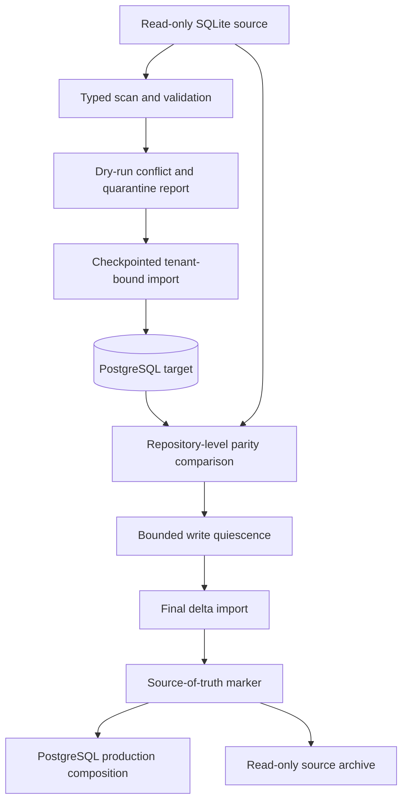
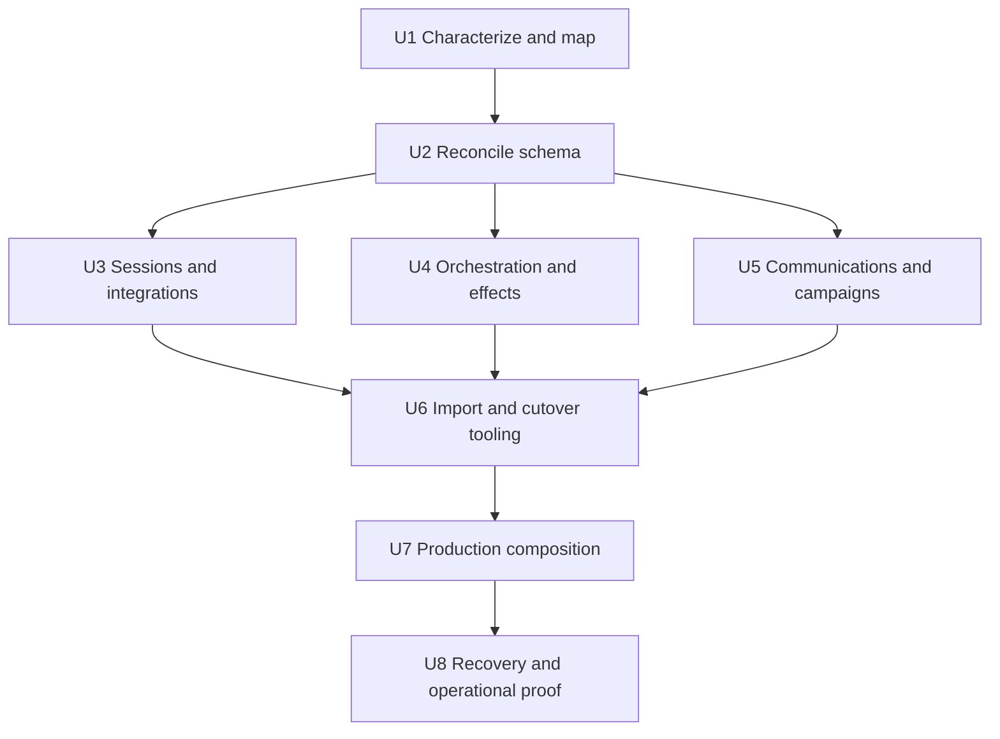
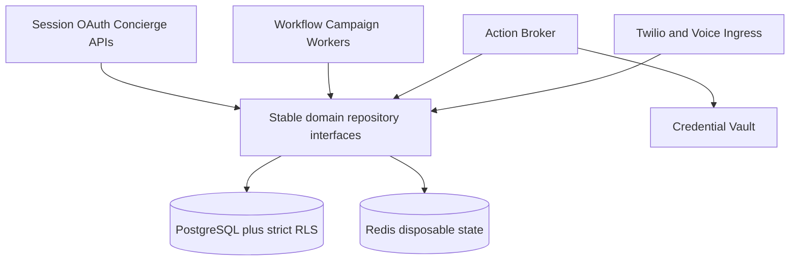

# refactor: Converge operational state on PostgreSQL

## Summary

Complete U3 of the core architecture consolidation by replacing every production SQLite-backed operational repository with PostgreSQL-backed implementations behind the existing domain interfaces. Migrate data in restartable, tenant-aware batches; cut over one bounded-context family at a time; and prove multi-instance correctness, recovery, idempotency, secret handling, and rollback before removing production SQLite configuration.

---

## Problem Frame

Tessera already has PostgreSQL schemas for much of its orchestration, integrations, spend, campaign, WhatsApp, and voice state, but production composition still instantiates SQLite repositories for sessions, OAuth, workflows, actions, campaigns, communication state, and execution ledgers. This split creates divergent schemas, prevents reliable horizontal scaling, and makes one strict tenant-security model impossible.

This child plan executes only U3 from the active consolidation plan. It preserves existing APIs and state-machine behavior; it does not perform the later control-plane process composition or expand the frozen campaign/voice verticals.

---

## Requirements

- R1. PostgreSQL is the only production source of truth for durable session, integration, orchestration, campaign, communications, spend, routing, and execution-ledger state.
- R2. Existing repository-facing behavior, HTTP contracts, identifiers, hashes, encrypted content, state transitions, and error semantics remain compatible during migration.
- R3. Every tenant-owned query and mutation uses the strict repository contract and `app.current_org_id`; cross-tenant reads, writes, imports, and claims fail closed under a non-owner runtime role.
- R4. Imports are idempotent, checkpointed, conflict-reporting, resumable, and non-destructive to their SQLite sources.
- R5. Worker claims, leases, dispatches, spend reservations, campaign effects, and event ingestion remain atomic and safe under multiple processes and retries.
- R6. Production cutover is performed by bounded-context family with explicit readiness, source-of-truth, rollback, and completion markers; indefinite dual-write is prohibited.
- R7. Active sessions follow an explicit continuity policy: verified import when possible and deterministic reauthentication when a record cannot be safely preserved.
- R8. OAuth and provider credentials retain their encryption and Vault boundaries; migration logs, reports, traces, and failures never expose secret material.
- R9. SQLite remains available only for isolated tests, disposable examples, and intentionally local developer fixtures after production cutover.
- R10. The current PostgreSQL migration history remains immutable; all schema corrections and additions are forward-only.

---

## Scope Boundaries

- No control-plane process consolidation; that is master-plan U4 after this storage boundary is stable.
- No new campaign, CRM, voice, Slack, Google, Twilio, or WhatsApp product behavior.
- No Kafka, NATS, Temporal, ORM, or replacement migration framework introduction.
- No migration of large immutable evidence bytes into PostgreSQL; only authoritative operational metadata belongs here.
- No permanent compatibility mode in which SQLite and PostgreSQL are co-equal authorities.
- No deletion or mutation of source SQLite files by the importer.

### Deferred to Follow-Up Work

- Composing session, OAuth, registry administration, and orchestration APIs into the modular control plane: master-plan U4.
- Closing the canonical exact-approval and independent-verification lifecycle: master-plan U5 and later units.
- Removing SQLite implementations used exclusively by unit tests: optional cleanup after production composition no longer imports them.

---

## Context & Research

### Relevant Code and Patterns

- `libs/db.py` provides pooled PostgreSQL transactions and request-scoped organization binding.
- `libs/repository_contract.py` provides fail-closed tenant normalization and typed missing-context behavior.
- `registry/repository.py`, `libs/reputation_repository.py`, `libs/contacts_repository.py`, and `services/integrations/repository.py` are the PostgreSQL repository patterns to extend.
- `migrations/0010_integration_connections.sql` through `migrations/0016_provider_control_plane.sql` already define integration, workflow, conversation, outbox, and authority structures that must be reconciled rather than duplicated.
- `migrations/0023_spend.sql` through `migrations/0026_voice_routing.sql` already define spend, WhatsApp, campaign, throughput, and voice-routing structures.
- `migrations/0029_strict_tenant_foundation.sql` and `infra/roles.sql` establish strict RLS and non-owner runtime-role requirements.
- `tools/migrate.py` is the forward-only migration runner; new SQL files must remain independently transactional and idempotent at the migration-runner level.
- `docs/architecture/current-state-inventory.md` is the authoritative production SQLite census and must fail architecture tests if a new durable local store appears.

### Institutional Learnings

- No applicable `docs/solutions/` records exist. Capture the import/cutover lessons after execution because this migration establishes the reusable pattern for future durable-store convergence.

### External References

- [PostgreSQL 16 transaction isolation](https://www.postgresql.org/docs/16/transaction-iso.html) requires whole-transaction retries for serialization failures and informs the handling of high-contention budget and claim invariants.
- [PostgreSQL 16 locking clauses](https://www.postgresql.org/docs/16/sql-select.html) documents `SKIP LOCKED` as appropriate for queue-like consumers, not general-purpose reads.
- [PostgreSQL 16 row security](https://www.postgresql.org/docs/16/ddl-rowsecurity.html) establishes default-deny behavior when RLS is enabled without a matching policy and the owner-bypass caveat addressed by `FORCE ROW LEVEL SECURITY`.
- [PostgreSQL 16 COPY](https://www.postgresql.org/docs/16/sql-copy.html) notes that `COPY FROM` is not supported on RLS-protected tables; the importer must use tenant-bound inserts/upserts rather than bypassing policies.

---

## Key Technical Decisions

| Decision | Resolution | Rationale |
|---|---|---|
| Schema strategy | Reconcile existing PostgreSQL schemas first; add only missing columns, constraints, indexes, and tables in new forward migrations | Most target models already exist, so creating parallel replacements would preserve divergence rather than remove it. |
| Repository strategy | Keep public repository/domain interfaces stable and replace storage implementations behind them | Limits blast radius and allows existing characterization suites to prove parity. |
| Cutover unit | Cut over sessions/integrations, orchestration/effects, then communications/campaigns | These families match transaction and deployment boundaries and permit independent rollback before authority changes. |
| Source authority | One durable source per family, recorded explicitly; shadow reads compare but never decide behavior | Avoids split brain and makes rollback state knowable. |
| Writes during import | Quiesce writes for the final delta and authority flip; do not introduce long-lived dual-write | Dual-write creates ordering, partial-failure, and reconciliation problems disproportionate to this local-to-central migration. |
| Import mechanism | Typed domain adapters, stable source checksums, checkpoints, dry-run reports, and idempotent tenant-bound upserts | Makes imports restartable and auditable without turning raw SQLite rows into an unvalidated SQL dump. |
| Worker concurrency | PostgreSQL row locks and queue-style `SKIP LOCKED` claims with lease expiry and unique idempotency constraints | Preserves existing claim semantics while enabling several workers safely. |
| Isolation level | Use normal tenant-bound transactions with explicit row locks for queue/ledger invariants; reserve serializable transactions for aggregate invariants that cannot be expressed by constraints and locks | Avoids globally raising contention while ensuring correctness where read/write dependencies matter. |
| Redis boundary | Keep reconstructible short-window throttles in Redis; persist configured limits, durable consumption/accounting, and effect decisions in PostgreSQL | Matches the master architecture: Redis may disappear without losing authoritative business state. |
| Session continuity | Import unexpired, structurally valid sessions and consumed proofs; invalidate ambiguous records with a stable reauthentication response | Preserves valid users without silently accepting unverifiable identity state. |
| Secrets | Import only encrypted references/ciphertext through existing Vault and crypto boundaries; redact every report field by construction | Credential migration must not create a plaintext side channel. |

---

## Open Questions

### Resolved During Planning

- Should the existing PostgreSQL tables be replaced wholesale? No. They are the intended target and will be reconciled through new migrations.
- Should production run with indefinite dual-write? No. Shadow comparison is read-only; final cutover uses a short write quiescence and a single authority marker.
- Should all domains cut over together? No. Bounded-context cutovers constrain failures and make rollback practical.
- Should `COPY FROM` load tenant tables? No. Tenant-bound insert/upsert batches preserve RLS and domain validation.
- Should every rate-limit counter be durable? No. Only configured limits and counters needed for authorization, spend, audit, or replay correctness are durable; disposable short-window throttles may remain in Redis.

### Deferred to Implementation

- Exact batch sizes and connection-pool limits, determined from representative import and contention measurements.
- Whether any legacy SQLite row lacks enough ownership or foreign-key information to import automatically; such rows must be quarantined and reported, not guessed.
- Whether specific aggregate mutations need serializable retries after constraint and explicit-lock tests; this is an execution-time contention finding, not a default for every repository method.

---

## High-Level Technical Design

> *This illustrates the intended approach and is directional guidance for review, not implementation specification. The implementing agent should treat it as context, not code to reproduce.*

The authority marker is per domain family and environment. Before the marker flips, rollback means reopening SQLite writes after proving no PostgreSQL-only production write occurred. After the marker flips, rollback is application-code rollback against PostgreSQL; it never reactivates stale SQLite as an authority.

---

## Implementation Units

### U1. Characterize repository contracts and define the migration manifest

**Goal:** Freeze current behavior and produce an executable inventory mapping every SQLite table, field, invariant, tenant source, and composition root to its PostgreSQL target.

**Requirements:** R1, R2, R4, R8, R10

**Dependencies:** `docs/plans/2026-08-26-001-refactor-strict-tenant-foundation-plan.md` completed

**Files:**
- Create: `docs/architecture/operational-state-mapping.md`
- Create: `tests/architecture/test_operational_store_contract.py`
- Create: `tests/fixtures/operational_sqlite/README.md`
- Modify: `docs/architecture/current-state-inventory.md`
- Test: `tests/session/test_session_lifecycle.py`
- Test: `tests/oauth/test_oauth_flow.py`
- Test: `tests/orchestrator/test_workflow_repository.py`
- Test: `tests/orchestrator/test_campaign_envelope.py`
- Test: `tests/orchestrator/test_dispatch_ledger.py`
- Test: `tests/orchestrator/test_spend_ledger.py`

**Approach:**
- Record SQLite-to-PostgreSQL table/column mappings, transformations, ownership derivation, encryption treatment, primary/idempotency keys, timestamp normalization, and unsupported-row quarantine rules.
- Enumerate every production constructor and environment variable that selects a local database path.
- Add architecture assertions that production composition cannot introduce a new SQLite import, path, or durable file default without updating the inventory.
- Expand characterization only where current tests do not cover a repository's transitions, conflict errors, expiration, retry, or close behavior.

**Execution note:** Characterization-first. Existing behavior must be captured before repository code changes.

**Patterns to follow:**
- `tests/architecture/test_architecture_contracts.py`
- `docs/architecture/current-state-inventory.md`
- Existing domain tests listed above

**Test scenarios:**
- Architecture: scan production modules and report every SQLite dependency with its mapped disposition; an unmapped dependency fails the test.
- Contract parity: session expiry/touch/revoke and identity-proof replay behavior is explicit.
- Contract parity: OAuth transaction consume-once, installation uniqueness, authority, revocation, and control-plane behavior is explicit.
- Contract parity: workflow leases, approval binding, retries, unknown execution, outbox ordering, and projection watermarks are explicit.
- Contract parity: campaign envelope, dispatch ambiguity, spend reservation, and throughput semantics are explicit.
- Security: mapping rows identify a tenant source and secret classification; missing ownership or plaintext-secret handling cannot be marked automatically importable.

**Verification:**
- Every production SQLite-backed class and composition root has a reviewed target and cutover family.
- The characterization suite passes unchanged against the legacy implementations before PostgreSQL replacements begin.

### U2. Reconcile PostgreSQL operational schemas

**Goal:** Make existing PostgreSQL schemas capable of representing all characterized operational state with strict tenant security and concurrency invariants.

**Requirements:** R1, R3, R5, R8, R10

**Dependencies:** U1

**Files:**
- Create: `migrations/0030_operational_state_core.sql`
- Create: `migrations/0031_operational_state_verticals.sql`
- Test: `tests/migrations/test_operational_state_core_migration.py`
- Test: `tests/migrations/test_operational_state_verticals_migration.py`
- Test: `tests/integration/test_operational_state_schema.py`
- Modify: `infra/roles.sql`

**Approach:**
- Reconcile sessions and consumed identity proofs; OAuth transactions and any legacy connection mapping gaps; action proposals, approvals, capability leases, dispatch records, and durable migration/cutover metadata.
- Reconcile workflow/campaign schemas with the current repository state machines instead of cloning SQLite layouts literally.
- Add missing Twilio event/verdict, voice session/transcript metadata, and other communications-state tables not already covered by migrations `0021`-`0026`.
- Add foreign keys, unique idempotency constraints, lease indexes, claim indexes, timestamp types, checks, strict RLS, and least-privilege grants.
- Keep sensitive content encrypted at the application boundary and store retention timestamps needed for deterministic purge.

**Execution note:** Migration-test-first. Prove forward application, idempotent runner behavior, strict RLS, and immutable prior migration contents.

**Patterns to follow:**
- `migrations/0010_integration_connections.sql`
- `migrations/0011_workflow_runs.sql`
- `migrations/0013_general_slack_foundations.sql`
- `migrations/0029_strict_tenant_foundation.sql`
- `tests/migrations/test_strict_tenant_foundation.py`

**Test scenarios:**
- Happy path: a fresh database applies every migration through `0031` and exposes all required schemas, constraints, indexes, policies, and grants.
- Upgrade: a database at migration `0029` upgrades without rewriting or dropping valid operational rows.
- Isolation: non-owner organization A cannot read, mutate, claim, or import organization B's operational rows.
- Missing context: tenant tables fail closed when no organization is bound.
- Concurrency: unique constraints prevent duplicate leases, effects, events, imports, reservations, and consumed proofs.
- Failure: an error in either new migration rolls back that migration and does not record it as applied.
- Compatibility: existing integration/workflow/campaign identifiers and foreign keys remain valid after schema reconciliation.

**Verification:**
- The target schema can represent every automatically importable legacy row and every characterized state transition.
- New tables are governed by `app.current_org_id`, `ENABLE` and `FORCE ROW LEVEL SECURITY`, and non-owner runtime grants.

### U3. Implement PostgreSQL sessions and integration authority

**Goal:** Replace SQLite persistence for browser sessions, OAuth transactions/connections, provider authority, and voice transfer-route administration without changing service contracts.

**Requirements:** R1, R2, R3, R7, R8

**Dependencies:** U2

**Files:**
- Modify: `services/session/repository.py`
- Modify: `services/oauth/repository.py`
- Modify: `services/integrations/repository.py`
- Modify: `services/session/app.py`
- Modify: `services/oauth/app.py`
- Test: `tests/session/test_session_lifecycle.py`
- Test: `tests/oauth/test_oauth_flow.py`
- Test: `tests/oauth/test_integration_connections.py`
- Test: `tests/oauth/test_slack_authority_profiles.py`
- Test: `tests/oauth/test_provider_account_connection.py`
- Test: `tests/oauth/test_voice_routes.py`
- Test: `tests/integration/test_operational_state_postgres.py`

**Approach:**
- Introduce PostgreSQL implementations behind existing repository contracts and inject `Database` through service composition.
- Consolidate overlapping connection data onto canonical `integrations` tables; retain explicit legacy mapping only for import traceability and compatibility lookups.
- Use atomic consume/update statements for OAuth state and consumed identity proofs.
- Keep credential bodies in Vault and preserve encrypted managed-OAuth semantics; operational rows contain identifiers, authority metadata, versions, and status only.
- Return deterministic reauthentication for invalidated sessions rather than the prior ambiguous missing-account behavior.

**Execution note:** Implement contract tests against both legacy and PostgreSQL repositories before switching service composition.

**Patterns to follow:**
- `services/integrations/repository.py`
- `libs/identity_repository.py`
- `vault/app.py`
- `libs/repository_contract.py`

**Test scenarios:**
- Happy path: a session created by one service instance resolves and is revoked by another.
- Expiry: idle and absolute expiry produce the same result as the characterized contract; touch is atomic.
- Replay: two requests attempt to consume one identity proof or OAuth state and exactly one succeeds.
- Authority: tenant, personal, delegated, suspended, tombstoned, and emergency-stop states produce existing authorization outcomes.
- Isolation: identical provider/team identifiers in separate tenants cannot leak installation or authority state.
- Secret handling: connection and transaction logs/reports contain no token, authorization code, refresh secret, or decryptable credential value.
- Integration: session and OAuth HTTP endpoints preserve status codes and response shapes after PostgreSQL composition.

**Verification:**
- Session and OAuth services start with PostgreSQL only and pass their existing API suites.
- Valid imported sessions continue; quarantined or invalid sessions receive a stable reauthentication response.

### U4. Implement PostgreSQL orchestration, approvals, effects, and ledgers

**Goal:** Move workflow execution, conversation state, action proposals, leases, dispatch ambiguity, and outbox/projection state onto one crash-recoverable PostgreSQL boundary.

**Requirements:** R1, R2, R3, R5, R6

**Dependencies:** U2

**Files:**
- Modify: `agents/orchestrator/workflow_repository.py`
- Modify: `agents/orchestrator/action_repository.py`
- Modify: `agents/orchestrator/conversation_state.py`
- Modify: `agents/orchestrator/dispatch_ledger.py`
- Modify: `services/workflow_worker/app.py`
- Modify: `services/action_broker/composition.py`
- Test: `tests/orchestrator/test_workflow_repository.py`
- Test: `tests/orchestrator/test_dynamic_workflow_execution.py`
- Test: `tests/orchestrator/test_conversation_state.py`
- Test: `tests/orchestrator/test_dispatch_ledger.py`
- Test: `tests/orchestrator/test_workflow_broker_dispatcher.py`
- Test: `tests/integration/test_workflow_restart_recovery.py`
- Test: `tests/integration/test_dynamic_workflow_security.py`
- Test: `tests/integration/test_conversational_slack_tenant_isolation.py`

**Approach:**
- Preserve repository methods while translating SQLite locking and transaction assumptions into tenant-bound PostgreSQL transactions.
- Claim queue-like work with row locks and `SKIP LOCKED`; keep lease expiry/recovery and attempt uniqueness authoritative in the same transaction.
- Persist approval, action, dispatch, receipt, outbox, and projection changes atomically whenever they represent one state transition.
- Preserve encrypted workflow/conversation content contexts and retention purge behavior.
- Ensure ambiguous provider outcomes remain `unknown` until reconciliation; a crash must never infer success or retry a potentially completed external write blindly.

**Execution note:** State-transition-test-first, followed by two-connection and two-worker integration tests.

**Patterns to follow:**
- Existing interfaces in the modified repositories
- `migrations/0011_workflow_runs.sql`
- `migrations/0013_general_slack_foundations.sql`
- PostgreSQL queue semantics from `tests/integration/test_workflow_restart_recovery.py`

**Test scenarios:**
- Happy path: create, revise, approve, claim, dispatch, receipt, verify, project, and complete a workflow through PostgreSQL.
- Concurrency: two workers claim ready work concurrently and never obtain the same active step/effect.
- Idempotency: repeated proposal, approval, dispatch, completion, outbox, and projection requests return the established result without duplicates.
- Recovery: terminate after claim, after pre-dispatch persistence, and after provider acknowledgement; a replacement worker resumes or reconciles according to the persisted state.
- Ordering: aggregate outbox versions project in order, duplicate delivery is harmless, and expired claims are recoverable.
- Isolation: cross-tenant workflow, conversation, action, lease, receipt, and outbox identifiers remain inaccessible.
- Retention: expired sensitive content is purged while hashes, receipts, and audit-safe metadata remain valid.

**Verification:**
- Several workflow workers and action brokers can safely share one PostgreSQL database.
- Restart recovery has no duplicate external effect and no guessed-success path.

### U5. Implement PostgreSQL communications, campaign, spend, throughput, and voice state

**Goal:** Replace the remaining production SQLite repositories while freezing their product behavior.

**Requirements:** R1, R2, R3, R5, R9

**Dependencies:** U2

**Files:**
- Modify: `agents/orchestrator/campaign_repository.py`
- Modify: `libs/spend_ledger.py`
- Modify: `libs/twilio_events.py`
- Modify: `libs/whatsapp_state.py`
- Modify: `libs/transfer_routing.py`
- Modify: `services/action_broker/rate_limits.py`
- Modify: `services/twilio_webhook/app.py`
- Modify: `services/voice_bridge/app.py`
- Modify: `web/concierge.py`
- Test: `tests/integration/test_campaign_lifecycle.py`
- Test: `tests/orchestrator/test_spend_ledger.py`
- Test: `tests/services/test_distributed_rate_limits.py`
- Test: `tests/services/test_twilio_webhook.py`
- Test: `tests/integration/test_whatsapp_window.py`
- Test: `tests/integration/test_transfer_routing.py`
- Test: `tests/services/test_voice_bridge.py`
- Test: `tests/services/test_campaign_worker.py`

**Approach:**
- Reuse `campaign`, `billing`, `twilio`, and `voice` schemas and inject `Database` consistently.
- Make campaign claims, spend reservation/settlement, brand volume, throughput acquisition, Twilio event dedupe/verdict advancement, and WhatsApp window/template changes atomic.
- Store voice transcript/session metadata with retention and tenant ownership while retaining existing content-protection semantics.
- Keep `SlackRatePolicy` process-local backoff behavior separate from durable authorization/accounting; use Redis only for explicitly disposable high-frequency windows if present.
- Do not add campaign or voice features while replacing persistence.

**Execution note:** Characterize the frozen vertical behavior, then test the PostgreSQL implementations with concurrent connections.

**Patterns to follow:**
- `migrations/0023_spend.sql`
- `migrations/0024_whatsapp.sql`
- `migrations/0025_campaigns.sql`
- `migrations/0026_voice_routing.sql`
- Existing lifecycle integration tests

**Test scenarios:**
- Campaign: authorization envelope, late audience rules, pause/resume/reaffirm/stop, claim recovery, finalization, and reporting remain equivalent.
- Spend: concurrent reservations cannot exceed a budget; settle/release retries are idempotent and totals remain non-negative.
- Throughput: concurrent acquisitions enforce the configured durable limit without over-admitting.
- Twilio: duplicate webhook keys do not duplicate events; verdict progression is monotonic and tenant-bound.
- WhatsApp: windows expire correctly and template uniqueness/status remains tenant- and sender-scoped.
- Voice: routes honor timezone/priority/budgets; sessions and transcript metadata survive process restart and obey retention.
- Isolation: campaigns, destinations, events, templates, spend, routes, calls, and transcripts never cross organizations.

**Verification:**
- Concierge, campaign worker, Twilio webhook, and voice bridge can restart or scale without local durable files.
- Frozen vertical behavior remains compatible with the pre-migration characterization suite.

### U6. Build idempotent import, comparison, and cutover tooling

**Goal:** Safely migrate existing SQLite data and make every authority transition observable, resumable, and auditable.

**Requirements:** R4, R6, R7, R8, R10

**Dependencies:** U3, U4, U5

**Files:**
- Create: `tools/import_operational_sqlite.py`
- Create: `libs/operational_migration.py`
- Create: `tests/tools/test_import_operational_sqlite.py`
- Create: `tests/integration/test_operational_import.py`
- Create: `docs/runbooks/operational-state-cutover.md`

**Approach:**
- Support inventory, dry-run, import, compare, final-delta, status, and report operations by domain family.
- Open SQLite read-only, fingerprint source schema/content, normalize timestamps and JSON deterministically, validate tenant/foreign-key/secret rules, then write through tenant-bound migration adapters.
- Persist source fingerprint, row checkpoint, counts, conflicts, quarantines, and authority state in PostgreSQL; reruns skip verified rows and reject changed source content unless explicitly started as a new import generation.
- Compare semantic repository projections and key aggregates, not only raw row counts.
- Require a successful dry-run, zero unexplained conflicts, final delta under write quiescence, parity report, and explicit authority flip before production composition changes.
- Redact values by classification; reports contain stable row identifiers, hashes, reason codes, and counts rather than sensitive payloads.

**Execution note:** Importer-test-first with synthetic fixtures for every supported schema version and failure mode.

**Patterns to follow:**
- `tools/migrate.py`
- `tools/quarantine_legacy_tenant_rows.py`
- `docs/runbooks/strict-tenant-foundation.md`

**Test scenarios:**
- Happy path: representative files for every family import and produce equivalent domain-level reads.
- Idempotency: repeating a completed import inserts nothing, changes no authority, and reports the same checksums/counts.
- Resume: interruption mid-batch resumes from the verified checkpoint without duplicates or omissions.
- Conflict: a target key with different semantic content is reported and blocks authority flip.
- Source drift: a changed SQLite file after checkpoint is rejected unless a new generation is explicitly declared.
- Quarantine: missing tenant, invalid foreign key, corrupt ciphertext, or unsupported state is isolated with a reason and no guessed repair.
- Secret handling: captured stdout, logs, exception messages, and reports contain no sensitive source values.
- Rollback: before authority flip, the target generation can be abandoned without changing SQLite; after flip, tooling refuses to reactivate SQLite as authority.

**Verification:**
- A dry-run and real import can be repeated safely for each domain family.
- Operators can prove row/aggregate parity, identify every quarantine, and know exactly which store is authoritative.

### U7. Cut production composition over to PostgreSQL

**Goal:** Remove local durable-store selection from all production composition roots while retaining explicit test-only SQLite construction.

**Requirements:** R1, R2, R6, R9

**Dependencies:** U6

**Files:**
- Modify: `services/session/app.py`
- Modify: `services/oauth/app.py`
- Modify: `services/action_broker/composition.py`
- Modify: `services/workflow_worker/app.py`
- Modify: `services/twilio_webhook/app.py`
- Modify: `services/voice_bridge/app.py`
- Modify: `web/concierge.py`
- Modify: `scripts/slack_phase1_canary.py`
- Modify: `scripts/dev-stack.sh`
- Modify: `infra/docker-compose.yml`
- Modify: `.env.example`
- Modify: `docs/architecture/current-state-inventory.md`
- Test: `tests/architecture/test_operational_store_contract.py`
- Test: `tests/integration/test_operational_state_postgres.py`
- Test: `tests/services/test_workflow_worker.py`

**Approach:**
- Require PostgreSQL configuration for production and build all operational repositories from the shared `Database` boundary.
- Remove production defaults and required variables for `SESSION_DATABASE`, `OAUTH_DATABASE`, `WORKFLOW_DATABASE`, `ACTION_DATABASE`, `CAMPAIGN_DATABASE`, `TWILIO_EVENT_DATABASE`, `VOICE_TRANSCRIPT_DATABASE`, and equivalent path aliases.
- Preserve explicit SQLite factories only in tests/examples; production startup fails clearly if PostgreSQL is unavailable rather than silently creating a local file.
- Execute authority flips in dependency order and deploy compatible code before disabling each SQLite writer.
- Update architecture documentation and startup diagnostics to show PostgreSQL as the sole durable store.

**Execution note:** Cut over one family at a time using the runbook; do not combine authority flips into an unobservable release.

**Patterns to follow:**
- `services/integrations/repository.py` composition
- `libs/db.py`
- `scripts/dev-stack.sh` readiness reporting

**Test scenarios:**
- Startup: production services start with PostgreSQL and no local database path variables.
- Fail closed: missing/unavailable PostgreSQL produces a precise startup error and creates no `.db` file.
- Multi-instance: two Concierge/workers/webhook instances observe shared durable state and respect claims.
- Compatibility: frontend BFF and service HTTP contracts remain unchanged through cutover.
- Architecture: production imports/composition contain no SQLite constructor or default local database filename.
- Test isolation: explicit unit-test SQLite repositories remain constructible without becoming production defaults.

**Verification:**
- The default stack creates no production SQLite file and requires none to restart successfully.
- Every domain family reports PostgreSQL as authoritative and legacy SQLite files are read-only archives or disposable fixtures.

### U8. Prove recovery, isolation, performance, and operational readiness

**Goal:** Establish evidence that PostgreSQL convergence is safe to complete and maintain.

**Requirements:** R1, R3, R4, R5, R6, R8, R9

**Dependencies:** U7

**Files:**
- Create: `tests/integration/test_operational_multi_instance.py`
- Create: `tests/integration/test_operational_cutover_recovery.py`
- Create: `tests/performance/test_operational_contention.py`
- Modify: `tests/integration/test_workflow_restart_recovery.py`
- Modify: `tests/integration/test_campaign_lifecycle.py`
- Modify: `tests/integration/test_transfer_routing.py`
- Modify: `tests/architecture/test_architecture_contracts.py`
- Modify: `docs/runbooks/operational-state-cutover.md`
- Modify: `docs/architecture/target-architecture.md`

**Approach:**
- Exercise process termination at each critical persistence/provider boundary and document expected recovery.
- Run isolation under non-owner roles across every migrated schema and repository family.
- Measure claim throughput, lock wait, serialization retry rate, import rate, pool saturation, and slow queries with representative datasets.
- Define operational alerts for failed/dead-lettered imports, stale leases, repeated serialization errors, unexplained parity drift, and accidental local-file creation.
- Record the final cutover evidence and any quarantined data disposition before marking the child plan complete.

**Execution note:** Treat recovery and isolation gates as release blockers; performance findings trigger targeted indexing/query work, not a new infrastructure platform by default.

**Patterns to follow:**
- `tests/integration/test_strict_tenant_isolation.py`
- `tests/integration/test_workflow_restart_recovery.py`
- `docs/runbooks/strict-tenant-foundation.md`

**Test scenarios:**
- Recovery matrix: kill each process before claim, after claim, before provider call, after provider response, before receipt, and before projection; expected state and next action are deterministic.
- Tenant matrix: organization A cannot select, infer, claim, update, delete, or import organization B's rows across every operational table.
- Load: multiple workers claim disjoint work with bounded lock waits and no duplicates.
- Contention: spend, throughput, OAuth consume-once, and idempotency invariants hold under concurrent transactions and configured retry policy.
- Cutover: stop before flip, fail during final delta, and restart after flip all follow the documented authority rules.
- Configuration: the repository contains no production SQLite environment dependency and the stack creates no durable local files.

**Verification:**
- All migrated families pass contract, integration, recovery, isolation, and representative contention tests.
- The runbook contains measured gates, rollback conditions, monitoring signals, and evidence for each completed authority flip.

---

## System-Wide Impact

- **Interaction graph:** Every primary production process changes repository construction, while HTTP and worker-facing contracts remain stable.
- **Error propagation:** Database unavailability and tenant-binding failures surface as typed service errors; they never trigger local-store fallback. Serialization and transient lock failures are retried only at complete transaction boundaries.
- **State lifecycle risks:** Authority drift, partial import, duplicate effects, stale leases, expired sessions, content retention, and quarantined records are explicitly represented and observable.
- **API surface parity:** Session, OAuth, Concierge, workflow-worker, action-broker, campaign, Twilio webhook, and voice contracts require characterization and compatibility tests.
- **Integration coverage:** Multi-process claims, restart boundaries, importer-to-repository parity, Vault references, and strict RLS require real PostgreSQL integration tests.
- **Unchanged invariants:** Public A2A/Agent Card contracts, external provider semantics, exact hashes/identifiers, Vault ownership, and frozen vertical behavior do not change.

---

## Phased Delivery

1. **Foundation:** U1-U2 establish parity contracts and schema readiness without changing production authority.
2. **Repository convergence:** U3-U5 implement PostgreSQL families behind stable interfaces and run dual-backend contract tests.
3. **Data migration:** U6 imports and compares one family at a time; SQLite remains authoritative until each explicit flip.
4. **Production cutover:** U7 changes composition and removes local durable defaults in dependency order.
5. **Closure:** U8 proves recovery, isolation, contention behavior, and operational readiness before marking U3 complete in the master plan.

---

## Success Metrics

- Zero production composition roots instantiate SQLite or require a local database path.
- Zero unexplained import conflicts and zero silently discarded rows; every unsupported row has a quarantine reason and disposition.
- Zero duplicate external effects in restart and multi-worker tests.
- Zero cross-tenant visibility or mutation across migrated operational tables under non-owner roles.
- All existing domain/API characterization suites pass against PostgreSQL implementations.
- Import reruns are idempotent, interrupted runs resume, and source SQLite files remain unchanged.
- Representative contention tests meet documented baselines without unbounded lock waits, pool saturation, or sustained serialization failures.

---

## Risks & Dependencies

| Risk | Impact | Mitigation |
|---|---|---|
| Existing PostgreSQL schema and SQLite behavior have drifted | Data loss or changed state transitions | U1 mapping and dual-backend characterization before repository cutover; reconcile rather than blindly copy layouts. |
| A tenant cannot be derived for a legacy row | Cross-tenant exposure or orphaned state | Quarantine with stable reason; never infer ownership from provider identifiers or phone/email domains. |
| Dual authority during rollout | Split brain and missing updates | Per-family authority marker, short final write quiescence, no indefinite dual-write. |
| Worker locking differs from SQLite serialization | Duplicate or starved work | Unique constraints, row locks, `SKIP LOCKED` only for queues, lease expiry, multi-worker tests, measured lock waits. |
| Session import strands active users | Login failures | Import valid unexpired sessions; deterministic invalidation and clear reauthentication for ambiguous rows. |
| Credential material leaks during import | Security incident | Migrate references/ciphertext through existing boundaries; structural redaction tests for logs and reports. |
| Rollback reactivates stale SQLite | Lost PostgreSQL-only writes | Permit source rollback only before authority flip; after flip, application rollback continues against PostgreSQL. |
| A single large migration becomes hard to review or recover | Operational risk | Split schema additions by core and vertical families while keeping historical migrations immutable. |
| PostgreSQL becomes a contention bottleneck | Latency and worker backlog | Narrow transactions, explicit indexes, bounded pools, queue locks, retry metrics, and representative load tests before introducing new infrastructure. |

---

## Documentation / Operational Notes

- `docs/architecture/operational-state-mapping.md` is the reviewed source-to-target contract and data-classification record.
- `docs/runbooks/operational-state-cutover.md` owns prerequisites, dry-run review, quiescence, final delta, authority flip, rollback boundary, monitoring, and archive handling.
- Update `.env.example`, `scripts/dev-stack.sh`, Docker composition, and current-state documentation in the same unit that removes production SQLite defaults.
- Preserve legacy SQLite files read-only for the documented verification window; disposal must follow the data-retention policy and must not be automated by the importer.
- After completion, write a `docs/solutions/` learning covering the reusable migration, authority-marker, and rollback pattern.

---

## Sources & References

- Parent plan: `docs/plans/2026-08-25-001-refactor-core-architecture-consolidation-plan.md` (U3)
- Completed prerequisite: `docs/plans/2026-08-26-001-refactor-strict-tenant-foundation-plan.md`
- Architecture inventory: `docs/architecture/current-state-inventory.md`
- Target architecture: `docs/architecture/target-architecture.md`
- Repository contract: `libs/repository_contract.py`
- PostgreSQL transaction isolation: https://www.postgresql.org/docs/16/transaction-iso.html
- PostgreSQL locking clauses: https://www.postgresql.org/docs/16/sql-select.html
- PostgreSQL row security: https://www.postgresql.org/docs/16/ddl-rowsecurity.html
- PostgreSQL COPY: https://www.postgresql.org/docs/16/sql-copy.html
